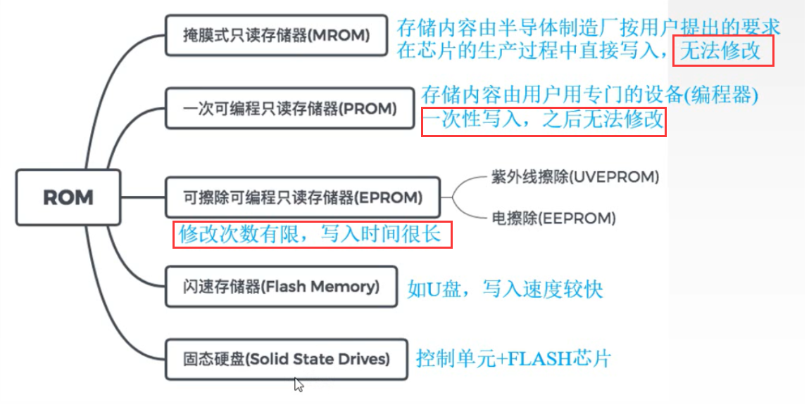
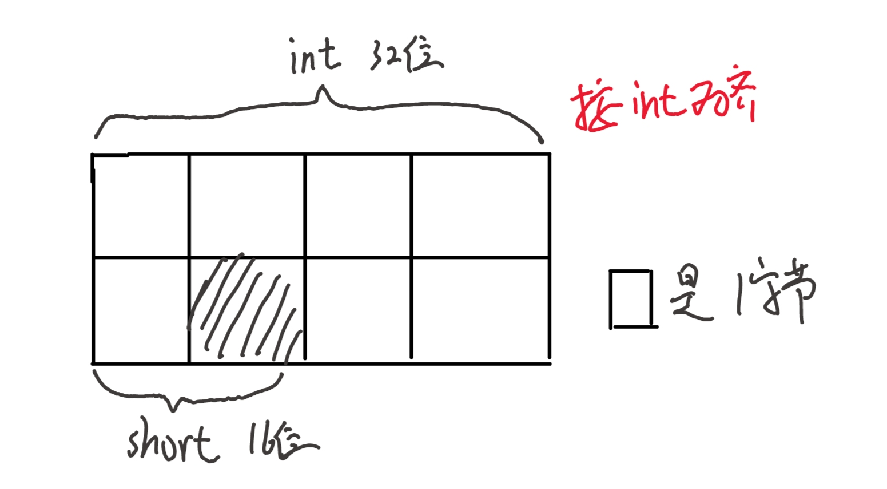
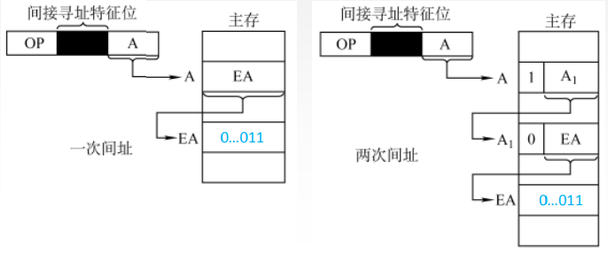

# 计算机组成原理

## 计算机系统概述

### 计算机体系结构

### 冯·诺依曼机
美籍匈牙利科学家冯·诺依曼最先提出“**程序存储**”的思想，并成功将其运用在计算机的设计之中，根据这一原理制造的计算机被称为冯·诺依曼结构计算机。
“程序存储”：指令以代码的形式事先输入到计算机的主存储器中，然后按其在存储器中的首地址执行程序的第一条指令，以后就按该程序的规定顺序执行其他指令，直至程序执行结束。即**按地址访问并顺序执行指令**
#### 冯诺曼体系结构特点:
计算机硬件系统由五大部件组成(存储器、运算器、控制器、输出设备、输入设备)
指令和数据以同等地位存于存储器，可按地址寻访
指令和数据在CPU中区分是根据**指令周期的不同阶段**
指令和数据用二进制表示
指令由操作码和地址码组成
存储程序
以运算器为中心
### 计算机性能指标

**吞吐量**，指系统在单位时间内处理请求的数量 ；从用户观点看，它是评价计算机系统性能的综合参数
**响应时间**，指从用户向计算机发送一个请求，到系统对该请求做出响应并获得所需结构的等待时间。
**CPU时钟周期**，通常为节拍脉冲或T周期，即主频的倒数，它是CPU中最小的时间单位，每个动作至少需要1个时钟周期。
**主频(CPU时钟频率)**。机器内部主时钟的频率，是衡量机器速度的重要参数。
- CPU周期又称为机器周期，由多个时钟周期组成！
- 指令周期>CPU周期>时钟周期

**CPI**（Clock cycle Per Instruction），即执行一条指令所需的时钟周期数。
CPU执行时间，指运行一个程序所花费的时间。
CPU执行时间 = CPU时钟周期数/主频 = (指令条数xCPI)/主频
CPU的性能取决于三个要素:主频、CPI 、指令条数
**IPS** = 主频/平均CPI，每秒执行多少指令
**MIPS** = 即每秒执行多少百万条指令。
MFLOPS=浮点操作次数/(执行时间x$10^6$),即每秒执行多少百万次浮点运算。
GFLOPS=浮点操作次数/(执行时间x$10^9$)，即每秒执行多少十亿次浮点运算。
TFLOPS=浮点操作次数/(执行时间x$10^{12}$)，即每秒执行多少万亿次浮点运算。
PFLOPS:$10^{15}$
EFLOPS:$10^{18}$
ZFLOPS:$10^{21}$
***问题：<u>计算机由哪几部分组成？以哪部分为中心？</u>***
答：计算机由运算器、控制器、存储器、输入设备及输出设备五大部分构成。早期的冯·诺依曼机**以运算器为中心**；现代计算机已经发展为**以存储器为中心**

### C语言浮点数类型
1.int$\rightarrow$float &emsp; 不会溢出、影响精度
2.int或float$\rightarrow$double &emsp; 保留精确值
3.double$\rightarrow$float &emsp; 可能溢出、舍入
4.double或float$\rightarrow$int &emsp; 可能溢出、影响精度

## 数据的表示与运算
常见 2 的指数：
$2^5=32$，$2^6=64$，$2^7=128$，$2^8=256$，$2^9=512$，$2^{10}=1024$，$2^{11}=2048$，$2^{12}=4096$，$2^{13}=8192$，$2^{14}=16384$，$2^{15}=32768$，$2^{16}=65536$

### 补码相关内容

#### 补码大小比较
正数：1多值大，1越靠左值大
负数：1多值大，1越靠左值大
负数补码快速计算:1000 0011=-128+3=125

#### 有无符号转换
有符号$\rightarrow$无符号：将符号位转为最高位数值位
例：-32767=1000 0000 0000 0001$\rightarrow$无符号 32768+1
无符号$\rightarrow$有符号：最高数值位直接作为符号位

#### 符号拓展
正数：填0
负数：**原码**：填0
&emsp;  **反码、补码**：填1  

#### 移位
乘2=左移&emsp; 除2=右移
补码**算术移位**(符号位不变)：
  &emsp;1.正数：左移右移都是补0
  &emsp;2.负数：左0右1
  补码**逻辑移位**：补0而且是整个移动

***问题：<u>如何判断移位是否溢出？</u>***
答：若**左移**且**移丢的是有效位**时，则溢出。
例：0<u>**1**</u>00 1100 &emsp;**1是有效位置**&emsp; 溢出
0<u>**0**</u>10 0010 &emsp;**0是有效位置**&emsp; 无溢出
1<u>**0**</u>10 0010 &emsp;**0是有效位置**&emsp; 溢出
1<u>**1**</u>00 1100 &emsp;**1是有效位置**&emsp; 无溢出
PS：正数有效位为1；负数有效位为0

***问题：<u>双符号位移位？</u>***
答：最高符号位不参与移位，次高位参与移位
若双符号位最高与次高不同时，则溢出
例：1100 1100 左移$\rightarrow$1001 1000 溢出
&emsp; &emsp; &emsp; &emsp;&emsp;&emsp;右移$\rightarrow$1110 0110 无溢出

#### 范围
补码范围：-128~127
定点数其值超出能表示的范围时，溢出

### 定点数计算
补码定点加法&emsp;符号位参与运算，产生进位丢掉
补码定点减法
长度为n+1的定点数，按照不同的编码方式，表示的数值范围：

### 浮点数计算
IEEE 754标准 &emsp;阶码-126~127

IEEE 754浮点数格式：
|    | 符号  |  阶码  | 尾数  |
|  :----:  | :----:  |  :----:  | :----:  |
|  短浮点数(32位)  | 1  |  8  | 23  |
|  长浮点数(64位)  | 1  |  11  | 52  |

IEEE 754浮点数范围：
|    | min  |  max  |
|  :----:  | :----:  |  :----:  |
|  单精度  | $2^{-126}$  |  $2^{127}(2-2^{-23})$  |
|  双精度  | $2^{-1022}$  |  $2^{1023}(2-2^{-52})$  |

#### 浮点数转为十进制运算例子
1<u>100</u> <u>0110</u> <u>0</u>100 0000 …………0000
1：符号位
1000 1100：阶码&emsp;
1.1=1.5：尾数(默认个位有个1)

阶码转为十进制：将其看作无符号数再减去127然后转为10进制
PS:这个方法只限于1~254（全0和全1不能用）
全0就是-126，全1则是无穷大或NaN

#### 浮点数运算
低阶转高阶
浮点数运算溢出判断是根据阶码尾数右规或左规后的阶码是否溢出

#### 规格化特点
规格化浮点数的尾数小数点后的第一位一定是个非零数。
左规：阶码-1 &emsp; 右规：阶码+1
|    | 正数  |  负数  |
|  :----:  | :----:  |  :----:  |
|  原码  | 0.1xxxx  |  1.1xxxx  |
|  补码  | 0.1xxxx  |  1.0xxxx  |

阶码和尾数均用补码表示，阶码部分共K+1位(含1位阶符)，尾数部分共n+1位（含1位数符），则这样的浮点数的表示范围

### 基本运算常见问题总结

#### 基本运算部件

#### OP、SF、ZF、CF 溢出判定

#### 加减溢出判定

#### 乘除溢出判定

## 存储系统

### 存储器概念和特点

#### 存储器分类
按存取方式分类：
- 随机存储器（**RAM**）。存储器的任何一个存储单元的内容都可以**随机存取**，而且存取时间与存取单元的物理位置无关，主要用作**主存或高速缓冲存储器，如内存条**。
- 只读存储器（**ROM**）。存储器的内容只能随机读出而不能写入(**只读不写**)。**即使断电，内容也不会丢失**。主要用于**光盘、专辑、CD-DOM**。**不用刷新**
- 串行访问存储器。对存储单元进行读/写操作时，需按其物理位置的先后顺序寻址，包括**SAM顺序存取存储器**（如**磁带**）与**DAM直接存取存储器**（如**磁盘**）。
PS：RAM和ROM都是**随机存取方式**。但传统的ROM不是

**SRAM和DRAM**:

PS:**任何存储器“写”都比“读”慢**

#### ROM分类——断点不丢失的只读存储器

PS：随机存储器是指RAM，Flash不是。但有随机存储能力的有EPROM.Flash和SSD

### 存储器与CPU连接
字长位数默认是8
芯片数量=存储容量/芯片大小
题中常见形式:
1.给大小，直接算；
2.给范围，尾-首+1.例：$5FFF$H-$4000$H+1=$2000$H=8k
内存空间：
1.逻辑地址空间&emsp;主存地址空间
2.物理地址空间&emsp;主存储器容量

常见题型：
4M×8(**8为芯片字长**) DRAM芯片组成256MB存储器
DRAM 数据引脚：8
&emsp;&emsp;&emsp; 地址引脚：$\frac{log_2{4M}}{2}$=11位 (PS:除2的原因是DRAM送行到地址需要分两次，所以**地址引脚需要减半**)

存储器 数据引脚：8
&emsp;&emsp;&emsp; 地址引脚：11+6片选 (6是所需芯片个数，然后进行$log_2n$处理，比如该题为$log_2\frac{256}{4}=6$)

芯片&emsp;&emsp;$2^k\rightarrow2^{11}$&emsp;地址引脚最少&emsp;$log_2\frac{2^k}{2}$&emsp;$2^5·2^6$
刷新是按行刷新，行数越少；刷新越快

### 数据存储方式
注意：区分字、字节、位
字$\rightarrow$**n**×B &emsp;16，32，64 基本形式：FFFF
字节$\rightarrow$1B=8b 基本形式：FF
位$\rightarrow$b

#### 大端/小端
大端(从大到小)/小端(从小到大)
1. 每个字内字节顺序要根据大小端对应变化
2. 字的顺序递增(所以在存储单元内往往是字要倒着存的)
3. 字节内顺序不变

例：

大端：低位**字节**在内存高位 &emsp;大$\rightarrow$小
小端:低位**字节**在内存低位(往往要把字内字节顺序倒过来) &emsp;小$\rightarrow$大

题目主往往字长为32位，也就是4字节，格式一般为：FFFF FFFF
int类就是一个字长，double类就是两个字长

#### 数据边界
按照数据长度大的对齐

### 多体模块系统

#### 单体多字存储器/多体并行存储器：

#### 多体并行存储器分类
多体并行存储器分为**高位交叉编址(顺序方式)**和**低位交叉编址(交叉方式)**

方便理解的例题：

可能会出现**冲突情况**：
假定某计算机采用**四体交叉编址存储器**

### 主存与Cache系统

#### 程序访问的局部性原理
**空间局部性**：在最近的未来要用到的信息(指令和数据)，很可能
与现在正在使用的信息在存储空间上是邻近的(**未来使用的可能是邻近使用的**)
**时间局部性**：在最近的未来要用到的信息，很可能是现在正在使用的信息(**未来使用的可能是最近使用的**)
总结：
1.**一重循环**：只有**空间**局部性
2.**二重循环**：有**时间**、有**空间**

#### Cache与主存映射方式
1. 直接映射
   直接映射的关系可定义为：**Cache行号 = 主存块号 mod Cache总行数**
   
2. 全相联映射
   
3. 组相联映射
   组相联映射的关系可定义为：**Cache组号 = 主存块号 mod Cache组数**
   
   

块内地址位数=主存块大小=主存地址长/主存块号

#### Cache中主存块的替换算法
1. **随机算法(RAND)**:随机地确定替换的 Cache块。它的实现比较简单，但没有依据程序访问的局部性原理，故可能命中率较低
2. **先进先出算法(FIFO)**:选择最早调入的行进行替换。它比较容易实现，但也没有依据程序访问的局部性原理，可能会把一些需要经常使用的程序块（如循环程序）也作为最早进入 Cache的块替换掉。
3. **近期最少使用算法（LRU)**:依据程序访问的局部性原理选择近期内长久未访问过的存储行作为替换的行，平均命中率要比FFO要高，是堆栈类算法。
LRU算法对每行设置一个计数器， Cache每命中一次，命中行计数器清0,而其他各行计数器均加1,需要替换时比较各特定行的计数值，将计数值最大的行换出。
4. **最不经常使用算法(LFU)**:将一段时间内被访问次数最少的存储行换出。每行也设置一个计数器，新行建立后从0开始计数，每访问一次，被访问的行计数器加1,需要替换时比较各特定行的计数值，将计数值最小的行换出。

#### Cache写策略

PS：题中表明**写回法**，有**脏位**(也即是修改位，为1标志Cache行中的块被修改过，替换时需要写回主存)，所以计算Cache行长的时候需要$\mathbf{+1}$

#### Cache行长计算/TLB(重要题型)

**根据6个条件考虑：一个Cache行的完整构成**

**Cache行长 = 标记 + 数据位+ 有效位(1b) + (可能有)脏位(1b)**
**标记**：主存地址(位数) - 主存块大小($log_2{n}$) - (根据映射方式变化：<u>直接-行号</u>；<u>全相联-0</u>；<u>组相联-组号</u>)
PS：若是组相联可能还有**LRU位**，LRU位用于主存块使用情况，其位数跟Cache组大小有关。2路有一位LRU位，4路有两位LRU位，$n$路有$log_2{n}$位。
**数据位**：块内地址，主存块大小 例：32B×8=256b，256位

**TLB行长计算(与Cache有异曲同工之处)**

### 虚拟存储器系统

#### 虚拟存储器的基本概念

#### 页式虚拟存储器
**页内地址**：页面大小，若页面大小4KB即12位
**虚拟地址空间大小**：虚页号+页内地址，若为4GB即32位
**物理地址**：实页号+页内地址

#### 段式虚拟存储器

#### 段页式虚拟存储器
把程序按逻辑结构分段，每段再划分为固定大小的页，
主存空间也划分为大小相等的页，
程序对主存的调入、调出仍以页为基本传送单位。
每个程序对应一个段表，每段对应一个页表
**虚拟地址：段号+段内页号+页内地址**

#### 快表（TLB）
页表、段表存放在主存中，收到虚拟地址后要先访问主存，查询页表、段表，进行虚实地址转换。
放在主存中的页表称为慢表(Page)。
提高变换速度 $\rightarrow$ 用高速缓冲存储器存放常用的页表项  $\rightarrow$ 快表(TLB)

**TLB与Cache**：
1.TLB存放页表的一部分，若缺失$\rightarrow$页表；
&emsp;Cache存放内存的一部分，若缺失$\rightarrow$内存
2.二者都是SRAM
PS：TLB是Page的一部分

①TLB命中
②TLB不中，Page中
说明在内存中，Cache中/Cache不中
③TLB，Page都不中

Cache无论是否命中都要访问一次

## 指令系统

### 指令格式

OP:有多少指令就有几位

### 寻址方式

**立即寻址**：形式地址A就是操作数本身，又称为立即数，一般采用补码形式。

**直接寻址**：指令字中的形式地址A就是操作数的真实地址EA，即EA=A。

**间接寻址**：指令的地址字段给出的形式地址不是操作数的真正地址，而是操作数有效地址
所在的存储单元的地址，也就是操作数地址的地址，即EA=(A) 。

**寄存器寻址**：在指令字中直接给出操作数所在的寄存器编号，即EA =Ri，其操作数在由Ri所指的寄存器内。**缩短字长**

**寄存器间接寻址**：寄存器Ri中给出的不是一个操作数，而是操作数所在主存单元的地址，即EA=(Ri) 。

**相对寻址**：把程序计数器PC的内容加上指令格式中的形式地址A而形成操作数的有效地址，即EA=(PC)+A，其中A是相对于当前指令地址的位移量，可正可负，补码表示 。**程序移动**

取指后PC会+1，往往最后的转移目标地址位PC+2+A。
“+2”的原因是根据题目而定，指令往往是2字节大小，所以+2、按字节编址
PS：若题目给的是取指后的PC就不用+1，但若是转移指令的地址就需要了

**基址寻址**：将CPU中基址寄存器（BR）的内容加上指令格式中的形式地址A，而形成操作数的有效地址，即EA=(BR)+A。**多道，循环**

**变址寻址**：：有效地址EA等于指令字中的形式地址A与变址寄存器IX的内容相加之和，即EA= (IX)+A，其中IX为变址寄存器（专用），也可用通用寄存器作为变址寄存器 。**数组**

寻址方式总结：

### CISC和RISC 

#### CISC：复杂指令系统计算机
x86架构，主要用于笔记本、台式机等
指令长度不一
提供了很多功能的指令，比如矩阵的加减乘除
80%左右的指令很少用，约占整个程序的20%
或者是有load、store等访问主存的指令有“[]”，也可以证明是CISC

#### RISC：精简指令系统
ARM架构，主要用于手机、平板等
只提供普遍的加减乘除。一定采用“流水线技术”
指令长度一致
Register(寄存器多)、程序长、硬布线
#### 二者比较：

## 中央处理器

### CPU的设计与实现

#### CPU的基本结构
1.运算器
- 算术逻辑单元：主要功能是进行算术/逻辑运算。 
- 通用寄存器组：如AX、BX、CX、DX、SP等，用于存放操作数（包括源操作数、目的操作数及中间结果）和各种地址信息等。SP是堆栈指针，用于指示栈顶的地址。 
- 暂存寄存器：用于暂存从主存读来的数据，这个数据不能存放在通用寄存器中，否则会破坏其原有内容。 
- 累加寄存器：它是一个通用寄存器，用于暂时存放 ALU运算的结果信息，用于实现加法运算。 
- 程序状态字寄存器：保留由算术逻辑运算指令或测试指令的结果而建立的各种状态信息，如溢出标志（OF）、符号标志（SF）、零标志（ZF）、进位标志（CF）等。PSW中的这些位参与并决定微操作的形成。 
- 移位器：对运算结果进行移位运算。 
- 计数器：控制乘除运算的操作步数。

2.控制器
- 程序计数器：用于指出下一条指令在主存中的存放地址。CPU就是根据PC的内容去主存中取指令的。因程序中指令（通常）是顺序执行的，所以PC有自增功能。 
- 指令寄存器：用于保存当前正在执行的那条指令。
- 指令译码器：仅对操作码字段进行译码，向控制器提供特定的操作信号。 
- 微操作信号发生器：根据IR的内容（指令）、PSW的内容（状态信息）及时序信号，产生控制整个计算机系统所需的各种控制信号，其结构有组合逻辑型和存储逻辑型两种。
- 时序系统：用于产生各种时序信号，它们都是由统一时钟（CLOCK）分频得到。
- 存储器地址寄存器：用于存放所要访问的主存单元的地址
- 存储器数据寄存器：用于存放向主存写入的信息或从主存中读出的信息。

#### 指令周期
指令周期：CPU从主存中每取出并执行一条指令所需的全部时间。
指令周期常常用若干机器周期来表示，机器周期又叫CPU周期。
一个机器周期又包含若干时钟周期（也称为节拍、T周期或CPU时钟周期，它是CPU操作的最基本单位）。

每个指令周期内机器周期数可以不等，每个机器周期内的节拍数也可以不等。

#### 微程序控制器/硬布线控制器

#### 微指令的编码方式

##### 直接编码（直接控制）方式
在微指令的操作控制字段中，每一位代表一个微操作命令，也就是**n个指令就有n位**
某位为 “1” 表示该控制信号有效

特点总结：
优点：简单、直观，执行速度**快**，操作并行性好。
缺点：微指令字长过长，n个微命令就要求微指令
的操作字段有n位，造成**控存容量极大**。

##### 字段直接编码方式
将微指令的控制字段分成若干 “段”，每段经译码后发出控制信号微命令字段分段的原则：
① 互斥性微命令分在同一段内，相容性微命令分在不同段内。
② 每个小段中包含的信息位不能太多，否则将增加译码线路的复杂性和译码时间。
③ 一般每个小段还要留出一个状态，表示本字段不发出任何微命令。因此，当某字段的长度为3位时，最多只能表示7个互斥的微命令，通常用000表示不操作。

**例题**：某计算机的控制器采用微程序控制方式，微指令中的操作控制字段采用字段直接编码法，共有33个微命令，构成5个互斥类，分别包含7、3、12、5和6个微命令，则操作控制字段至少有多少位？
**答**：第1个互斥类有7个微命令，要留出1个状态表示不操作，所以需要表示8种不同的状态，故需要3个二进制位。以此类推，后面4个互斥类各需要表示4、13、6、7种不同的状态，分别对应2、4、3、3个二进制位。
故操作控制字段的总位数为：3+2+4+3+3 = 15 位
**简单总结**：几个互斥类就有几段，几种微命令加上1后取对数就要几位

特点总结：
优点：可以缩短微指令字长 。
缺点：要通过译码电路后再发出微命令，因此比直接编码方式慢 。

##### 字段间接编码方式
一个字段的某些微命令需由另一个字段中的某些微命令来解释，由于不是靠字段直接译码发出的微命令，故称为字段间接编码，又称隐式编码。

#### 微指令的地址形成方式

**例题**：某计算机采用微程序控制器，共有32条指令，公共的取指令微程序包含2条微指令，各指令对应的微程序平均由4条微指令组成，采用**断定法**（下地址字段法）确定下条微指令地址，则微指令中下地址字段的位数至少是多少位？
**答**：总共需要存储微指令数：32 × 4 + 2 = 130条
对其标注所需的二进制位数：2^8 = 256 > 130。
下地址字段的位数至少是8位 
**简单总结**：有$n$条指令，就有$n$道微程序，若每个微程序的平均微指令个数为$k$，则一共有$k*n$个微指令。然后再加上取指令微程序的微指令，就是总微指令数。

按内容访问：全相联 Cache；TLB 快表&emsp;其余的都是按地址访问

### 指令流水线

#### 指令阶段
在每一个时钟周期启动一条指令，尽量让多条指令同时运行，但各自处在不同的执行步骤中。指令之间并行执行。

**例题**：大致上，指令可以分为5个阶段(功能段)
每一段对应一个CPU时钟周期，而长度以最大的功能段为准。
如：取值(IF):200ps；译码/读寄存器(IP):100ps；执行/计算地址(EX):150ps；访存(MEM):200ps；写回(WB):100ps
则每个流水段为200ps(有延时再加上延时)
PS：运算类指令：无MEM访存；
&emsp; &emsp;条件转移指令用相对地址：无WB写回；
&emsp; &emsp;无条件转移：无MEM访存、无WB写回

#### 流水线冒险与处理

##### 结构冒险(资源冲突)
由于多条指令在同一时刻争用同一资源而形成的冲突称为结构相关。
解决办法：
1.后一相关指令暂停一周期
2.资源重复配置：数据存储器+指令存储器，使得取指和取数在不同存储器进行
##### 数据冒险(数据冲突)
数据相关指在一个程序中，存在必须等前一条指令执行完才能执行后一条指令的情况，则这两条指令即为数据相关。
三类：**RAW**写后读；**WAW**写后写；**WAR**读后写

题目中要注意**前后相邻、编号相同的**
无转发，注意写后读
解决办法：
1.把遇到数据相关的指令及其后续指令都暂停一至几个时钟周期，直到数据相关问题消失后再继续执行。可分为硬件阻塞(stall)和软件插入“NOP”两种方法。
2.数据旁路技术(转发机制)。
3.编译优化：通过编译器调整指令顺序来解决数据相关。

##### 控制冒险(控制冲突)
当流水线遇到转移指令和其他改变PC值的指令而造成断流时，会引起控制相关。
解决办法：
1.尽早判别转移是否发生，尽早生成转移目标地址
2.预取转移成功和不成功两个控制流方向上的目标指令
3.加快和提前形成条件码
4.提高转移方向的猜准率

#### 流水线性能指标

##### 流水线吞吐率
吞吐率是指在单位时间内流水线所完成的任务数量，或是输出结果的数量。
设任务数为$n$；处理完成$n$个任务所用的时间为$T_k$
则计算流水线吞吐率（TP）的最基本的公式为：$TP=\frac{n}{T_k}$

总结：$n$任务数(指令数)&emsp;$k$流水线段数(k级指令)&emsp;$\triangle{t}$时钟周期(1/主频)
吞吐率：$TP=\frac{n}{(k+n-1)\triangle{t}}$
最大吞吐率：$TP_{max}=\frac{1}{\triangle{t}}$

##### 流水加速比
完成同样一批任务，不使用流水线所用的时间与使用流水线所用的时间之比。

$S_{max}=k$

##### 效率
流水线的设备利用率称为流水线的效率。
在时空图上，流水线的效率定义为**完成n个任务占用的时空区有效面积**与 **n个任务所用的时间与k个流水段所围成的时空区总面积**之比。

E=$\frac{n-1}{k+n-1}$
n趋于无穷，E=1

#### 高级流水线技术

##### 超标量技术
又名动态多发射技术

##### 超流水技术

最理想是将时钟周期分段为机械周期

##### 超长指令字

超长指令字与超标量技术区别：看同一时间是否进行多个运算

## 总线

### 总线组成和性能
总线是一组能为多个部件**分时共享**的公共信息传送线路
**分时**是指同一时刻只允许有一个部件向总线发送信息，如果系统中有多个部件，则它们只能分时地向总线发送信息。
**共享**是指总线上可以挂接多个部件，各个部件之间互相交换的信息都可以通过这组线路分时共享。

#### 总线结构

##### 单总线结构
注：单总线并不是指只有一根信号线，系统总线按传送信息的不同可以细分为地址总线、数据总线和控制总线。
CPU、主存、I/O设备（通过I/O接口）都连接在一组总线上，允许I/O设备之间、I/O设备和CPU之间或I/O设备与主存之间直接交换信息。

##### 双总线结构
双总线结构有两条总线，一条是**主存总线**，用于CPU、主存和通道之间进行数据传送；另一条是**I/O总线**，用于多个外部设备与通道之间进行数据传送。

##### 三总线结构
三总线结构是在计算机系统各部件之间采用3条各自独立的总线来构成信息通路，这3条总线分别为**主存总线**、**I/O总线**和**直接内存访问DMA总线**。
三个总线同一时间只能一个工作

### 总线性能指标
1. 总线的**传输周期(总线周期)**
一次总线操作所需的时间（包括申请阶段、寻址阶段、传输阶段和结束阶段），通常由若干个总线时钟周期构成。

2. 总线的**工作频率**
总线上各种操作的频率，为总线周期的倒数。
若总线周期=N个时钟周期，则总线的工作频率=时钟频率/N。
实际上指一秒内传送几次数据。   
3. 总线**时钟周期**
即机器的时钟周期。计算机有一个统一的
时钟，以控制整个计算机的各个部件，总
线也要受此时钟的控制
4. 总线的**时钟频率**
即机器的时钟频率，为时钟周期的倒数。
若时钟周期为T，则时钟频率为1/T。
实际上指一秒内有多少个时钟周期。
5. 总线宽度
又称为**总线位宽**，它是总线上同时能够传输的数据位数，通常是指数据总线的根数，如32根称为32位（bit）总线。
6. 总线带宽
可理解为总线的数据传输率，即单位时间内总线上可传输数据的位数，通常用每秒钟传送信息的字节数来衡量，单位可用字节/秒（B/s）表示。

7. 总线复用(不常考)
总线复用是指一种信号线在不同的时间传输不同的信息。可以使用较少的线传输更多的信息，从而节省了空间和成本。
8. 信号线数(不常考)
地址总线、数据总线和控制总线,这3种总线数的总和称为信号线数。

PS：总线频率独立于CPU频率

突发传输方式：数据存放地址连接，只要访问一次，便可连续读取。寻址阶段是发送数据单元的首地址。
并行不一定比串行慢。
**总线传输数据总时间**=传地址(**一次**)+传数据(**根据数据大小传几次**)
### 总线标准

### 总线通信控制

#### 总线事务
总线周期的四个阶段：
1）申请分配阶段：由需要使用总线的主模块（或主设备）提出申请，经总线仲裁机构决定将下一传输周期的总线使用权授予某一申请者。也可将此阶段细分为**传输请求**和**总线仲**裁两个阶段。
2）寻址阶段：获得使用权的主模块通过总线**发出**本次要访问的从模块的**地址**及有关**命令**，启动参与本次传输的从模块。
3）传输阶段：主模块和从模块进行数据交换，可单向或双向进行数据传送。
4）结束阶段：主模块的有关信息均从系统总线上撤除，让出总线使用权。

#### 总线定时
总线定时是指总线在双方交换数据的过程中需要时间上配合关系的控制，这种控制称为总线定时，它的实质是一种协议或规则

- 同步通信(同步定时方式)
- 异步通信(异步定时方式)
- 半同步通信
- 分离式通信

##### 同步定时方式
同步定时方式是指系统采用一个**统一的时钟信号**(由系统提供不根据设备)来协调发送和接收双方的传送定时关系。
时钟产生相等的时间间隔，每个间隔构成一个总线周期。
在**一个总线周期中，发送方和接收方可进行一次数据传送**。
因为采用统一的时钟，每个部件或设备发送或接收信息都在固定的总线传送周期中，一个总线的传送周期结束，下一个总线传送周期开始。
优点：传送速度快，具有较高的传输速率；总线控制逻辑简单。
缺点：主从设备属于强制性同步；不能及时进行数据通信的有效性检验，可靠性较差。
同步通信适用于**总线长度较短**及**总线所接部件的存取时间比较接近**的系统。

##### 异步定时方式
在异步定时方式中，**没有统一的时钟**，也没有固定的时间间隔，完全依靠传送双方相互制约的“握手”信号来实现定时控制。
主设备提出交换信息的“请求”信号，经接口传送到从设备；从设备接到主设备的请求后，通过接口向主设备发出“回答”信号。
根据“请求”和“回答”信号的撤销是否互锁，分为以下3种类型。
1. 不互锁
主设备发出“**请求**”信号后，**不必等**到接到从设备的“**回答**”信号，而是经过一段时间，便撤销“请求”信号。
而从设备在接到“请求”信号后，发出“回答”信号，并**经过一段时间**，**自动撤销**“**回答**”信号。双方不存在互锁关系。
特点：**速度最快 可靠性最差**
2. 半互锁
主设备发出“**请求**”信号后，**必须待接**到从设备的“**回答**”信号后，才**撤销**“**请求**”信号，有互锁的关系。
而从设备在接到“请求”信号后，发出“**回答**”信号，但**不必等待**获知主设备的“**请求**”信号已经撤销，而是**隔一段时间**后**自动撤销**“**回答**”信号，不存在互锁关系。
3. 全互锁
主设备发出“**请求**”*信号后，**必须待接**从设备“**回答**”后，才**撤销**“**请求**”信号；
从设备发出“**回答**”信号，**必须待获**知主设备“**请求**”信号已撤销后，再**撤销**其“**回答**”信号。双方存在互锁关系。
特点：**最可靠 速度最慢**

## 输入/输出系统

### I/O接口
I/O接口在主机同I/O总线与内存、CPU相连
I/O端口是I/O接口中的寄存器，与**通用寄存器**进行数据交互

数据线：读写数据、状态字、控制字、中断类型号
控制线：读写I/O端口位置、中断请求信号

##### I/O端口的编址方式
1. 统一编址
   把I/O端口当做存储器的单元进行地址分配，用**统一的访存指令**(意思是：CPU访存与I/O端口访问用同一指令)就可以访问I/O端口，又称存储器映射方式。靠不同的**地址码**区分**内存**和**I/O设备**，I/O地址要求相对固定在地址的某部分。
2. 独立编址
   I/O端口地址与存储器地址无关，独立编址CPU需要设置专门的输入/输出指令访问端口，又称I/O映射方式。
   靠不同的**指令**区分**内存**和**I/O设备**。所以I/O端口地址可能与主存地址相同

### 中断系统

#### 外部中断(硬件)——计组强调

* I/O中断
* DMA中断
* 逻辑中断
* 时钟中断

#### 中断流程

##### 中断请求
中断源向CPU发出中断请求

通过INTR线的是**可屏蔽中断**
通过NMI线的是**不可屏蔽中断**
可屏蔽中断：优先级低，关中断下不响应
不可屏蔽中断：优先级高，关中断下响应，多是时钟中断或是断电

##### 中断响应判优
中断判优既可以用硬件实现，也可用软件实现：
**硬件实现**是通过**硬件排队器**实现的，它既可以设置在CPU中，也可以分散在各个中断源中；
**软件实现**是通过**查询程序**实现的。

**优先级设置：**
1. 硬件故障$>$软件中断；
2. 非屏蔽中断优于$>$内部异常$>$可屏蔽中断； 
3. DMA请求$>$I/O设备传送的中断请求；
4. 高速设备$>$低速设备； 
5. 输入设备$>$输出设备；
6. 实时设备$>$普通设备。

##### CPU响应中断的条件
1. 中断源要有发出中断请求；
2. CPU允许中断即处于开中断(不可屏蔽中断不受影响)； 
3. 一条指令执行完毕后(异常不受影响)，且无紧迫任务；

##### 中断响应(中断隐指令的主要任务)
① **关中断**。在中断服务程序中，为了保护中断现场（即CPU主要寄存器中的内容）期间不被新的中断所打断，必须关中断，从而保证被中断的程序在中断服务程序执行完毕之后能接着正确地执行下去。
② **保存断点**。为了保证在中断服务程序执行完毕后能正确地返回到原来的程序，必须将原来程序的断点（即程序计数器（PC）的内容）保存起来。可以存入堆栈，也可以存入指定单元。
PS：基本上外内中断的断点都是**下一个指令的地址即PC**；只有异常中**缺页**是返回当前指令的地址。
③ **引出中断服务程序**。引出中断服务程序的实质就是取出中断服务程序的入口地址并传送给程序计数器（PC）。
ISR$\rightarrow$PC，对应中断服务程序入口地址送入PC

##### 中断向量
中断向量即是中断服务程序的入口地址。每个中断都有一个**中断类型号**，CPU通过识别中断源获得中断类型号，从**中断向量表**找到对应的中断向量，根据其入口地址启动中断服务程序

##### 中断处理过程

#### 多重中断和中断屏蔽技术
允许多重中断的条件：
① 在中断服务程序中提前设置开中断指令。
② 优先级别高的中断源有权中断优先级别低的中断源。
每个中断源都有一个屏蔽触发器，**1表示屏蔽该中断源的请求**，**0表示可以正常申请**，所有屏蔽触发器组合在一起，便构成一个屏蔽字寄存器，屏蔽字寄存器的内容称为**屏蔽字**。**哪一位有“1”可以屏蔽哪一个，优先级越高“1”越多**

**例题**：设某机有4个中断源A、B、C、D，其硬件排队优先次序为A>B>C>D，现要求将中断处理次序改为D>A>C>B。写出每个中断源对应的屏蔽字。
**答**：中断源A的屏蔽字为1110
&emsp;&emsp;中断源B的屏蔽字为0100
&emsp;&emsp;中断源C的屏蔽字为0110
&emsp;&emsp;中断源D的屏蔽字为1111

**内外中断区别**：
**外中断**：指令周期之末响应 与当前指令无关
**内中断**：指令周期之中响应 与当前指令有关

### I/O方式
**常见题型**：
① 程序查询、中断、DMA这些方式的特点
② 在基本I-O方式下，CPU用于I/O的时间在这个CPU总时间的比值

#### 程序查询方式
程序查询方式：CPU执行I/O时，查询设备状态，根据设备状态来选择数据传输还是等待。
I/O一旦启动便停止当前运行的程序。最主要的特点是：CPU踏步等待现象，CPU与I/O串行工作。
主要类别：
① 独占查询：CPU100%的时间都在查询I/O状态
② 立即查询：每隔一段时间查询一次

**例题**：
在程序查询方式的输入/输出系统中，假设不考虑处理时间，每一个查询操作需要100个时钟周期，CPU的时钟频率为50MHz。现有鼠标和硬盘两个设备，而且CPU必须每秒对鼠标进行30次查询，硬盘以32位字长为单位传输数据，即每32位被CPU查询一次，传输率为2×220B/s。求CPU对这两个设备查询所花费的时间比率。
**答**：
时间的角度：
一个时钟周期为 1/50MHz = 20ns
一个查询操作耗时 100 × 20ns = 2000ns
1)鼠标
每秒查询鼠标耗时 30 × 2000ns = 60000ns
查询鼠标所花费的时间比率 = 60000ns/1s = 0.006%
对鼠标的查询基本不影响CPU的性能
2)硬盘
每32位需要查询一次，每秒传送2×2^20B
每秒需要查询(2×220B)/32 = 2^19次
查询硬盘耗时 2^19× 2000ns = 512 × 1024 × 2000ns ≈ 1.05× 10^9 ns
查询硬盘所花费的时间比率 = (1.05× 10^9 ns)/1s = 105%
CPU将全部时间都用于对硬盘的查询也不能满足磁盘传输的要求

#### 程序中断方式
&emsp;见上一节

#### DMA方式

##### DMA特点
有中断方式的优点即数据准备阶段CPU与外设并行工作。
由于DMA方式传送数据不需要经过CPU，因此不必中现行程序，I/O与主机并行工作，程序和传送并行工作。

DMA方式具有下列特点：
① 它使主存与CPU的固定联系脱钩，主存既可被CPU访问，又可被外设访问。
② 在数据块传送时，主存地址的确定、传送数据的计数等都由硬件电路直接实现。
③ 主存中要开辟专用缓冲区，及时供给和接收外设的数据。
④ DMA传送速度快，CPU和外设并行工作，提高了系统效率。
⑤ DMA在传送开始前要通过程序进行预处理，结束后要通过中断方式进行后处理。

PS：数据每传送一个字就释放总线让CPU可以访问主存

##### DMA与中断的主要区别

&emsp;&emsp;&emsp;&emsp;**中断请求：CPU处理时间 &emsp; DMA请求：总线使用权**

**例题**：某计算机的CPU主频为500MHz，CPI为5（即执行每条指令平均需5个时钟周期）。假定某外设的数据传输率为0.5MB/s，采用中断方式与主机进行数据传送，以32位为传输单位，对应的中断服务程序包含18条指令，中断服务的其他开销相当于2条指令的执行时间。请回答下列问题，要求给出计算过程。
1）在中断方式下，CPU用于该外设I/O的时间占整个CPU时间的百分比是多少？
2）当该外设的数据传输率达到5MB/s时，改用DMA方式传送数据。假定每次DMA传送块大小为5000B，且DMA预处理和后处理的总开销为500个时钟周期，则CPU用于该外设I/O的时间占整个CPU时间的百分比是多少？（假设DMA与CPU之间没有访存冲突）
**答**：
1）

2）
