# 数据结构
## 线性表、栈、队列
### 线性表
#### 顺序表
##### 顺序表的存储结构 (数据[ ],当前长度)
```C
#define MAXSIZE 20             //存储空间初始分配量
typedef int ElemType;          //ElemType的类型根据实际情况而定（此行可忽略）
typedef struct{
    ElemType data[MAXSIZE];    //数组存储数据元素，最大值为MAXSIZE
    int length;                //线性表当前长度
}SqList;                       //顺序表类型定义

```
##### 顺序表的插入
```C
//插入操作
Status ListInsert(SqList* L, int i, ElemType e){
    if (L.length >= MAXSIZE)          //顺序表已满
        return false; 
    if (i<1 || i>L.length+1)
        return false;                 //当i不在范围内
    for (int j = L.length - 1;j >= i - 1;j--)     
        L.data[j + 1] = L.data[j];    //将插入位置及之后的元素后移一位*/
    L.data[i - 1] = e;                //将新元素插入
    L.length++;                       //表长加1
    return true;
}
```
最好的情况：插入到表尾，移动0次，时间复杂度O(1)
最坏的情况：插入到表头，移动n次，时间复杂度O(n)
平均情况：n/2次
时间复杂度：O(n)
##### 顺序表的删除
```C
//删除操作
Status ListDelete(SqList* L, int i, ElemType* e){
    if (L.length == 0)
        return false;                 //线性表为空
    if (i<1 || i>L.length)
        return false;                 //删除位置不正确
    e = L.data[i - 1];
    for (int j = i ;j < L.length;j++)
        L.data[j - 1] = L.data[j];    //将删除位置后继元素前移
    L.length--;                       //线性表减1
    return OK;
}
```
最好的情况：删除顺序表中最后一个元素，移动0次，时间复杂度O(1)
最坏的请况：删除顺序表中第一个元素，移动n-1次，时间复杂度O(n)
平均情况：移动（n-1）/2
时间复杂度：O(n)
##### 顺序表的查找
```C
//顺序表按数据值查找，返回位序
Status LocateElem(SqList L, ElemType e){
    int i;
    for (i = 0;i < L.length;i++)
        if (L.data[i] == e)
            return i + 1;         //查找成功
    return 0;                     //查找失败
}
```
最好的情况：查找1次，时间复杂度O(1)
最坏的情况：查找n次，时间复杂度O(n)
平均情况：（1+n）/2次
时间复杂度为：O(n)
#### 单链表
##### 单链表的存储结构 (数据[ ]，向后指针)<font color="#dd0000">从头结点出发向后</font><br /> 

```C
typedef struct LNode{       //定义单链表结点类型
    ElemType data;          //数据域
    struct LNode *next;     //指针域
}LNode, *LinkList;
```
***问题：<u>头结点和头指针的区别？</u>***
答：不管带不带头结点，头指针始终指向链表的<font color="#dd0000">第一个结点</font>，而头结点是<font color="#dd0000">带头结点链表</font>中的第一个结点，结点内通常不存储信息。
##### 单链表的建立
**头插** 
头指针L `s->next=L->next;L->next=s`
头插法建立单链表，读入数据的顺序与生成的链表中元素的顺序是<font color="#dd0000">相反</font>的
```C
LinkList CreatList1(LinkList &L){ 
    LNode *s; //辅助指针
    int x; 
    L=(LinkList)malloc(sizeof(LNode)); //创建头结点
    L->next=NULL; //初始为空链表
    scanf(”%d”,&x); //输入结点的值
    while(x!=9999){ //输入9999表示结束
        s=(LNode*)malloc(sizeof(LNode)); //创建新结点
        s->data=x;
        s->next=L->next;
        L->next=s; //将新结点插入表中，L为头指针
    scanf(”%d”,&x); //读入下一个结点值
}
    return L;
}
```
**尾插** 
尾指针 r->next=s; r=s
尾插法建立单链表，读入数据的顺序与生成的链表中元素的顺序是<font color="#dd0000">相同</font>的
```C
LinkList CreatList2(LinkList &L){ 
    int x; 
    L=(LinkList)malloc(sizeof(LNode));
    LNode *s, *r=L; //r为表尾指针 指向表尾
    scanf(”%d”,&x); //输入结点的值
    while(x!=9999){ //输入9999表示结束
        s=(LNode *)malloc(sizeof(LNode)); 
        s->data=x;
        r->next=s; 
        r=s; //r指向新的表尾结点
        scanf(”%d”,&x);
    }
    r->next=NULL; //尾结点指针置空
    return L;
}
```
##### 单链表的插入
```C
p=GetElem(L,i-1);//取指向插入位置的前驱结点的指针
s->next=p->next;//令新结点*s的指针域指向*p的后继结点
p->next=s;//.令结点*p的指针域指向新插入的结点*s
```
##### 单链表的删除
```C
p=GetElem(L,i-1);//查找输出位置的前驱结点
q=p->next;//令q指向删除结点
p->next=q->next;//将*q结点从链中“断开”
free(q);//释放结点的存储空间
```
##### 单链表的查找
**按序号查找**
```C
LNode * GetElem(LinkList L,int i){
    int j=1; //计数，初始为1
    LNode *p=L->next; //第一个结点指针赋给p
    if(i==0) return L; //若i等于0，则返回头结点
    if(i<1) return NULL; //若i无效，则返回NULL
    while(p&&j<i){ //从第1个结点开始找，查找第i个结点
        p=p->next;
        j++;
    }
    return p; //返回第i个结点的指针，如果i大于表长，直接返回p即可
}
```
**按值查找**
```C
LNode *LocateElem(LinkList L,ElemType e){
    LNode *p=L->next;
    while(p!=NULL&&p->data!=e)//从第1个结点开始查找data域为e的结点
        p=p->next;
    return p; //找到后返回该结点指针，否则返回NULL
}
```
#### 双链表
##### 双链表的存储结构 (数据[ ]，向后指针，向前指针)
```C
typedef struct DNode{ //定义单链表结点类型
    ElemType data; //数据域
    struct DNode *prior,*next; //前驱和后继指针
}DNode, *DLinkList;
```
##### 双链表的插入
```C
s->next=p->next;
p->next->prior=s;
s->prior=p;
p->next=s;
```
##### 双链表的删除
```C
p->next=q->next;
q->next->prior=p;
free(q);
```

### 栈
#### 顺序栈
##### 顺序栈的存储结构
```C
#define MaxSize 50 //定义栈中元素的最大个数
typedef struct{
    Elemtype data[MaxSize]; //存放栈中元素
    int top; //栈顶指针
} SqStack; //顺序栈的简写
```
栈：LIFO 先进先出
n个元素进栈，一共有$\frac{1}{n+1}$$C^n_ {2n}$出栈方式
进栈：`push(e);t++;` 出栈：`t--;pop()`
`top`指向栈顶下一个空位置，允许插入删除
`bottom`指向栈底，固定，不允许插入输出
空栈的判定条件：`top==-1`
满栈的判定条件：`top==MaxSize-1`
栈中数据元素个数为：`top+1`
##### 对顶栈/共享栈
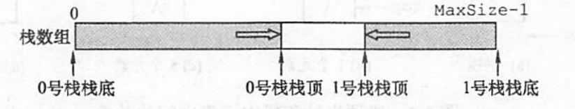
0号栈栈顶：top0
1号栈栈顶：top1
进栈：0号进栈`top0++`;1号进栈`top1--`
出栈：与进栈相反
空栈的判定条件：`top0+1==top1`
满栈的判定条件：`top0==-1；top1==MaxSize`
#### 链栈
##### 链栈的存储结构
```C
typedef struct SNode{
    Elemtype data; //存放栈中元素
    struct SNode *next ; //栈顶指针
} SNode，*SLink //链栈的结点
```
##### 链栈的进栈
```C
bool Push(LinkStack *S, ElemType x){
    SLink p=(SLink)malloc(sizeof(SNode)); //给新元素分配空间
    p->data=x; //新元素的值
    p->next=S->top; //p的后继指向栈顶元素
    S->top=p; //栈顶指针指向新的元素
    S->count++; //栈中元素个数加1
    return true; 
}
```
上例代码为不带头结点
带头结点：p->next=S->top->next; S->top->next=p; 
不带头结点：p->next=S->top; S->top=p; 
##### 链栈的出栈
```C
bool Pop(LinkStack *S, ElemType&x){
    if(S->top==NULL) return false;
    x=S->top->data; //栈顶元素值
    Slink p=S->top; //辅助指针
    S->top=S->top->next; //栈顶指针后移
    free(p); //释放被删除数据的存储空间
    S->count--; //栈中元素个数减一
    return true; 
}
```
上例代码为不带头结点
不带头结点：p=S->top; S->top=S->top->next; free(p);
带头结点：p=S->top->next; S->top->next=p->next; 
#### 栈的应用
##### 1.函数与递归(先调用后执行 用栈来保留先调用的函数，出栈再执行)
##### 2.表达式求值(前缀 中缀 后缀)
例：
中缀表达式：A+B*(C-D)-E/F
后缀表达式：ABCD-*+EF/-
对应二叉树：数字在两边，符号在中间
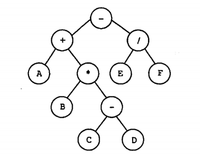
前序——>前缀
中序——>中缀
后序——>后缀
计算机普遍利用后缀表达式计算，计算规则：从左到右扫描表达式的每个数字和符号，遇到数字就进栈，遇到符号就将处于栈顶的两个数字出栈然后跟这个符号进行运算，最后将运算结果进栈，直到最终获得结果。
**中缀转后缀**
有两个栈，一个为数字栈，一个为符号栈
规则：
1.操作数直接入数字栈
2.遇到`(`入数字栈，直到遇到`)`将里面全部弹出
3.弹出栈中优先级高或者等于当前运算符中的所有运算符，直到遇到`(`。
在符号栈中，符号的优先级是不断上升的
比如以`(`为分界点,`*`和`/`一直在`+`和`-`上面，且不会有连续的同优先级出现。
如`+(-*`正确，`+(*-`错误
##### 3.进制转换
##### 4.括号匹配
括号匹配算法思想：若是左括号，入栈；若是右括号，出栈一个左括号判断是否与之匹配；检验到字符串尾，还要检查栈是否为空。只有栈空，整个字符串才是括号匹配的。
### 队列
队列：FIFO 先进先出
双端队列：
1.输入受限，两端都可以出，只有一端可以入
2.输出受限，两端都可以入，只有一端可以出
队列的应用：1.排队；2.打印机；3.层次遍历；4.BFS；5.基数排序
#### 顺序队列
##### 循环队列
`front`指队首；`rear`指队尾的下一个元素
队列空：`front==rear`
队列满：`(rear+1)%MaxSize==front`
入队：`rear=(rear+1)%MaxSize`
出队：`front=(front+1)%MaxSize`
长度：`(rear+MaxSize-front)%MaxSize`
#### 链队列
一般为带尾指针的单循环链表
插入：尾插，尾改头不改
删除：头插，头改尾不改；<font color="#dd0000">删除到最后，头尾都要改</font>。
入队：rear++；放入
&emsp;与单链表插入操作一致
```C
void EnQueue(LinkQueue &Q，ElemType x){
    s=(LinkNode *)malloc(sizeof(LinkNode));
    s->data=x; 
    s->next=NULL; 
    Q.rear->next=s;
    Q.rear=s;
}
```
出队：放出；front++
&emsp;头结点的后继结点出队
```c
bool DeQueue(LinkQueue &Q,ElemType &x){
    if(Q.front==Q.rear) return false; //空队
    p=Q.front->next;
    x=p->data;
    Q.front->next=p->next;
    if(Q.rear==p) Q.rear=Q.front; //若原队列中只有一个结点，删除后变空
    free(p);
    return true;
}
```
## 树
树的度：树中结点的最大度数
结点的度：子结点的个数
路径：两个结点之间的结点序列

1.结点数为所有结点度数+1
2.m度树，叶子结点个数$n_{0}=n_{2}+2n_{3}+...(m-1)n_{m}+1$
$n_{2}$为度为2的结点个数
### <font color="#dd0000">二叉树和完全二叉树</font> 
#### 二叉树的链式存储结构：
```c
typedef struct BiTNode{
    ElemType data; //数据域
    struct BiTNode *lchild,*rchild; //指向该结点的左、右孩子指针
}BiTNode,*BiTree; //二叉树结点结构
```
#### 特殊性质：
1.非空二叉树&emsp;叶子结点数$n_{0}$为度为2的结点数+1，即$\mathbf{n_{0}=n_{2}+1}$
2.**k**层树至少有$\mathbf{2^{k-1}}$个结点
3.高度为**h**至多有个$\mathbf{2^{h-1}}$结点
4.具有**n**个节点的二叉树，最小高度$\lfloor\mathbf{log_2{n}+1}\rfloor$向下取整
#### 完全二叉树的独有性质
完全二叉树：除了最后一行，其余层全满
全满**k**层，一共$\mathbf{2^{k}-1}$个结点
1.**n**个结点深度：$\lfloor\mathbf{log_2{n}+1}\rfloor$向下取整或$\lceil\mathbf{log_2{(n+1)}}\rceil$向下取整
2.右子树最大I层，左子树最大I+1或I层
3.双亲结点 $\lfloor\mathbf{i/2}\rfloor$
4.度为1的个数只有0或1
5.叶子结点出现在k层或者k-1层，k为深度
6.当该层编好后出现一结点为叶子结点或只有左子树，则之后都是叶子结点，如下图为某一层的最后结点
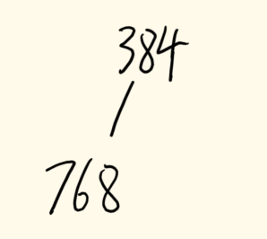 384之后都是叶子结点，所以叶子结点数：768-384=384
#### 二叉树遍历
先序：根左右
中序：左根右
后序：左右根
层次：按照层次遍历
中+层$\Rightarrow$层
中+后$\Rightarrow$后
中+先$\Rightarrow$先
先确定根，中序确定左右
#### 线索二叉树
方便查找前驱、后继和遍历(前驱后继根据中序)
1.有左孩子，指向左孩子；无，则指向前驱
2.有右孩子，指向右孩子；无，则指向后继
***问题：<u>如何区分指针是指向左孩子还是前驱，或者指向右孩子还是后继？</u>***
答：在二叉链表的结构基础上增加两个标志位`ltag`和`rtag`
$ ltag=
0，左孩子；
1，前驱
$
$ rtag=
0，右孩子；
1，后继
$
#### 树、森林和二叉树转换
一般树转化为二叉树规则：**左孩子不变，右孩子变为右兄弟**，如下图所示：
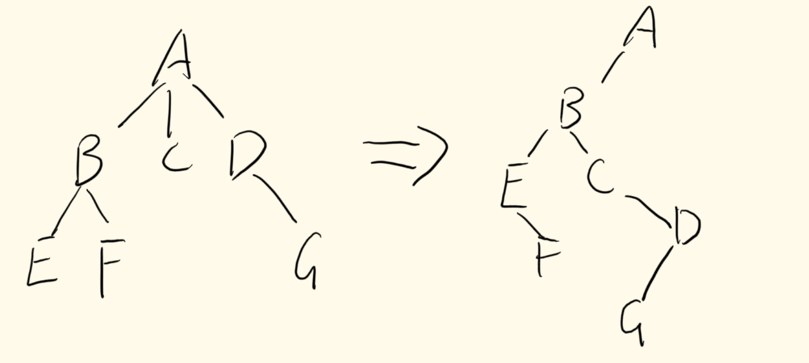
根右边一定为空，所以**根据根的右子树情况，可判断森林中树的个数**
森林转化为二叉树规则：先将每棵树转化为二叉树，再将每棵树的根相连
$树\Rightarrow二叉树$：$先序\Rightarrow先序；$$后序\Rightarrow中序；$$中序\Rightarrow中序$
### 哈夫曼树
WPL带权路径最小
权重大的在上面，权重小的在下面
不够需要补0，&emsp;补几个，利用$n_0=(m-1)n_m+1$，$n_m$为整数，所以$n_m=\frac{n_0-1}{m-1}$最后得$n_0$
左0右1
只有0度和2度的结点
**前缀编码判定方法**：
1.任何一个编码不能是一个编码的前缀
2.画树，找度为1的点，$n_1=1$不能是前缀编码
## 图
度之和=边*2
完全图边数：$\frac{n(n-1)}{2}$
顶点集`V` &emsp;边集`E`
非连通：最多$\mathbf{C^2_ {n-1}}$条边
连通：最少$\mathbf{C^2_ {n-1}+1}$条边
强联通(顶点v到w或w到v都有路径)：最少$\mathbf{n}$条边
简单路径：顶点不重复 &emsp;简单回路：首尾相同其余不重复
### 图的存储
#### 邻接矩阵
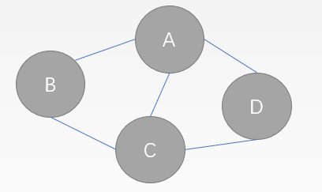
如图所得邻接矩阵：<br /> 
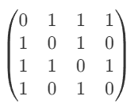

若是有向图，则是指向为1，例：
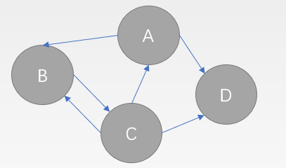
如图所得邻接矩阵：<br /> 
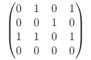

<font color="#dd0000">邻接矩阵唯一，遍历结果也唯一</font>
空间复杂度：$O(n^2)$ &emsp; 遍历时间复杂度：$O(n^2)$

#### 邻接表
**<font color="#dd0000">适用于稀疏图(|E|远小于|V|^2)</font>**
##### 无向图
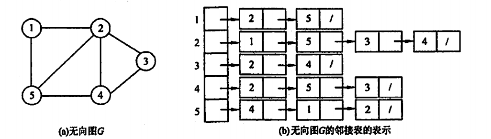
##### 有向图
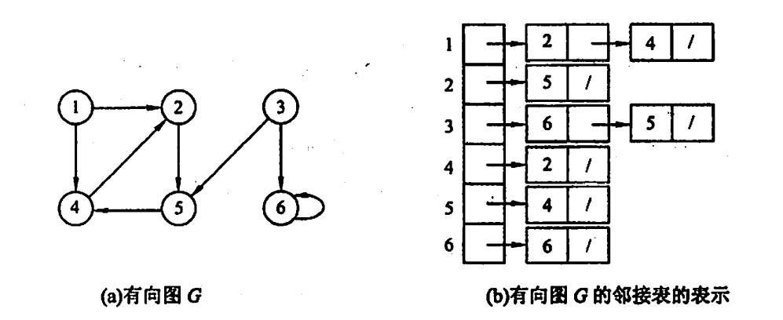
<font color="#dd0000">邻接表不唯一，遍历结果不唯一。但若是已经给定邻接表，遍历结果唯一。</font>
遍历时间复杂度：$O(n+e)$

### 图的遍历
#### 广度优先搜索(BFS)
**空间复杂度**：
BFS需要借助一个**队列**，n个顶点均需要入队一次，所以最坏情况下n个顶点在队列，那么则需要$\mathbf{O(|V|)}$的空间复杂度。
**时间复杂度**：
1)邻接表：每个顶点入队一次，时间复杂度为$\mathbf{O(|V|)}$,对于每个顶点，搜索它的邻接点，就需要访问这个顶点的所有边，所以时间复杂度为$\mathbf{O(|E|)}$。所以总的时间复杂度为$\mathbf{O(|V|+|E|)}$
2)邻接矩阵：每个顶点入队一次，时间复杂度为$\mathbf{O(|V|)}$,对于每个顶点，搜索它的邻接点，需要遍历一遍矩阵的一行，所以时间复杂度为$\mathbf{O(|V|)}$,所以总的时间复杂度为$\mathbf{O(|V|^2)}$

#### 深度优先搜索(DFS) 
**空间复杂度**：
由于DFS是一个递归算法，递归是需要一个**工作栈**来辅助工作，最多需要图中所有顶点进栈，所以时间复杂度为$\mathbf{O(|V|)}$
**时间复杂度（与BFS相同）**：
1)邻接表：遍历过程的主要操作是对顶点遍历它的邻接点，由于通过访问边表来查找邻接点，所以时间复杂度为$\mathbf{O(|E|)}$,访问顶点时间为$\mathbf{O(|V|)}$,所以总的时间复杂度为$\mathbf{O(|V|+|E|)}$
2)邻接矩阵：查找每个顶点的邻接点时间复杂度为$\mathbf{O(|V|)}$,对每个顶点都进行查找，所以总的时间复杂度为$\mathbf{O(|V|^2)}$
### 图的应用——最小生成树的构造算法和性质
#### Prim算法
n个顶点，n-1条边
规则：
①从图中找第一个起始顶点v0，作为生成树的第一个顶点，然后从这个顶点到其他顶点的所有边中选一条权值最小的边。然后把这条边的另一个顶点v和这条边加入到生成树中。
②对剩下的其他所有顶点，分别检查这些顶点与顶点v的权值是否比这些顶点在lowcost数组中对应的权值小，如果更小，则用较小的权值更新lowcost数组。
③从更新后的lowcost数组中继续挑选权值最小而且不在生成树中的边，然后加入到生成树。
④反复执行②③直到所有所有顶点都加入到生成树中。
<font color="#dd0000">PS:只有当图中每条边的权重均不相等时，Prim和Kruskal算法生成的MST一定唯一。而若是Kruskal能完成唯一判断，则基本上就是唯一的。</font>
需要维护两个数组：`lowcost[n]`和`adjvex[n]`（n是图中的顶点数）
`lowcost[n]`记录边长
`adjvex[n]`记录该条边从那个顶点出发
```c
Void MiniSpanTree_Prim(MGraph G){
    int min,i,j,k;
    int adjvex[MAXVEX];   //保存邻接顶点下标的数组
    int lowcost[MAXVEX]; //记录当前生成树到剩余顶点的最小权值
    lowcost[0]=0;//将0号顶点(以0号顶点作为第一个顶点)加入生成树
    adjvex[0]=0;//由于刚开始生成树只有一个顶点 不存在边 干脆都设为0
    for(i=1;i<G.vexnum;i++){ //除下标为0以外的所有顶点
        lowcost[i]=G.arc[0][i];//将与下标为0的顶点有边的权值存入Lowcost数组
            djvex[i]=0;//这些顶点的adjvex数组全部初始化为0
    }
    //算法核心
    for(i=1;i<G.vexnum;i++){//只需要循环N-1次，N为顶点数
        min=65535; //tip：因为要找最小值，不妨先设取一个最大的值来比较
        j=0;k=0;
        //找出lowcost最小的 最小权值给min，下标给k
        while(j<G.vexnum){ //从1号顶点开始找
            if(lowcost[j]!=0 && lowcost[j]<min)
            { //不在生成树中的顶点而且权值更小的
                 min=lowcost[j]; //更新更小的值
                k=j;  //找到了新的点下标给k
            }
            j++; //再看下一个顶点
        }
        printf(“(%d->%d)”,adjvex[k],k); //打印权值最小的边
        lowcost[k]=0;  //将这个顶点加入生成树
        //生成树加入了新的顶点 从下标为1的顶点开始更新lowcost数组值
        for(j=0;j<G.vexnum;j++){ 
        if(lowcost[j]!=0 && G.arc[k][j]<lowcost[j]){  //如果新加入树的顶点k使得权值变小
            lowcost[j]=G.arc[k][j]; //更新更小的权值
            adjvex[j]=k;
        //修改这条边邻接的顶点也就是表示这条边是从选出的顶点k指过来的方便打印     
            }
        }
    }
}
```
时间复杂度为**O(n^2)**
而且时间复杂度只和n有关，所以适合**稠密图**

#### Kruskal(克鲁斯卡尔)算法
找最小边，不能形成回路
```c
#define MaxSize 100
typedef struct {
    int a,b;  //边的两个顶点
    int weight; //边的权值
}Edge;  //边结构体
int Find(int *parent,int x){
    while(parent[x]>=0) x=parent[x];  //循环向上寻找下标为x顶点的根
    return  x;  //while循环结束时找到了根的下标
}
Edge edges[MaxEdge];    //边数组
int parent[MaxVex];         //父亲顶点数组(并查集)
Void MiniSpanTree_Kruskal(MGraph G){
    int  i , n , m;
    sort(edges); //按权值由小到大对边排列
    for(i=0 ; i<G.vexnum ; i++)parent[i]=-1;  //初始化：各个顶点单独形成一个集合
    for(i=0 ; i<G.arcnum ; i++){    //扫描每条边
        n=Find(parent,edges[i].a);//n是这条边的第一个顶点的根顶点所在下标
        m=Find(parent,edges[i].b);//m是这条边第二个顶点的根顶点所在下标
        if(n!=m){//根顶点不相同 这条边不会构成环
             parent[n]=m;  //并操作
            //作为生成树的一条边打印出来
            printf(“(%d->%d) ”,edges[i].a,edges[i].b); 
        }
    }
}
```
时间复杂度：$O(|E|log|E|)$
主要时间耗费在排序上。排序和图中边的数量有关系，所以适合**稀疏图**。

### 图的应用——AOV网和AOE网、拓扑排序、关键路径

#### AOV网
有向网 &emsp;<$V_i$,$V_j$>,$V_i$完成必须先于$V_j$（无环），顶点表示活动，能被拓扑排序的便是AOE网
#### <font color="#dd0000">拓扑排序</font>（考得更多）
不唯一
每个顶点最多一次；
A在B前面，则没有B到A的路径
从AOV网中选择一个入度为0的顶点输出，然后删去此顶点，并删除以此顶点为弧尾的弧。重复这个步骤直到输出图中全部顶点，或者找不到入度为0的顶点为止。
由于拓扑排序需要删除边和顶点，所以使用邻接表存储图比较方便。
```c
bool TopologicalSort(Graph G){
    InitStack(S);//初始化栈，存储入度为0的顶点
    for(int i=0;i<G.vexnum;i++)
        if(indegree[i]==0)Push(S,i);//将所有入度为0的顶点进栈
    int count=0;//计数，记录当前已经输出的顶点数
    while(!IsEmpty(S)){//栈不空，则存在入度为0的顶点
        Pop(S,i);//栈顶元素出栈
        pritnf(“%d”,G.adjlist[i]);
        for(ArcNode *p=G.vertices[i].firstarc; p; p=p->nextarc){
            v=p->adjvex; //取这条弧指向的顶点
            if(!(--indegree[v]))Push(S,v);   //入度减1为0，则入栈
        }
    }
    if(count<G.vexnum)return  false;    //排序失败，有向图中有回路
    else return  true; 	//拓扑排序成功
}
```
时间复杂度：O(n+e)
#### AOE网
带权的有向无环，用顶点表示事件，**用边表示活动**
#### 关键路径

1.顶点事件发生，各条边活动才能开始；
2.各边活动结束，顶点事件才能发生
最大路径长度的路径：关键路径
关键路径上的活动：关键活动
工程最短时间：关键路径长度

1.加快关键活动缩短工期
2.关键路径不唯一，要缩短所有关键路径的公共部分或者都缩短

最早事件开始时间：正推法 &emsp;从头到该事件的**最长**路径  **值最大**
最晚事件开始时间：倒推法 &emsp;从最大路径往前到该事件的**最小**路径  **值最小**
<font color="#dd0000">关键路径的最早发生时间和最晚发生时间是一样的！</font>

### 最短路径
#### Dijkstra(迪杰斯特拉)算法 选择题中最难题
`dist[]`：记录了从源点v0到其他各顶点当前的最短路径长度
`path[]`：`path[i]`表示从源点到顶点i之间的最短路径的前驱结点，在算法结束时，可根据其值追溯得到源点v0到顶点vi的最短路径。
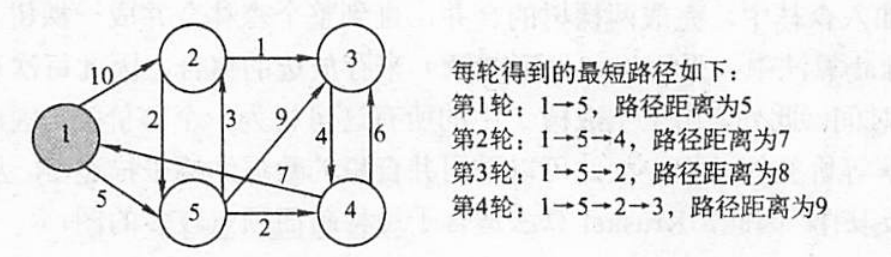
**时间复杂度**：迪杰斯特拉算法的核心部分在于一个双重循环，这个双重循环的内循环又是两个并列的单重for循环组成(找距离最小顶点和更新距离),任意取其中一个循环中的操作为基本操作，都可以得出迪杰斯特拉算法的时间复杂度为$\mathbf{O(n^2)}$ 其中n为图中的顶点数。


#### Floyd(弗洛伊德)算法
求图中任意一对顶点间的最短路径的算法
递推产生一个n阶方阵序列$A^{(−1)}$，$A^{(0)}$，…，$A^{(k)}$，…，$A^{(n−1)}$
其中$A^{(k)}[i][j]$表示从顶点vi到顶点vj的路径长度，k表示绕行第k个顶点的运算步骤。
$A^{(k)}[i][j]=Min{A^{(k-1)}[i][j],A^{(k-1)}[i][k]+A^{(k-1)}[k][j]}$
**时间复杂度**：弗洛伊德算法的核心为一个三重循环，所以时间复杂度为$\mathbf{O(n^3)}$ 其中n是图中的顶点数。


## 查找
### 折半查找
仅适用于顺序存储，有序顺序表
时间复杂度：$\mathbf{O(log_2n)}$
1.默认使用$\lfloor\mathbf{\frac{low+high}{2}}\rfloor=mid$向下取整
2.平均查找长度ASL取决于其树型结构。而树型结构只取决于元素个数
$ASL\approx$$log_2(n+1)-1$
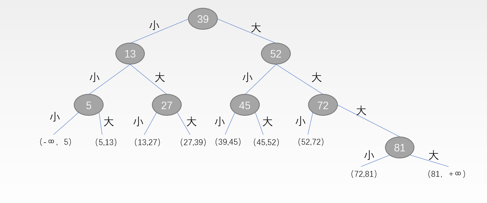
ASL成功=（1+2+2+3+3+3+3+4)/8=21/8
ASL失败=（3+3+3+3+3+3+3+4+4)/9=29/9
### BST二叉排序树的查找、插入和删除
BST二叉排序树:左小右大
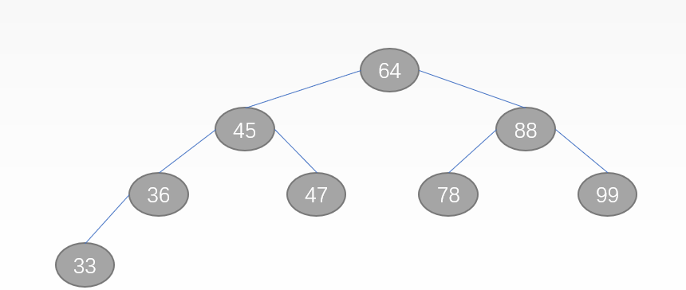
#### 查找(非递归)
```c
BiTNode * BST_Search(BiTNode *t,ElemType key){
    BiTNode *p=t;  //工作指针 初值指向二叉排序树根结点
    while(p!=NULL && key!=p->data){/p不为空且没有找到key
        if(key<p->data)  
            p=p->lchild;//如果key值比p指向结点值小，则查找左子树
        else  
            p=p->rchild;  //如果key值比p指向结点值大，则查找右子树
    }
    return p; //查找成功返回指向值为key值的结点的指针 查找失败返回NULL 
}
```
最好效率：$\mathbf{O(log_2n)}$
最坏效率：$\mathbf{O(n)}$
#### 删除
1.删叶子，直接删
2.删除的是仅有左子树或者右子树的结点，让其子树取代，“子承父业”
3.删除的是左右子树都有的结点。中序遍历，删除结点的直接前驱或者直接后继结点来取代。
### AVL平衡二叉树树的性质和调整
左右子树的高度差不超过1，为平衡二叉树
高度差为**平衡因子**，平衡二叉树的结点平衡因子只有0，-1和1
平衡二叉树可以为空树

#### 插入
插入后二叉树不平衡了
从插入路径上找到与插入结点最近的**平衡因子绝对值大于1**的结点，将其作为根的**子树**（组成三个点，按照以下情况调整）
##### LL调整
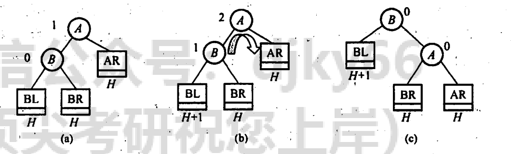
##### RR调整
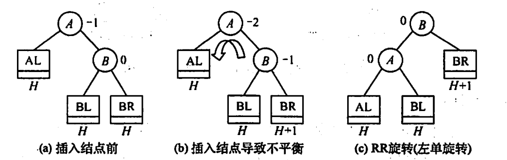
##### LR调整
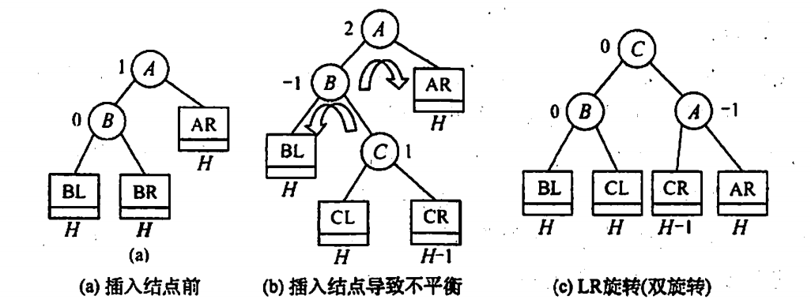
##### RL调整
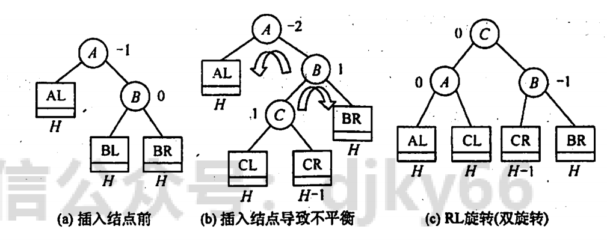
#### 删除
插入看自己，删除看兄弟
1.用**二叉排序树删除**的方法删（叶子直接删；只有一颗子树，用子树代替；两颗子树都有，中序遍历用前驱或者后继代替）
2.从删除的位置向上找到第一个**不平衡点**，从该点向下高度最高的点，一条线有三个。(以x，y，z为例，z为第一个不平衡点，y是z的最高孩子结点，x是y的最高孩子结点)
3.之后同上的插入方法，根据x，y，z的情况旋转
深度为h的最少结点数为$N_n$
$N_0=0$，$N_1=1$，$N_2=2$，$N_n=N_{(n-1)}+N_{(n-2)}$+1
### <font color="#dd0000">B树和B+树的性质</font>
#### m阶B树特点
1）树中每个结点至多有**m**棵子树。（即至多含有**m-1个关键字**) ("两棵子树指针夹着一个关键字")
2）若根结点不是终端结点，则至少有两棵子树。(至少一个关键字)
3）除根结点外的所有非叶结点至少有⌈m/2⌉(向上取整)棵子树。（即至少含有⌈m/2⌉-1个关键字）
如图所示是一个5阶B树：
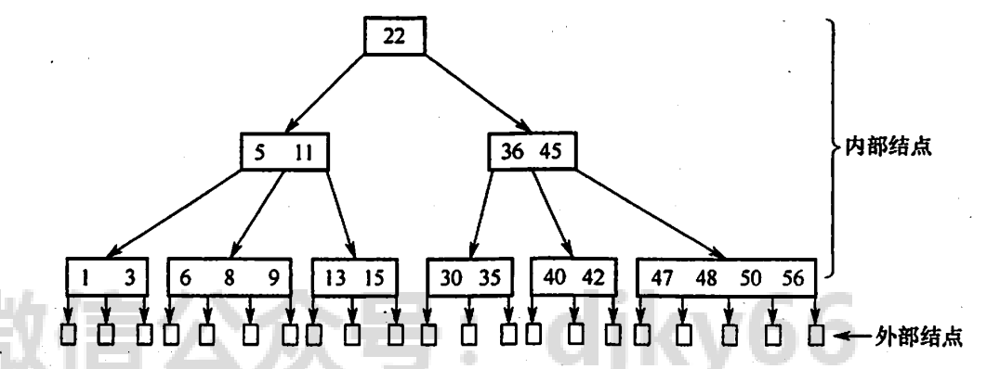
##### B树结点子树个数
**根结点**:子树个数$\mathbf{[2,m]}$ &emsp; 关键字数$\mathbf{[1,m-1]}$
**其他结点**:子树个数$\mathbf{[⌈m/2⌉,m]}$ &emsp; 关键字数$\mathbf{[⌈m/2⌉-1,m-1]}$
**该类题求解方法：**
1.关键字最少$\Leftrightarrow$子树少$\Leftrightarrow$结点少；
2.关键字个数：
&emsp;最少结点：每个结点的关键字最多，m-1
&emsp;最多结点：每个结点的关键字最少，⌈m/2⌉-1

#### m阶B+树特点
结点的子树个数与关键字个数相同
支持顺序查找和随机查找，B树只支持随机
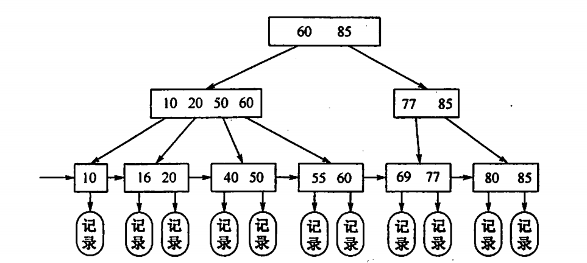
m阶的B+树与m阶的B树的**主要差异**在于：
1）在B+树中，具有n个关键字的结点只含有n棵子树，即<font color="#dd0000">每个关键字对应一棵子树</font>；而在B树中，具有n个关键字的结点含有(n+1)棵子树。
2）在B+树中，每个结点（非根内部结点）关键字个数n的范围是 ⌈m/2⌉≤n≤m（根结点1≤n≤m），在B树中，每个结点（非根内部结点）关键字个数n的范围是⌈m/2⌉ -1≤n≤m-1（根结点：1≤n≤m-1）。
3）在B+树中，<font color="#dd0000">叶结点包含信息，所有非叶结点仅起到索引作用</font>，非叶结点中的每个索引项只含有对应子树的<font color="#dd0000">最大关键字</font>和指向该子树的指针，不含有该关键字对应记录的存储地址。
4）在B+树中，<font color="#dd0000">叶结点包含了全部关键字</font>，即在非叶结点中出现的关键字也会出现在叶结点中；而在B树中，叶结点包含的关键字和其他结点包含的关键字是不重复的。
主要应用：
编译器中的词法分析：二叉树
数据库索引：B+
路由表查找：折半
#### B树插入与删除
##### 插入
可能插入后B树的高度+1，因为根结点也进行分裂
步骤：
1.找到插入的叶子结点
2.若该结点插入后，关键字仍小于等于m-1，则直接插入。反之，则将需要**分裂**。分裂的方法：取这个关键字数组中的中间关键字(⌈m/2⌉)作为新的结点，然后其他关键字形成两个结点作为新结点的左右孩子。需要从该结点的父结点持续向上进行，若不符合要求，就依次分裂直到根结点。
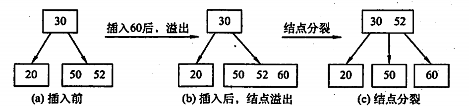

##### 删除
##### 1）删除的关键字不在终端结点上（最底层非叶子结点）
用直接前驱(最右下)和直接后继(最左下)来代替，然后便转换为了“在终端结点”的问题
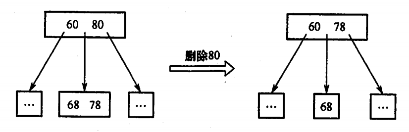
##### 2）删除的关键字在终端结点上（最底层非叶子结点）
1.结点内关键字数量**大于**⌈m/2⌉-1(不能等于)，删除后仍大于等于⌈m/2⌉-1这时删除这个关键字不会破坏B树的定义要求。所以直接删除。
2.结点内关键字数量**等于**⌈m/2⌉-1，并且其左右兄弟结点中存在关键字数量**大于**⌈m/2⌉-1 的结点，则去兄弟阶段中借关键字。
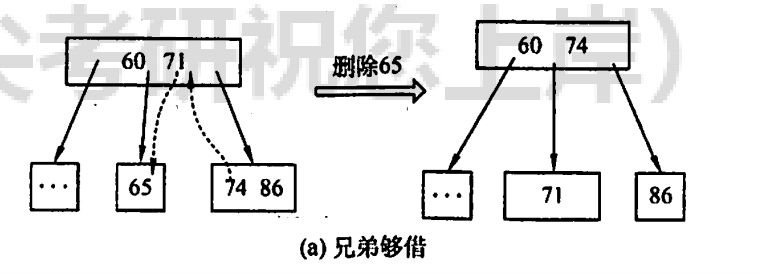
3.结点内关键字数量**等于**⌈m/2⌉-1 ，并且其左右兄弟结点中都是关键字数量**等于**⌈m/2⌉-1 的结点，则需要进行结点合并。
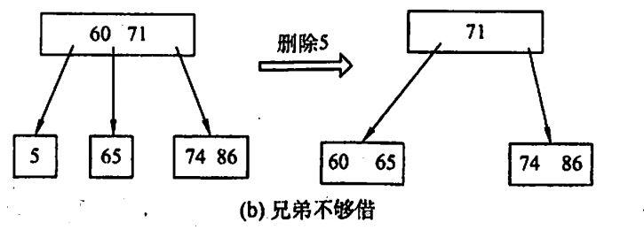
### 散列表
#### 散列函数
主要是**除留余数法**m，H(key)=key % p
#### 冲突处理方法
##### 开放定址法
1）线性探测法：冲突发生时，顺序查看表中下一个单元（当探测到表尾地址m-1时，下一个探测地址是表首地址0），直到找出一个空闲单元（当表未填满时一定能找到一个空闲单元）或查遍全表。**易“堆积”**，降低查找效率
2）平方探测法：设发生冲突的地址为d,平方探测法得到的新的地址序列为$d\pm1^2$，$d\pm2^2$......$d\pm{k^2}$
$m$是列表长度，则$k\leq{m/2}$,$m$必须是一个$4k+3$的质数
平方探测法是一种较好的处理冲突的方法，可以**避免**出现“堆积”问题，它的缺点是不能探测到散列表上的所有单元，但至少能探测到一半单元。
##### 拉链法
对于不同的关键字可能会通过散列函数映射到同一地址，为了避免非同义词发生冲突，可以**把所有的同义词存储在一个线性链表中**，这个线性链表由其散列地址唯一标识。拉链法适用于**经常进行插入和删除的情况**。
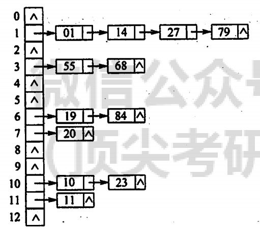
ASL成功$=\frac{1\times6+2\times4+3\times1+4\times1}{12}$ &emsp;分母12为总数据个数
ASL失败$=\frac{0+4+0+2+0+0+2+1+0+0+2+1+0}{13}$ &emsp;分母13为散列表长度
#### 性能分析
装填因子：散列表的装填因子一般记为α，定义为一个表的装满程度。
计算方法为α=表中记录数𝑛/散列表长度𝑚
散列表的平均查找长度依赖于散列表的填装因子α，而不直接依赖于n或m。
α越大，表示装填的记录越“满”，发生冲突的可能性就越大，反之发生冲突的可能性越小。
<font color="#dd0000">散列函数、冲突处理方法、装填因子以上三者都是影响平均查找长度的因素</font>

## 排序
### 直接插入排序
首先以一个元素为有序的序列，然后将后面的元素依次插入到有序的序列中合适的位置直到所有元素都插入有序序列。
可以用链表，则移动次数减少，但比较次数增多
特点：**前半部分是有序的** 第n趟排序，则至少有n+1个有序
```C
void InsertSort(ElemType A[],int n){
    int i,j;
    for(i=2;i<=n;i++)	
        if(A[i].key<A[i-1].key){	
            A[0]=A[i];//复制为哨兵，A[0]不存放元素
            for(j=i-1;A[0].key<A[j].key;--j)
                A[j+1]=A[j];//所有比待插入元素值大的都往后移一位，腾出空位
            A[j+1]=A[0];//复制到插入位置 
    }
}
```
**空间复杂度**：在下标为0处存储哨兵，是常数个辅助空间大小，所以空间复杂度为$O(1)$
**时间复杂度**：最好$O(n)$，最坏$O(n^2)$，实际<font color="#dd0000">$\mathbf{O(n^2)}$</font>，**<font color="#dd0000">稳定</font>**
### 折半插入排序
只能顺序表
通过折半查找到插入的位置
```c
void InsertSort(ElemType A[],int n){
    int i,j,low,high,mid;
    for(i=2;i<=n;i++){	//i记录的是待插入的元素下标，也就是说i-1之前的元素都是有序的	
        A[0]=A[i]; //保存待插入的值			
        low=1;high=i-1; 
        while(low<=high){	 //折半查找	
            mid=(low+high)/2;	
            if(A[mid].key>A[0].key) high=mid-1; 
            else low=mid+1;	
        }
        //找到了待插入的位置 接下来从后往前依次后移元素腾出位置
        for(j=i-1;j>=high+1;--j)A[j+1]=A[j];		
        A[high+1]=A[0];	//因为此时high指向的是待插入位置的前一位		
    }
}
```
减少了比较次数————$O(nlog_2n)$
但时间复杂度仍是<font color="#dd0000">$\mathbf{O(n^2)}$</font>，**<font color="#dd0000">稳定</font>**
### 希尔排序
仅适用于顺序表
希尔排序本质上还是插入排序，只不过是把待排序序列分成几个子序列，再分别对这几个子序列进行直接插入排序。
①先以增量5来分割序列，也就是下标为0,5,10,15...的关键字分成一组，下标为1,6,11,16..分成一组,然后对这些组分别进行直接插入排序，这就完成了一轮希尔排序。
②缩小增量(d1=n/2，di+1= ⌊di/2⌋，比如10个数据序列，第一次增量d1=10/2=5,第二次增量d2= ⌊d1/2⌋= ⌊5/2⌋=2,并且最后一个增量等于1),所以第二轮以增量为2进行类似的排序过程。
③接下来的第三轮，第四轮...都是类似的过程，直到最后一轮以增量为1。此时就是前面所说的直接插入排序。
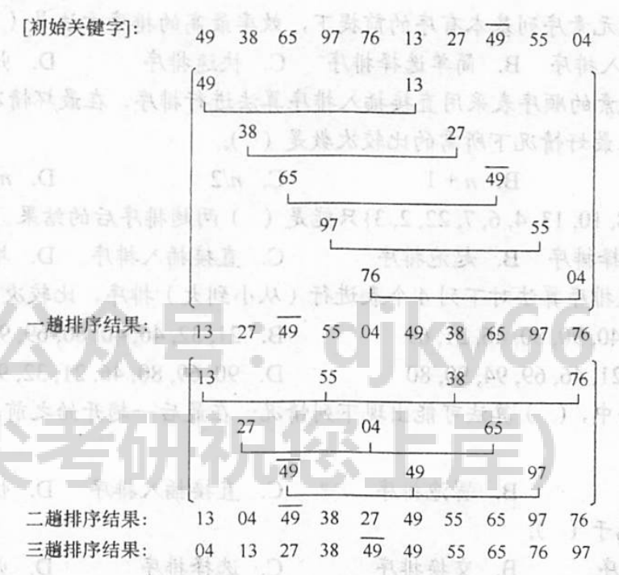
步长为d，则分组就有d个分组
**希尔排序的优势：**
希尔排序的每一轮都会使整个序列变得越来越有序，最后一轮当增量为1的时候，整个序列几乎都是有序的，所以进行直接插入排序会提高排序的效率。
```c
void ShellSort (ElemType A[],int n){
    int i,j;
    for(dk=n/2;dk>=1;dk=dk/2)//初始增量为总长度的一半,之后依次除2且向下取整,且最后一次要为1
        for(i=dk+1;i<=n;++i)
            if(A[i].key<A[i-dk].key){ //A[i].key是待插入的关键字，i-dk之前的都是有序的，如果待插入的比有序序列最后一个小则需要进行排序(进入if语句块)，如果大则不需要(跳出if语句块)
                A[0]=A[i]; //待插入关键字暂存在A[0]
                for(j=i-dk;j>0&&A[0].key<A[j].key; j-=dk){
                //待插入关键字之前以dk为增量的关键字只要比待插入关键字大的都往后移动dk位
                    A[j+dk]=A[j];		
                    A[j+dk]=A[0]; 
                    //找到了待插入的位置，就将待插入关键字插入这个位置			
                }
            }
}
```
**空间复杂度**：希尔排序的空间复杂度为$O(1)$
**时间复杂度**：希尔排序的时间复杂度约为<font color="#dd0000">$\mathbf{O(n^{1.3})}$</font>    在最坏情况下希尔排序的时间复杂度为$O(n^2)$
**<font color="#dd0000">不稳定</font>**：由于不同的增量可能就会把相等的关键字划分到两个直接插入排序中进行排序， 可能就会造成相对顺序变化。

### 冒泡排序
```c
void BubbleSort(ElemType A[],int n){
    for(i=0;i<n-1;i++){
        flag=false;//tips:当整个序列都有序的时候，标志位是不发生修改的，从而表示已经排好了	
        for(j=n-1;j>i;j--)//一趟冒泡过程
            if(A[j-1].key>A[j].key){//如果前面的元素比后面的大，则需要做交换
                ElemType temp=A[j-1].key;
                A[j-1].key=A[j].key;
                A[j].key=temp;	
                flag=true; //发生了数据交换 修改标志位
            }
        if(flag==false)return ; //本趟遍历后没有发生交换，说明表已经有序
    }
}
```
**空间复杂度**：交换时开辟了存储空间来存储中间变量，所以空间复杂度为O(1)
**时间复杂度**：最好$\mathbf{O(n)}$，最坏$\mathbf{O(n^2)}$，实际<font color="#dd0000">$\mathbf{O(n^2)}$</font>，**<font color="#dd0000">稳定</font>**
### 快排
顺序表
每一趟快排选择序列中任一个元素作为枢轴(pivot)(通常选第一个元素)，将序列中比枢轴小的元素都移到枢轴前边，比枢轴大的元素都移到枢轴后边。
```c
//划分函数
int Partition(ElemType A[],int low,int high){//low是当前待排序的序列起始下标，high是末尾下标
    ElemType pivot=A[low];	//第一个元素作为枢轴
    while(low<high){		
        while(low<high&&A[high]>=pivot) --high;//先从末尾往前找到第一个比枢轴小的元素
        A[low]=A[high];//用high的元素替换low的元素
        while(low<high&&A[low]<=pivot) ++low; //再从开头往后找到第一个比枢轴大的元素
        A[high]=A[low];//用low的元素替换high的元素
    }
    A[low]=pivot;//枢轴元素存放到最终位置
    return  low;//返回存放枢轴的最终位置
}
```
```c
//快排函数
void QuickSort(ElemType A[],int low,int high){
    if(low<high){   //low和high值要合法			
        int pivotpos=Partition(A,low,high);	
        QuickSort(A,low,pivotpos-1); //分治递归左半部分	
        QuickSort(A,pivotpos+1,high); //分治递归右半部分
    }
}
```
**时间复杂度**：最好$O(nlog_2n)$ ,最坏$O(n^2)$，实际<font color="#dd0000">$\mathbf{O(nlog_2n)}$</font>，**<font color="#dd0000">不稳定</font>**
性能最优
**特点**：每趟排序排完后，pivot元素一定在最终位置上。所以n趟排序，至少有n个元素在最终位置上
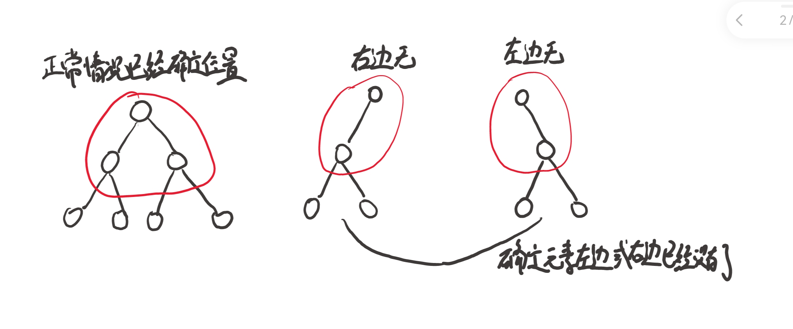
**特殊应用**：
找第k大的数
1.排序
2.不排序。用快排思想找pivot，若pivot在第k个位置就算是找到了。时间复杂度O(n)
### 简单选择排序
第i趟，对n-i次关键字进行比较，找到最大/最小与第i个元素进行替换
**跟元素的初始状态无关**
**时间复杂度**：<font color="#dd0000">$\mathbf{O(n^2)}$</font>
### <font color="#dd0000">堆排序</font>
堆：完全二叉树
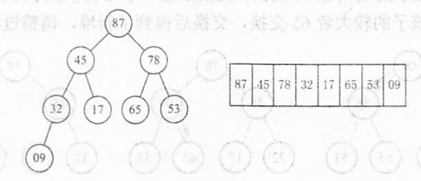
大根堆(用于升序)：根大于子树
小根堆：根小于子树
以大根堆为例：从下往上，将左右子树中大于根中最大的代替根
从第i个元素开始，i=n/2向下取整
大根堆代码：
```c
void BuildMaxHeap(ElemType A[],int len){
    for(int i=len/2;i>0;i--) AdjustDown(A,i,len); //由数组下标高处往低处,从第一个可能需要调整的非叶
    //结点开始检查，直到根结点(注意根结点下标不是0是从1开始存储)
}
void AdjustDown(ElemType A[],int k,int len){
//A是存储堆的数组,k是需要检查的结点下标,len是堆中结点个数
    A[0]=A[k];//A[0]暂存这个需要检查的结点值
    for(i=2*k;i<=len;i*=2){//从这个结点的左孩子开始往下比较，若发生交换对交换过的结点继续和其孩子比较
        if(i<len&&A[i]<A[i+1])i++;//若右孩子大一些就只要考虑和右孩子比较
        if(A[0]>=A[i])break;//若该结点的值大于它较大孩子结点值则不需要交换
        else{//若这个结点的值小于它较大孩子结点值则将孩子结点值赋值给该结点
            A[k]=A[i];	
            k=i;//i赋值给k也就是从i开始继续往下检查 直到所有结点检查结束	
        }
    }
    A[k]=A[0];//检查到最后k的值就是最后一轮交换过的结点位置下标将该结点换过去		
}
```
**空间复杂度**：堆排序只需要在交换结点的时候需要额外存储空间来辅佐，所以空间复杂度为$O(1)$
时间复杂度：
堆排序的总时间可以分为**①建堆部分**+**②n-1次向下调整堆**
**①建堆部分**:时间复杂度为$O(n)$
**②调堆部分**:一次调堆从上至下最坏情况走得路径是从根结点到叶子结点，完全二叉树的高度为$⌈log_2(n+1)⌉$，所以时间复杂度为$O(log_2n)$那么n-1个顶点时间复杂度为$O(nlog_2n)$
堆排序的时间复杂度为$O(n)$+$(nlog_2n)$=<font color="#dd0000">$\mathbf{O(nlog_2n)}$</font>，**<font color="#dd0000">不稳定</font>**
堆建立好后，输出堆顶，用末尾元素代替，然后按照前面的方法进行调整
```c
void HeapSort(ElemType A[],int len){
    BuildMaxHeap(A,len);//初始建堆
    for(i=len;i>1;i--){//n-1趟的交换和建堆过程
        Swap(A[i],A[1]);//输出堆顶元素(和堆底元素交换)
        AdjustDown(A,1,i-1);//把剩余的i-1个元素整理成堆
    }
}
```
常用于选前n个最大值(用小根堆)
堆删除首个元素重新建堆会把尾数换到首位
### 归并排序
用于外存排序，尤其是数据体积很大，内存放不下
二路归并排序
n个数先分为⌈n/2⌉(向上取整)个组，每组2或1个
下方为二路归并排序事例
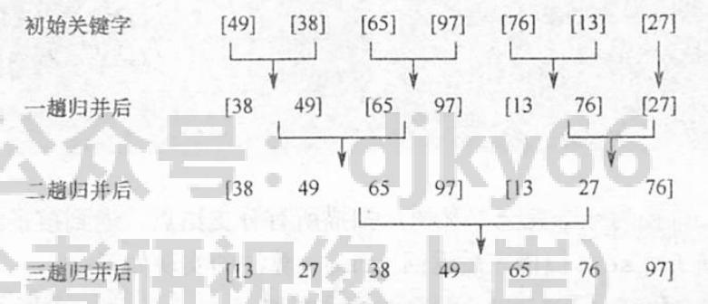
```c
ElemType *B=(ElemType *)malloc((n+1)*sizeof(ElemType)); //辅助数组
void Merge(ElemType A[],int low,int mid,int high){
//表A的两段A[low…mid]和A[mid+1…high]各自有序，将它们合并成一个有序表
    for(int k=low;k<=high;k++)B[k]=A[k];//将A中所有元素复制到B中
    for(int i=low,j=mid+1,k=i;i<=mid&&j<=high;k++){  
        //k是归并之后数组的下标计数器
        if(B[i]<=B[j])//比较B的左右两段中的元素
            A[k]=B[i++];//将较小值复制到A中
        else
            A[k]=B[j++];
    }
    while(i<=mid) A[k++]=B[i++];//若第一个表未检测完,则将剩下部分复制过来
    while(j<=high) A[k++]=B[j++];//若第二个表未检测完,则将剩下部分复制过来
}
void MergeSort(ElemType A[],int low,int high){
    if(low<high){
        int mid=(low+high)/2;//从中间划分两个子序列
        MergeSort(A,low,mid);//对左侧子序列进行递归排序
        MergeSort(A,mid+1,high);//对右侧子序列进行递归排序
        Merge(A,low,mid,high);//归并
    }       
}
```
**空间复杂度**：因为需要将这个待排序序列转存到一个数组，所以需要额外开辟大小为n的存储空间，即空间复杂度为$O(n)$
**时间复杂度**：每趟排序的时间复杂度都是$O(n)$所以整个归并排序的时间复杂度为<font color="#dd0000">$\mathbf{O(nlog_2n)}$</font>，**<font color="#dd0000">稳定</font>**

### 基数排序
链式   不比较、不移动
**基数排序**(也叫桶排序)是一种很特别的排序方法，它不是基于比较进行排序的，而是采用多关键字排序思想（即基于**关键字各位的大小进行排序**的），借助“分配”和“收集”两种操作对单逻辑关键字进行排序。基数排序又分为**最高位优先（MSD）**排序和**最低位优先（LSD）**排序。
假如以如下10个数据为例：
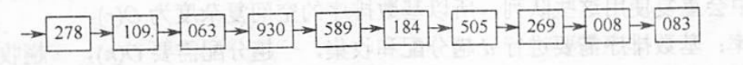
**第一趟比“个位”**：
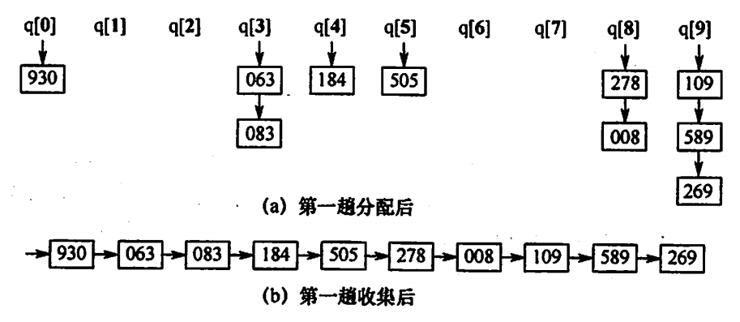
**第二趟比“十位”**：
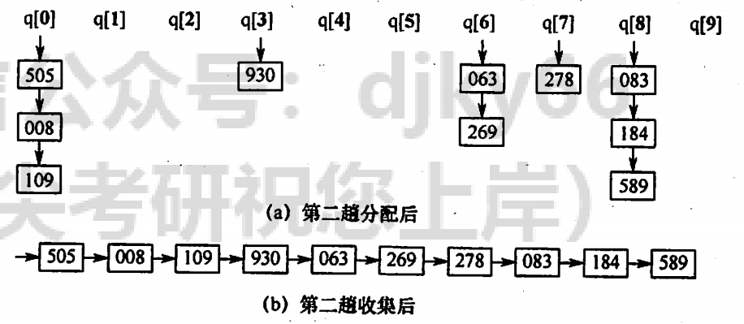
**第三趟比“百位”**：
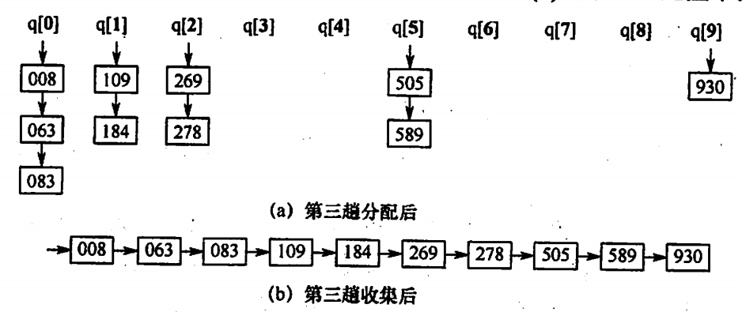
关键字数量为$\mathbf{n}$,关键字的位数为$\mathbf{d}$,比如748 d=3，$\mathbf{r}$为关键字的基的个数，就是组成关键字的数据的种类，比如十进制数字一共有0至9一共10个数字，即$\mathbf{r=10}$
**空间复杂度**：需要开辟关键字基的个数个队列，所以空间复杂度为$O(r)$
**时间复杂度**：需要进行关键字位数d次"分配"和"收集"，一次"分配"需要将n个关键字放进各个队列中，一次"收集"需要将r个桶都收集一遍。所以一次"分配"和一次"收集"时间复杂度为$O(n+r)$。d次就需要<font color="#dd0000">$\mathbf{O(d(n+r))}$</font>的时间复杂度。

### <font color="#dd0000">排序的比较分析</font>

<font size=2>

|   算法种类   |  最好  |   平均   |   最坏   |  空间复杂度   | 是否稳定  |
|  :----:  | :----:  |  :----:  | :----:  |  :----:  | :----: |
|  直插  | $O(n)$  |  $O(n^2)$  | $O(n^2)$  |  $O(1)$  | $√$  |
|  冒泡  | $O(n)$  |  $O(n^2)$  | $O(n^2)$  |  $O(1)$  | $√$  |
|  选择  | $O(n^2)$  |  $O(n^2)$  | $O(n^2)$  |  $O(1)$  | $×$  |
|  希尔  | $O(nlog_2n)$  |  $O(n^3)$  | $O(n^{1.3})$  |  $O(1)$  | $×$  |
|  快排  | $O(nlog_2n)$  |  $O(nlog_2n)$  | $O(n^2)$  |  $O(log_2n)$  | $×$  |
|  堆排  | $O(nlog_2n)$  |  $O(nlog_2n)$  | $O(nlog_2n)$  |  $O(1)$  | $×$  |
|  二路归并  | $O(nlog_2n)$  |  $O(nlog_2n)$  | $O(nlog_2n)$  |  $O(n)$  | $√$  |
|  基数  | $O(d(n+r))$  |  $O(d(n+r))$  | $O(d(n+r))$  |  $O(r)$  | $√$  |
</font>

**不稳定**：快希选堆
**时间复杂度**：$O(nlog_2n)$ 快堆归
**空间复杂度**：$O(log_2n)$ 快；$O(n)$ 归；$O(r)$ 基数
注意：$O(n^{1.3})是希尔$$d=n/2$的步长
特殊分类：
**只能用顺序表**：归并、堆、快排(希尔、折半插入)
&emsp;&emsp;&emsp;&emsp;&emsp;&emsp;&emsp;其余的链式和顺序都可以
**时间复杂度与元素初始状态<font color="#dd0000">无关</font>**：基数、选择、归并
**比较次数与元素初始状态<font color="#dd0000">无关</font>**：基数、选择
**排序趟数与元素初始状态<font color="#dd0000">有关</font>**：快排、冒泡
**排序趟数与元素初始状态<font color="#dd0000">无关</font>**：直插、折半、希尔、选择、堆、归并、基数
**至少确定一个位置**：交换：冒泡、快排；选择：简单选择、堆
