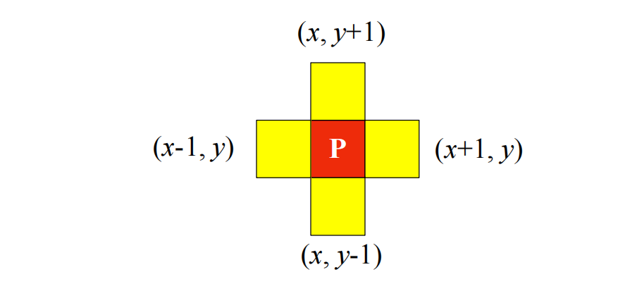
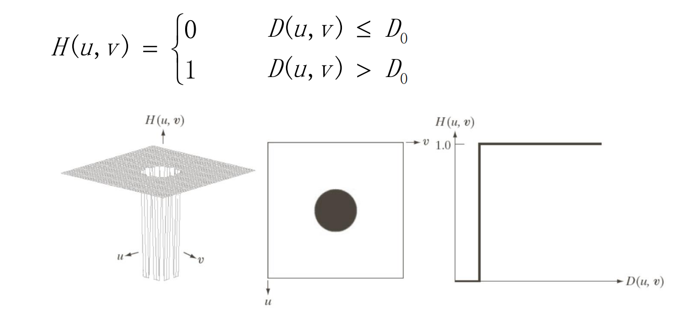

# 数字图像处理
------

## 数学图像基础
### 图像处理技术的分类
#### 1. 模拟图像处理
光学处理和电子处理：照相、遥感图像处理、电视信号处理
优点：速度快（一般为实时处理，理论上讲可达到光的速度，并可同时并行处理）。
缺点：精度较差，灵活性差，很难有判断能力和非线性处理能力。
#### 2. 数字图像处理
数字图像处理用计算机处理，亦称计算机图像处理
优点：精度高，内容丰富，可进行复杂的非线性处理，灵活的变通能力，仅改变软件就可以改变处理内容。
缺点：处理速度问题（复杂处理过程更甚）。实时处理一般精度的数字图像需100Mips的处理能力；分辨率及精度限制

### 数字图像处理的特点
1. 图像信息量大、数据量也大；
2. 图像处理技术综合性强；
3. 图像信息理论与通信理论密切相关。

### 图像取样和量化
#### 采样
将在空间上连续的图像转换成离散的采样点（即像素）集的操作。
由于图像是二维分布的信息，所以采样是在 x轴和y轴两个方向上进行一般情况下， x轴方向与y轴方向的采样间隔相同。
#### 量化
量化是将各个像素所含的明暗信息离散化后，用数字来表示。一般的量化值为整数。充分考虑到人眼的识别能力之后，目前非特殊用途的图像均为8bit量化，即用[0,255]描述“从黑到白”。
① 均匀量化：是简单地在灰度范围内等间隔量化。
② 非均匀量化：是对像素出现频度少的部分量化间隔取大，而对频度大的量化间隔取小。
#### 分辨率（空间、幅度）
映射到图像平面上的单个像素的景物元素的尺寸。单位：像素/厘米；或者是指要精确测量和再现一定尺寸的图像所必需的像素个数。单位：像素*像素
#### 采样、量化和分辨率之间的联系
① 采样频率决定分辨率
② 量化强度决定了每个象素可以取的值集合

### 像素间的基本关系
#### 相邻像素
##### 4邻域
用 $N_4(p)$ 表示像素 $p$ 的4邻域

##### D邻域
用 $N_D(p)$ 表示像素 $p$ 的对角邻域，像素 $p(x,y)$ 的Dd邻域为其对角上像素

##### 8邻域
用 $N_8(p)$ 表示像素 $p$ 的8邻域： $N_8(p) = N_4(p)∪N_D(p)$

#### 邻接性
令V是具有特定**相似性准则**的灰度值集合
##### 4邻接
对于具有值 $V$ 的像素 $p$ 和 $q$ ，如果 $q$ 在集合 $N_4(p)$ 中，则称这两个像素是4邻接的

##### 8邻接
对于具有值 $V$ 的像素 $p$ 和 $q$ ，如果 $q$ 在集合 $N_8(p)$ 中，则称这两个像素是8邻接的

##### m邻接
对于具有值 $V$ 的像素 $p$ 和 $q$ ，如果:
I.  $q$ 在集合 $N_4(p)$ 中，或
II.  $q$ 在集合 $N_D(p)$ 中，并且 $N_4(p)$ 与 $N_D(p)$ 的交集没有值V的像素
则称这两个像素是m邻接的，即4邻接和D邻接的混合邻接。

#### 连通性
##### 通路的定义
从具有坐标 $(x,y)$的像素 $p$,到具有坐标 $(s,t)$ 的像素 $q$ 的一条通路由一系列具有坐标 $(x_0,y_0)$，$(x_1,y_1)$，...，$(x_n,y_n)$的独立像素组成。其中，$(x_0,y_0) = (x,y)$，$(x_n,y_n) = (s,t)$，且$(x_i,_i)$  和 $(xi-1,yi-1)$ 是邻接的，$1≤i≤n$，$n$ 是路径的长度。如果 $(x0,y0) = (x_n,y_n)$ ,则该通路是闭合通路。
##### 连通分量
$S$ 是图像中的一个子集,对 $S$ 中任何一个像素 $p$，连通到该像素的像素集称为 $S$ 的连通分量。如果 $S$ 仅有一个连通分量，则称为**连通集**，也称作一个**区域**。
##### 邻接区域
两个区域联合起来形成一个连通集。
不连接区域：非邻接区域。
##### 背景
一幅图像的K个不连接区域的并集的补集。
##### 边界
一个区域的边界，是该区域中至少有一个背景邻接点的像素的集合。
#### 距离
##### 欧式(Euclidean)距离定义：模为2的距离
- 像素$p(x,y)$和$(s,t)$间的欧式距离定义如下：
$D_e(p,q) = \sqrt{(x-s)^2+(y-t)^2}$
- 对于这个距离计算法，具有与$(x,y)$距离小于等于某个值$r$的像素是：包含在以$(x,y)$为圆心，以$r$为半径的圆平面
##### 城区(city-block)距离：模为1的距离或$𝐷_4$距离
- 像素$p(x,y)$和$q(s,t)$之间的$D_4$距离定义为：
$D_4(x,y) = \lvert x-s\rvert + \lvert y-t\rvert$

**例**：
- 具有与$(x,y)$距离小于等于某个值r的那些像素形成一个菱形
- 例如，与点$(x,y)$（中心点）$D_4$距离小于等于2的像素，形成右边固定距离的轮廓
- 具有$D_4 = 1$的像素是$(x,y)$的4邻域

##### 棋盘(chessboard)距离：模为$\infty$的距离或$𝐷_8$距离

- 像素$p(x,y)$和$q(s,t)$之间的$D_8$距离定义为：
$D_8(x,y) = max(\lvert x-s\rvert + \lvert y-t\rvert)$

**例**：
- 具有与$(x,y)$距离小于等于某个值r的那些像素形成一个正方形
- 例如，与点$(x,y)$（中心点）$D_8$距离小于等于2的像素，形成右边固定距离的轮廓
- 具有$D_8 = 1$的像素是$(x,y)$的4邻域

---
## 灰度变化与空间滤波
### 基本灰度变换
#### 背景知识
* 空间域指包含图像像素的平面，灰度变换与空间滤波均在空间域进行，即直接在图像像素上操作，表示为 $g(x,y)=T[f(x,y)]$ ，其中 $T$ 是在点 $(x, y)$ 的邻域上定义的关于 $f$ 的一种算子
  * 如空间滤波：邻域与预定义的操作共称为空间滤波器（也称为空间掩膜、核、模版或窗口）  
  * 空间滤波的最小邻域为 $1\times1$ ，此时 $T$ 成为灰度变换函数：$s=T(r)$ ，可以起到对比度拉伸或阈值处理的作用
* 图像增强应用
  * 增强是指对图像进行加工，使其结果对于**特定**的应用比原始图像更适合的一种处理
#### 灰度变换
- 灰度变换函数：$s=T(r)$ 
  - $r$ 为数字量且取值有限，该映射可通过查找表实现

#### 图像反转
- 灰度变换函数：$s=L-1-r$
  - 适用于增强嵌入在一幅图像的暗区域中的白色或灰色细节，特别当黑色面积在尺寸上站主导地位时

#### 对数变换
* 灰度变换函数：$s=clog(1+r)$
* 该变换将输入中范围较窄的低灰度值映射为输出中较宽范围的灰度值；对高的输入灰度值起相反作用
* 使用对数变换来扩展图像中暗像素的值，同时压缩更高灰度级的值
* 反对数变换与对数变换相反
* 对数变换可以压缩像素值变化较大的图像的动态范围，比如傅立叶频谱。傅立叶频谱的范围一般在 $0\sim10^6$ ，通过对数变换后可以显示图像中丰富的细节

####  幂律（伽马）变换
* 灰度变换函数：$s=cr^\gamma$
  
* 随着 $\gamma$ 的变化，得到一族可能的变换曲线（分界点为 $\gamma = 1$ ，此时简化成了恒等变换）
* 用于图像获取、显示、打印的各种设备常根据幂律来产生相应，因此应用**伽马矫正**来矫正这些幂律响应现象
* 幂律变换同样可用于调整图像的对比度：当 $\gamma\lt1$ 时，减小对比度；当 $\gamma\gt1$ 时，增加对比度

#### 分段线性变换函数

* 对比度拉伸：一般函数是单值且单调递增的，保持了灰度级的次序（包括了阈值处理函数）

* 灰度级分层：用于突出图像特定灰度范围的亮度

  * 一种方法将感兴趣范围内所有灰度显示为一个值，将其他灰度值显示为另一个值
  * 另一种方法使感兴趣范围的灰度变亮（或变暗），而保持图像中的其他灰度级不变
* **比特平面分层**：将 256 级灰度图像分成 8 个 1 比特平面来表示，通过阈值灰度变换函数处理来得到对应平面的二值图像

* 可用于图像压缩：通过特定几个平面来恢复图像
### 直方图处理
#### 直方图定义
  $p(r_k)=\frac{n_k}{MN}$ （类比概率）
#### 直方图均衡
  * 灰度映射：$s=T(r)$
    * $T(r)$ 在区间 $0\leq r\leq L-1$ 上为（严格）单调递增函数
    * 当 $0\leq r\leq L-1$ 时，$0\leq T(r)\leq L-1$
  * 重要变换函数：$s=T(r)=(L-1)\int^r_0p_r(w)dw$
  * 离散形式：$s_k=T(r_k)=(L-1)\sum^k_{j=0}p_r(r_j)=\frac{(L-1)}{MN}\sum^k_{j=0}n_j,\ k=0, 1, 2, ...,L-1$
  * 对于该变换函数，恒有 $p_s(s)=p_r(r)|\frac{dr}{ds}|=p_r(r)|\frac{1}{(L-a)p_r(r)}|=\frac{1}{L-1}$ ，即 $p_s(s)$ 始终是均匀的，与 $p_r(r)$ 的形式无关
  * 只要图像直方图中没有为 0 的分量，就满足严格单调递增，可以进行反变换 $r_k=T^{-1}(s_k)$
  * 局部直方图均衡，自适应直方图均衡
  * [参考资料](https://zhuanlan.zhihu.com/p/44918476)
#### 直方图匹配
  * 直方图匹配（规范化）用于在处理后产生特殊直方图
  * 步骤
    1. 由输入图像得到 $p_r(r)$ ，并通过直方图均衡得到 $s$ 的值
    2. 通过 $G(z)=(L-1)\int^z_0p_z(t)dt=s$ 中指定的 $p_z(z)$ 求得变换函数 $G(z)$ ；对于离散函数，用 $G(z_q)=(L-a)\sum^q_{i=0}p_z(z_i)$ 对 $q=0,1,...,L-1$ 计算变换函数 $G$ 的所有值，将其四舍五入为范围 $[0,L-1]$ 内的整数，存入一个表中
    3. 求得反变换函数 $=G^{-1}(z)$ ；对于离散函数，对每一个值 $s_k$ 找到对应的 $z_q$ 值，以使 $G(z_q)$ 最接近 $s_k$ ，并储存这些从 $s$ 到 $k$ 的映射，当映射不唯一时，按惯例选择最小的值
    4. 对经过直方图均衡的图像中每个像素执行反变换函数，最后输出图像的 PDF 将等于指定的 PDF；对于离散函数，使用上一步找到的映射把该图像每个均衡后的像素值 $s_k$ 映射为直方图规定化后的图像中相应的 $z_q$ 值，形成直方图规范化后的图像
#### 在图像增强中使用直方图统计
  * 平均灰度、灰度方差
  * 局部均值、局部方差：与全局均值、方差做比较来判断当前区域的亮度和对比度特征

### 空间滤波基础
滤波一词一般用于频域处理中，指接受或拒绝一定的频率分量；而空间滤波器也可以直接作用于图像本身
#### 空间滤波机理
空间滤波器由一个邻域（一般为较小矩形）和对该邻域包围的像像素执行的预定义操作组成。根据操作的不同，可以分为线性滤波器和非线性滤波器
#### 空间相关与卷积
  * 相关
    * $w(x,y) * f(x,y)=\sum^a_{s=-a}\sum^b_{t=-b}w(s,t)f(x+s,y+t)$
    * 相关是滤波器模版移过图像并计算每个位置乘积之和的处理，是滤波器位移的函数
    * 一个函数与离散单位冲激相关，在该冲激位置产生这个函数一个翻转的版本
  * 卷积
    * $w(x,y)* f(x,y)=\sum^a_{s=-a}\sum^b_{t=-b}w(s,t)f(x-s,y-t)$
    * 卷积的机理与相关类似，只不过滤波器要先旋转 $180^{\circ}$
    * 卷积的特性是某个函数与某个单位冲激卷积，得到一个在该冲激处的这个函数的拷贝
    * 如果滤波器模版是对称的，相关和卷积将得到同样的结果
#### 线性滤波的向量表示
 $R=w_1z_1+w_2z_2+...+w_{mn}z_{mn}=\sum^{mn}_{k=1}=\mathbf{w^Tz}$
#### 空间滤波器模版的产生
滤波器模版的系数由进行的操作来决定，需注意线性滤波仅能实现乘积求和操作；而非线性滤波要求确定邻域的大小，以及对包含在邻域内图像像素执行的操作
### 空域平滑
平滑滤波器常用于模糊处理与降低噪声（预处理任务中），主要作用是：
&emsp;&emsp;1.模糊处理:去除图像中一些不重要的细节
&emsp;&emsp;2.减小噪声
#### 线性滤波器
主要类别：**均值滤波器**、**高斯滤波器**
##### 均值滤波器
* 平滑线性空间滤波器的输出是包含在滤波器模版邻域内的像素的简单平均值  $w_i=\frac{1}{mn}$ ，也称为**均值滤波器**
* 作用：减小图像灰度的“尖锐”变化，减小噪声。由于图像边缘是由图像灰度尖锐变化引起的，所以也存在边缘模糊的问题 （局限性）
* 常用均值滤波器

##### 高斯滤波器(正态分布)
* 一种特殊的线性滤波，其使用高斯函数作为权函数。
* 一维高斯函数: $p(x) = \frac{1}{\sqrt{2\pi\sigma^2}}e^{-\frac{x^2}{2\sigma^2}}$
   * $\sigma$值的意义及选取
   1. 高斯滤波器模板的生成最重要的参数就是高斯分布的标准差$\sigma$。标准差代表着数据的离散程度，如果$\sigma$较小，那么生成的模板的中心系数较大，而周围的系数较小，这样对图像的平滑效果就不是很明显；反之，$\sigma$较大，则生成的模板的各个系数相差就不是很大，比较类似均值模板，对图像的平滑效果比较明显。
   2. $\sigma$越大，分布越分散，各部分比重差别不大，于是生成的模板各元素值差别不大，类似于平均模板；$\sigma$越小，分布越集中，中间部分所占比重远远高于其他部分，反映到高斯模板上就是中心元素值远远大于其他元素值。
* 二维高斯函数: $p(x) = \frac{1}{\sqrt{2\pi\sigma^2}}e^{-\frac{x^2+y^2}{2\sigma^2}}$
$x$ 的平方和 $y$ 的平方分别表示的是邻域内其他像素与邻域内中心像素的距离，$\sigma$代表的是标准差

#### 统计排序（非线性）滤波器
* 主要类别：**中值滤波器**、**最大值滤波器**、**最小值滤波器**
* 统计排序滤波器的响应以滤波器包围的图像区域中所包含的像素的排序为基础，然后使用统计排序的结果所决定的值替代中心像素的值
##### 中值滤波器
* **中值滤波器**：将像素邻域内灰度的**中值**代替该像素的值
  * 对于脉冲噪声（椒盐噪声）非常有效，且比现行平滑滤波器的模糊程度要低
  * 主要功能是使拥有不同灰度的点看起来更接近于他的相邻点
##### 最大值/最小值滤波器
* **最大值滤波器**、**最小值滤波器**:将像素邻域内灰度的**最大值/最小值**值代替该像素的值
### 空域锐化
* 锐化处理的主要目的是突使模糊图像变清晰，增强图像的边缘等细节。
一般先去除噪声，再进行锐化处理。
* 图像模糊可通过在空间域用像素邻域平均法实现，因为均值处理与积分类似；而锐化处理可由空间微分来实现，因为微分算子的相应强度与图像在用算子操作的这一点的突变程度成正比
  * 一阶微分：$\frac{\partial f}{\partial x}=f(x+1)-f(x)$
  * 二阶微分：$\frac{\partial^2f}{\partial x^2}=f(x+1)+f(x-1)-2f(x)$
  * 图像的一阶微分常常在灰度变化处产生较粗的边缘，而二阶微分由零产生分开的双边缘；同时，在图像灰度陡变处，二阶微分将产生零交叉，对于边缘定位十分有用。因此，二阶微分在增强细节方面要比一阶微分好得多，是一个适合锐化图像的理想特性
#### 一阶微分：梯度
  * 梯度的幅值（梯度图像）：$M(x,y)=mag(\nabla f)=\sqrt {g^2_x+g^2_y}$
    * 非线性算子、非各向同性
  * 用绝对值来近似平方根更适合计算：$M(x,y)\approx |g_x|+|g_y|$
  * Sobel 算子，Robert 算子，Prewitt 算子，Kirsch 算子

  * 所有模版中系数总和为 0，正如微分算子的期望值，表明灰度恒定区域的相应为 0
#### 二阶微分：拉普拉斯算子
  * 拉普拉斯算子是最简单的各向同性微分算子（线性）
  * $\nabla^2f=\frac{\partial^2f}{\partial x^2}+\frac{\partial^2f}{\partial y^2}=f(x+1,y)+f(x-1,y)+f(x,y+1)+f(x,y-1)-4f(x,y)$
  * 以上算子仅对 $90^\circ$ 为增量旋转的各向同性，若加入沿对角线方向的两项，便可对 $45^\circ$ 增幅的结果也为各向同性
  * 使用拉普拉斯算子对图像增强：$g(x,y)=f(x,y)+c[\nabla^2f(x,y)]$
  * 几种常用的拉普拉斯算子：

---
## 频率域滤波
### 傅里叶变换(DFT)
#### 一维傅立叶变换
##### 一维傅立叶变换及其反变换
- 一维傅立叶变换：$$F(u)=\int_{-\infty}^\infty f(x){e^{-j2\pi ux}dx}$$ 
- 一维傅里叶逆变换：$$f(x)=\int_{-\infty}^\infty F(u){e^{j2\pi ux}du}$$
##### 离散形式
- 一维傅立叶变换：$$F(u)=\sum_{x=0} ^{M-1} {f(x){e^{-j2\pi ux/M}}}$$ 
- 一维傅里叶逆变换：$$f(x)=\frac{1}{M}\sum_{u=0} ^{M-1} F(u){e^{j2\pi ux/M}}$$
- 根据欧拉公式 $e^{j\theta} = \cos{\theta} + j\sin{\theta}$ 可得一维傅里叶变换：
$$F(u)=\sum_{x=0} ^{M-1} {f(x)(\cos{2\pi ux/M}-j\sin{2\pi ux/M})}$$ 
##### 极坐标形式
- 傅里叶变换的极坐标表示: $$F(u) = |F(u)|e^{-j\phi(u)}$$
- 幅度或频率谱为:$$|F(u)| = \sqrt{R^2(u)+I^2(u)}$$ 其中 $R$ 和 $I$ 分别为F的实部和虚部
- 相角或相位谱为:$$\phi(u) = \arctan{\frac{I(u)}{R(u)}}$$
#### 二维傅立叶变换
##### 二维傅立叶变换及其反变换
- 二维傅立叶变换：$$F(u,v)=\int_{-\infty}^\infty f(x,y){e^{-j2\pi (ux+vy)}dxdy}$$ 
- 二维傅里叶逆变换：$$f(x,y)=\int_{-\infty}^\infty F(u,v){e^{j2\pi (ux+vy)}dudv}$$
##### 离散形式
- 图像尺寸为$M×N$的函数$f(x,y)$的DFT定义为：$$F(u,v)=\sum_{x=0} ^{M-1}\sum_{y=0}^{N-1} {f(x,y){e^{-j2\pi (ux/M+vy/N)}}}$$ 
- 二维傅里叶逆变换：$$f(x,y)=\frac{1}{MN}\sum_{u=0} ^{M-1} \sum_{y=0} ^{N-1}F(u,v){e^{j2\pi (ux/M+vy/N)}}$$
##### 极坐标形式
- 二傅里叶变换的极坐标表示: $$F(u,v) = |F(u,v)|e^{-j\phi(u,v)}$$
- 幅度或频率谱为:$$|F(u,v)| = \sqrt{R^2(u,v)+I^2(u,v)}$$ 其中 $R$ 和 $I$ 分别为F的实部和虚部
- 相角或相位谱为:$$\phi(u,v) = \arctan{\frac{I(u,v)}{R(u,v)}}$$

#### DEF的性质(主要是二维)

### 频率域滤波基础

#### 傅里叶变换的频率分量和图像空间特征之间的联系
- 变化最慢的频率成分 $(u=v=0)$ 对应一幅图像的平均灰度级:$$F(0,0)=\sum_{x=0} ^{M-1}\sum_{y=0} ^{N-1}f(x,y)=MN\overline{f(x,y)}$$
- 当从变换的原点移开时，低频对应着图像的慢变化分量，如图像的平滑部分
- 进一步离开原点时，较高的频率对应图像中变化越来越快的灰度级，如边缘或噪声等尖锐部分
#### 频率域的滤波步骤
1. 用 $(-1)x+y$ 乘以输入图像进行中心变换 $$f (x, y)(−1)^{x+y} \Leftrightarrow F(u − M / 2,v − N / 2)$$
2. 计算1中的DFT $F(u,v)$
3. 用滤波器函数 $H(u,v)$ 乘以 $F(u,v)$
4. 计算3中结果的IDFT(逆傅里叶变换)
5. 得到4中结果的实部
6. 用 $(-1)^{x+y}$ 乘以5中的结果

#### 主要类别
- **低通滤波器**：使低频通过而使高频衰减的滤波器
   - 被低通滤波的图像比原始图像少尖锐的细节部分而突出平滑过渡部分
   - 对比空间域滤波的平滑处理，如均值滤波器
- **高通滤波器**：使高频通过而使低频衰减的滤波器
   - 被高通滤波的图像比原始图像少灰度级的平滑过渡而突出边缘等细节部分
   - 对比空间域的梯度算子、拉普拉斯算子
#### 空间域滤波和频率域滤波之间的对应关系
- 大小为$M×N$的两个函数$f(x,y)$和$h(x,y)$的离散卷积表示为$f(x,y)*h(x,y)$，定义为$$f(x,y)*h(x,y)=\frac{1}{MN}\sum_{u=0} ^{M-1} \sum_{y=0} ^{N-1}f(x,y)h(x-m,y-n)$$
- 对比空间域滤波：在$M×N$的图像$f$上，用$m×n$的滤波器进行线性滤波$$
g(x,y)=\sum_{s=-a} ^{a}\sum_{t=-b} ^{b}w(s,t)f(x+s,y+t)$$
- 卷积定理:$f(x,y)*h(x,y)\Leftrightarrow F(u,v)*H(u,v)$
- 上式说明空间域卷积可以通过$F(u,v)H(u,v) $的乘积进行反傅里叶变换得到
- 上述两个公式主要为两个函数逐元素相乘的乘法

### 频率域滤波器平滑图像

#### 理想低通滤波器(Ideal)

##### 原理
截断傅里叶变换中的所有**高频**成分，这些高频成分处于指定距离$D_0$之外

**说明**：在半径为$D_0$的圆内，所有频率没有衰减地通过滤波器，而在此半径的圆之外的所有频率完全被衰减掉
##### 实例
截止频率即为$D_0$

**结论**：半径$D_0$越小，模糊越大；半径$D_0$越大，模糊越小

#### 巴特沃思低通滤波器(Butterworth)

##### 原理

**应用**：可用于平滑处理，如图像由于量化不足产生虚假轮廓时，常可用低通滤波进行平滑以改进图像质量。通常，BLPF的平滑效果好于ILPF。
##### 实例

#### 高斯低通滤波器

##### 原理

##### 实例

高斯低通滤波器（GLPF）的傅里叶反变换也是高斯的，因此通过上式的IDFT得到的空间高斯滤波器没有振铃。
#### 应用实例
低通滤波器的应用实例：**模糊**，**平滑**等
- **字符识别**：通过模糊图像，桥接断裂字符的裂缝
- **印刷和出版业**：从一幅尖锐的原始图像产生平滑、柔和的外观，如人脸，减少皮肤细纹的锐化程度和小斑点
- **处理卫星和航空图像**：尽可能模糊细节，而保留大的可识别特征。低通滤波通过消除不重要的特征来简化感兴趣特征的分析
### 频率域滤波器锐化图像

#### 理想高通滤波器

##### 原理

截断傅里叶变换中的所有**低频**成分，这些低频成分处于指定距离$D_0$之内

##### 实例

**结论**：图a和b的振铃问题十分明显

#### 巴特沃思高通滤波器

##### 原理

##### 实例

**结论**：BHPF的结果比IHPF的结果平滑得多

#### 高斯高通滤波器

##### 原理

##### 实例

**结论**：GHPF的结果比BHBF和IHPF的结果更平滑

---
## 形态学处理
### 腐蚀和膨胀
#### 腐蚀
##### 定义
- $A$被$B$腐蚀的定义为：$A\ominus B= \{z|(B)_z\subseteq A\} $
- 该式表明腐蚀的结果为所有使$B$中包含于$A$中的点$z$的集合用$z$平移。集合$B$在被称为**结构元素**。
- **腐蚀运算的含义是**：每当在目标图像$A$中找到一个与结构元素$B$相同的子图像时，就把该子图像中与$B$的原点位置对应的那个像素位置标注为1，图像$A$上标注出的所有这样的像素组成的集合，即为腐蚀运算的结果。
- 简而言之，腐蚀运算的实质就是在目标图像中标出那些与结构元素相同的子图像的原点位置的像素。
- **注意**，结构元素中的原点位置可以不为1。
##### 步骤
- 对$Z$中的集合$A和B$，$B$对$A$进行腐蚀的整个过程如下： 
1. 用结构元素$B$，扫描图像$A$的每一个像素
2. 用结构元素与其覆盖的二值图像做“与”操作
3. 如果都为1，结果图像的该像素为1。否则为0
- 腐蚀处理的结果是使原来的二值图像减小一圈
##### 实例

- 事实上，我们可以将腐蚀视为形态学滤波操作，这种操作把**比结构元小的图像细节**从图像中滤除

#### 膨胀
##### 定义
- $A$被$B$膨胀的定义为：$A\oplus B=\{z|(\hat{B})_z\cap A \neq\varnothing\}$
- 该式表明膨胀过程是$B$首先做关于原点的映像$\hat{B}$，然后平移$z$。$A$被$B$膨胀是所有位移$z$的集合，这样 $\hat{B}$和$A$至少有一个元素是重叠的
- 腐蚀是一种收缩或细化操作，而膨胀则会“增长”或“粗化”二值图像中的物体

##### 步骤
- 对$Z$中的集合$A$和$B$，$B$对$A$进行膨胀的整个过程如下：
1. 首先$B$做关于原点的映像$\hat{B}$
2. 用结构元素$\hat{B}$，扫描图像$A$的每一个像素
3. 用结构元素与其覆盖的二值图像做“与”操作
4. 如果都为0，结果图像的该像素为0。否则为1
##### 实例

- 最简单的膨胀应用之一是连接裂缝
   - 形态学方法较之用于连接断裂的低通滤波方法的一个直接优点是，形态学方法
可在一幅二值图像中直接得到结果。
   - 另一方面，低通滤波方法则从一幅二值图像开始，生成一幅灰度图像，它需要
用一个阈值函数将灰度图像转换为二值图像

#### 对偶性
##### 原理
* $B$ 对 $A$ 的腐蚀是 $\hat{B}$ 对 $A^c$ 的膨胀的补集，反之亦然
* 当结构元关于其原点对称时有 $\hat{B}=B$，此时可以用相同的结构元简单地使用 $B$ 膨胀图像的背景，对该结果求补即可得到 $B$ 对该幅图像的腐蚀
##### 实例

### 开操作与闭操作
#### 开操作
##### 定义
- 使用同一个结构元素对目标图像**先**进行**腐蚀**运算，然后**再**进行**膨胀**运算称为**开操作**。开操作一般使对象的轮廓变得光滑，断开狭窄的间断和消除细的突出物。
- 结构元素$B$对目标图像$A$的开操作定义为：$A\circ B=(A\ominus B)\oplus B$
###### 实例

- 假设我们把结构元 $B$ 视为一个“转球”
- $B$ 对 $A$ 的开操作的边界由 $B$ 中的点建立：当 $B$ 在 $A$ 的边界内侧滚动时，$B$ 所能到达的 $A$ 的边界的最远点

#### 闭操作
##### 定义
- 使用同一个结构元素对目标图像**先**进行**膨胀**运算，然后**再**进行**腐蚀**运算称为**闭操作**。闭操作同样使轮廓线更光滑，但它通常消弭狭窄的间断和长细的鸿沟，消除小的孔洞，并填补轮廓线中的断裂。
- 结构元素$B$对目标图像$A$的闭运算定义为：$A\bullet B=(A\oplus B)\ominus B$
##### 实例

- 开操作与闭操作彼此对偶，所以闭操作在边界外侧滚动球体是意料之中的事情，$B$ 在 $A$ 的边界外侧外切滚动一圈， 所有 $(B)_z$ 的并集构成的内包络为边界

#### 对偶性
##### 原理
- 开操作与闭操作互为对偶，并可表示为：$$(A\bullet B)^c=(A^c \circ \hat B)$$和$$(A \circ B)^c=(A^c \bullet \hat B)$$
* 开操作满足下列性质：
  * $A \circ B$是$A$的一个子集（子图像）
  * 如果$C$是$D$的一个子集，则$C \circ B$是$𝐷 \circ B$的一个子集
  * $(A \circ B) \circ B = A \circ B$
* 类似地，闭操作满足下列性质：
  * $A$是$A \bullet B$的一个子集（子图像）
  * 如果$C$是$D$的一个子集，则$C \bullet B$是$𝐷 \bullet B$的一个子集
  * $(A \bullet B) \bullet B = A \bullet B$
### 击中或不击中变换
- 击中或击不中变换是形状检测的基本工具。
- 如果$B$表示由$D$及其背景组成的集合，则$B$在$A$中的匹配，表示为$A ⊛ B$，是$$A ⊛ B=(A\ominus D)\cap[A^c\ominus(W-D)]$$

- 我们可以通过令$B = (B_1,B_2)$ 对这种表示法稍微做些推广，其中$B_1$是由与一个目标相联系的$B$的元素构成的集合，$B_2$是由与相应背景相联系的$B$的元素构成的集合。根据前面的讨论， $B_1 = D，B_2 =W − D）$。用这种表示方法，击中或击不中变换变为$$A ⊛ B=(A\ominus B_1)\cap(A^c\ominus B_2)$$
- 因此，集合$A ⊛ B$包含了所有的原点，同时，在这些原点处，$B_1$在$A$中找到了一个匹配（击中），$B_2$在$𝐴^c$中也找到了一个匹配。使用腐蚀与膨胀的对偶关系，可将上式写为$$A ⊛ B=(A\ominus B_1)\cap(A^c\oplus \hat B_2)^c$$
- 使用与物体有关的结构元$B_1$和与背景有关的结构元$B_2$的原因，基于一个假设的定义——仅当两个或多个物体形成相脱离的集合时，这些物体才是可分的。
- 在某些应用中，我们可能对检测某个集合内由$1$和$0$组成的某些模式感兴趣，在这种情况下不需要背景。因此，击中或击不中就简化为简单的腐蚀。
### 一些基本的形态学算法
#### 边界提取
* 表示为 $\beta (A)$ 的集合 A 的边界可以通过先用 B 对 A 腐蚀，而后执行 A 和腐蚀的结果之间的差集得到
#### 孔洞填充
* 孔洞定义:由前景像素相连接的边界所包围的背景区域
* 令 A 表示一个集合，其元素是 8 连通的边界，每个边界包围一个背景区域。当给定每个孔洞中的一个点后，目的就是用 1 填充所有的 孔洞
* 给定每个孔洞中对应于 $X_0$ 中的位置点(这一点已经置为 1 )，我们从形成一个由 0 组成的阵列 $X_0$ 开始。然后，如下过程将用 1 填充所有孔洞L ：$X_k=(X_{k-1}\oplus B)\cap A^c$
* 如果 $X_k = X_{k-1}$ ，则算法在迭代的第 k 步结束。然后，集合 $X_k$ 包含所有被填充的孔洞。$X_k$ 和 A 的并集包含所有填充的孔洞及这些孔洞的边界
* 如果左边不加限制，那么膨胀将填充整个区域。然而，每一步中 与 $A^c$ 的交集操作将把结果限制到感兴趣区域内，称为条件膨胀
#### 连通分量的提取
* 令 A 是包含一个或多个连通分量的集合，并形成一个阵列 $X_0$ 除了在对应于 A 中每个连通分量的一个点的每个已知位置处我们已置为 1 外，该阵列的所有其他元素均为 0 。如下迭代过程可完成这一目 的：$X_k=(X_{k-1}\oplus B)\cap A$
#### 凸壳
* 如果在集合 A 内连接任意两个点的直线段都在 A 的内部，则称集合 A 是凸形的。任意集合 S 的凸壳 H 是包含 S 的最小凸集。差集 H-S 称为 S 的凸缺
* $X^i_k=(X_{k-1}\circledast B^i)\cup A$，当该过程收敛时，我们令 $D^i=X^i_k$，则 A 的凸壳为：$C(A)=\bigcup^4_{i=1}D^i$ 
#### 细化
* $A\otimes B=A-(A\circledast B)$
* 我们仅对与结构元的模式匹配感兴趣，所以在击中或击不中变换中没有背景运算
#### 粗化
* 粗化是细化的形态学对偶：$A\cdot B=A\cup (A\circledast B)$
* 然而，针对粗化的分离算法在实际中很少用到，取而代之的过程 是先对问题中集合的背景进行细化，而后对结果求补集。由于依赖于 A 的性质，这个过程可能会产生某些断点。因此，通过这种方法的粗化处理通常会跟随一个消除断点的后处理
#### 骨架
* A 的骨架可以用腐蚀和开操作来表达，即骨架可以表示为 $S(A)=\bigcup^K_{k=0}S_k(A)$ 其中，$S(A)=(A\ominus kB)-(A\ominus kB)\circ B$， $K$ 是 A 被腐蚀成空集前的最后一次迭代步骤
* 使用下式可由这些子集来重建 A ：$A=\bigcup^K_{k=0}(S_k(A)\oplus kB)$ 
#### 裁剪
* 裁剪方法本质上是对细化和骨架算法的补充，因
* 为这些过程会保留某些寄生成分，因而需要用后处理来清除这些寄生成分
#### 形态学重建
* 形态学重建涉及两幅图像和一个结构元，一幅图像是标记，它包含变换的起始点，另一幅图像是模板，它用来约束该变换。结构元用来定义连续性
* 形态学重建的核心是测地膨胀和测地腐蚀
    * 测地膨胀和测地腐蚀关于集合的补集对偶
    * 有限数量图像的测地膨胀和腐蚀经过有限数量的迭代步骤后总会收敛，因为标记图像的扩散或收缩受模版约束
* 用腐蚀和膨胀的形态学重建：反复执行测地膨胀或腐蚀，直到达到稳定状态
* 重建开操作：形态学开操作中，腐蚀会删除小的物体，而后续的膨胀会试图恢复遗留物体的形状。然而这种恢复的准确性高度依赖于物体的形状和所用结构元的相似性；而重建开操作可正确地恢复腐蚀后所保留物体的形状
* 填充孔洞
* 边界清除
---
## 图像分割
* 图像分割是指将图像细分为构成它的子区域或物体
* 本章算法基于灰度值的两个基本性质之一：不连续性和相似性

### 边缘分割法
#### 背景知识
* 就像局部平均平滑一幅图像那样，假设平均处理类似于积分，对于灰度的突变，局部变化可以用微分来检测
* 使用空间滤波器来计算图像中每个像素位置处的一阶导数和二阶导数
* 一阶导数和二阶导数的特点
    * 一阶导数通常在图像中产生较粗的边缘
    * 二阶导数对精细细节，如细线、孤立点和噪声有较强的响应
    * 二阶导数在灰度斜坡和灰度台阶过渡处会产生双边缘响应
    * 二阶导数的符号可用于确定边缘的过渡是从亮到暗还是从暗到亮
#### 孤立点的检测
* 点的检测应以二阶导数为基础，即使用拉普拉斯算子$$𝛻^2𝑓 (𝑥, 𝑦) = 𝑓 (𝑥 + 1, 𝑦) + 𝑓 (𝑥 − 1, 𝑦) + 𝑓 (𝑥, 𝑦 + 1) + 𝑓 (𝑥, 𝑦 − 1) − 4𝑓(𝑥, 𝑦)$$
* 如果在某个点处，该模板的**响应的绝对值超过了指定的阈值**，则在 (x,y) 处的点已被检测到。在输出图像中，该点标为1，否则为0

#### 线检测
* 对于线检测，二阶导数将导致更强的响应，产生比一阶导数更细的线。我们可以使用拉普拉斯模板，但要处理双线效应
* 例：
 
* 当把3×3滤波器居中放在一条宽为5个像素的恒定灰度线上时，其响应将为零，这样就产生了双线效应
* 点检测的拉普拉斯算子是**各向同性**的，因此**其响应与方向无关** (相对于该3×3拉普拉斯目标的4个方向:垂直方向、水平方向和两个对角方向)
* 通常，我们的兴趣在于检测特定方向的线。
 
* 第一个模板对于水平线有最佳响应；第二个模板对于45度方向的线有最佳响应；第三个模板对于垂直线有最佳响应；第四个模板对于-45度方向的线有最佳响应
* 每个模板的首选方向用一个比其他方向更大的系数（如2）加权。所有模板的系数之和为0，这表明**恒定灰度区域中的响应为0**
* 特定方向线的检测
 

#### 边缘模型
* 边缘检测是基于灰度突变来分割图像的常用方法
* 边缘模型根据它们的灰度剖面来分类。有台阶边缘、斜坡边缘和 “屋顶”边缘等
* 下图显示了这些边缘模型和相应的灰度剖面
 
* 一阶导数的**幅度**可用于检测图像中的某个点处是否存在一个边缘
* 二阶导数的**符号**用于确定一个边缘像素是位于该边缘的暗侧还是位于该边缘的亮侧
    * 对图像中的每条边缘，二阶导数生成两个值(一个不希望的特点)
    * 二阶导数的**零交叉点**可用于定位粗边缘的中心
* 微弱的可见噪声严重影响检测边缘所用的一阶导数和二阶导数，二阶导数比一阶导数更为敏感
* 因此执行边缘检测的三个基本步骤是:
    * 为降噪图像进行平滑处理
    * 边缘点的检测。这是一个局部操作，从一幅图像中提取所有边缘点的潜在候选者
    * 边缘定位。这一步的目的是从候选边缘点中选择组成边缘点集合的真实成员

#### 基本边缘检测
* 梯度向量、幅度和方向角
 
* 图像边缘方向与边缘上点的梯度向量正交
 
* 梯度算子：Roberts, Prewitt, Sobel（抑制噪声）
 
 
  * 精细的细节在边缘检测中通常是不符合需要的，因为它往往表现为噪声，导致
计算会增强这种噪声，使主要边缘的检测变得复杂。
  * 减少精细细节的一个方法是对图像进行平滑处理，如下图
 
* 与阈值处理相结合的梯度
    * 在计算梯度前对图像进行平滑处理，边缘检测可做更多的选择。实现相同基本目标的另一种方法是，对梯度图像进行阈值处理。
    * 阈值处理后的图像边缘更少，并且图像中的边缘要清晰得多。另一方面，许多边缘被断开了
    * 当目的是突出主要边缘并尽可能保持连接时，实践中通常既做平滑处理也做阈值处理
 

#### Marr-Hildreth边缘检测器（马尔算子）
* 高斯拉普拉斯（LoG）
* 下图显示了一个LoG的负函数的三维图、图像和剖面
 
* 特点
    * 算子的高斯部分会模糊图像
    * 尽管一阶导数可用于检测灰度突变，但它们是有方向的算子。另一方面，拉普拉斯有各向同性的优点，符合人的视觉系统特性
* 步骤
    * 用一个2-D的高斯平滑模板与源图象卷积
    * 计算卷积后图象的拉普拉斯值
    * 检测拉普拉斯图象中的零交叉作为边缘点
        * 寻找零交叉的方法是用以p为中心的一个3x3的邻域，p点处零交叉意味着至少有两个相对的邻域像素的符号不同；如果进行阈值处理，那么不仅相对邻域的符号不同，它们的数值差的绝对值还必须超过这个阈值
        * 使用零交叉检测边缘的另一个好处是可以得到一个像素宽的边缘，简化了诸如边缘连接的后续阶段的处理
* 使用高斯差分(DoG)来近似LoG滤波器
 

#### 坎尼边缘检测器(Canny)
* **一般标准**:
 ① 低错误率。既要少将真正的边缘丢失也要少将非边缘判为边
缘。
② 边缘点应被很好地定位。检测出的边缘应在真正的边界上。
③ 单一的边缘响应。得到的边界为单象素宽。
* 基本步骤总结:
  1. 灰度化
  2. 使用**高斯滤波器**平滑图像、滤除噪声
  3. 计算图像中每个像素点的**梯度强度和方向**
  4. 对梯度幅值图像应用**极大值抑制**
  5. **双阈值处理**
  6. 抑制孤立低阈值点
* 以下是重点步骤详解：
* **使用高斯滤波器平滑图像、滤除噪声**
  * 这一步很简单，类似于LOG算子（Laplacian of Gaussian）进行高斯平滑，主要作用就是去除噪声。因为噪声也集中于高频信号，很容易被识别为伪边缘。应用高斯模糊去除噪声，降低伪边缘的识别。但是由于图像边缘信息也是高频信号，高斯模糊的半径选择很重要，过大的半径很容易让一些弱边缘检测不到。
  * 大小为$(2k+1)×(2k+1)$的高斯滤波器核的生成方程式由下式给出: $$w_{ij}=\frac{1}{2\pi \sigma^2}e^{-\frac{(i-k-1)^2+(j-k-1)^2}{2\sigma^2}},1\leq i,j\leq(2k+1)$$
  * 高斯卷积核大小的选择将影响Canny检测器的性能。尺寸越大，检测器对噪声的敏感度越低，但是边缘检测的定位误差也将略有增加。一般5×5是一个比较不错的trade-off。 
* **计算图像中每个像素点的梯度强度和方向**
  * 注：在opencv中，选取3×3的Sobel算子 
* **非极大值抑制**(NMS,Non-Maximum Suppression)
  * NMS是一种边缘稀疏技术，非极大值抑制的作用在于“瘦”边。对图像进行梯度计算后，仅仅基于梯度值提取的边缘仍然很模糊。对边缘而言，有且应当只有一个准确的响应。而NMS则可以帮助将局部最大值之外的所有梯度值抑制为0，对梯度图像中每个像素进行非极大值抑制的算法是： 
    * 将当前像素的梯度强度与沿正负梯度方向上的两个像素进行比较。
    * 如果当前像素的梯度强度与另外两个像素相比最大，则该像素点保留为边缘点，否则该像素点将被抑制。 
 
* **双阈值检测**
  * 在施加非极大值抑制之后，剩余的像素可以更准确地表示图像中的实际边缘。然而，仍然存在由于噪声和颜色变化引起的一些边缘像素。为了解决这些杂散响应，必须用**弱梯度值过滤**边缘像素，并**保留**具有**高梯度值**的边缘像素。
  * 如果边缘像素的梯度值**高于高阈值**，则将其标记为**强边缘像素**；
  * 如果边缘像素的梯度值**小于高阈值并且大于低阈值**，则将其标记为**弱边缘像素**；
  * 如果边缘像素的梯度值**小于低阈值**，则会**被抑制**。
  * 阈值的选择取决于给定输入图像的内容。
* **抑制孤立低阈值点**
  * 到目前为止，被划分为强边缘的像素点已经被确定为边缘，因为它们是从图像中的真实边缘中提取出来的。
  * 然而，对于弱边缘像素，将会有一些讨论，因为这些像素可能从真实边缘提取也可能是因噪声或颜色变化引起的。为获得准确的结果，应该抑制由后者引起的弱边缘。
  * 通常，由真实边缘引起的弱边缘像素将连接到强边缘像素，而噪声响应未连接。为了跟踪边缘连接，通过查看弱边缘像素及其8个邻域像素，只要其中一个为强边缘像素，则该弱边缘点就可以保留为真实的边缘。
* 实例：
 

#### 边缘连接和边界检测
* 理想情况下，边缘检测应该仅产生位于边缘上的像素集合。实际上，由于噪声、不均匀照明引起的**边缘间断**，以及其他引入灰度值虚假的不连续的影响，这些像素并不能完全描述边缘特性。
* 因此，一般是在边缘检测后紧跟连接算法，将边缘像素组合成有意义的边缘或区域边界。
* 本节讨论三种基本的边缘连接方法
  * 第一种方法需要有关局部区域中的边缘点（如一个3×3邻域）的知识；
  * 第二种方法要求区域边界上的点已知；
  * 第三种方法是**处理整个边缘图像的全局方法**(重点)

#### 基于Hough变换的全局处理
* 基本思想：图像中每一点对参数组合进行表决，赢得多数票的参数组合为胜者（结果）。最基本的霍夫变换是从黑白图像中检测直线(线段)。
* Hough变换主要优点：是能容忍特征边界描述中的间隙，并且相对不受图像噪声的影响。
* 步骤：
  1. 读取原始图并转换成灰度图，采用边缘检测算子（如Canny）转换成二值化边缘图像
  2. 然后对该图像进行霍夫变换
  3. 先使用峰值检测函数，找到大于阈值的霍夫变换单元（局部最大值应该最可能是线，步长和量化会影响效果）
  4. 将上述识别出的一组候选峰，需要确定与其相关的线段及其起始点和终止点（这需要一定的算法，很多论文对此都做了改进，诸如蝴蝶形状宽度，峰值走廊）
  5. 然后描绘于原图（或结果图）上
### 阈值分割法
#### 基础知识
* 阈值处理操作
$$T =T[x, y, p(x, y), f (x, y)]$$
* $f(x,y)$是点$(x,y)$的灰度级，$p(x,y)$表示该点的局部性质，如以$(x,y)$为中心的邻域的平均灰度级
* 阈值处理后的图像$g(x,y)$定义为

* 标记为$1$的像素对应于对象，标记为$0$的像素对应于背景
* 当$T$仅取决于$f(x,y)$，阈值称为全局的
* 当$T$取决于$f(x,y)$和$p(x,y)$，阈值是局部的
* 当$T$取决于空间坐标$x$和$y$，阈值就是动态的或自适应的
#### 全局阈值
* 全局阈值算法步骤:
  1. 选择一个$T$的初始估计值
  2. 用$T$分割图像，生成两组像素：$G_1$由所有灰度值大于$T$的像素组成，而$G_2$由所有灰度值小于或等于$T$的像素组成
  3. 对区域$G_1$和$G_2$中的所有像素计算平均灰度值$µ_1$和$µ_2$
  4. 计算新的阈值 $T=\frac{1}{2}(µ_1+µ_2)$
  5. 重复步骤2到4，直到逐次迭代所得的$T$值之差小于事先定义的参数$T_0$

#### Otsu方法：最佳全局阈值
* 该方法在类间方差最大的情况下是最佳的；完全以在一幅图像的直方图上执行计算为基础。
* 算法具体步骤如下：

* 实例：

#### 图像平滑改善全局阈值

* Otsu失败的原因可归于这样一个事实，即区域太小，以至于该区域对直方图的贡献与由噪声引起的灰度扩散相比无足轻重

#### 通过边界特性选择阈值
* 通过边界特性选择阈值
  * 如果直方图的各个波峰很高、很窄、对称，且被很深的波谷分开时，有利于选择阈值。
  * 为了改善直方图的波峰形状，我们只把区域边缘的像素绘入直方图，而不考虑区域中间的像素。
  * 用微分算子，处理图像，使图像只剩下边界中心两边的值
* 通过边界特性选择阈值的**优点**
  * 在前景和背景所占区域面积差别很大时， 不会造成一个灰度级的波峰过高，而另一过低。
  * 边缘上的点在区域内还是区域外的概率是相等的，因此可以增加波峰的对称性。
  * 基于梯度和拉普拉斯算子选择的像素，可以增加波峰的高度。
* **算法实现：**

#### 基本自适应阈值
* 单一全局阈值存在的问题
  *  不均匀亮度图像无法有效分割
* 方法
  *  将图像进一步细分为子图像，并对不同的子图像使用不同的阈值处理
  *  解决的关键问题：如何将图像进行细分和如何为得到的子图像估计阈值
  *  自适应阈值：取决于像素在子图像中的位置

### 区域分割法
#### 区域生长
* 区域生长是根据预先定义的生长准则，将像素或子区域组合为更大区域的过程。
* 基本方法是从一组“种子”点开始，将与种子预先定义的性质相似的那些领域像素添加到每个种子上，来形成这些生长区域。
  * **连通属性，终止规则**
* 令$𝑓(𝑥, 𝑦)$ 表示一个输入图像；$𝑆(𝑥, 𝑦)$  表示一个种子阵列，阵列中种子点位置处为$1$，其他为$0$；$Q$表示在每个位置$(𝑥, 𝑦 ) $处的属性。
  1. 在$𝑆(𝑥, 𝑦)$中寻找所有连通分量，并把每个连通分量腐蚀为一个像素；把找到的所有这种像素标记为$1$，把$S$中的所有其他像素标记为$0$
  2. 在坐标对$(𝑥, 𝑦 ) $处形成图像$𝑓_𝑄$：若输入图像在该坐标处满足给定的属性$Q$，则令$𝑓_𝑄(𝑥, 𝑦) = 1$，否则令$𝑓_𝑄(𝑥, 𝑦) =  0$
  3. 令$g$是这样形成的图像：即把$𝑓_𝑄$中为8连通种子点的所有1值点，添加到$S$中的每个种子点
  4. 用不同的区域标记（如1,2,3, ⋯ ）标记g中的每个连通分量。这就是由区域生长得到的分割图像
#### 区域分裂与聚合
* 上一节是从一组种子点来生长区域。另一种方法是首先将一幅图像细分为一组任意的不想交的区域，然后聚合和/或分裂这些区域
* 令R表示整幅图像区域，并选择一个属性Q。则区域分裂与聚合的算法过程如下：
  1. 把满足$𝑄 (𝑅_𝑖) = 𝐹𝐴𝐿𝑆𝐸$的任何区域𝑅𝑖分裂为4个不相交的象限区域
  2. 不可能进一步分裂时，对满足条件$𝑄( 𝑅_𝑗 ∪ 𝑅_𝑘) = 𝑇𝑅𝑈𝐸$的任意两个邻接区域$𝑅_𝑗$和$𝑅_𝑘$进行聚合
  3. 无法进一步聚合时，停止操作
* 习惯上要规定一个不能再进一步执行分裂的最小四象限区的尺寸

### 基于形态学分割
#### 分水岭分割法
* 分水岭也称分水线/水线，将图像看成三维地形表示
* 基本思想：
  *  假设在每个区域的最小值上打一个洞，并且让水通过洞以均匀的速率上升，从低到高淹没整个地形。当不同汇水盆地中上升的水聚集时，修建一个水坝来阻止这种聚合。水将达到在水线上只能见到各个水坝的顶部的程度。这些大坝的边界对应于分水岭的分割线

