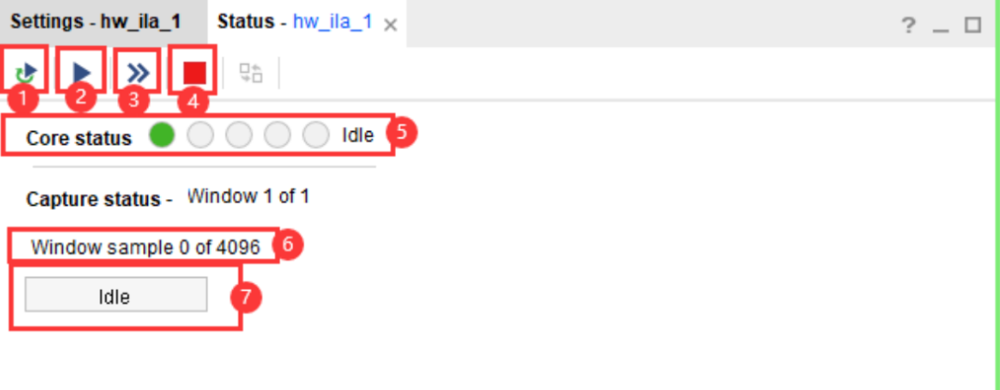
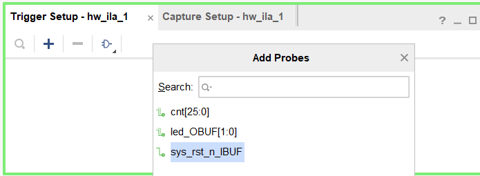
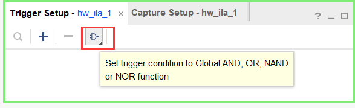
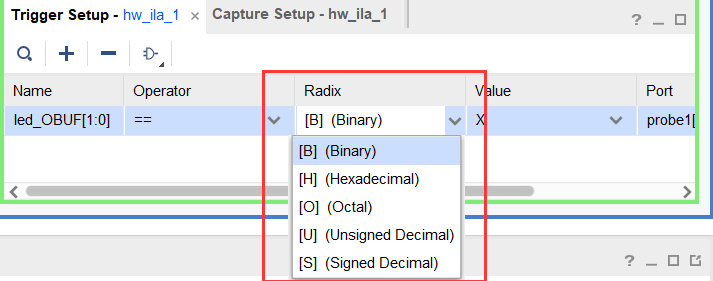
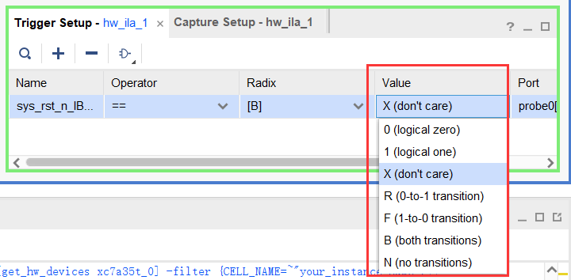

# ILA的使用

## 何为ILA

Integrated Logic Analyzer (ILA) 是Xilinx Vivado工具套件中的一个强大调试工具，用于在FPGA设计中嵌入并调试内部信号。ILA允许你在不影响设计运行的情况下捕获和分析信号波形，是调试和验证FPGA设计的重要工具。

### ILA的功能

1. **实时数据捕获：**
    - 可以在设计运行时捕获内部信号的数据波形，帮助你理解和调试设计的行为。

2. **复杂的触发条件：**
    - 支持设置复杂的触发条件，以捕获特定事件或信号状态。触发条件可以是信号的上升沿、下降沿或特定值。

3. **多通道支持：**
    - 可以同时监控多个信号通道，每个通道可以设置不同的触发条件和采样深度。

4. **信号分析：**
    - 捕获的数据波形可以在Vivado的波形窗口中进行详细分析，支持放大、缩小、测量时间间隔等功能。

### ILA的工作流程

1. **插入ILA IP核：**
    - 在设计中插入ILA IP核，并将需要监控的信号连接到ILA IP核的输入端口。

2. **配置ILA IP核：**
    - 配置ILA的触发条件、采样深度、采样率等参数。可以在Vivado的IP Integrator
或在原理图中进行配置。

3. **综合和实现设计：**
    - 对插入了ILA的设计进行综合、实现和生成比特流。

4. **下载比特流到FPGA：**
    - 使用Vivado的硬件管理器将生成的比特流文件下载到FPGA。

5. **设置触发条件并启动捕获：**
    - 在硬件管理器中设置触发条件并启动数据捕获。ILA会在触发条件满足时捕获信号数据，并将其传回Vivado。

6. **分析数据波形：**
    - 捕获的数据波形会显示在Vivado的波形窗口中，供用户分析和调试。

### 使用ILA的优势

1. **无需外部硬件：**
    - 不需要额外的逻辑分析仪硬件，直接利用FPGA内部资源进行调试，降低了成本和复杂度。

2. **实时调试：**
    - 可以在设计运行的同时进行调试，捕获实际工作环境下的信号行为，提供更准确的调试信息。

3. **深入内部信号：**
    - 可以监控并捕获FPGA内部信号，这些信号在外部是不可见的，提供了更深入的调试能力。


## 配置ILA

### 实验环境

本次实验将前文的led灯交替闪烁的程序`led_twinkle`作为调试对象，将其修改为错误程序，具体如下：

```verilog
module led_twinkle(
    input   sys_clk,    //系统时钟
    input   sys_rst_n,    //N系统复位，低电平有效

    output [1:0] led    //LEDT
);

////////////////////reg define
    reg [8:0] cnt;  //修改错误1
/////////////////
//      main code
////////////////

//对计数器的值进行判断，以输出LED的状态
assign led = (cnt < 26'd2500_0000) ? 2'b01:2'b10;

//计数器在0“5000 000之间进行计数
always @(posedge sys_clk or negedge sys_rst_n) begin
    if(sys_rst_n)   //修改错误2
        cnt <= 26'd0;
//    else if(cnt < (25'd2500_0000 - 25'd1))
    else if(cnt < 26'd5000_0000)  
        cnt <= cnt + 1'b1;
    else
        cnt <= 26'd0;
end

endmodule
```

具体错误为：
- 计数器`cnt`的定义由`reg [26:0] cnt;`改为`reg [8:0] cnt; `
- 逻辑判断中，时钟复位信号`sys_rst_n`，由`if(!sys_rst_n) cnt <= 26'd0;`改为`if(sys_rst_n) cnt <= 26'd0;`


### 方法一：使用IP核创建ILA调试环境


1. 点击左侧`PROJECT MANAGER`栏 → `IP Catalog`或者菜单栏下`Window` → `IP Catalog`，然后在右侧出现的`IP Catalog`窗口下搜索`ILA`，双击选择`Debug`下的`ILA`进行IP配置，操作步骤如下图所示：

<div align="center">

</div>

2. ILA IP参数设置
<div align="center">

</div>

1. **Documentation**：IP 相关文档入口，其中的`Product Guide` 是 IP 手册查看入口，`Change Log` 是 IP 版本更新    记录，`Product Webpage`是 IP 相关介绍的网页版
2. **IP Location**：设置 IP 的存放路径入口，**点击出现如下图所示窗口**，在窗口里可以通过点击`…`设置更换存放路   径，默认是存放在工程路径下的`…<工程名>.srcs\ sources_1\ip`，这里我们就保持默认。
3. **Switch to Default**：点击后所有的设置恢复到默认值。

<div align="center">

</div>

4. **Component Name**：设置生成 IP Core 的名称，这里保持默认设置。
5. 这里是一个提示，提示通过该界面设置最多可设置 64 个探针，如果想设置更多的探针需要使用 Tcl 脚本命令去设置，具体用法可以查询 IP 手册。

6.  **ILA 探针接口类型设置**  
    - Native：常规普通接口模式
    - AXI：AXI 接口模式，用于调试 AXI 接口信号

7.  <font color="#dd0000">Number of Probes</font>：探针数量设置，要观察3个信号，所以这里设置探针数量为3。
8.  <font color="#dd0000">Sample Data Depth</font>：采样数据深度，设置的数值越大，采样的数据越多，看到的波形数据越多，但是最终占用的资源也会越多，并不是设置的越大越好。从下拉框也能看出最大也只能设置为 131072，这个根据实际需求进行合适的设置即可，我们这里选择设置 4096。
- PS：**Number of Probes**和**Sample Data Depth**是最重要的两个设置

<div align="center">

</div>

9. **Same Number of Comparators for All Probe Ports**：这里是设置相同探针接口的 Comparators 的个数，不勾选，下面的 Number of Comparators 就会消失。如果默认勾选，后面的参数也保持默认，我们不勾选。
10. **Trigger Out Port**：触发输出端口，可用于 ILA 模块的级联或一些高级功能，具体使用参考 IP 手册，这里保持默认不勾选。
11. **Trigger In Port**：触发输入端口，可用于手工设置添加触发信号或进行 ILA模块的级联或一些高级功能，具体使用参考 IP 手册，这里保持默认不勾选。
12. **Input Pipe Stages**：设置待探测信号打拍次数，如下图所示，可设置数值0~6，一般情况下，采样时钟和探测信号是一个时钟域下，这里可以默认设置为 0 即
可。
13. **Capture Control**：这里勾选后可在调试查看波形窗口进行对 Capture mode的设置，如果不勾选后面有关 Capture mode 就不可修改，这里不勾选。
14. **Advanced Trigger**：这里勾选后可在调试查看波形窗口进行对 Trigger mode的设置，如果不勾选后面有关 Trigger mode 就不可修改，这里不勾选。

<div align="center">

</div>


15.  **Probe_Ports**：这个选项卡用于配置ILA的探针端口。探针端口是用来连接和监控设计中内部信号的。
16.  **Probe Width**：探针数据信号的位宽设置，我们需要对一个 1bit，一个 2bit 和一个9bit信号进行在线观察，这里将`Probe0`位宽设置为 1，`Probe1`位宽设置为2和`Probe2`位宽设置为9。

```verilog
 input   sys_rst_n；   //复位信号，1位
 output [1:0] led；    //led输出信号，2位
 reg [8:0] cnt;        //计数器，9位
```


17.  **Number of Comparators**：如果已经勾选（9）处，这里就不可设置，如果没有勾选，这里就可以设置。保持默认即可
18.  **Probe Trigger or Data**：对探针设置触发器或数据，有3种选项：
    -  DATA AND TRIGGER：既是数据又可作为触发条件；
    -  DATA：仅作为数据，不可作为触发条件；
    -  TRIGGER：仅可作为触发条件。

设置完成后点击下方`OK` → `Generate`生成IP核


### 方法二：使用 Debug 标记创建 ILA

1. 在左侧`SYNTHESIS`栏下展开`Open Synthesized Design`，然后点击`Schematic`，打开原理图，操作步骤如下图所示：

<div align="center">

</div>

2. 调整窗口为Debug模式，点击右上角栏下的`Debug`：

<div align="center">

</div>

3. 标记所需的调试信号，以`led_OBUF`为例，右键点击`led_OBUF`，在弹出的窗口中点击`Makr Debug`，如下图所示：

<div align="center">

</div>

- 选择`led_OBUF`而不是`led`信号的原因：由于`led`是输出端口不能直接添加标记，又因为该信号为输出信号，所以是`OBUF`，因此需要选择`led_OBUF`缓冲进行标记。
- 同理，`sys_rst_n_IBUF`作为输入端口，也需要进行标记
- 而选择不是输入输出端口的信号，如`cnt`等，则可以**直接进行标记**。但是由于其没有缓冲，Vivado在分析综合的时候，可能会对其优化，导致报错。**为此需要在代码中对**`cnt`**定义添加一段语句：**
```verilog
(*mark_debug="true"*)reg [25:0] cnt;
```
- <font color="#dd0000">上面那一步最好在综合前完成</font>
- 最后可在下方窗口查看到所添加的信号：


4. 配置调试环境，可点击`Open Synthesized Design`栏下的`Set up Debug`，或者点击下方的**小甲虫**，如下图所示：

<div align="center">

</div>

5. 出现向导框，点击`Next`

<div align="center">

</div>

6. 显示添加的信号，继续点击`Next`

<div align="center">

</div>

7. 同IP核创建ILA，继续点击`Next`
    - Sample Data Depth：采样数据深度，设置的数值越大，采样的数据越多，看到的波形数据越多，但是最终占用的资源也会
    - Input Pipe Stages：在FPGA设计中通常指输入管道级的数量。这是在信号进入一个模块或系统之前通过的寄存器级数。一般设置为2以上，本次实验简单，因此可设置为0.

<div align="center">

</div>

8. 点击`Finish`，完成添加ILA

## ILA的调试

### 调试界面基本介绍

<div align="center">

</div>

- 窗口1：波形显示窗口，可以通过点击➕添加想查看的波形的信号。在这里可查看的信号有 `cnt`、`led_OBUF`和`sys_rst_n_IBUF`。
当然，通常在下载完程序后，ILA 能够非常智能的识别出设计师期望观察的信号，同时，在右键菜单也可以找到删除观察信号的指令。这样，有限的窗口面积就可以被充分利用，自由调配和增减所需观察信号的条目。
- 窗口2：ILA Croe 的状态控制和显示窗口。


  - 按钮①：设置采样执行过程为循环采样
  - 按钮②：启动采样按钮。按下后将启动 ILA 采样。根据是单次采样还是循环采样，根据是有条件触发还是无条件触发，启动后会呈现 ILA 状态的周期性变化或等待触发条件的到来。
  - 按钮③：无条件执行 ILA 采样。
  - 按钮④：停止采样按钮。
  - 状态栏⑤：状态栏⑤由 5 个空心圈组成，唯一的实心绿色点所处的位置表征ILA 的运行状态。
  - 状态栏⑥：已采集的点数占总采集点数的关系。
  - 状态栏⑦：以进度条的方式结合状态名称，标明当前所处的状态以及采样过程中执行状态的百分比。

- 窗口3：添加触发信号窗口，如下图所示，点击窗口内➕ 添加产生触发条件的信号（两个地方的➕ 都可以进行信号的添加）。

    - 点击按该钮在这里插入图片描述设置多个信号产生触发信号时的条件，与、或、同或、异或，还可以设置触发条件，如下图所示：
    
    - 基数（Radix），即选择数值表示的进制。
    
      - [B] (Binary)：二进制格式
      - [H] (Hexadecimal)：十六进制格式
      - [O] (Octal)：八进制格式
      - [U] (Unsigned Decimal)：无符号十进制格式
      - [S] (Signed Decimal)：有符号十进制格式

    - 触发值（Value），选择用于触发条件的具体值或条件
    
        - `X (don't care)`：无所谓的值，表示忽略这个条件。
        - `0 (logical zero)`：逻辑零。
        - `1 (logical one)`：逻辑一。
        - `R (0-to-1 transition)`：从0到1的跳变。
        - `F (1-to-0 transition)`：从1到0的跳变。
        - `B (both transitions)`：两种跳变（从0到1和从1到0）。
        - `N (no transitions)`：没有跳变。


### ILA具体调试步骤


1. **烧录程序**
   - 该步骤同前文的连接开发板验证
   - 先点击左侧`PROGERAM AND DEBUG`栏下的`Generate Bitstream`，生成比特流文件，然后点击`Open Hardware Manager`。与前文不同的是，会将比特流文件和**自动相关联的Debug文件**一起烧录进板卡，如下所示：

<div align="center">

</div>

2. **添加产生触发条件的信号**

<div align="center">

</div>

3. **点击运行**`Run`**，观察波形。**

<div align="center">

</div>

- 所查波形为下图所示：

<div align="center">

</div>

- 可见，采样一次，计数器`cnt`为`0`没有计数，`led_OBUF`为`1`即`led0`灯亮。

4. **点击循环采样，运行**`Run`**，观察波形。**

<div align="center">

</div>

- 所查波形一般是为动态图，但由于本实验代码问题，与采样一次的波形一致。
- 可见，计数器`cnt`始终为`0`，`led_OBUF`始终为`1`，`sys_rst_n_IBUF`始终为高电平
- **注意**，在一般正常工作中，不能单单通过一次采样没有得到预想的数据就认为代码或者是硬件有问题。由于一些元器件初始化需要时间或是其他原因，可能正好采样到错误数据，需要多次采样才能确认。

5. **添加触发条件**
- 添加触发条件的原因：
   - 可能正确的值出现时间很短，无法在波形上直接观察到，需要添加触发条件。
   - 添加触发条件可以大大提高调试效率。直接查看波形可能需要你手动筛选大量数据，以找到问题发生的时刻。而触发条件可以自动化这个过程，一旦条件满足就开始捕获，省去了大量手动查找的时间。
   - FPGA 内部的存储资源有限，ILA 的存储深度也有限。如果没有触发条件，ILA 会持续捕获数据，很快就会耗尽存储资源，可能错过关键事件

- 可通过结果逆推，先由`led_OBUF`信号，反推到`cnt`计数器，再反推到`sys_rst_n_IBUF`复位信号。

- 添加`led_OBUF`的触发条件
<div align="center">

</div>

- 改触发条件进制为二进制，数值为二进制`10`，观察是否存在`led1`点亮的情况
<div align="center">

</div>

- 添加触发条件后，点击`Run`运行，观察波形。
<div align="center">

</div>

- 可见，`led_OBUF`不存在为`10`时刻。
- 由此反推至`cnt`计数器，观察其值。其数值始终为0，说明`cnt`没有计数，而`cut`又与`sys_rst_n_IBUF`有关。观察到`sys_rst_n_IBUF`始终为高电平，由此可尝试观察其为低电平时，`cnt`计数器情况

6. **根据情况调试**
- 由上一步可知，需要观察`sys_rst_n_IBUF`为低电平时，`cnt`计数器情况。
- 具体步骤：
    1. 长按开发板的led灯复位键
    2. `Run`运行  
    3. 观察波形

<div align="center">

</div>

- 可见，`sys_rst_n_IBUF`为低电平时，`cnt`计数器值出现变化，且经过多次采样，`cnt`计数器值开始逐渐增加。
- 由此发现 **<font color="#dd0000">第一个错误</font>** ，需要将时钟复位信号`sys_rst_n`，由`if(sys_rst_n) cnt <= 26'd0;`改为`if(!sys_rst_n) cnt <= 26'd0;`


7. **继续添加触发条件**
- 添加`cnt`计数器的触发条件，观察其值。本次实验会使得`cnt`达到`25000000`，变化`led`的值，由此需要观察其是否能到达`25000000`。
- 由此添加`cnt`计数器的触发条件，改为十进制，数值为`25000000`

<div align="center">

</div>

- 发现直接报错，发现0至8的位宽，`cnt`无法达到`25000000`。
- 由此发现 **<font color="#dd0000">第二个错误</font>** ，需要将计数器`cnt`的定义由`reg [26:0] cnt;`改为`reg [8:0] cnt; `
