# 机器学习基础笔记

----

## 机器学习介绍

### 什么是机器学习？
- 机器学习（包括深度学习分支）是研究“学习算法”的一门学问
- 所谓“学习”是指:对于某类任务T和性能度量P，一个计算机程序在T上以P衡量的性能随着经验E而自我完善，那么我们称这个计算机程序在从经验E学习。

- 人类学习与机器学习

### 机器学习算法与传统基于规则的区别
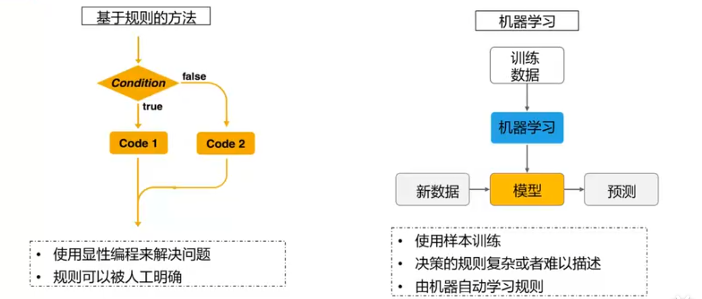

### 什么时候该使用机器学习
- 问题的解决方案很复杂，或者问题可能涉及到大量的数据却没有明确的数据分布函数
- 遇到如下情况，可以考虑使用机器学习:

### 机器学习算法的理性认识
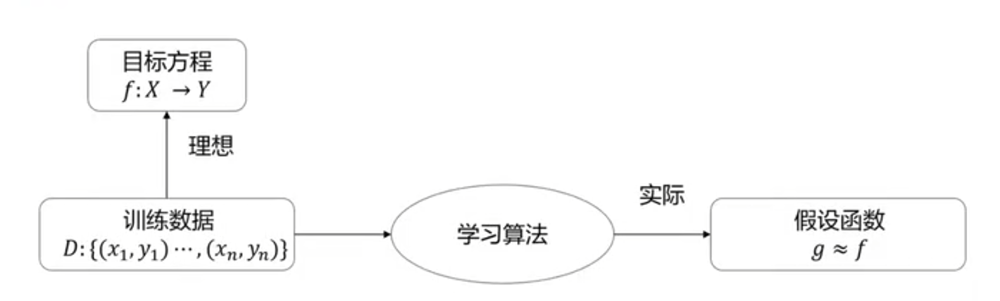
- 目标函数$f$未知，学习算法无法得到一个完美的函数$f$
- 假设函数$g$逼近函数$f$，但是可能和函数$f$不同

### 机器学习解决的主要问题
- 机器学习可以解决多种类型的任务，下面列出最典型的常见的三种:
  - **分类**：计算机程序需要指定输入属于$k$ 类中的哪一类。为了完成这个任务，学习算法通常会输出一个函数$f$ : $R^n→(1,2. ... k.)$。比如计算机视觉中的图像分类算法解决的就是一个分类任务。
  - **回归**：这类任务中，计算机程序会对给定输入预测输出数值。学习算法通常会输出一个函数$f$ : $R^n →R$，这类任务的一个示例是预测投保人的索赔金额（用于设置保险费），或者预测证券未来的价格。
  - **聚类**：对大量**未知标注**（也是与分类的最大区别）的数据集，按数据的内在相似性，将数据划分为多个类别，是类别内的数据相似度较大，而类别间的相似性比较小。可以被运用在图片检索，用户画像等场景中
- 分类和回归是预测问题的两种主要类型，占到80%-90%，分类的输出是离散的类别值，而回归的输出是连续数值。

----

## 机器学习分类
### 分类方法
- 几十年来，研究发表的机器学习的方法种类很多，根据强调侧面的不同可以有多种分类方法。
- 常见分类方法如下：
  - 基于学习策略的分类；
  - 基于学习方法的分类；
  - 基于学习方式的分类；
  - 基于数据形式的分类；
  - 基于学习目标的分类
- 本文介绍最为常见的分类方式———**基于学习方式的分类**

### 基于学习方式的分类
- **监督学习**：利用已知类别(**即有标签**)的样本，训练学习得到一个最优模型，使其达到所要求性能，再利用这个训练所得模型，将所有的输入映射为相应的输出，对输出进行简单的判断，从而实现分类的目的，即可以对未知数据进行分类。
- **无监督学习**：对于没有标记(**即无标签**)的样本，学习算法直接对输入数据集进行建模，例如**聚类**，即“物以类聚，人以群分”。我们只需要把相似度高的东西放在一起，对于新来的样本，计算相似度后，按照相似程度进行归类就好。
- **半监督学习**：试图让学习器自动地对大量未标记数据进行利用以辅助少量有标记数据进行学习。
- **强化学习**：学习系统从环境到行为**映射**的学习，以使奖励信号(强化信号)函数值最大，强化学习不同于连接主义学习中的监督学习，主要表现在教师信号上，强化学习中由环境提供的强化信号是对产生动作的好坏作一种评价(通常为标量信号)，而不是告诉强化学习系统如何去产生正确的动作。

### 监督学习
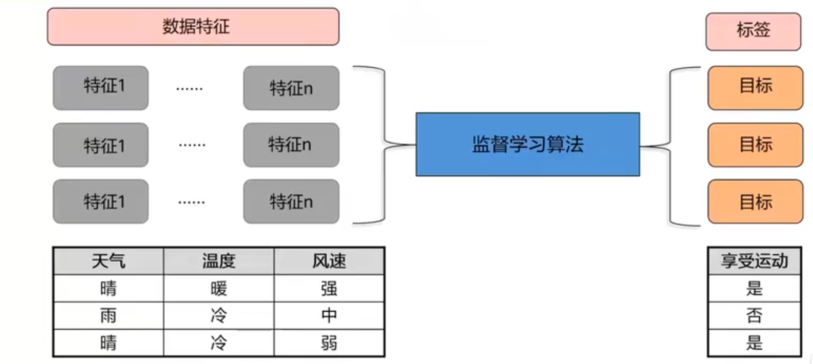
#### 监督学习 - 回归问题
- 回归：反映了样本数据集中样本的属性值的特性通过函数表达样本映射的关系来发现属性值之间的依赖关系。
  - 下周股票能给我带来多少收益?
  - 周二的温度会是多少摄氏度?
- 回归问题的关键在于，试图找到最适合的一条线拟合数据点
- 如图所示:
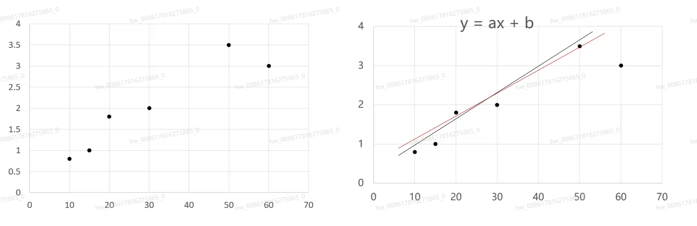
#### 监督学习 - 分类问题
- 分类：分类问题属于有监督学习，通过分类模型，将样本数据集中的样本映射到某个给定的类别中。
  - 明天早高峰时间段xx路上会堵车吗?
  - 哪种手段更吸引顾客：5元代金券or打75折

### 无监督学习
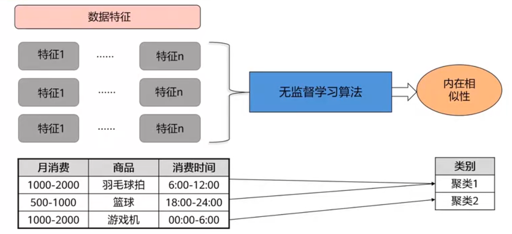
#### 无监督学习 - 聚类问题
- 聚类：通过聚类模型，将样本数据集中的样本分为几个类别，属于同一类别的样本相似性比较大。
  - 哪些观众喜欢看同一题材的电影?
  - 这些零部件中哪些破损的方式是相似的?

### 半监督学习
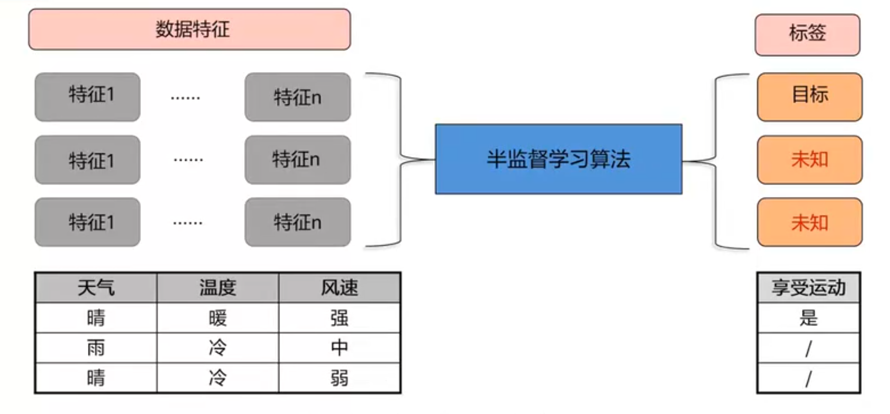

### 强化学习
- 模型感知环境，做出行动，根据状态与奖惩做出调整和选择
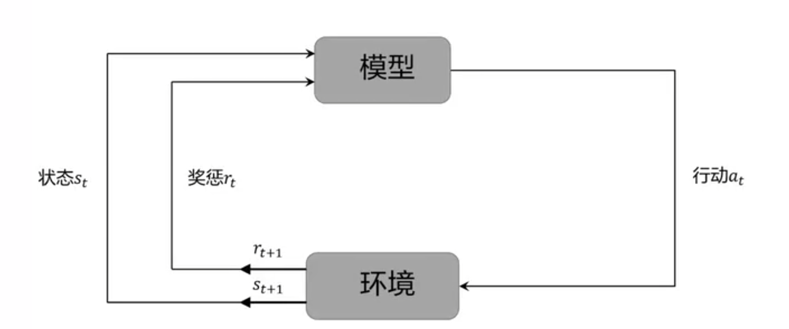
#### 强化学习 - 最佳行为
- 强化学习：强化学习总是在寻找什么样的行动才是最佳的?强化学习针对的对象是机器或者机器人。
  - 自动驾驶汽车:黄灯开始闪了，是刹车还是加速通过?
  - 对于一个吸尘机器人，是继续吸尘还是回去充电?

-----

## 机器学习整体流程
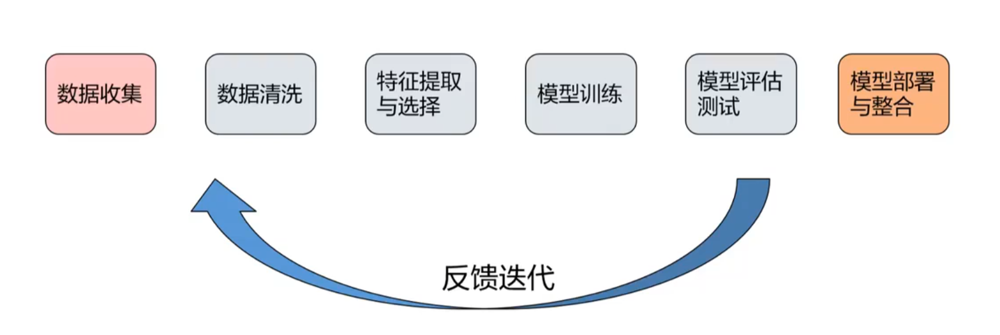
### 机器学习基本概念 - 数据集
- **数据集**：在机器学习任务中使用的一组数据，其中的每一个数据称为一个样本。反映样本在某方面的表现或性质的事项或属性称为特征。
- **训练集**：训练过程中使用的数据集，其中每个训练样本称为训练样本。从数据中学得模型的过程称为学习(训练)。
- **测试集**：学得模型后，使用其进行预测的过程称为测试，使用的数据集称为测风果，母个样本称为测试样本。
- 典型的数据集样式：
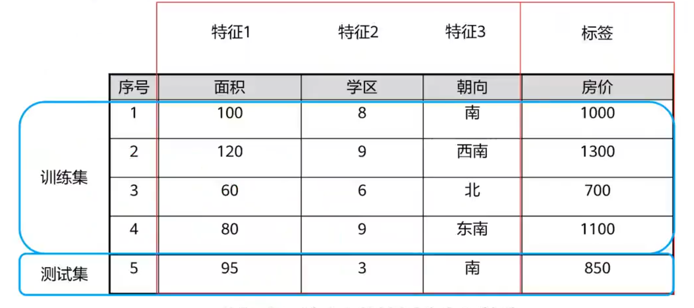
- 数据对于模型来说就是至关重要的，是**模型能力的天花板**，没有好的数据，就没有好的模型。因此**数据预处理**也就是重中之重。
### 数据预处理(数据清洗)
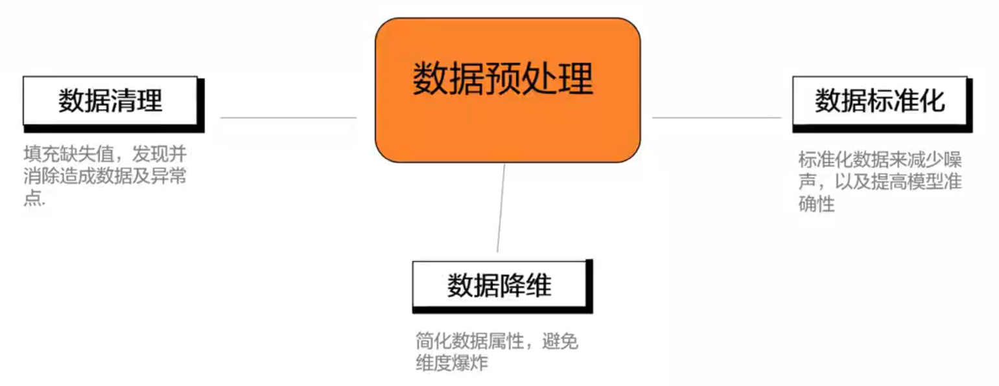
#### 数据清理
- 数据清理的工作量

- 大部分的机器学习模型所处理的都是特征，特征通常是输入变量所对应的可用于模型的数值表示。
- 大部分情况下，收集得到的数据需要经过预处理后才能够为算法所使用，预处理的操作主要包括以下几个部分:
  - 数据过滤
  - 处理数据缺失
  - 处理可能的异常、错误或者异常值- 合并多个数据源数据
  - 数据汇总

#### “脏”数据 
- 真实的数据中通常会出现一些数据质量问题:
  - 不完整:数据中缺少属性或者包含一些确实的值。
  - 多噪音:数据包含错误的记录或者异常点。
  - 不一致:数据中存在矛盾的、有差异的记录。
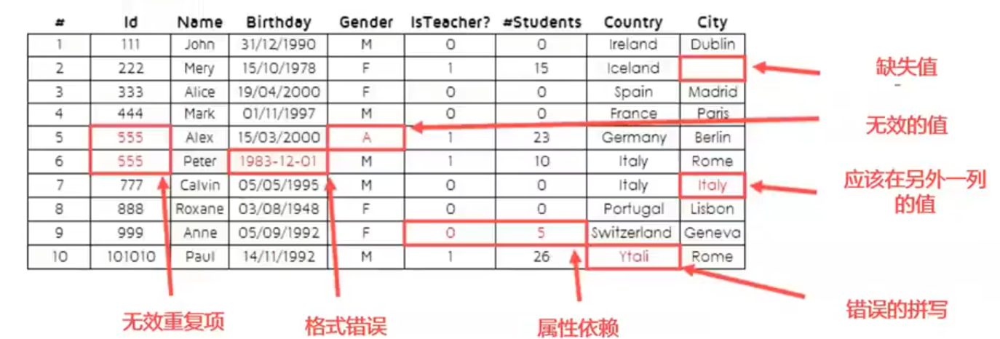

### 数据的转换（特征提取与选择）
- 对数据进行初步的预处理后，需要将其转换为一种适合机器学习模型的表示形式，以下是一些常见的数据转化的形式。
  - 在分类问题中，将类别数据编码成为对应的数值表示(哑编码)
  - 数值数据转换为类别数据以减少变量的值(对年龄分段)
  - 其他数据
    - 从文本数据中提取有用的数据(一般使用词袋法、TF-IDF或者word2vec)
    - 处理图像数据(颜色空间，灰度化，几何变化，haar特征等，图像增强)
  - 特征工程
    - 对特征进行归一化、标准化，以保证同一模型的不同输入变量的值域相同
    - 特征扩充:对现有变量进行组合或转换以生成新特征，比如平均数

#### 特征选择的必要性
- 通常情况下，一个数据集当中存在很多种不同的特征，其中一些可能是多余的或者与我们要预测的值无关的。
- 特征选择技术的必要性体现在:
  - 简化模型，是模型个容易被使用者所解释
  - 减少训练的时间
  - 避免维度爆炸的问题
  - 提升模型泛化性，避免过拟合

#### 特征选择的方法 - Filter
- **过滤法(filter)** 在选择特征的时候是独立的，与模型本身无关。
- **Filter过程**：

- 通过评估每个特征和目标属性之间的**相关性**，这些方法应用一个统计度量来为每个特征赋值。然后根据分数对这些特性进行排序，这可以用来帮助保留或消除特定特征
- 常见的方法
  - 皮尔逊相关系数
  - 卡方系数
  - 互信息
- 过滤法的局限
  - 过滤方法倾向于选择**冗余的变量**，因为它们没有考虑特征之间的关系。

#### 特征选择的方法 - wapper
- **包装器(wapper)** 方法使用一个预测模型来对对特征子集进行评分。
- **wapper过程**：

- 包装器方法将特征选择问题视为一个搜索问题，在这个问题中，将评估和比较不同的组合。在这里，预测模型用于评估特征的组合的工具，根据模型的准确性进行评分
- 常见的方法
  - 特征递归消除法
- 包装法的局限
  - 因为包装器方法为每个子集训练一个新模型时，所以它们的计算量非常大。
  - 其特征选择的方法通常为特定类型的模型提供了性能最好的特性集。

#### 特征选择的方法 - Embedded
- **嵌入法(Embedded)** 的方法将特征选择作为模型构建的一部分。
- **Embedded过程**：

- 最常见的嵌入式特征选择方法是**正则化方法**。正则化方法也称为惩罚方法，它在优化预测算法时引入额外的约束，使模型的复杂度降低，也就是减少了特征的数量。
- 常见的方法
  - LASSO回归
  - RIDGE回归

### 模型构建
#### 模型构建项目整体流程 
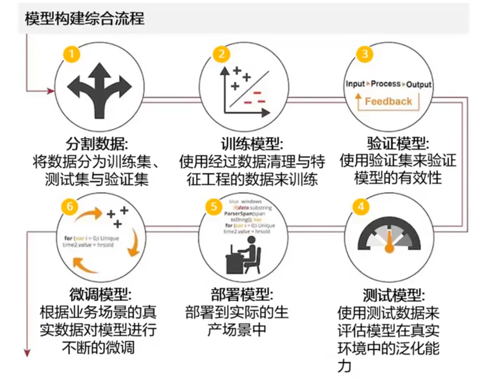
- 接下来将以有监督学习为例，讲解各阶段

#### 有监督学习实例 - 学习阶段
- 使用分类模型来判断，在特定特征下这个人是否是要更换供货商。
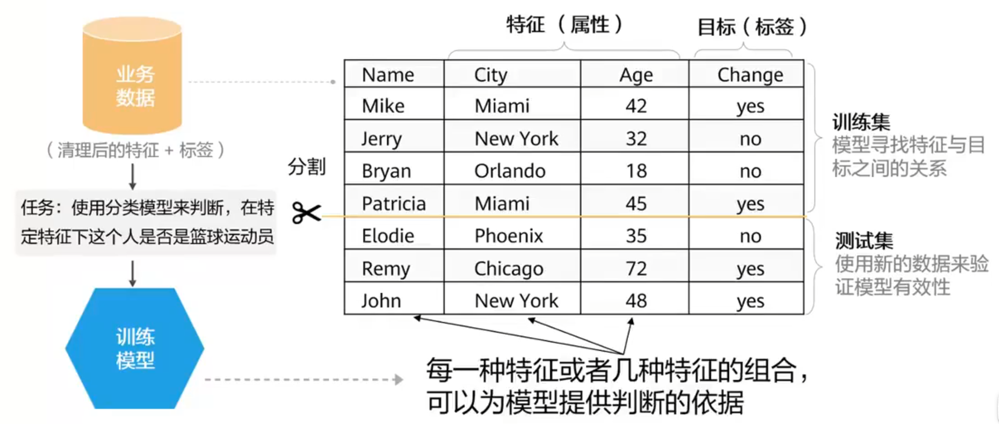

#### 有监督学习实例 - 预测阶段
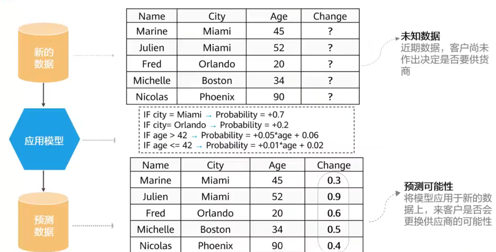

#### 模型评价
- **泛化能力**
  - 能否在实际的业务数据也能预测准确
- **可解释性**
  - 预测的结果是否容易被解释
- **预测速率**
  - 每一条数据的预测需要多长时间
- **可塑性**
  - 实际业务过程中数据量可能很大，随着业务量增大，预测的速率是否仍然可以接受

##### 模型的有效性（即泛化能力）
- **泛化能力**：机器学习的目标是使学得的模型能够很好的适用于新的样本，而不是仅仅在训练样本上工作的很好，学得的模型适用于新样本的能力称为泛化能力，也称为鲁棒性。
- **误差**：学习到的模型在样本上的预测结果与样本的真实结果之间的差。
  - **训练误差**：模型在训练集上的误差。
  - **泛化误差**：在新样本上的误差。显然，我们更希望得到泛化误差小的模型。
- **欠拟合**：如果训练误差很大的现象。
- **过拟合**：如果学得的模型的训练误差很小，而泛化能力较弱即泛化误差较大的现象。
- **模型的容量**：指其拟合各种函数的能力，也称为模型的复杂度。
  - 容量适合于执行任务的复杂度和所提供训练数据的数量时，算法效果通常会最佳;
  - **容量不足**的模型不能解决复杂任务，可能出现**欠拟合**;
  - **容量高**的模型能够解决复杂的任务，但是其容量高于任务所需时，有可能会**过拟合**。
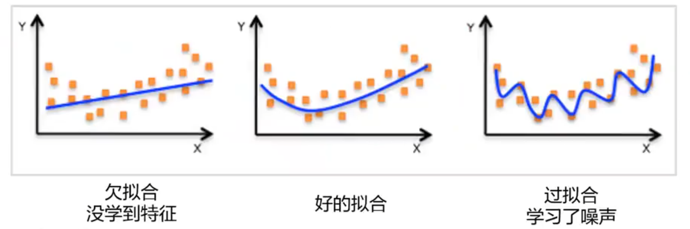

##### 过拟合的原因 - 误差
- 最终预测的**总误差** = 偏差$^2$＋方差＋不可消解的误差
- 预测误差总的来说可以被拆解出两种主要的我们需要关注的子形式:
  - 来源于“偏差”的误差
  - 来源于“方差”的误差
- **方差(Variance)**:
  - 模型的预测结果在均值附近的偏移的幅度
  - 来源于模型在训练集上对小波动的敏感性的误差·
- **偏差(Bias)**:
  - 模型的预期(或平均)预测值与我们试图预测的正确值之间的差异。

##### 方差与偏差
- 以下四种形式表示了方差与偏差不同组合方式:
  - 低偏差&低方差→**好模型**
  - 低偏差&高方差
  - 高偏差&低方差
  - 高偏差&高方差→不良模型

- 理想状态下，我们想要选择一个模型，它既能准确地捕获训练数据中的规律，又能很好地概括不可见数据(即新数据)。但是，通常我们不可能同时完成这两件事.

##### 模型的复杂度与误差
- 随着模型复杂度上升的增加，训练误差逐渐减小。
- 同时，测试误差会随着复杂的增大而减小到某一点，继而反向增大，形成一条凸曲线。
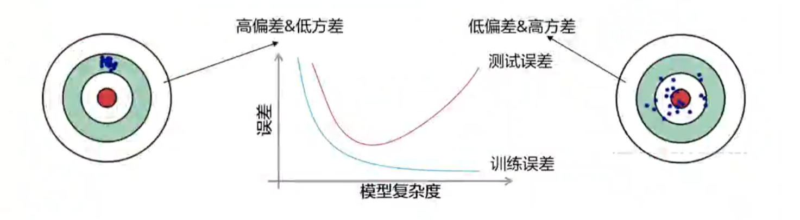

#### 机器学习其他性能评估指标 - 回归
- **MAE(Mean Absolute Error)平均绝对误差**，越趋近于0表示模型越拟合训练数据。$$MAE=\frac{1}{m} \sum^m_{i=1} |y_i-\hat{y_i}|$$
- **MSE(Mean Square Error)** $$MSE=\frac{1}{m} \sum^m_{i=1} (y_i-\hat{y_i})^2$$
- $R^2$取值范围$($负无穷,$1]$，值越大表示模型越拟合训练数据其中TSS表示样本之间的差异情况，RSS表示预测值与样本值之间的差异情况
$$R^2=1-\frac{RSS}{TSS}=1-\frac{\sum^m_{i=1}(y_i-\hat{y_i})^2}{\sum^m_{i=1}(y_i-\bar{y_i})^2}$$

#### 机器学习其他性能评估指标 - 分类
- 术语:
  - $P$：正元组，感兴趣的主要类的元组。
  - $N$：负元组，其他元组。
  - $TP$：真正例，被分类器正确分类的正元组。
  - $TN$：真负例，被分类器正确分类的负元组。
  - $FP$：假正例，被错误地标记为正元组的负元组。
  - $FN$：假负例，被错误的标记为负元组的正元组。
- 混淆矩阵:是一个至少为$m ×m$的表。前$m$行和$m$列的表目$CM_{i,j}$指出类 $i$ 的元组被分类器标记为 $j$ 的个数。
 - 理想的，对于高准确率的分类器，大部分元组应该被混淆矩阵从$CM_{1,1}$到$CM_{m,m}$的对角线上的表目表示，而其他表目为0或者接近于0。即$FP$和$FN$接近0。

- **实例**
  - 训练了一个机器学习的模型用来识别图片中是不是一只猫,现在用200张图片来验证下模型的性能指标。这200张图片中，170张是猫，30张不是猫。模型的识别结果为160张是猫，40张不是猫。
    - 精度：$P=\frac{TP}{TP+FP}=\frac{140}{140+20}=87.5\% $
    - 召回率：$R=\frac{TP}{P}=\frac{140}{170}=82.4\%$
    - 准确率：$ACC=\frac{TP+TN}{P+N}=\frac{140+10}{170+30}=75\%$

-----

## 其他机器学习重要方法

### 机器学习训练方法 - 梯度下降

#### 梯度下降介绍
- 梯度下降法的优化思想是用当前位置**负梯度**方向作为搜索方向，该方向为当前位置最快下降方向，梯度下降中越接近目标值，变化量越小，公式如下:$$w_{k+1}=w_k-\eta\nabla f_{w_k}(x^i)$$
- 其中$\eta$成为学习率，$i$表示第$i$条数据。权重参数$w$每次迭代变化的大小。
- **收敛**：目标函数的值变化非常小或达到最大迭代次数。

- 存在的问题：梯度下降法容易陷入一个局部最低点，而不是全局最低点
- 
#### 常见梯度下降法
-  **批量梯度下降(BGD)** ：使用**所有**数据集中的样本（共m个样本）在当前点的度之和来对权重参数进行更新操作。$$w_{k+1}=w_k-\eta \frac{1}{m}\sum^m_{i=1} \nabla f_{w_k}x^i$$
-  **随机梯度下降(SGD)** ：随机选取**一个**数据集中的样本在当前的梯度来对权重参数进行更新操作。$$w_{k+1}=w_k-\eta\nabla f_{w_k}x^i$$
-  **小批量梯度下降(MBGD)** ：结合BGD与SGD的特性，每次选择数据集中 **n个**样本的梯度来对权重参数进行更新操作。$Batch$为其重要的超参数，规定选择样本的数量。 $$w_{k+1}=w_k-\eta \frac{1}{n}\sum_{i=t} ^{t+n-1} \nabla f_{w_k}x^i$$

- 三种梯度下降法的比较
  - SGD中，因为每次训练选取的样本是随机的，这本身就带来了**不稳定性**，会导致损失函数在下降到最低点的过程中，产生动荡甚至反向的位移。
  - BGD最稳定，但是**过于消耗运算资源**，MBGD是SGD与BGD平衡之后的方法。
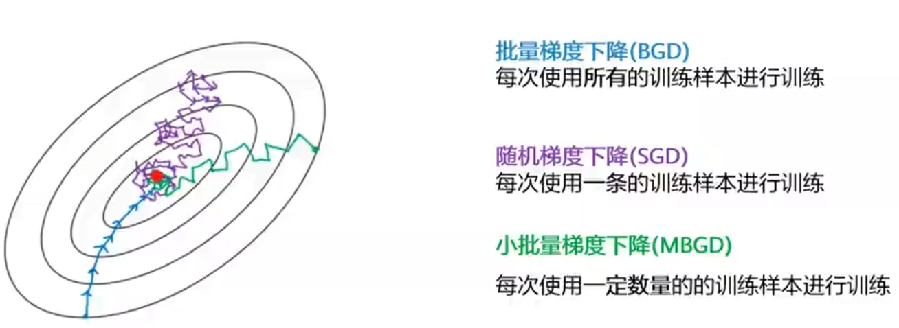

### 模型中的参数与超参数
- 模型中不但有参数，还有超参数的存在。其目的是为了让模型能够学习到最佳的参数
  - **参数**有模型**自动学习**
  - **超参数**由**人工手动设定**

### 模型的超参数
#### 模型的超参数是模型外部的配置
- 模型超参数常应用于估计模型参数的过程中。
- 模型超参数通常由实践者直接指定。模型超参数通常可以使用启发式方法来设置。
- 模型超参数通常根据给定的预测建模问题而调整。

#### 常见的模型超参数
- Lasso/Ridge回归当中的 $\lambda$
- 训练神经网络的学习速率，迭代次数，批次大小，激活函数，神经元的数量。
- 支持向量机的 $C$ 和 $\sigma$ 超参数。
- KNN中的 $K$。
- 随机森林当中的树的棵数

#### 超参数的搜索过程及方法
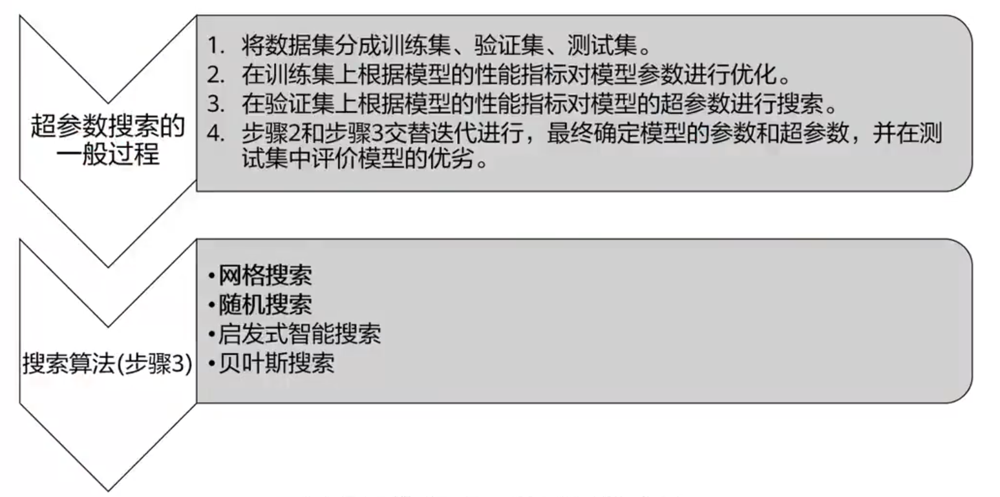

#### 超参数的调节方法 - 网格搜索
- 网格搜索尝试穷举搜索所有可能的超参数组合形成超参数值网格。
- 在实践中，人工指定的范围和步骤之间的值。
 

 

- 网格搜索是一种**昂贵且耗时**的方法。
  - 这种方法在超参数数目相对较少的情况下工作良好。因此一般机器学习算法中可行，但在神经网络等情况下就行不通了（见深度学习部分）。

#### 超参数的调节方法 - 随机搜索
- 在超参数搜索空间较大的情况下，采用随机搜索，会优于网格搜索的效果
- 随机搜索实现了对超参数的随机搜索，其中每个设置都是从可能的参数值的分布中进行取样，试图找出最佳的超参数子集
- 注意:
  - 首先在一个粗范围内搜索，然后根据最佳结果出现的位置，缩小范围。
  - 某些超参数比其他的更加重要，随机搜索过程中会影响搜索的偏向。
 

 

#### 交叉验证
- **交叉验证**：是用来验证分类器的性能一种统计分析方法，基本思想是把在某种意义下将原始数据进行分组，一部分作为**训练集**，另一部分作为**验证集**，首先用训练集对分类器进行训练，再利用验证集来测试训练得到的模型，以此来做为评价分类器的性能指标。**用于调节超参数**。
- $k$-折交叉验证 ( $K -  CV$ ) :
  - 将原始数据分成k组(一般是均分)。
  - 将每个子集数据分别做一次验证集，其余的$k –1$组子集数据作为训练集，这样会得到$k$个模型。
  - 用这$k$个模型最终的验证集的分类准确率的平均数作为此 $K -CV$ 下分类器的性能指标。
 

 

------

## 机器学习常见算法
### 机器学习算法总览
 

 

### 有监督学习 - 线性回归
#### 基础线性回归
- **线性回归( Linear regression )**：线性回归是利用数理统计中回归分析，来确定两种或两种以上变量间相互依赖的定量关系的一种统计分析方法。
- 线性回归是一种**有监督学习**。
 

 

- 线性回归的**模型函数**如下。其中$w$为权重参数，$b$为偏置，$x$表示样本。
$$h_w(x)=w^tx+b$$
- **模型预测与真实值的关系**如下。其中$y$表示真实值，$\varepsilon$表示误差。
$$y=w^tx+\varepsilon$$
- 误差$\varepsilon$受到众多因素独立影响，根据中心极限定律，误差$\varepsilon$服从正态分布。根据正态分布函数与最大似然估计，可以求出线性回归的**损失函数**为:
$$J(w)=\frac{1}{2m}\sum (h_w(x)-y)^2$$
- 我们想要预测值与真实值最接近，就是求损失值最小。可以使用梯度下降的方法求出当损失函数达到最小的时候的权重参数$w$，继而完成模型构建。
#### 线性回归扩展 - 多项式回归
- 多项式回归，是线性回归的拓展，通常数据集的复杂度会超过用一条直线来拟合的可能性，也就是使用原始的线性回归模型会明显欠拟合。解决的办法就是使用多项式回归。$$h_w(x)=w_1x+w_2x^2+L+w_nx^n+b，L表示中间多个式子$$
- 这里的n次方就是多项式回归维度(degree)
- 多项式回归仍然是线性回归的一种，是因为其**非线性**体现在**特征的维度**上，而其权重参数w之间的关系仍然是**线性的**。
 

 

#### 线性回归与防止过拟合
- 正则项有助于减少过拟合，$w$值在样本空间中不能过大/过小，可以在目标函数之上增加一个**平方和损失**
- **正则项(norm)**︰这里这个正则项叫做**L2-norm**，这个使用这个损失函数的，线性回归也叫**Ridge回归**。
 $$J(w)=\frac{1}{2}\sum (h_w(x)-y)^2+\lambda\sum w^2$$
- 追加了绝对值损失的线性回归叫做**Lasso回归**。
$$J(w)=\frac{1}{2}\sum (h_w(x)-y)^2+\lambda\sum |w|$$

### 有监督学习 - 逻辑回归
#### 基础逻辑回归
- **逻辑回归**：逻辑回归模型是一种**分类模型**，用来解决分类问题。模型的定义:$$P(Y=1|X)=\frac{e^{wx}+b}{1+e^{wx}+b}$$ $$P(Y=0|X)=\frac{1}{1+e^{wx}+b}$$
   其中 $w$ 称为权重，$b$ 称为偏置，其中的 $wx+ b$ 看成对 $x$ 的线性函数。然后对比上面两个概率值，概率值大的就是 $x$ 对应的类。
 

 

- 逻辑回归与线性回归都是广义线性模型。逻辑回归在线性回归的基础上引入了非线性因素(**Sigmoid函数**)，并设定了阈值，因此可以处理二分类问题。
- 根据逻辑回归的模型函数，可以通过**最大似然估计**计算出逻辑回归的**损失函数**为:
$$J(w)=\frac{1}{m}\sum \big(y\log h_w(x)+(1-y)\log (1-h_w(x))\big)$$
  其中 $w$ 为权重参数， $m$ 为样本个数，$x$ 表示样本，$y$ 表示真实值。同样可以通过梯度下降算法求得所有权重参数w的值。
#### 逻辑回归扩展 - Softmax函数
- 逻辑回归只能用于二分类问题，如果是多分类问题，我们通常使用**Softmax函数**。
 

 

- Softmax回归是逻辑回归的一般化，适用于**K分类**的问题。
- Softmax函数的本质就是将一个K维的任意实数向量压缩（映射）成另一个K维的实数向量，其中向量中的每个元素取值都介于$(0，1)$之间。
- **Softmax回归概率函数**为:$$p(y=k|x,w)=\frac{e^{w_k^Tx}}{\sum^K_{l=1} e^{w^T_lx}}，k=1,2...K$$
- Softmax为多类问题中的每个分类分配了概率值。这些概率加起来等于1。  
  - Softmax可能产生一个属于特定类别的形式可能以如下方式展示:
 

 

### 有监督学习 - 决策树
#### 决策树介绍
- **决策树**：决策树( decision tree )是一个树结构（可以是二叉树或非二叉树)。其每个非叶节点表示一个特征属性上的测试，每个分支代表这个特征属性在某个值域上的输出，而每个叶节点存放一个类别。使用决策树进行决策的过程就是从根节点开始，测试待分类项中相应的特征属性，开按照其值选择输出分支，直到到达叶子节点，将叶子节点存放的类别作为决策结果。
 

 

- **决策树结构**：
 

 

#### 决策树的构建关键点
- 决策树的构造就是进行属性的选择，确定各个特征属性之间的树结构。构建决策树的关键步骤就是按照所有的特征属性进行划分操作，对所有的划分操作的结果集的“纯度”进行比较，选择“纯度”最高的属性作为分割数据集的数据点。
- 纯度的量化指标主要通过**信息嫡**与**GINI系数**，公式如下：
$$H(X)=-\sum^K_{k=1}p_k\log (p_k)$$
$$Gini=1-\sum^K_{k=1}p_k^2$$
- 其中 $p_k$ 表示样本属于类别 $k$ 的概率(共有$K$个类别)，分割前与分割后的纯度差异越大，决策树越好。
- 常见的决策树算法有ID3，C4.5，CART等。

#### 决策树的构建过程
- **特征选择**：从训练数据的特征中选择一个特征作为当前节点的分裂标准（特征选择的标准不同产生了不同的特征决策树算法）。
- **决策树生成**：根据所选特征评估标准，从上至下递归地生成子节点，直到数据集不可分则停止决策树停止生长。
- **剪枝**：决策树容易过拟合，需要剪枝来缩小树的结构和规模（包括预剪枝和后剪枝）。
  - 预剪枝：生成节点前剪
  - 后剪枝：生成节点后剪

#### 决策树案例
- 下图案例向我们展示了一个决策树进行的分类问题，分类结果受到三个属性的影响分别是Refund, Marital status,Taxable Income。
 

 

### 有监督学习 - 支持向量机
#### 支持向量机基础
- **支持向量机**( support vector machine，**SVM** )是一种**二分类模型**，它的基本模型是定义在特征空间上的**间隔最大**的线性分类器。SVM还包括核技巧，这使它成为实质上的非线性分类器。支持向量机的学习算法是求解凸二次规划的最优化算法。
 

 

#### 线性支持向量机
- 如何使用一条线直接分割下面的红蓝数据集？
 

 

- 直线被用来将数据分割到不同类别中，而实际上我们可以多条直线将数据分来。SVM的核心思路是找到一个直线，使离直线比较近的点，尽可能远离这条直线，这可以使模型具有很强的泛化能力。而这些点就被称为**支持向量(Support Vector)**
- 在二维空间中，我们用**直线**来分割，如果是高维空间，我们使用**超平面**来分割。
 

 

#### 非线性支持向量机
- 如何分类一种非线性可分的数据集？
 

 

- 使用**核函数**来构建**非线性支持向量机**。
- 核函数允许算法在变换后的高维特征空间中拟合最大的超平面。
 

 

- **高斯核函数**应用范围最广，应用场景也最多

### 有监督学习 - K最邻近算法
- **K最近邻**(k-Nearest Neighbor，**KNN**)**分类算法**，是一个理论上比较成熟的方法，也是最简单的机器学习算法之一。该方法的思路是：如果一个样本在特征空间中的k个最相似(即特征空间中最邻近)的样本中的大多数属于某一个类别，则该样本也属于这个类别。
 

 

- KNN的核心思想是“近朱者赤，近墨者黑”，其在逻辑上十分的简洁。
- KNN是非参数方法，常用在决策边界非常不规则的数据集中使用。
  - KNN在**分类预测**时，一般采用**多数表决法**；KNN在做**回归预测**时，一般采用**平均值法**。
- KNN的需要非常大的计算量。

 

- 一般来说，较大的k值会降低噪声对分类的影响，但会使类之间的边界不那么明显 
  - **K值越大**越容易**欠拟合**，因为分割过于粗糙，**越小**越容易**过拟合**，因为分割过于细腻。

 

- 可以发现你会发现随着K值的增加，边界会变得更平滑。
- 随着k值的增加到无穷大，最终会变成全蓝或全红

### 有监督学习 - 朴素贝叶斯
- **朴素贝叶斯算法**(Naive Bayes )︰朴素贝叶斯是一种简单的**多类分类算法**，基于贝叶斯定理，并假设特征之间是独立的。给定样本特征 $X$，样本属于类别$H$的概率是:$$P(C_k|X_1,...,X_n)=\frac{P(X_1,...,X_n|C_k)P(C_k)}{P(X_1,...,X_n)}$$
  - $X_1,...,X_n$ 是数据的特征，通常用 $m$ 个属性集的测量值描述，
    - 比如说颜色特征可能有红，黄和蓝三个属性。
  - $C_k$ 表示该数据属于某个特定类 $C$。
  - $P(C_k|X_1,...,X_n)$ 是后验概率，或在条件c下，H的后验概率
  - $P(C_k)$ 是先验概率，$P(C_k)$ 独立于$X_1,...,X_n$
  - $P(X_1,...,X_n)$ 是x的先验概率。
- 特征独立假设。
  - 例如，如果一个水果是红色的，圆圆的，直径大约10厘米，就可以被认为是苹果。
  - 一个朴素贝叶斯分类器认为这些特征中的每一个都独立地贡献了这个水果是一个苹果的概率，而不考虑颜色、圆度和直径特征之间的任何可能的相关性。

### 有监督学习 - 集成算法

#### 集成算法基础
- **集成学习**是一种机器学习范式，在这种范式中，多个学习者被训练和组合以解决同一个问题。通过使用多个学习者，集成的泛化能力可以比单个学习者强得多。
- 如果随机向数千人提出一个复杂的问题，然后汇总他们的答案。在许多情况下，会发现这个汇总的答案比专家的答案更好。这就是群众智慧。

 

#### 集成算法分类

 

#### 集成算法 - 随机森林
- **随机森林(Random Forest)** = Bagging + CART决策树。
- 随机森林建立多个决策树，并将它们合并在一起，以获得更准确和稳定的预测。
  - 随机森林可以用于分类和回归问题。

 

#### 集成算法 - GBDT
- **GBDT**是Boosting算法的一种。
- 综合模型的结果是所有基础学习器的结果相加等于预测值，其本质是下一个基础学习器去**拟合误差函数对预测值的残差**(这个残差就是预测值与真实值之间的误差)。
- GBDT在模型训练的时候，是要求模型预测的样本损失尽可能的小。

 

### 无监督学习 - K-means
- K-means算法是输入聚类个数k，以及包含n个数据对象的数据集，输出满足方差最小的标准的k个聚类的一种算法。
- K-means算法需要输入聚类的最终个数k ，然后将n个数据对象划分为k个聚类，而最终所获得的聚类满足:
  1. 同一聚类中的对象相似度较高;
  2. 而不同聚类中的对象相似度较小。
 

 

### 无监督学习 - 层次聚类
- 层次聚类法试图在不同层次对数据集进行划分，从而形成树形的聚类结构，数据集的划分可采用“自下向上”的聚合策略，也可以采用“自顶向下”的分拆策略。聚类的层次被表示成树形图。树根拥有所有样本的唯一聚类，叶子是仅有一个样本的聚类。
 

 