# 操作系统
## 操作系统概述
### 操作系统四个特征: 并发, 共享, 虚拟, 异步
- 并发性: 指计算机系统中同时存在着多个运行着的程序
**并发**: 指两个或多个事件在**同一时间间隔内**发生。这些事件宏观上是同时发生的，但微观上是交替发生的
**并行**: 指两个或多个事件在**同一时刻**同时发生
PS：能并行一定能并发
- 共享性: 指系统中的资源可供内存中**多个并发执行的进程**共同使用
- 虚拟性:
   - 空分复用(虚拟存储器)
  > 4G内存电脑拥有,同时运行超过4G运行空间的程序
   - 时分复用(虚拟处理器)
  > CPU时间片轮转
- 异步性: 在多道程序环境下，允许多个程序并发执行，但由于资源有限，进程的执行不是一贯到底的， 而是走走停停，以不可预知的速度向前推进，这就是进程的异步性。
并发与共享相辅相存, 前者缺一不可, 否则虚拟性与异步性显得毫无意义.
### 操作系统类型
##### 单批道处理
引入**脱机输入/输出**技术, 并由 **监督程序** 负责控制作业的输入输出
* 优点:
缓解了一定程度的**人机速度矛盾**， 资源利用率有所提升
* 缺点:
内存中仅能 **有一道程序运行**，只有 该程序运行结束之后才 能调入下一道程序。**CPU有大量的时间是在 空闲等待I/O完成**。资源 利用率依然很低。

PS：由于**I/O技术栈**实现**多批道处理系统**。批处理系统的最大缺陷：**<font color="#dd0000">不能人机交互</font>**
##### 分时操作系统
计算机以**时间片为单位轮流为各个用户/作业服务**，各个用户可通过终端与计算机进行交互
* 优点:
用户请求可以被即时响应，**解决了人机交互问题**。允许多个用户同时使用一台计算机，并且用户对计算机的操作相互独立，感受不到别人的存在
* 缺点:
**不能优先处理一些紧急任务**。操作系统对各个用户/作业都是完全公平的，循环地为每个用户/ 作业服务一个时间片，不区分任务的紧急性
* 特征：
多路性，独立性，交互性，及时性
##### 实时操作系统
在实时操作系统的控制下，计算机系统接收到外部信号后及时进行处理，
并且要**在严格的时限内处理完事件**。实时操作系统的主要特点是**及时性和可靠性**
* 优点:
能够优先响应一些紧急任务，某些紧急任务不需时间片排
* 分类:
硬实时系统, 必须在绝对严格规定时间内完成
软实时系统, 接受偶尔违反时间规定

除了以上, 还有网络操作系统, 分布式操作系统, 分布式操作系统的主要特点是 分布性和并行性, 任何工作都可以分布在这些计算机上, 由它们并行, 协同完成这个任务

PS：CPU可以you多个核，多核处理器多线程
### <font color="#dd0000">操作系统运行环境和调用</font>
#### 系统调用
系统调用：用户在程序中调用操作系统的一些子功能。
子功能都是凡是与共享资源相关的功能，如：设备管理、文件管理、进程控制、进程通信、内存管理
系统调用相关处理在 **核心态** 处理

**调用流程**
1. 传递系统调用参数
2. 执行陷入指令(**用户态**)
    * **陷入指令**在**用户态**执行, 执行陷入指令后立即引发**内中断**, 从而 CPU 进入**核心态**
    * 发出请求在**用户态**, 相应处理在**核心态**
    * 是唯一一个只能在用户态执行的指令, **核心态不可执行**
3. 执行系统调用相应服务程序(**核心态**)
4. 返回用户程序
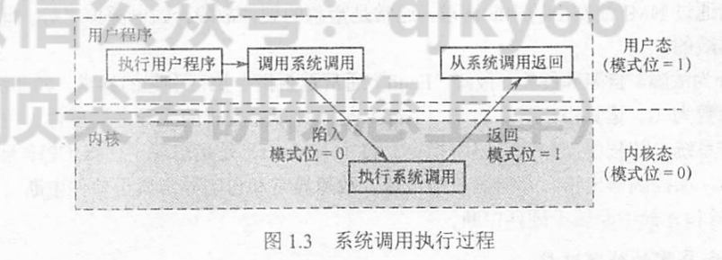

**操作系统向用户提供的接口**：
&emsp;用户接口：命令行、图形、批处理
&emsp;程序接口：系统调用
#### 操作系统状态
两种处理器状态, 用程序状态寄存器 (PSW) 标记, 0 用户, 1 核心
* **用户态**(目态): CPU 只能执行非特权指令
* **核心态**(管态): 特权指令, 非特权指令都可以执行
两种程序
* **内核程序**: 系统的管理, 两种指令都可以执行, 在**核心态**运行
* **应用程序**: 只能运行非特权指令, 在***用户态***执行

***问题：<u>用户态, 核心态之间是怎么切换的?</u>***
答：切换是通过**中断**实现的, 并且是**唯一**途径, 改变 **程序状态字(PSW)** 即可
用户态$\rightarrow$核心态：中断
核心态$\rightarrow$用户态：修改PSW
用户态可以触发中断，但中断处理只能在核心态中执行
PS：进程切换、调度既不可以在用户态发生，更不能执行

**中断类型**(同计组)：
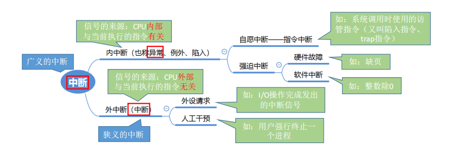
**自陷**是主动的，如陷入指令，将用户态转为核心态
**常见异常**：非法操作码、地址越界、运算溢出、虚存系统缺页、陷入指令

**中断响应周期(中断隐指令)**：PC(程序计数器)、PSW(程序状态寄存器)&emsp;可以**用户态**
**中断服务程序(ISR)**:通用寄存器&emsp;必须**核心态**
## 进程 
### 进程的定义和状态
**程序段**、**数据段**、**PCB(进程控制块)**三部分组成了**进程实体(进程映像)**, 一般情況下，我们把进程实体就简称为**进程**，
例如，所谓创建进程，**实质上是创建进程实体中的PCB**；而撤销进程，实质上是撤销进程实体中的PCB。
PS：PCB是进程存在的**唯一标志**！
#### 进程状态
* 创建态 (New), 进程正在被创建，操作系统为进程分配资源、初始化PCB
* 运行态 (Running), 占有CPU并在CPU上执行
* 就绪态 (Ready), 已经具备运行条件, 没有空闲CPU 还没有运行
* 阻塞态 (Wating/Blocking), 因等待某一时间暂时不能运行
* 终止态 (Terminated), 进程正在从系统中撤销，操作系统会回收进程拥有的资源、撒销PCB*
#### 进程转换
* 就绪态$\rightarrow$运行态：**调度**
* 运行态$\rightarrow$就绪态：**CPU没了①时间片用完了②更高优先级进程执行**
* 运行态$\rightarrow$阻塞态：**申请其他资源、等待I/O完成、读文件**
   * 申请其他资源：1.内存；2.I/O；3.buffer；4.设备；5.临界资源；6.磁盘；7.执行p操作
* 阻塞态$\rightarrow$就绪态：**I/O完成**
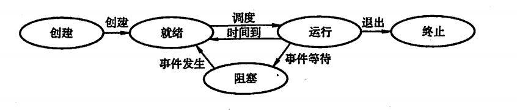

PS：父子进程相关
1. 父进程创建了子进程；
2. 二者地位一样，有独立资源、独立空间。
   
<font color="#dd0000">进程不能共享虚拟地址空间、不能使用同一临界资源 </font>这一点同样针对上面的子父进程

### <font color="#dd0000">进程管理</font>
#### 1. 进程创建
##### 创建过程
* 申请空白PCB
* 为新进程分配所需资源
* 初始化PCB
* 将PCB插入就绪队列
##### 引起进程创建的时间(相关事件)
* 用户登录 --- 分时系统中，用户登录成功，系统会建立为其建立一个新的进程(**内核态**)
* 作业调度 --- 多道批处理系统中，有新的作业放入内存时，会为其建立一个新的进程(**内核态**)
* 提供服务 --- 用户向操作系统提出某些请求时，会新建一个进程处理该请求(**内核态**)
* 应用请求 --- 由用户进程主动请求创建一个子进程(**用户态**)
#### 2. 进程终止
##### 创建过程
* 从PCB集合中找到终止进程的PCB
* 若进程正在运行，立即剥夺CPU，将CPU分配给其他进程
* 终止其所有子进程
* 将该进程拥有的所有资源归还给父迸程或操作系统
* 删除PCB
##### 引起进程创建的时间(相关事件)
* 正常结束
* 异常结束
* 外泉干预
#### 3. 进程阻塞和唤醒
##### 进程的阻塞（即运行$\rightarrow$阻塞）
* 找到要阻塞的进程对应的PCB
* 保护进程运行现场，将PCB状态信息设置为“阻塞态"，暂时停止进程运行
* 将PCB插入相应事件的等待队列
##### 迸程的唤醒（即阻塞$\rightarrow$就绪）
* 在事件等待队列中找到PCB
* 将PCB从等待队列移除，设置进程为就绪态
* 将PCB插入就绪队列，等待被调度

PS：**基本步骤**
* 找到其PCB
* 改变状态
* 进入新队列
### 进程通信
#### 共享存储
两个进程对共享空间的**访问**必须是**互斥**的（互斥访问通过操作系统提供的工具实现）
1. 基于数据结构
比如共享空间里只能放一个长度为10的数组。这种共享方式速度慢、限制多，是一种**低级通信方式**
2. 基于存储区
 在内存中画出一块共享存储区，数据的形式、存放位置都由进程控制而不是操作系统。相比之下，这种共享方式速度更快，是一种高**级通信方式**。
 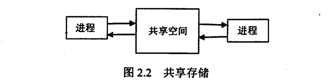
#### 消息传递
进程间的数据交换以**格式化的消息(Message)**为单位。进程通过**操作系统提供的“发送消息/接收消息”两个原语进行数据交换**。
* **消息结构**
   * 消息头, 包括：发送进程ID、接受进程ID、消息类型、消息长度等格式化信息
   * 消息体
* **传递方式**
   * 直接传递, 消息直接挂到接收进程的消息缓冲队列上
   * 间接传递, 消息要先发送到中间实体（信箱）中，因此也称“信箱通信方式”。Eg：计网中的电子邮件系统
  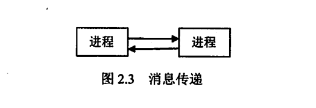
#### 管道通信
1. 管道**只能采用半双工通信**，某一时间段内只能实现单向的传输。如果要**实现双向同时通信，则需要设置两个管道**。
2. 各进程要**互斥地访问管道**
3. 数据以宇符流的形式与入管道
    * 当管道**写满**时，写进程的**write()系统调用将被阻塞**，等待读进程将数据取走，才能read()
    * 当读进程将数据全部取走后，**管道变空**，此时读进程的**read()系统调用将被阻塞**，才能write()
4. 数据一旦被读出，就从管道中被抛弃，这就意味着读**进程最多只能有一个**，否则可能会有读错数据的情况。
 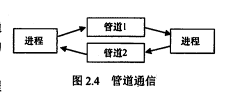
### 进程同步与互斥
#### 基本概念
**同步**：同步亦称直接制约关系，它是指为完成某种任务而建立的两个或多个进程，这些进程因为需要在某些位置上协调它们的工作次序而产生的制约关系。进程间的直接制约关系就是源于它们之间的相互合作。
**互斥**：互斥亦称间接制约关系。进程互斥指当一个进程访问某临界资源时，另一个想要访问该临界资源的进程必须等待。当前访问临界资源的进程访问结束，释放该资源之后，另一个进程才能去访问临界资源。
**临界资源**：一个时间段内只允许一个进程使用的资源(许多物理设备，如打印机)
**临界区**：访问临界资源的代码
##### 进程互斥原则

* **空闲让进**。临界区空闲时，可以允许一个请求进入临界区的进程立即进入临界区；
* **忙则等待**。当己有进程进入临界区时，其他试图进入临界区的进程必须等待；
* **有限等待**对请求访问的进程，应保证能在有限时间内进入临界区（保证不会饥饿）：
* **让权等待**。当进程不能进入临界区时，应立即释放处理机，防止进程忙等待。
#### 实现临界区互斥方法
##### 软件实现
**1.单标志法**
两个进程在**访问完临界区后**会把使用临界区的权限转交给另一进程. 也就是说**每个进程进入临界区的权限只能被另一进程赋予**
**<font color="#dd0000">不满足空闲让进**</font>的互斥原则
访问顺序一定是` 01010101... `, 当临界区空闲, 0 没有访问临界区时, `turn == 0 `, 1 需要访问但无法进入.
代码中“只有turn”
```c
// P0:
{
    while (turn != 0);
    critical section;
    turn = 1;
    remainder section;
}
// P1:
{
    while (turn != 1);
    critical section;
    turn = 1;
    remainder section;
}
```
**2.双标志先检查法**
先检查, 后上锁
**<font color="#dd0000">不满足忙则等待**</font> 原则.
若 0, 1 两个进程并发执行, P0 结束while循环还未复制 flag[0] 时, 发生进程切换, P1 也可以进入临界区
代码中“有flag”
```c
bool flag[2];       // flag[i] = true 表示 i 进程想要进入临界区
flag[0] = false;
flag[1] = false;        

// P0:
{
    while (flag[1]);
    flag[0] = true;  //true表示上锁
    critical section;
    flag[0] = false;
    remainder section;
}
// P1:
{
    while (flag[0]);
    flag[1] = true;
    critical section;
    flag[1] = false;
    remainder section;
}
```
**3.双标志后检查法**
先上锁, 后检查
P0 先执行`flag[0] = true` 后, 发生进程切换, P[1]执行` flag[1]`, 最后两个进程都不能进入临界区
**<font color="#dd0000">不满足空闲让进和有限等待**</font> 互斥原则
代码中“有flag”
```c
bool flag[2];       // flag[i] = true 表示 i 进程想要进入临界区
flag[0] = false;
flag[1] = false;        

// P0:
{
    flag[0] = true;
    while (flag[1]);
    critical section;
    flag[0] = false;
    remainder section;
}
// P1:
{
    flag[1] = true;
    while (flag[0]);
    critical section;
    flag[1] = false;
    remainder section;
}
```
**4.Peterson 算法**
主动先让对方进入临界区
进程发生**忙等待**, **<font color="#dd0000">不满足让权等待**</font>互斥原则
代码中“有flag也有turn”
```c
bool flag[2];
int turn = 0;
// P0
void funcp0(){
    flag[0] = true;
    turn = 1;
    while (flag[1] && turn == 1) ;
    critical section;
    flag[0] = false;
    remainder section;
}

// P1
void funcp1(){
    flag[1] = true;
    turn = 0;
    while (flag[0] && turn == 0) ;
    critical section;
    flag[1] = false;
    remainder section;
}
```
##### 硬件实现
**1. 中断屏蔽**
&emsp;利用“开/关中断”指令实现
&emsp;不适用于多处理机；只适用于内核进程
**2. 硬件指令**
&emsp;TestAndSet指令和Swap 指令
**硬件缺点**：
**<font color="#dd0000">不满足让权等待**</font>，还有 **<font color="#dd0000">饥饿**</font>。
#### <font color="#dd0000">信号量机制</font>
信号量表示系统中某种资源的数量
**初值**为资源总量
**当前值**为资源可用(还剩)数量，若当前值为**负数**，其绝对值表示等待资源的进程数。
PS：`while`后面直接加"`;`"，分号表示空语句，表示忙等，就没有“让权等待”，也就不会主动放弃CPU。因为不让权，所以其它进程也不会阻塞。
##### 整型信号量
整数型变量, 表示某种资源的数量
**<font color="#dd0000">会发生忙等, 不满足让权等待**</font>互斥原则
```c
int S = 1;
void wait(int S) {
    while (S <= 0);
    S --;
}
void signal(int S) {
    S ++;
}
// P0
{
    wait(S);
    使用资源...
    signal(S);
}
```
##### 记录型信号量
没有申请到资源的进程会被挂起进入**阻塞态**, 所以**不会发生忙等(让权等待满足)**, **<font color="#dd0000">满足所有的互斥原则**</font>
```c
typedef struct {
    int value;          // 剩余资源数
    struct process *L;  // 等待队列
} semaphore;

void wait (semaphore S) {       // 原语操作
    S.value --;
    if (S.value < 0) 
        block (S.L);        // 资源数不够, 把进程挂到S的等待队列中, 进入阻塞态
}

void signal(semaphore S) {      // 原语操作
    S.value ++;
    if (S.value <= 0) {
        wakeup(S.L);      // 释放资源后, 还要进程在等待, 就将等待队列中阻塞的进程唤起
    }
}
```
信号量定义位置决定是否互斥
|    | 进程间  |  线程间  |
|  :----:  | :----:  |  :----:  |
|  进程外  | 是  |  是  |
|  进程内  | 否  |  是  |
|  线程内  | 否  |  否  |
##### 信号量实现进程互斥, 同步</font>
将临界区资源视为一种特殊资源, 设置**互斥信号量mutex**, 初值为 1

PS:
对**不同的临界资源**需要设置**不同的互斥信号量**
**P, V 操作必须成对出现**

**同步**：
 ①设置同步信号量S, 初始为0
 ②在"前操作"之后执行V(S)
 ③在"后操作"之前执行P(S)
```c
Semaphore S = 0;
void P1(){
    code 1;
    code 2;
    V(S);
    code 3;
}
void P2(){
    P(S);
    code 4;
    code 5;
    code 6;
}
```
##### <font color="#dd0000">信号量解决同步互斥问题</font>
**PV问题解题**
1. 有几类进程？————每类进程(几类人)对一个函数
2. 在函数内部用中文描述$\Rightarrow$只做一个？不断重复？（<font color="#0090dd">加不加while(1)</font>）
3. 每个动作之前需要$P$什么？————注意隐含的互斥(缓冲区的访问)，同时注意有$P$则则必有$V$
4. 所有的$PV$写完之后再去定义信号量
5. 检查多个$P$操作出现的地方是否可能<u>死锁</u>？
①对一个信号量的$P$之间无其它$P$，不可能死锁
②连续的$P$产生死锁，可以调节$P$顺序

<font color="#0000dd">往往容量(缓冲区)会设置两个信号量，一个$n$一个$0$，分别表示上限和下限。同时对其的操作(一般是中文操作)前后要加上$mutex$进行互斥访问</font>
<font color="#dd0000">无论题目中有没有提及都必须互斥访问</font>
<font color="#0000dd">与容量(缓冲区)容易混淆的是工具中介信号量。该容量只需设置一个$n$。特点是对其访问不用互斥。同时其量是定死的，没有凭空产生或消耗。例子：打水的水桶有三个。可以没有中文操作对其访问。</font>
<font color="#dd0000">PS：对工具资源的访问尤其需要注意$P$操作产生的死锁问题。往往是先对缓冲区$P$再对工具区$P$</font>

**1.生产者-消费者问题**
改变互斥信号量mutex 在 同步信号量操作之间
```c
semaphore mutex = 1;    // 互斥
semaphore empty = n;    // 同步
semaphore full = 0;     // 同步
void put() {
    while (1) {
        P(empty);
        P(mutex);
        把产品放入缓冲区;
        V(mutex);
        v(full);
    }
}
void get() {
    while (1) {
        P(full);
        P(mutex);
        取出产品
        V(mutex);
        V(empty);
        // 使用产品
    }
}
```
**2.多生产者-消费者问题**
问题描述：
桌子上有一只盘子，每次只能向其中放入一个水果。爸爸专向盘子中放苹果，妈妈专向盘子中放
橘子，儿子专等着吃盘子中的橘子，女儿专等着吃盘子中的苹果。
只有盘子空时，爸爸或妈妈才
可向盘子中放一个水果。仅当盘子中有自己需要的水果时，儿子或女儿可以从盘子中取出水果。

分析：
&emsp;1.父亲, 母亲: 生产者1, 2
&emsp;2.儿子, 女儿: 消费者1, 2
&emsp;3.公用一个临界区资源, 有 2 类信号量
```c
semaphore mutex = 1; //可以省去, 缓冲区大于1 必须设置, 等于 1 可能不用设置
semaphore apple = 0; //盘子里有多少苹果
semaphore orange = 0; //盘子里有多少橘子
semaphore plate = 1; //盘子里还可以放多少水果(缓冲区)
dad (){
   while(1){
      准备一个苹果;
      P(plate);
      P(mutex);
      把苹果放入盘子;
      V(mutex);
      V(apple);
   }
}
mom (){
   while(1){
      准备一个橘子;
      P(plate);
      P(mutex);
      把橘子放入盘子;
      V(mutex);
      V(orange);
   }
}
daughter (){
   while(1){
      P(apple);
      P(mutex);
      从盘子中取出苹果;
      V(mutex);
      V(plate);
      吃掉苹果;
   }
}
son (){
   while(1){
      P(orange);
      P(mutex);
      从盘子中取出橘子;
      V(mutex);
      V(plate);
      吃掉橘子;
   }
}
```

**3.服务者-被服务者问题**
该类型题特点：
1. 有类型需要等待；
2. 也需要一个变量计数等待人数(也需要互斥访问)
   <font color="#dd0000">往往类似读写者问题有多个$count$(int count=0;)</font>
3. 可能会有两个变量均用于同步，且值为$0$；一个用于实现无顾客服务人员等待，一个用于实现无服务人员顾客等待

```c
int count = 0;//设几个顾客在等待
semaphore mutex = 1;//对count互斥访问
semaphore rest = 0;//同步 无顾客，服务人员等待
semaphore wait = 0;//同步 无服务人员，顾客等待

Sever(){
   while(1){
      P(mutex);
      if (count>0){
         count--;
         叫号;
         V(mutex);
         V(wait);//唤醒一个顾客
         理发;
      }
      else{
         V(mutex);
         P(rest);//服务人员休息，一定要在所有V操作后面
      }
   }
}

Customer(){
   P(mutex);
   if(count>上限){
      V(mutex);
      离开;
   }
   else{
      count++;
      排队取号;
      V(mutex);
      V(rest);//唤醒一个服务人员
      P(wait);//等待被服务，一定要在所有V操作后面
      被服务;
   }
}
```

**4.吸烟者问题**
题目描述
假设一个系统有三个抽烟者进程和一个供应者进程。每个抽烟者不停地卷烟并抽掉它，但是要卷起并抽掉一支烟，抽烟者需要有三种料：烟草、纸和胶水。
三个抽烟者中，第一个拥有烟草、第二个拥有纸、第三个拥有胶水。供应者进程无限地提供三种材料，供应者每次将两种材料放桌子上，拥有剩下那种材料的抽烟者卷一根烟并抽掉它，并给供应者进程一个信号告诉完成了，供并给供应者进程应者就会放另外两种材料再桌上，这个过程一直重复（让三个抽烟者轮流地抽烟）
```c
semaphore offer1 = 0; //桌上组合一的数量
semaphore offer2 = 0; //桌上组合二的数量
semaphore offer3 = 0; //桌上组合三的数量
semaphore finish = 0; //抽烟是否完成
int i = 0;//用于实现“三个抽烟者轮流抽烟”
provider (){
   while(1){
      if(i==0) {
         组合一放到桌上;
         V(offer1);
      } else if(i==1){
         组合二放到桌上;
         V(offer2);
      } else if(i==2){
         组合三放到桌上;
         V(offer3);
      } 
      i = (i+1)%3;
      P(finish);
   }
}
smoker1 (){
   while(1){
      P(offer1);
      从桌上拿走组合一；
      卷烟；
      抽掉；
      V(finish);
   }
}
smoker2 (){
   while(1){
      P(offer2);
      从桌上拿走组合二；
      卷烟；
      抽掉；
      V(finish);
   }
}
smoker3 (){
   while(1){
      P(offer5);
      从桌上拿走组合三；
      卷烟；
      抽掉；
      V(finish);
   }
}
```
**5.读者写者问题**
有**读者**和**写者**两组并发进程，
共享一个文件，当两个或两个以上的读进程同时访问共享数据时不产生副作用，但若某个写进程和其他进程（读进程或写进程）同时访问共享数据时则可能导致
数据不一致的错误。因此要求：
&emsp;&emsp;1.允许多个读者可以同时对文件执行读操作；
&emsp;&emsp;2.只允许一个写者往文件中写信息；
&emsp;&emsp;3.任一写者在完成写操作之前不允许其他读者或写者工作；
&emsp;&emsp;4.写者执行写操作前，应让己有的读者和写者全部退出。
```c
semaphore rw = 1;   // 读写锁 
int count = 0;      // 记录正在访问的读者数量，特点，也要互斥访问
semaphore mutex = 1; // 保证对 count 的互斥访问
semaphore w = 1;    // 实现读写公平
void write(){
    while (1) {
        P(w);
        P(rw);
        写文件...
        V(rw);
        V(w);
    }
}
void read() {
    while (1) {
        P(w);
        P (mutex);
        if (count == 0)//第一个人上锁
            P(rw);
        count ++;
        V(mutex);
        V(w);
        读文件...
        P(mutex);
        count --;
        if (count == 0)//最后一个人解锁
            V(rw);
        V(mutex);
    }
}
```
**6.哲学家进餐问题**
一张圆桌上坐着5名哲学家，每两个哲学家之间的桌上摆一根筷子，桌子的中间是一碗米饭。哲学家们倾注毕生的精力用于思考和进餐，哲学家在思考时，并不影响他人。只有当哲学家饥饿时才试图拿起左、右两根筷子(一根一根地拿起)。如果筷子己在他人手上，则需等待。饥饿的哲学家只有同时拿起两根筷子才可以开始进餐，当进餐完毕后，放下筷子继续思考。
关键在于解决 **死锁**, 每个进程需要持有**两个或两种以上的临界资源**
方法:
&emsp;&emsp;1.设定信号量代表拿筷子的人数, 最多让 4名哲学家同时拿筷子
&emsp;&emsp;2.奇数号先拿左边, 偶数号先拿右边
&emsp;&emsp;3.仅当一个哲学家左右两支筷子都可用时才允许抓筷子
实现**一气呵成**, 加一个 **互斥信号量**
```c
semaphore chopstick[5] = {1, 1, 1, 1, 1};    //定义资源
semaphore mutex = 1;     //保证获取资源一气呵成
void P() {
    while (1) {
        P(mutex);   //拿资源先上锁
        if (chopstick[i]==1&&chopstick[(i + 1) % 5]==1){
            P(chopstick[i]);    // 拿左
            P(chopstick[(i + 1) % 5]);   // 拿右
            V(mutex);   //资源全拿到再解锁
        }
        else{
            V(mutex);   //资源全拿到再解锁
        }
        V(mutex);   //资源全拿到再解锁
        吃饭....
        V(chopstick[i]);
        V(chopstick[(i + 1) % 5]);
    }
}
```
#### 管程
管程是一种特殊的软件模块，有这些部分组成：
&emsp;&emsp;1.局部于管程的**共享数据结构**说明：
&emsp;&emsp;2.对该数据结构进行操作的**一组过程**；
&emsp;&emsp;3.对局部于管程的共享数据设置初始值的语句：
&emsp;&emsp;4.管程有一个名字。
管程的基本特征：
&emsp;&emsp;1.局部于管程的数据只能被局部于管程的过程所访问：
&emsp;&emsp;2.一个进程只有通过调用管程内的过程才能进入管程访问共享数据；
&emsp;&emsp;3.**每次仅允许一个进程在管程内执行某个内部过程**。
管程是段代码，可以**互斥**也可以**同步**
<font color="0000dd">管程的确能保证互斥性，但是是否允许多个读进程或写进程并发访问，取决于具体管程实现和应用需求</font>
**一般允许多个读进程并发访问，但写操作是互斥的。**
**x.wait/x.signal** 类似于P/V
但是x是无值的，wait是将其放入x的等待序列即将其阻塞，signal则是将因x阻塞的进程唤醒
```c
monitor ProducerConsumer{
    condition full, empty;
    int count = 0;
    void insert(Item item) {
        if (count == N)
            wait(full);
        count ++;
        insert_item(item);
        if (count == 1)
            signal(empty);
    }
    Item remove() {
        if (count == 0)
            wait(empty);
        count --;
        if (count == N - 1)
            signal(full);
        return remove_item();
    }
}
end monitor;
void produce() {
    while (1) {
        item = 生产一个产品;
        ProducerConsumer.insert(item);
    }
}
void consume() {
    while (1) {
        item = ProducerConsumer.remove();
        消费产品 item;
    }
}
```
### 进程与多线程
进程：独立调度、资源分配(**一直是资源分配的基本单位**)
线程：将进程中的调度功能分离出来，让线程尽量不使用资源。也可共享进程内的所有，但别的线程不行。
#### 线程基础
线程是一个***基本的CPU执行单元，也是程序执行流的最小单位***。

引入线程之后，不仅是进程之间可以并发，进程内的**各线程之间也可以并发**，从而进一步**提升了系统的并发度**，使得一个进程内也可以并发处理各种任务（如QQ视频、文字聊天、传文件）

引入线程后，**进程只作为除CPU之外的系统资源的分配单元**（如打印机、内存地址空间等都是分配给进程的）
即, **进程是资源分配的基本单位**, **线程是调度的基本单位**
* 每个线程有一个线程ID, 线程控制块 (TCB)
* **同一线程的切换, 不需要切换进程环境**
* 线程几乎不拥有系统资源
* 同一线程内进程共享进程的资源, 并且通信无需系统干预
#### 线程实现
* 用户级线程 (User-Level Thread, ULT)
   * 用户级线程由应用程序通过线程库实现。
   * 所有的线程管理工作都由应用程序负责（包括线程切换）
   * 用户级线程中，线程切换可以在用户态下即可完成，无需操作系统干预。
   * 在用户看来，是有多个线程。但是在操作系统内核看来，并意识不到线程的存在。（用户级线程对用户不透明，对操作系统透明）
  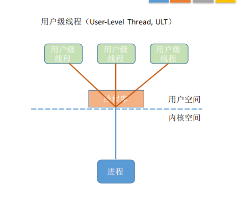
* 内核级线程 (Kernel-Level Thread, KLT, 内核支持的线程)
   * 内核级线程的管理工作由操作系统内核完成。
   * 线程调度、切换等工作都由内核负责，因此内核级线程的切换必然需要在核心态下才能完成。
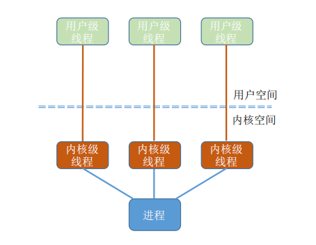   
在同时支持 ULT 和 KLT 的 OS 中, 可以用 n个 ULT 映射到 m个 KLT 上, n≥m
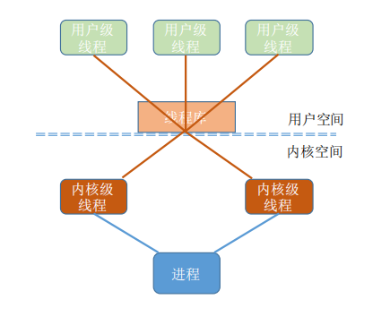
PS: **只有内核级线程才是处理机分配的单位**
#### 多线程模型
* 多对一模型：
   * 多个用户及线程映射到一个内核级线程。每个用户进程只对应一个内核级线程。
   * 优点：用户级线程的切换在用户空间即可完成，不需要切换到核心态，线程管理的系统开销小，效率高
   * 缺点：当一个用户级线程被阻塞后，整个进程都会被阻塞，并发度不高。多个线程不可在多核处理机上并行运行
* 一对一模型:
   * 一个用户及线程映射到一个内核级线程。每个用户进程有与用户级线程同数量的内核级线程。
   * 优点：当一个线程被阻塞后，别的线程还可以继续执行，并发能力强。多线程可在多核处理机上并行执行。
   * 缺点：一个用户进程会占用多个内核级线程，线程切换由操作系统内核完成，需要切换到核心态，因此线程管理的成本高，开销大。
* 多对多模型:
   * n用户及线程映射到 m个内核级线程 (n≥m)。每个用户进程对应 m个内核级线程。
   * 克服了多对一模型并发度不高的缺点，又克服了一对一模型中一个用户进程占用太多内核级线程，开销太大的缺点。
### <font color="#dd0000">处理机调度算法</font>
一个作业从提交开始直到完成，往往要经历以下三级调度。
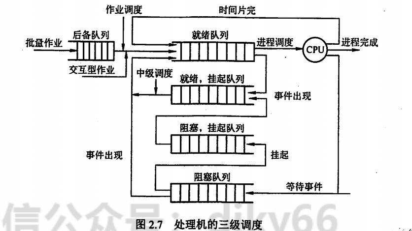
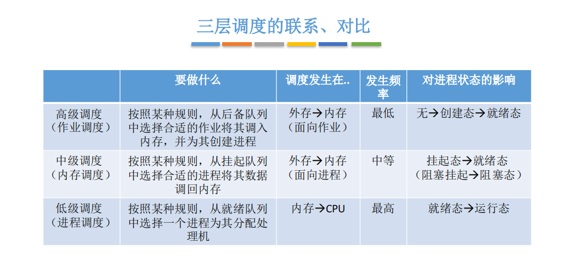
##### 进程调度时机
* 主动放弃
   * 进程正常终止
   * 运行过程中发生异常而终止
   * 进程主动请求阻塞 (i/o)
* 被动放弃
   * 分给进程的时间片用完
   * 有更紧急的事要处理 (I/O)
   * 有更高优先级的进程进入队列
* 不能进行
   * 处理中断时
   * 进程在操作系统内核程序临界区中
   * 在原子操作中
#### 调度算法的评价指标
**CPU利用率**
CPU 利用率 = $\frac{忙碌时间}{总时间}$

**系统吞吐量**
单位时间内完成作业的数量
系统吞吐量 = $\frac{总共完成多少作业}{总共花了多少时间}$

**周转时间**
指**从作业被提交给系统开始**, 到**作业完成为止**这段时间间隔
包括四个部分
&emsp;1.作业在外存后备队列上等待作业调度（高级调度）的时间、
&emsp;2.进程在就绪队列上等待进程调度（低级调度）的时间、
&emsp;3.进程在CPU上执行的时间、
&emsp;4.进程等待I/O操作完成的时间。
后三项在一个作业的整个处理过程中，可能发生多次。

**作业周转时间** = 作业完成时间 − 作业提交时间

**平均周转时间** = $\frac{各作业周转时间之和}{作业数}$

**带权周转时间** = $\frac{作业周转时间}{作业实际运行时间}$

**平均带权周转时间** = $\frac{各作业带权周转时间之和}{作业数}$

**等待时间**
对于进程, 就是在处理机上等待时间总和
对于作业, 还要计算上作业在外存等待队列上等待的时间

**响应时间**
从用户提交请求到首次产生响应所产生的时间
#### <font color="#dd0000">调度算法</font>
##### 先来先服务 (FCFS)
* 思想: 先来先得
* 规则: 按照到达先后顺序服务
* 作业/进程调度: 都能使用, 作业调度考虑谁先到后背队列, 进程调度考虑谁先到就绪队列
* 抢占: **非抢占式**
* 优点: 公平, 实现简单
* 缺点: **对长作业有利, 短作业不利**；**有利于CPU繁忙型作业，不利于I/O繁忙型作业**
* 饥饿: **不会导致饥饿**
* 等待时间 = 周转时间 - 运行时间 - I/O 操作时间
##### 短作业优先 (SJF), 最短剩余时间优先 (SRTN)
* 思想: 追求最少的平均等待时间, 平均周转时间, 平均带权周转时间
* 规则: 最短的作业/进程优先得到服务(服务时间最短)
* 作业/进程调度: 两者都可以, 用于进程时称为 "短进程优先 (SPF, Shortest Process First)" 算法
* 抢占: 默认**非抢占式**, 也有**抢占式---最短剩余时间优先算法** (SRTN, Shortest Remaining Time Next)
* 优点: "最短" 平均等待时间, 周转时间
* 缺点: **对短作业有利, 长作业不利**
* 饥饿: **会发生饥饿**
##### 高响应比优先算法 (HRRN)
* 思想: 总和考虑等待时间和要求服务时间
* 规则: 每次调度时计算各个作业/进程的响应比, 选择最高的来服务
   * **响应比** = $\frac{等待时间+要求服务时间}{要求服务时间}$
* 作业/进程调度: 都能使用
* 抢占: **非抢占式**, 当前运行作业/进程主动放弃处理机才进行调度
* 优点: 综合考虑, 结合了 SJF 和 FCFS 的优点
* 缺点: 无
* 饥饿: **不会导致饥饿**

高响应比优先算法：
* 非抢占式的调度算法，只有当前运行的进程主动放弃 CPU 时(正常/异常完成，或主动阻塞），才需要进
行调度，调度时计算所有就绪进程的响应比，选响应比最高的进程上处理机。

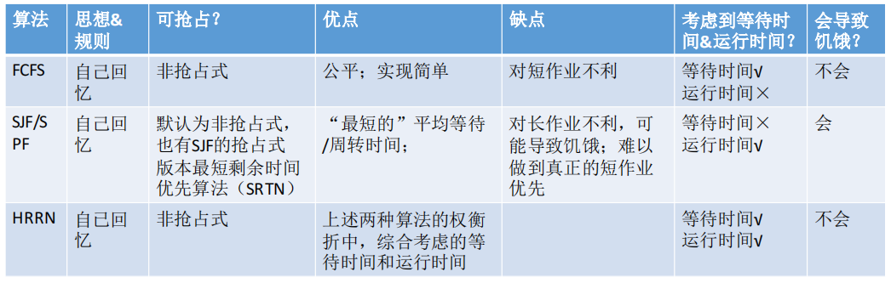
##### 优先级调度算法
* 思想: 根据任务紧急程度来调度
* 规则: 每个任务有自己的优先级, 调度时选择优先级最高的
* 作业/进程调度: 都可以, 甚至还能用于 I/O 调度
* 抢占: **抢占式, 非抢占式均可**, 抢占式时就绪队列发生变化就可能要调度, 否则主动放弃处理机时调度
* 优点: 优先级区分紧急程度, 适用实时操作系统
* 缺点: 一直有高优先级进入会有饥饿
* 饥饿: **导致饥饿**

同优先级, 选择先进来的

优先级可以动态改变:
* 静态优先级: 进程创建后, 优先级一直不变
* 动态优先级: 创建进程有个初始值, 之后根据情况动态调整

通常策略
* 通常**系统进程**优先级 **高于** **用户进程**
* **前台(交互)进程**优先级 **高于** **后台(非交互)进程**
* 操作系统**更偏好I/O型进程(I/O繁忙型进程)**, 相对的是**计算型进程(CPU繁忙进程)**, 两者可以并行, 选择更早进行 I/O 可以更优

动态策略
* 如果某进程在就绪队列中**等待了很长时间**，则可以适当**提升**其优先级
* 如果某进程占用**处理机运行了很长时间**，则可适当**降低**其优先级
* 如果发现一个进程**频繁地进行I/O操作**，则可适当**提升**其优先级
##### 时间片轮转 (RR)
* 思想: 公平轮流服务, 每个进程在一定时间间隔内都得到响应
* 规则: 按照各进程到就绪队列顺序, 轮流让各进程执行一个 时间片 (如100ms), 时间片结束未执行完成将被剥夺处理机, 放到队尾
* 作业/进程调度: **进程调度**, 作业放入内存建立了进程才能被分配时间片
* 抢占: **抢占式**, 时钟装置产生**时钟中断**进行时间片轮转
* 优点: 公平,响应快, 适用分时操作系统
* 缺点: 高频率进程切换, 不区分任务紧急程度
* 饥饿: **不会导致饥饿**

同一时刻两个进程 A 和 B, A 刚下处理机, B 刚进入队列, **默认** B 先轮转时间片
如果**时间片太大**, **退化为FCFS**, 会**增大进程响应时间**
如果**时间片太小**, **进程切换频繁**, 切换进程会花费大量时间
一般来说, 设计时间片要让切换进程的开销占比**不超过 1%**
时间片大小影响因素：系统响应时间、就绪队列进程数、系统处理能力
##### 多级反馈队列调度
* 思想: 对其他算法的折中考虑
* 规则:
   * 设置多级就绪队列, 优先级**从高到低**, 时间片**从小到大**
   * 新进程到达时**先进入第1级**队列, 按FCFS原则排队等待时间片, 如果用完时间片还未结束, 进入下一级队列队尾, 如果已经在最低级队列, 则重新放回队尾
   * 只有**第k级**队列为空, 才会为 k+1 级队列分配时间片
* 作业/进程调度: **用于进程调度**
* 抢占: **抢占式**, 抢占式的算法。在k级队列的进程运行过程中，若更上级的队列（1~k-1级）中进入了一个新进程，则由于新进程处于优先级更高的队列中，因此新进程会抢占处理机，**原来运行的进程放回 k 级队列队尾**。
* 优点: 结合了前面所有调度算法的优点, 并且对于 CPU密集型进程, I/O密集型进程可以调整偏好程度 (如: 将因 I/O 阻塞的进程重新放回原队列, 这样可以保证 I/O 进程保持较高优先级)
* 缺点: 无明显缺点
* 饥饿: **会导致饥饿**
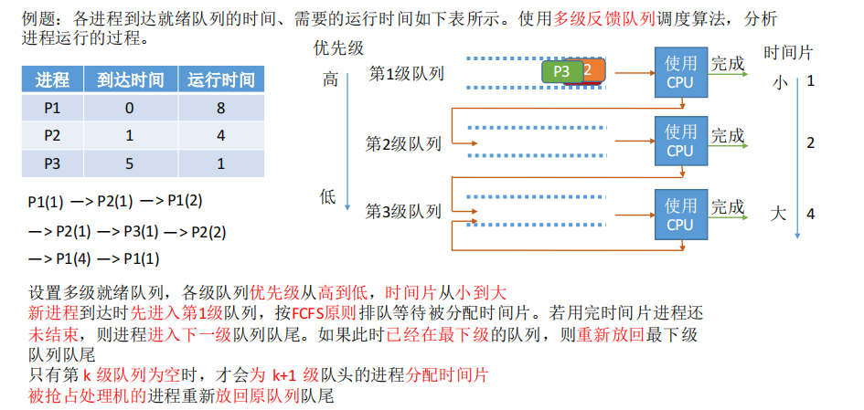

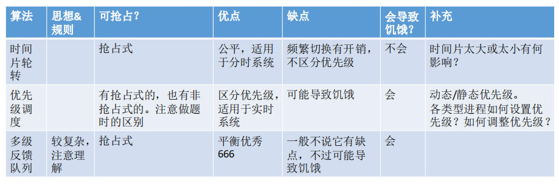
### 死锁和处理
**死锁定义**
* **死锁**：各进程互相等待对方手里的资源，导致各进程都阻塞，无法向前推进的现象。
* **饥饿**：由于长期得不到想要的资源，某进程无法向前推进的现象。比如：在短进程优先 （SPF）算法
中，若有源源不断的短进程到来，则长进程将一直得不到处理机，从而发生长进程“饥饿”而发生长进程
* **死循环**：某进程执行过程中一直跳不出某个循环的现象。有时是因为程序逻辑bug 导致的，有时是
程序员故意设计的。

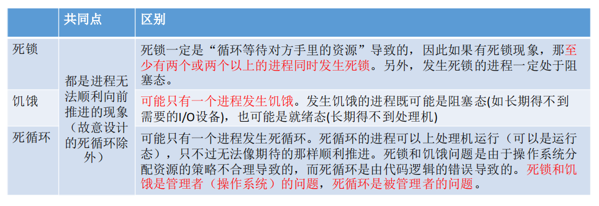
#### 死锁发生必要条件
产生死锁**必须同时满足以下四个条件，只要其中任一条件不成立，死锁就不会发生**。
1. **互斥条件**：只有对必须互斥使用的资源的争抢才会导致死锁（如哲学家的筷子、打印机设备）。
像内存、扬声器这样可以同时让多个进程使用的资源是不会导致死锁的（因为进程不用阻塞等待这种资源）
2. **不剥夺条件**：进程所获得的资源在未使用完之前，不能由其他进程强行夺走，只能主动释放。
3. **请求和保持条件**：进程已经保持了至少一个资源，但又提出子新的资源请求，而该资源又被其他进程占有，此时请求进程被阻塞，但又对自己己有的资源保持不放。
4. **循环等待条件**：存在一种进程资源的循环等待链，链中的每一个进程己获得的资源同时被下一个进程所请求。
   
注意！**发生死锁时一定有循环等待**
* 但是发生循环等待时未必死锁（**循环等待是死锁的必要不充分条件**）, 如果同类资源数大于 1，则即使有循环等待，也未必发生死锁。
* 但如果系统中每类资源都只有 1个，那循环等待就是死锁的充分必要条件了。

**死锁的处理策略**
&emsp;&emsp;**预防死锁**。破坏死锁产生的四个必要条件中的一个或几个。
&emsp;&emsp;**避免死锁**。用某种方法防止系统进入不安全状态，从而避免死锁（银行家算法）
&emsp;&emsp;**死锁的检测和解除**。允许死锁的发生，不过操作系统会负责检测出死锁的发生，然后采取某种措施解除死锁。
#### 死锁处理策略——死锁预防
限制条件苛刻，实现简单，但系统效率低、资源利用率低
1. 破坏互斥
允许资源共享。优先资源不能共享，用SPOOLing技术解决
2. 破坏不剥夺条件
方案一：申请不到资源就放弃
方案二：将想要的资源强行剥夺。
3. 破坏请求和保持条件
申请后一次性满足其所需资源，不满足就不执行
4. 破坏循环等待条件
顺序资源分配：首先给系统中的资源编号，规定每个进程必须按编号递增的顺序请求资源，同类资源（即编号相同的资源）一次申请完。

#### <font color="#dd0000">死锁处理策略——死锁避免</font>
限制资源分配的顺序

系统安全状态
**安全序列**：就是指如果系统按照这种序列分配资源，则每个进程都能顺利完成。只要能找出一个安全序列，系统就是**安全状态**。当然，**安全序列可能有多个**。
如果系统处于**安全状态**，就**一定不会发生死锁**。如果系统进入**不安全状态**，就**可能**发生**死锁**（处于不安全状态未必就是发生了死锁，但发生死锁时一定是在不安全状态）

经典例题：n 个资源，k 个进程，每个进程最多要 m 个资源
&emsp;不会死锁：k(m-1) < n
&emsp;会锁：k(m-1) ≥ n
##### 银行家算法
**安全性算法**
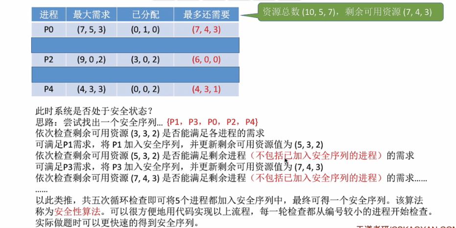
**银行家算法**
**数据结构**
* 长度为 m的一维数组 Avalible 表示还有多少可用的资源
* n∗m矩阵 Max 表示各进程对资源的最大需求数
* n∗m矩阵 Allocation 表示已经给各进程分配了多少资源
* Max−Allocation=Need矩阵表示各进程最多还需要多少资源
* 用长度为 m的一维数组 Request 表示进程此次申请的各种资源数

**步骤**
1. 检查此次申请是否超过声明的最大需求数
2. 检查此时系统剩余可用资源是否满足要求
3. 试探分配，更改各数据结构
4. 用安全性算法检查此次分配是否会导致系统进入不安全状态

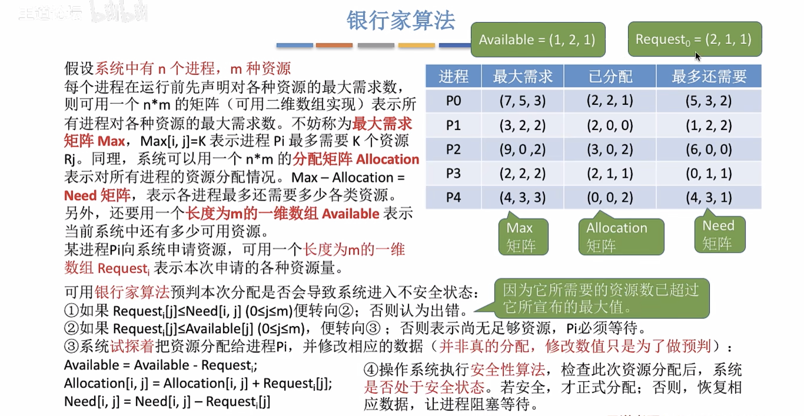
#### 死锁处理策略——检测与解除
建立**资源分配图**
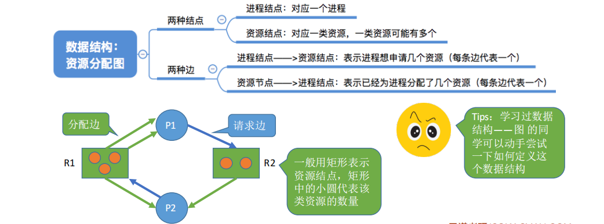
R $\rightarrow$ P：已经分配的资源
P $\rightarrow$ R：申请资源
**检测算法**：
1. 找到一个既不是孤点也不阻塞的点， 消除其所有边
2. 消除后释放的资源可以让某些阻塞进程被唤醒，然后继续消除这些进程的边。

**总结简化过程**：**当P进程所有P $\rightarrow$ R的边可以被满足时，则消去该P的所有边**

**死锁定理**
如果某时刻系统的资源分配图是**不可完全简化**的，那么此时系统发生**死锁**

**死锁解除**
PS： 并不是所有进程都是死锁状态，用**检测算法化简资源分配图后**，还**连着边的进程就是死锁进程**。

主要方法：
&emsp;&emsp;1.**资源剥夺法**。挂起（放外存）某些进程，抢占资源重新分配给其他进程。后续注意饥饿
&emsp;&emsp;2.**撤销进程法**（终止进程）。付出代价可能很大，前功尽弃，但实现简单
&emsp;&emsp;3.**进程回退法**, 让死锁进程回退到足以避免死锁的地步，需要系统记录进程历史信息。

***问题：<u>如何决定“对谁动手” ？</u>***
答：
&emsp;进程优先级来看（越低先牺牲）
&emsp;已执行多长时间（越短先牺牲）
&emsp;还要多久能结束（越久先牺牲）
&emsp;进程已经使用了多少资源(更多先牺牲)
&emsp;进程是交互式还是批处理式（优先批处理）
## 内存管理
### 内存管理基本概念
逻辑地址如何映射物理地址
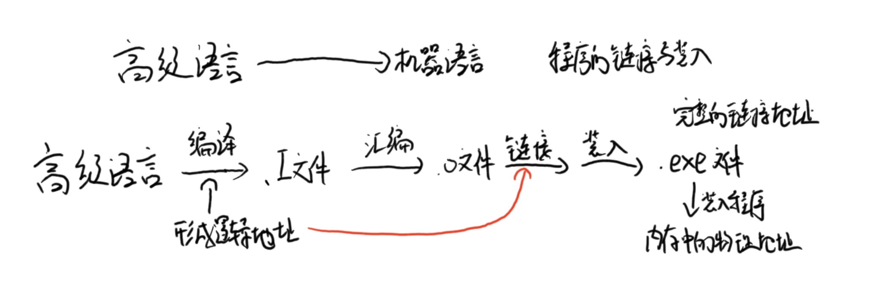
#### 内存管理概念
1. 操作系统负责**内存空间的分配与回收**
2. 提供某种技术从逻辑上**对内存空间进行扩充**
3. 提供地址转换功能，负责程序的**逻辑地址**与**物理地址**的转换
4. 提供**内存保护**，保证各进程在各自顾存储空间内运行，互不干扰
   * 在CPU设置一对**上、下限寄存器**，判断寻址合法
   * 采用**重定位寄存器（基址寄存器）**和界**址寄存器（限长寄存器)** 进行越界检查 , 界址寄存器中存放进程的**最大逻辑地址**
### 连续分配管理方式
为用户进程分配的一定是要一个连续的内存空间
* 内部碎片：分配给某进程的内存区域中，某些部分没有用上
* 外部碎片：是指内存中的某些空闲分区由于太小而难以利用
使用 **紧凑（Compacation)** 技术解决外部碎片

**单一分配**
内存被分为**系统区和用户区**
内存中**只有一道用户程序**
* 优点：
   * 实现简单；
   * 无外部碎片；
   * 可以采用覆盖技术扩充内存；
   * 不一定需要内存保护;
* 缺点：
   * 只能用于单用户，单任务操作系统
   * 有**内部碎片**
   * 存储器利用效率极低

**固定分区分配**
将用户空间划分为**若干个固定大小的分区**，在每**个分区只装入一道作业**

操作系统需要建立一个数据结构---**分区说明表**，来实现各个分区的分配与回。每个表项对应一个分区，通常按分区大小排列。每个表项包括对应分区的**大小、起始地址、状态（是否已分配）**。

* 分区大小相等
   * 缺乏灵活性
   * 使用与用一台计算机控制多个相同对象
* 分区大小不等
   * 增加了灵活性，可以满足不同大小的进程需求
* 优点：实现简单，无外部碎片
* 缺点：
   * 用户程序太大，需要覆盖技术来解决但又会降低性能
   * 会产生内部碎片，内存利用率低

**动态分区分配**
**动态分区分配**又称为**可变分区分配**。这种分配方式**不会预先划分内存分区**，而是在进程装入内存时，**根据进程的大小动态地建立分区**，并使分区的大小正好适合进程的需要。因此系统分区的大小和数目是可变的。（eg：假设某计算机内存大小为 64MB，系统区 8MB，用户区共 56 MB..)

数据结构：
&emsp;1.空闲分区表
&emsp;2.空闲分区链
注意内存回收时的各种情况，对分区表的修改情况
**无内部碎片，有外部碎片**
### 动态分区分配算法
#### 首次适应算法
**算法思想**：每次都**从低地址开始查找**，找到第一个能满足大小的空闲分区
**如何实现**：**空闲分区以地址递增的次序排列**。每次分配内存时顺序查找空闲分区链（或空闲分区表），找到大小能满足要求的第一个空闲分区。
#### 最佳适应算法
**算法思想**：由于动态分区分配是一种连续分配方式，为各进程分配的空间必须是连续的一整片区域。因此为了保证当“大进程”到来时能有连续的大片空间，可以尽可能多地留下大片的空闲区，即，优先使用更小的空闲区
**如何实现**：空闲分区**按容量递增次序链接**。每次分配内存时顺序查找空闲分区链（或空闲分区表），找到大小能满足要求的第一个空闲分区。
**缺点**：每次选最小的分区分配，会留下越来越多，很小的，难以利用的内存块。**因此会产生很多的外部碎片**
#### 最坏适应算法
**算法思想**：为了解決最佳适应算法的问题一一即留下太多难以利用的小碎片，可以在每次分配时优先使用最大的连续空闲区，这样分配后剩余的空闲区就不会太小，更方便使用。
**如何实现**：空闲分区**按容量递减次序链接**。每次分配内存时顺序查找空闲分区链（或空闲分区表），找到大小能满足要求的第一个空闲分区。
**缺点**：每次都选最大的分区进行分配，虽然可以让分配后留下的空闲区更大，更可用，但是这种方式会导致较大的连续空闲区被迅速用完。如果**之后有“大进程”到达，就没有内存分区可用了**
#### 邻近适应算法
**算法思想**：首次适应算法每次都从链头开始查找的。这可能会导致低地址部分出现很多小的空闲分区，而每次分配查找时，都要经过这些分区，因此也增加了查找的开销。如果每次都从上次查找结束的位置开始检索，就能解决上述问题。
**如何实现**：空闲分区**以地址递增的顺序排列（可排成一个循环链表）**,每次分配内存时从**上次查找结束的位置开始查找空闲分区链（或空闲分区表）**，找到大小能满足要求的第一个空闲分区.
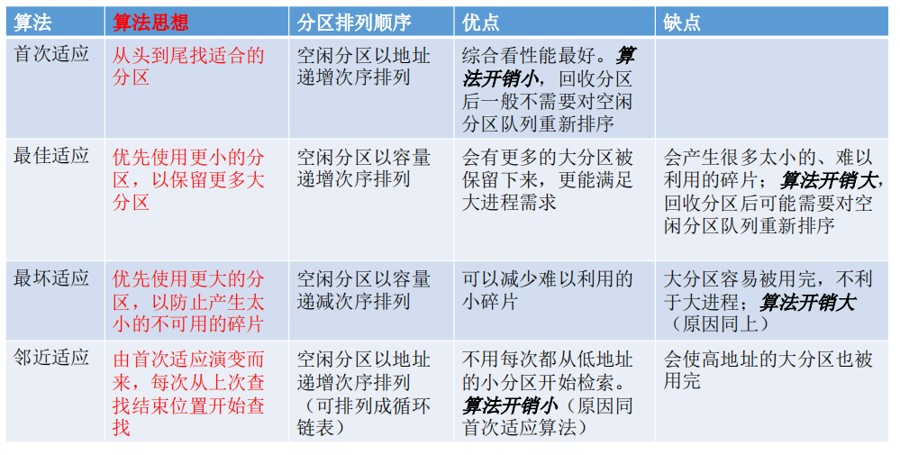
### <font color="#dd0000">基本分页存储管理</font>
**分页地址转换**
将内存空间分为一个个大小相等的分区（比如：每个分区4KB），每个分区就是一个 **“页框”**，或称**“页帧”**
**“内存块”、“物理块”** 。每个页框有一个编号，即 **“页框号”，“内存块号”，“页帧号”、“物理块号”**，页框号从0开始

将用户进程的地址空间也分为**与页框大小相等**的一个个区域称为 **“页”**或**“页面”**。每个页面也有一个编号，即“页号”。**页号也是从0开始**。(注：进程的最**后一个页面可能没有一个页框那么大**。因此，**页框不能太大，否则可能产生过大的内部碎片**）
操作系统**以页框为单位为各个进程分配**内存空间。进程的每个页面分别放入一个页框中。也就是说，进程的**页面**与内存的**页框**有**一一对应**的关系。

各个页面不必连续存放，也不必按先后顺序来，可以放到不相邻的各个页框中。
1. 要算出逻辑地址对应的页号
2. 要知道该页号对应页面在内存中的起始地址
3. 要算出逻辑地址在页面内的“偏移量”
4. 物理地址=页面始址 ＋页内偏移量

结论：如果每个页面大小为 2kB，用二进制数表示逻辑地址，则末尾K位即为页内偏移量，其余部分就是页号
因此，如果让每个页面的大小为2的整数幂，计算机就可以很方便地得出一个逻辑地址对应的页号和页内偏移量。

**页表**
1. 一个进程对应一张页表
2. 进程的每一页对应一个页表项
3. 每个页表项由“页号”和“块号” 组成
4. 页表记录进程页面和实际存放的内存块之间的对应关系
5. 每个页表项的长度是相同的，页号是“隐含”的
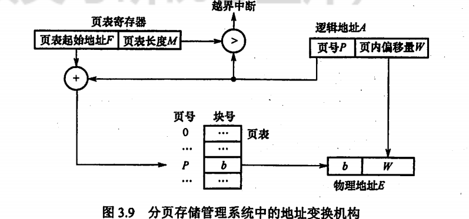

**总结**：
**页表长度M**：有多少个页表项(即多少页) 
**页表项长度**：每个页表项占多少空间
**页面大小**：一个页面有多少空间&emsp;**页表项长度×页表长度** = $2^{页内偏移量}$(若是有多个页面则不一定)

**具有快表的地址变换机构**
**快表**，又称**联想寄存器 (TLB)**，是一种访**问速度比内存快很多**的高速缓冲存储器，用来存放当前访问的若干页表项，以加速地址变换的过程。与此对应，内存中的页表常称为**慢表**。以加速地址变换的过程
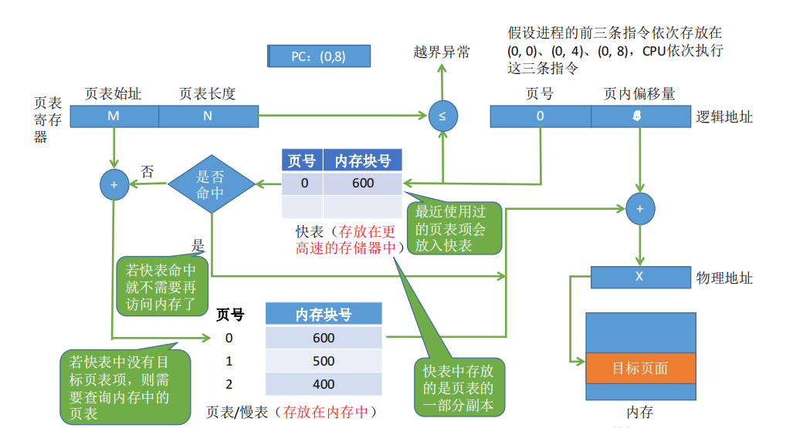

**例题**：访问一次快表消耗 1 us, 内存 100 us, TLB命中率为 90%, 平均耗时？
**答**：(1 + 100) * 0.9 + (1 + 100 + 100) * 0.1 = 111 us
都至少要访问一次内存

**例题**：
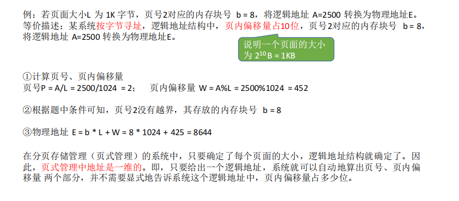
A：逻辑地址
L：页面大小
**页号P**：P=A/L
**页内偏移量**：W = A%L
**页号P所对应的页表项地址(物理地址)**：页表始址F+页号P×页表项长度
**物理地址E**：E=b×L+W。b是该页表项内容即物理块号

**缺页异常处理(有效位为0)**：调页+读磁盘
根据页表中该表的外存地址找到所对应的磁盘块，读入页框，修改页表中的块号/页框号。
如果页框满了，还需淘汰页
调页表一般页直接加入到TLB中，下一次访问直接访问快表


### 基本分段存储管理
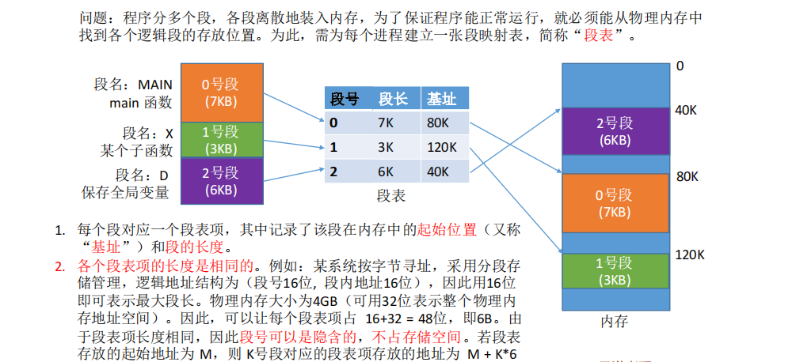
段页对比：
* **分段**比分页**更容易实现信息的共享与保护**
* 不能被修改的代码称为**纯代码或可重入代码（不属于临界资源）**，这样的代码是可以共享的。改的代码是不能共享的 （比如，有一个代码段中有很多变量，各进程并发地同时访问可能造成数据不一致）

逻辑地址结构: (段号， 页号， 页内偏移量)

每个段对应段表项，各表项长度相同段表组成： (段号（隐含）、页表长度、页表存放地址)

每个页对应一个页表项，页表组成：（页号（隐含）、页面存放的内存块号）
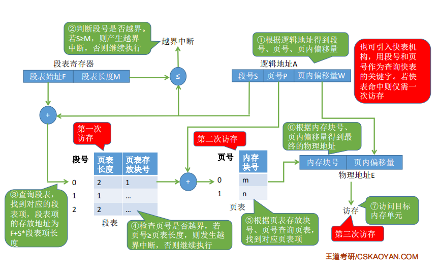
### 虚拟存储器
* 基于局部性原理，在程序装入时，可以将程序中很快会用到的部分装入内存，暂时用不到的部分留在外存，就可以让程序开始执行。
* 在程序执行过程中，当所访问的信息不在内存时，由操作系统负责将所需信息从外存调入内存，然后继续执行程序。
* 若内存空间不够，由操作系统负责将内存中暂时用不到的信息换出到外存。
* 在操作系统的管理下，，在用户看来似乎有一个比实际内存大得多的内存，这就是虚拟内存

传统内存管理方式：
* 一次性：作业必须一次性装入内存后才能运行
* 驻留性：作业被装入内存，就会一直驻留在内存中

虚拟内存：
* 多次性：无需在作业运行时一次性全部装入内存，而是允许被分成多次调入内存.
* 对换性：在作业运行时无需一直常驻内存，而是允许在作业运行过程中，将作业换入、换出。
* 虛拟性：从逻辑上扩充了内存的容量，使用户看到的内存容量，远大于实际的容量。

虚存大小：min{$2^{MAR}$，内存+外存}

### 请求分页管理方式
请求分页存储管理与基本分页存储管理的主要区别：
* 在程序执行过程中，当**所访问的信息不在内存时，由操作系统负责将所需信息从外存调入内存，然后继续执行程序**。
* 若内存空间不够，由**操作系统负责将内存中暂时用不到的信息换出到外存**。

请求页表新增增加4个字段：
1. 状态位：是否已经调入内存
2. 访问字段：记录最近访问过几次或者上次访问的时间，供置换算法使用
3. 修改位：调入内存后是否被修改
4. 外存地址：页面在外存中的存放位置

**缺页中断机构**
在请求分页系统中，每当要访问的**页面不在内存**时，便产生一个**缺页中断**，然后由操作系统的缺页**中断处理程序处理中断**。
PS：一条指令执行过程中可能产生多次缺页中断
**需要磁盘I/O**
此时**缺页的进程阻塞**，放入阻塞队列，调页**完成后再将其唤醒**，放回就绪队列。
* 如果内存中**有空闲块**，则为进程**分配一个空闲块**，将所缺页面装入该块，并修改页表中相应的页表项。
* 如果内存中**没有空闲块**，，则由页**面置换算法选择一个页面淘汰**，若该页面在内存期间**被修改过**，则要将其**写回外存**。未修改过的页面不用写回外存。

需要**修改页表**
缺页中断与当前指令有关， 属于**内中断**

**地址变换机构**
新增步骤：
1. 查到页表项判断是否调入内存
2. 页面置换（需要调入页面，但没有空闲内存块）
3. 需要修改请求页表中新增的表项

抖动：**频繁**页面调度。表现为CPU利用率低，I/O利用率高。原因为内存小，算法不好。

### 页面置换算法
#### 最佳置换算法 (OPT)
思想： 每次选择**淘汰的页面**将是**以后永不使用**，或者**在最长时间内不再被访问的页面**。
**缺页中断次数** ≥**页面置换次数**
缺点：最佳置换算法是**无法实现**的
#### 先进先出置换算法 (FIFO)
思想：每次选择**淘汰的页面**是**最早进入内存的页面**
**Belady 异常**---当为进程分配的物理块数增大时，缺页次数不减反增。
**只有FIFO算法发生Belady异常**, 实现简单，但不适应，**算法性能差**
#### 最近最久未使用置换算法（LRU)
思想：每次**淘汰的页面**是**最近最久未使用的页面**
实现：用**访问字段记录该页面上次被访问以来所经历的时间t**，每次要淘汰一个页面选择 t最大的
做题时，若淘汰页面，逆向检查此时内存中的几个页面号。逆**向扫描过程中最后一个出现的页号就是要淘汰的页面**
缺点： 算法**性能好**， 但是**实现困难，开销大**
#### 时钟置换算法 (CLOCK, 最近未用算法，NRU)
##### 简单CLOCK
1. 首次被装入或访问，置1；
2. 被替换时，指针指向被替换的下一个(最开始指向第1帧，只有被替换的指针才移动)
3. 为0，置换；为1，置0；
4. 拖全为1，则将队首置换
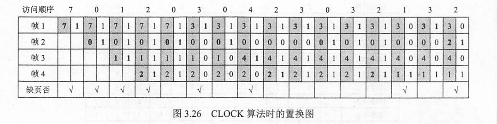
##### 改进CLOCK
增加一个字段修改位M，（访问位A，修改位M）
* 第一次扫描：从当前位置开始扫描到第一个 (0, 0) 的帧用于置换，不修改标志位
* 第二次扫描：查找第一个 (0, 1) 的帧用于置换，扫描过的帧访问位设0
* 第三次扫描：查找第一个 (0, 0) 用于置换，不修改标志位
* 第四次扫描：查找第一个 (0, 1) 的帧用于置换

优先级：
* 1类 A=0，M=0；最近没访问且没修改，最先置换
* 2类 A=0，M=1；最近没访问，但修改，其次
* 3类 A=1，M=0；最近访问过，但没修改，不淘汰
* 4类 A=1，M=1；最近访问过，且修改，不淘汰(后两类会变成前两类)

**工作集**
在某段时间间隔内，进程访问页面的集合
工作集由**时间t**和**工作集合窗口大小**确定

例：1 4 |5 3 5 3 2| 2 1 1 1 ，窗口大小$\triangle$=5
工作集为{5,3,2}

当所有进程工作集之和**超过了**可用的**物理快总数**，则操作系统会**暂停一个进程**，将其页面调出并将物理块分配给其他进程，**防止抖动**。

PS：缺页**不等同**于置换次数


## 文件管理
### 文件管理概念
文件打开，操作系统将 ①**文件控制信息** ②**FCB** ③**文件的属性** 逐步读入内存

**文件的属性**
* 文件名：同目录无重名文件
* 标识符：对用户无可读性，操作系统用于区分文件的内部名称
* 类型：指明文件的类型
* 位置：文件存放的路径（用户使用）、在外存中的地址（操作系统使用，用户不可见）
* 大小：文件大小
* 创建信息、上次修改时间、文件所有者信息
* 保护信息：对文件进行保护的访问控制信息

**文件控制块FCB**
目录本身是有结构文件，由一条条记录组成，每个记录都是放在该目录的一个文件
**FCB(File Control Block)** 的有序集合是 “文件目录”。一个FCB就是一个文件**目录项**
FCB 中包含了文件的基本信息（**文件名、物理地址**、逻辑结构、物理结构等），存取控制信息(访问存取权限)，使用信息(建立时间、修改时间)。

需要对目录进行哪些操作？
1. 搜索：当用户要使用一个文件时，系统要根据文件名搜索目录，找到该文件对应的目录项
2. 创建文件：创建一个新文件时，需要再所属目录中新增一个目录项
3. 删除文件：当删除一个文件时需要在目录中删除相应的目录项
4. 显示目录：用户可以请求显示目录的内容，如显示该目录中的所有文件及相应属性
5. 修改目录：某些文件属性保存在目录中，因此这些属性变化时需要修改相应的目录项（如：文件重命名）
### 目录管理
为了加快文件检索速度
删除文件：
删除文件不会删除其所在的文件夹
会删除FCB、磁盘释放空间，但不会删除快捷方式
### <font color="#dd0000">文件物理结构(文件分配方式)</font>
在很多操作系统中，**磁盘块的大小与内存块、页面的大小相同**

外存管理中，**文件的逻辑地址也被分为了一个一个的文件块**
逻辑地址形式 **（逻辑块号，块内地址）**
#### 磁盘分配方法
##### 连续分配
**每个文件在磁盘上占有一组连续的块**
* 转换时，只关心 **逻辑块号<->物理块号**
* 验证逻辑块号是否小于物理块长度
* 物理块号=起始块号+逻辑块号
* **顺序读/写最快**
* 优点：
   * **支持顺序访问和直接访问（随机访问）**
   * 读取某个磁盘块，需要移动磁块，**连续分配文件在顺序读写的速度最快**
* 缺点：
   * 物理上**不方便对文件拓展**
   * **空间利用率低，产生难以利用的磁盘碎片，可以通过紧凑解决(反复增删容易形成碎片)**
   * 为保持有序，删除和加入记录需要对物理块易用
##### 链接分配
采取**离散分配**的方式，分为**隐式链接**和**显示链接**

**隐式链接**

FCB: (文件名,...,起始块号，结束块号)，

类比链表的指针遍历，访问逻辑为 i 号逻辑块，需要 i+1 次磁盘 I/O.
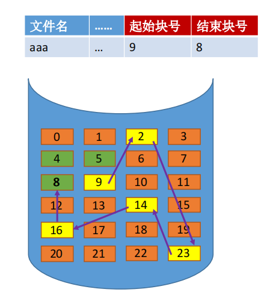
* 优点：
   * **拓展方便，不存在磁盘碎片**
* 缺点:
   * **只支持顺序访问，不支持随机访问**，查找效率低
   * 指向下一盘块的指针也要耗费少量空间
   * 指针易丢失。将几个盘块组成簇可解决

**显式链接**

* 顺序存储表中信息, 表项： **（物理块号，下一块）**, 类似数组实现邻接表
* **一个磁盘仅需要一张 FAT**。**开机时 FAT 被读入内存并常驻**
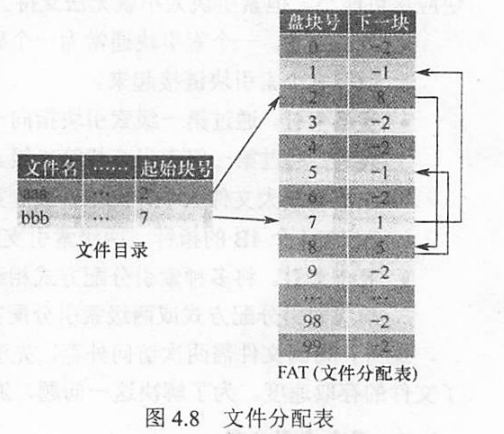
PS：-1表示最后一块，-2表示空闲
* 优点：
   * 采用链式分配 （显式链接）方式的文件，**支持顺序访问**，也**支持随机访问**（想访问i号逻辑块时，并不需要依次访问之前的0~i-1号逻辑块）
   * 块号转换的过程不需要访问磁盘，因此相比于隐式链接来说，访问速度快很多。
   * 显然，显式链接也不会产生外部碎片，也可以很方便地对文件进行拓展。
* 缺点：
   * FAT 需要占用一定内存空间
链接方式默认隐式链接
##### 索引分配
**注意： FCB 在内存里时读取不需要 I/O，初始放在外存（属于目录项，存在磁盘里）**

**索引分配**允许文件离散地分配在各个磁盘块中，系统会**为每个文件建立一张索引表**，索引表中记**录了文件的各个逻辑块对应的物理块**（索引表的功能类似于内存管理中的页表一一建立逻辑页面到物理页之间的映射关系）。索引表存放的磁盘块称为**索引块**。文件数据存放的磁盘块称为**数据块**。

目录中需要记录文件的索引快是几号磁盘块。 （文件名，...,索引块号）, 一个索引项指向物理块
可以**支持随机访问**，**文件拓展很容易实现**
##### <font color="#dd0000">多层索引</font>
多层索引，类似多级页表。FCB中记录 (文件名，索引块)。

* 磁盘块大小为 **1 KB**, 一个索引表项占**4 B**， 则一个磁盘块只能存放** 256 **个索引项
* 两层索引文件最大长度：**256×256×1KB = 65,536 KB = 64MB**
* 文件过小但依然需要多层索引。。。
##### <font color="#dd0000">混合索引</font>
多种索引分配方式的结合。

例如，一个文件的顶级索引表中，既包含直接地址索引（直接指向数据块），又包含一级间接索引（指向单层索引表）、还包含两级间接索引（指向两层索引表)

PS：**K层索引，K+1次读磁盘**
&emsp; &emsp;**索引结点个数 = 文件个数**

**例题：**
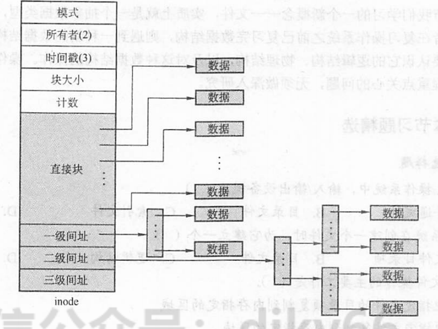

1. **直接地址**：**10个直接地址**，若一块4KB，文件不大于10 × 4KB = 40KB。可以在里面直接读出所有盘块号&emsp; &emsp;**2次访问**
2. 一次间接地址：1个一次间接地址，实质**一级索引**。一个间接地址块可放1024个盘块号，文件长达1024 × 4KB = 4MB&emsp; &emsp;**3次访问**
3. 多次间接地址：2次为例，文件长度大于4MB+40KB时，采取2次间接地址。最大可达4GB

PS：总文件的最大长度要将以上每个地址最大允许大小相加

#### 外存空闲空间管理
##### FAT文件分配表法
##### 空闲表法 (适用于 连续分配方式)
记录 **(第一个空闲盘，块号)**， **为文件分配连续的存储空间**, 与内存管理的相似
**首次适应**和**最佳适应算法**
**回收时注意表项合并**

##### 空闲链表法
* 空闲盘块链
   * **盘块为单位**，存有指向下一块指针
   * 系统保存**链头**、**链尾指针**
   * 分配与回收都是一个一个操作，回收放置链尾
* 空闲盘区链
   * **盘区为单位**，**第一个盘块存有盘区长度和下一个盘区的指针**，通常用**首次适应**
   * 系统保存 **链头**、**链尾指针**。
   * 分配时也有最佳适应算法等， 大小没有符合要求时，可以将不同盘区分配给一个文件
   * 回收时，要注意前后合并的问题，离散分配、连续分配都适用，效率高
##### 位示图法
每一个块用 **0或1** 表示是否空闲
若是 **m×n位** 位示图，可用来表示** m×n 个盘块**，适用于大型文件系统
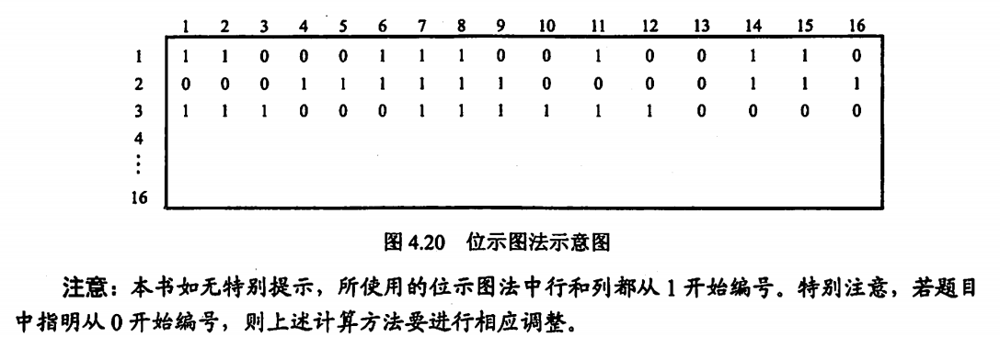
##### 成组链接法
设立一个磁盘块为 **超级块**
结合了空闲表和空闲链表
顺序的几个空闲块号组成一个成组链块
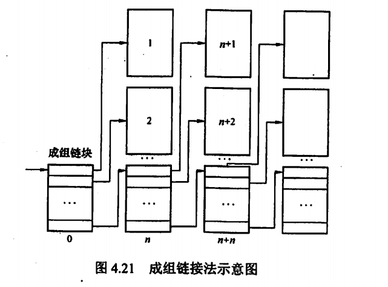
**最后一个指向另一个成组链块**

盘块分配：指针下移，若移动到最后就指向另一个成组链块
盘块回收：指针上移，若移动到头了，则将已有的几个空间盘块号的成组链块号放入新的回收盘块

若是满了，超级块中内容复制到新回收块，新回收块变为超级块加到链表头

PS：**簇和块都在 $\rightarrow$ 按簇分配磁盘空间文件**；**只有块**，**按块分配**


### 文件共享和保护
#### 硬链接
基于索引结点

索引结点，对FCB进行瘦身（存放文件名, 指针）

索引结点中设置一个链接计数变量 count，用于表示链接到本索引结点上的用户目录项数

* 若 count = 2，说明此时有两个用户目录项链接到该索引结点上，或者说是有两个用户在共享此文件。
若某个用户决定“删除〞该文件，则只是要把用户目录中与该文件对应的目录项删除，且索引结点的**count值减 1**。
* 若 count > 0，说明还有别的用户要使用该文件，暂时不能把文件数据删除，否则会导致指针悬空。
* **当 count = 0 时,系统负责删除文件**

#### 软链接
基于符号链接

索引节点指向 Link 类型的文件(源文件被删除依然存在link文件)。类似 **快捷方式**
不改变count值，只会引用count值。源文件删除后，count值也不变。
### 磁盘管理概念
#### 一次磁盘读写时间
* **寻找时间（寻道）** $T_S$  （题目往往会直接给）
   * **启动磁头臂**， 花费 s
   * **移动磁头**，每跨越一个磁道耗时 m, 总共跨越 n 条磁道
   * $T_S=s+m∗n$
   * **操作系统可以控制**
* **延迟时间** $T_R$,
   * **转半周的时间**
   * 磁盘转速为 $r$。
   * 延迟时间 $T_R=\frac{1}{2∗r}$
   * 例：题目给定转速如10000转/分
  $T_R=\frac{60s*1000}{2∗10000}$= 3 ms
* **读写时延/传输时间** $T_t$,
   * 转速为 $r$, 读写字节数为 $b$。每个磁道上字节数为 $N$
   * 传输时间 $T_t=\frac{b}{r∗N}$
   * 例1：读取扇区大小4KB，磁盘传输速率20MB/s，
    $T_t=\frac{4KB}{20MB/s}$ = 0.2ms
   * 例2：1/N圈的时间
    $T_t=\frac{b}{r∗N}
#### 磁盘管理
1. **磁盘初始化**
磁盘在存储数据之前，将其分成扇区，以便磁盘控制器能够进行读写操作，这个过程为**低级格式化(物理格式化)**
2. **分区**
分为一个或多个柱面组成的分区(C盘、D盘)
**以簇(linux为块)为单位**，多个相邻扇区为一簇
3. **引导块**
计算机启动初始化程序(自举程序)也是**系统启动的第一步**，**放在ROM中**
4. **坏块**

**逻辑格式化**：建立文件系统**根目录**，对保存空闲块的数据结构初始化。
### 磁盘寻寻道(调度)算法
#### 先来先服务算法 (FCFS)
<font color="#dd0000">多用于Flash等随机存储器，因为其不需要考虑寻道和旋转时延。</font>
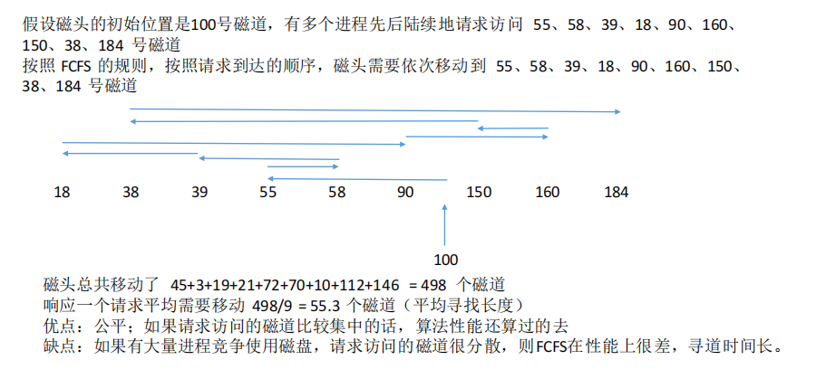
#### 最短寻找时间优先 (SSTF)
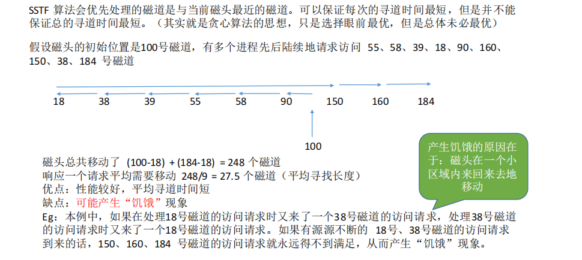
#### 扫描算法 (SCAN)
题目不说明，SCAN就是LOOK算法
在SCAN的基础上，如果在磁头移动方向上己经没有别的请求，就可以立即改变磁头移动方向
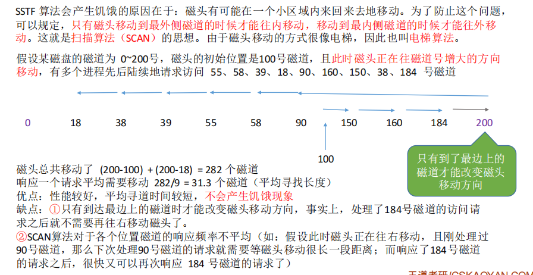
#### 循环扫描算法 (C-SCAN)
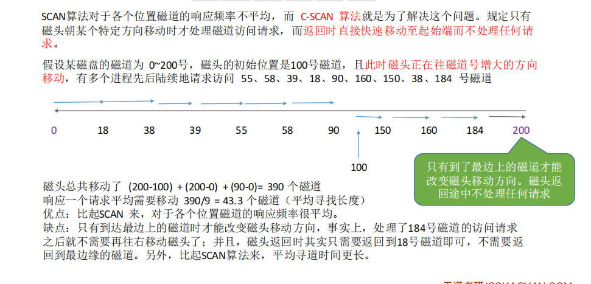


#### 减少磁盘延迟的方法
1. 采用交替编号
    * 原理：读完一个扇区需要一段时间才能继续读
2. 磁盘结构设计 (柱面，盘面，扇区)
3. 错位命名
## I/O设备管理
### I/O软件
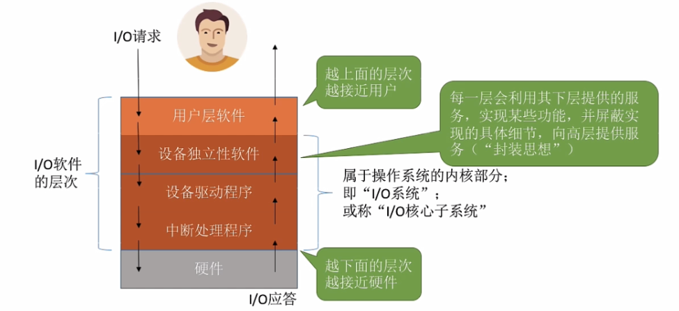
**用户层软件**
* **实现了与用户交互的接口**，用户使用提供的 **库函数(在应用层)**
* 将用户请求翻译成格式化的 I/O 请求，并通过系统调用请求操作系统内核的服务

**设备独立性软件**
又称**设备无关性软件 **
* 向上提供用户程序与设备驱动器统一的调用接口（read/write)
* 设备命令
* 设备的保护（类似文件保护， 设备被看成一种特殊的文件）
* 差错处理，对设备错误进行处理
* 设备的分配与回收（临界资源）
* 数据缓冲区管理（缓冲技术屏蔽设备间数据交换单位大小和数据传输的差异）
* 建立逻辑设备名到物理设备名的映射关系；根据设备类型选择调用相应的驱动程序。**逻辑设备在应用程序中作为申请，实际系统执行时逻辑程序将映射为物理设备来使用**
   * (通过**逻辑设备表（LUT, Logical Unit Table)** 确定逻辑设备对应的**物理设备**，并找到对应的**设备驱动程序**)
     * 第一种方式，整个系统设置一张 LUT， 只适用于单用户操作系统
     * 第二种方式，每个用户设置一张 LUT, 存在用户进程对应的 PCB 中

**设备驱动程序**  &emsp; **(初始化设备)**
**负责对硬件设备的具体控制，将上层发出一系列命令（read、write）转化成设备听得懂一系列操作**。包括设置设备寄存器；检查设备状态。**也将设备控制器传来的信号发送给上层**。

也是**真正完成对设备的驱动**，比如一些**找数据的计算**

不同I/O设备具有不同的硬件特性，厂家需要根据设备的硬件特性设计并提供相应的驱动程序

驱动程序**一般以一个进程的形式存在**

**中断处理程序**
当I/O任务完成时，I/O控制器会发送一个中断信号，系统会根据中断信号类型找到相应的中断处理程序并执行。**最早接受设备输入信号**
### I/O缓冲
I/O缓冲的作用在于减少I/O的次数
用磁盘告诉缓冲技术来提高磁盘的I/O速度
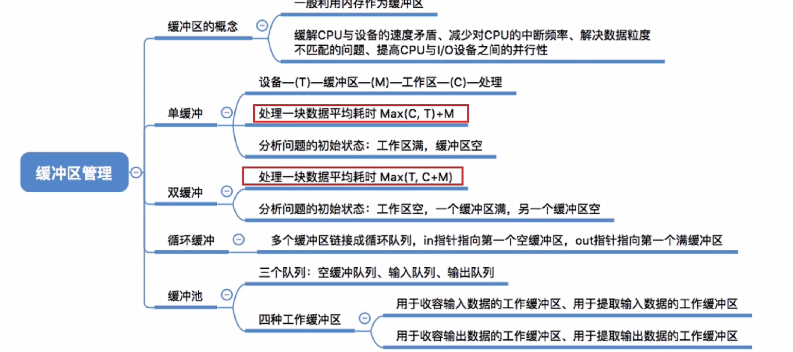
#### 单缓冲
**每块处理时间：M+max(C,T)**
非空不能输入，只能输出；反之，空，只能输入
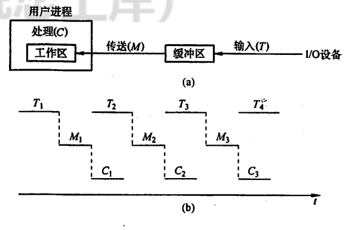
若是有 n 个块，**总处理时间：n (M + max(C,T)) + C**
#### 双缓冲
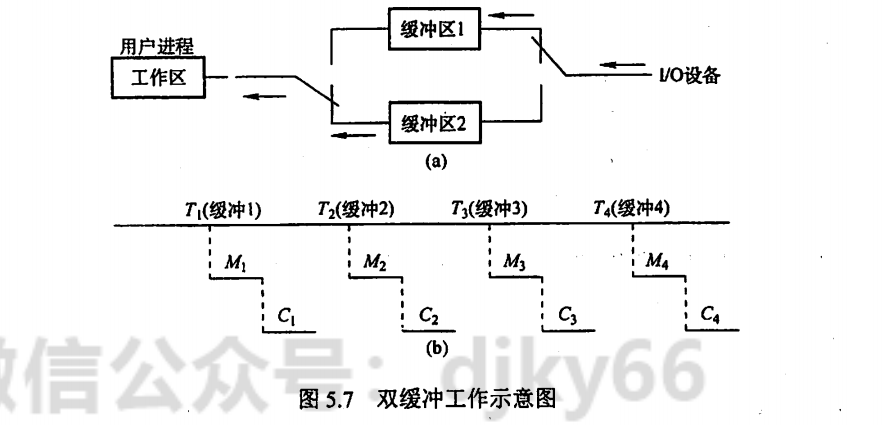
若是有 n 个块，**总处理时间：n (max(C + M,T)) + M + C**