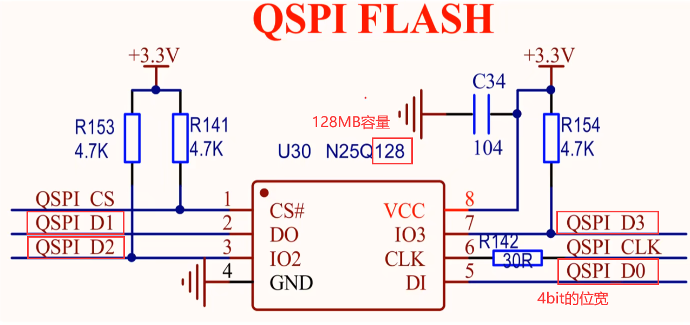
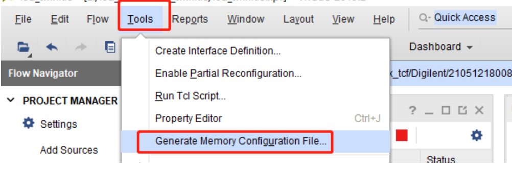
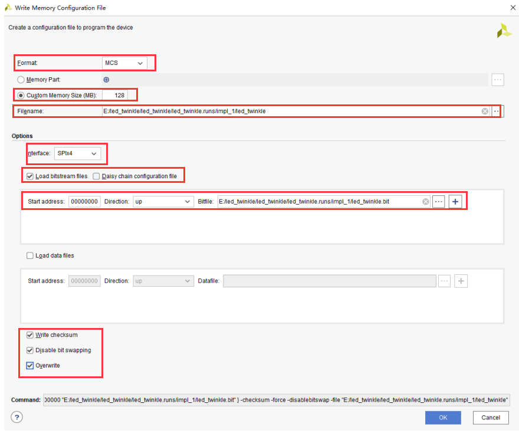
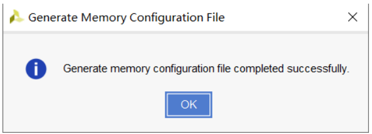
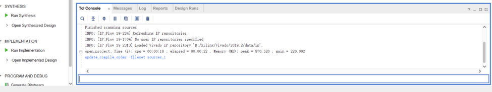
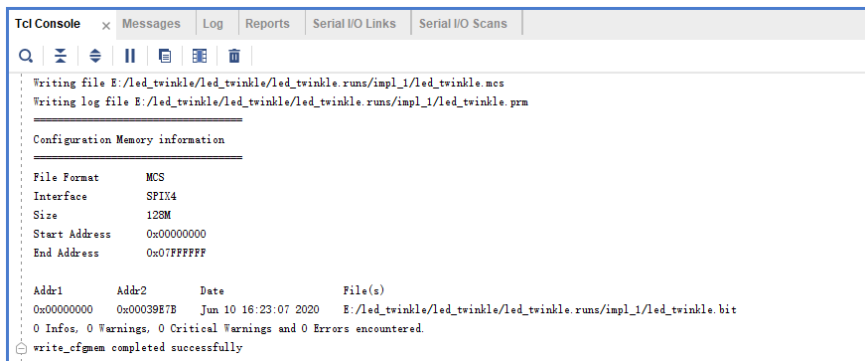

# Vivado程序固化

## 前言

对于FPGA开发者，都会遇到这样的一种情况，就是下载到板子中的FPGA程序会随着板子掉电而消失再次上电，又要重新编译下载程序。在程序调试阶段还可以接受，但在程序版本固定后使用起来就会非常不方便。这就需要用到固化程序这一操作，就是将FPGA的配置文件烧写到板载Flash中，实现上电自启动。

### .bin 和 .mcs文件

在 Vivado 中，生成的 `.bin` 和 `.mcs` 文件都是用于 FPGA 的配置和编程的，但它们在用途和格式上有一些区别。以下是对这两个文件的详细解释：

- `.bin` 文件
    1. 格式：
        - `.bin` 文件是二进制格式文件，包含 FPGA 配置所需的原始二进制数据。
    2. 用途：
        - `.bin` 文件通常用于直接配置 FPGA，尤其是在使用某些编程设备或工具时，如 JTAG 编程器。
        - 也可以用于直接加载到 FPGA 中进行配置，尤其适用于在开发和调试阶段。
    3. 生成：
        - 在 Vivado 中，可以通过生成比特流后选择适当的选项生成 .bin 文件。
- `.mcs` 文件
    1. 格式：
        - `.mcs` 文件是 Memory Configuration File，用于非易失性存储器（如闪存）的配置。它采用 ASCII 文本格式，以 Intel HEX 格式存储数据。
    2. 用途：
        - `.mcs` 文件通常用于将配置数据写入外部存储器（如 SPI Flash），这使得 FPGA 可以在上电时自动加载配置数据。
        - 适用于需要非易失性存储的应用场景，确保 FPGA 在每次上电后都能加载相同的配置。
    3. 生成：
        - 在 Vivado 中，可以通过生成比特流后选择适当的选项生成 .mcs 文件，通常是在“Generate Memory Configuration File”选项中选择生成。

- 区别总结
    - 格式：
        - .bin 是二进制格式，直接包含原始配置数据。
        - .mcs 是 ASCII 文本格式，采用 Intel HEX 格式，用于外部存储器编程。

    - 用途：
        - .bin 文件适用于直接配置 FPGA，特别是在开发和调试阶段。
        - .mcs 文件适用于将配置数据写入外部非易失性存储器，确保 FPGA 上电时能自动加载配置。

    - 应用场景：
        - 如果你需要频繁更新和测试 FPGA 配置，使用 .bin 文件更为方便。
        - 如果你需要在生产环境中部署，且 FPGA 每次上电后都需要自动加载配置，使用 .mcs 文件更合适。


### .svf 文件
- 为了实现通过Zynq对Artix-7 FPGA（A7）的远程更新（即通过网线传输固件并重新配置FPGA），需借助 **SVF（Serial Vector Format）文件** 和 **JTAG协议**。

- `.svf` 文件
    1. 定义：
        - SVF（Serial Vector Format）是一种标准化的 **JTAG编程指令序列文件**，记录了通过JTAG接口配置FPGA所需的完整操作流程（如复位、擦除、编程、校验等）。
    2. 特点：
        - 与具体硬件无关，支持跨平台JTAG控制器。
        - 包含二进制比特流（.bit）转换后的串行操作指令。
        - 可通过Xilinx Vivado工具生成。
    3. 应用：
        - 远程更新FPGA固件时，将SVF文件传输至支持JTAG主控的设备（如Zynq），由该设备通过JTAG接口对目标FPGA（A7）进行编程。


## 生成固化文件

### 属性设置

- 在 FPGA 设计过程中，特别是在程序固化之前，确实需要在约束文件中添加一些特定的原语（属性设置）。这些原语主要用于配置比特流生成和 FPGA 配置的详细参数，确保生成的比特流文件能够正确加载并运行。
- 依据Flash器件信号原理图：
- 需要在程序约束文件中添加如下原语：
```verilog
set_property CFGBVS VCCO [current_design]
set_property CONFIG_VOLTAGE 3.3 [current_design]
set_property BITSTREAM.GENERAL.COMPRESS true [current_design]
set_property BITSTREAM.CONFIG.CONFIGRATE 50 [current_design]
set_property BITSTREAM.CONFIG.SPI_BUSWIDTH 4 [current_design]
set_property BITSTREAM.CONFIG.SPI_FALL_EDGE Yes [current_design]
```

- 以下是对每个原语的详细解释：
    - `set_property CFGBVS VCCO [current_design]`：
        - 作用：设置配置引脚的电压源（CFGBVS, Configuration Bank Voltage Source）。VCCO 表示配置引脚使用 I/O 电源电压。
        - 原因：确保配置引脚使用正确的电压，以便在配置 FPGA 时避免电压不匹配的问题。
    - `set_property CONFIG_VOLTAGE 3.3 [current_design]`：
        - 作用：设置 FPGA 配置时所使用的电压。3.3 表示 3.3V。
        - 原因：明确指定 FPGA 配置电压，以确保 FPGA 在配置期间的稳定性和兼容性。
    - `set_property BITSTREAM.GENERAL.COMPRESS true [current_design]`：
        - 作用：启用比特流压缩。
        - 原因：压缩比特流文件可以减少文件大小，缩短配置时间，特别是在配置数据量较大的情况下。
    - `set_property BITSTREAM.CONFIG.CONFIGRATE 50 [current_design]`：
        - 作用：设置比特流配置速率，单位为 MHz。50 表示配置速率为 50 MHz。
        - 原因：通过设置合适的配置速率，确保 FPGA 配置过程的稳定性和速度。速率过高可能会导致配置失败，速率过低会延长配置时间。
    -  `set_property BITSTREAM.CONFIG.SPI_BUSWIDTH 4 [current_design]`：
        - 作用：设置 SPI 总线宽度。4 表示使用 4 位宽度的 SPI 总线（即 Quad-SPI）。
        - 原因：使用 Quad-SPI 可以加快配置速度，因为它能够同时传输 4 位数据，比单通道 SPI 速度更快。
    - `set_property BITSTREAM.CONFIG.SPI_FALL_EDGE Yes [current_design]`：
        - 作用：配置 SPI 接口在下降沿时采样数据。
        - 原因：有些 SPI 器件在下降沿采样数据，这一设置确保 FPGA 和 SPI 存储器之间的时序兼容性，避免数据传输错误。


### 生成.mcs文件

#### 用 Vivado 控制台生成.mcs 文件

1. 如下图所示首先在工具栏找到 `Tools`，打开扩展框然后点击 `Generate Memory Configuration File`


2. 之后会出现器件编辑选项框`Create a configuration file to program the device`如图所示：
    - 从图中我们可以看到一些配置选项，在此仅对我们需要用到的一些配置做简要介绍：
        - `Format`：指的生成文件的格式，这里我们选择生成 MCS 文件。
        - `Custom Memory Size（MB）`：指的是所用 flash 的容量大小，这里选 128（根据 flash 手册决定）。
        - `Filename`：这里编辑生成的 mcs 文件名称，右边的三个点按钮是选择 mcs 文件保存路径。
        - `Interface`：指的是所用 flash 的通信方式，这里我们选 SPIx4（4bit 通信 flash，根据 flash 手册决定）。
        - `Load bitstream files`：这个选项勾上，然后添加你要生成 mcs 文件的原文件（bit 流文件）。
        - `Write checksum`：写校验。
        - `Disable bit swapping`：禁止位交换。
        - `Overwrite`：覆盖原文件。

3. 配置选项完成后点击 `OK`，会出现下图提示信息，这就代表我们 `.mcs` 文件生成成功，点击 `OK` 就行。

#### 使用 tcl 指令生成.mcs 文件

1. 先在信息栏窗口找到  `Tcl Console` 如下图所示：



2. 然后在指令栏中输入`write_cfgmem -format mcs -interface SPIx4 -size 128 -loadbit {up 0x0 E:/led_twinkle/led_twinkle/led_twinkle.runs/impl_1/led_twinkle.bit} -file E:/led_twinkle/led_twinkle/led_twinkle.runs/impl_1/led_twinkle.mcs`然后按回车键就可以生成 `.mcs `文件了，指令运行成功可以看到如图所示信息： 


   - 该指令的含义：
     - `write_cfgmem`：命令头。 
     - `-format mcs`：生成文件格式为 mcs。 
     - `-interface SPIx4`：flash 的通信协议及位宽（QSPI 也写成 SPI）。 
     - `-size 128`：flash 容量 128M。 
     - `-loadbit{up0x0 E:/led_twinkle/led_twinkle/led_twinkle.runs/impl_1/led_twinkle.bit }` ：加载 bit 流文件的路径和 bit 流文件。 
     - `-file E:/led_twinkle/led_twinkle/led_twinkle.runs/impl_1/led_twinkle.mcs`：生成的 mcs 文件及保存路径。 
     - 建议读者将这条指令保存下来，下次使用只需要替换一下文件路径和源文件就可以直接使用了。 


### 生成.bin文件


#### 使用 Vivado 生成.bin 文件

1. 首先找到 `Flow Navigator` 栏，点击 `Settings` 
<div align="center">

</div>

2. 出现如下图所示的选项栏。这个选项栏中先在左边 `Project Settings` 栏选中 `Bitstream`，然后在右边的选项栏中选择`-bin_file`，之后点击 `Apply` 等待 `Apply` 按钮变成灰色，再点击 `OK`。然后我们重新生成 bit 流文件，bin 文件会同时生成，并且和 bit 流在同一个路径下。 
<div align="center">

</div>


### 生成.svf文件

#### 使用 Vivado IDE

1. (与连接开发板的步骤相同)，点击`Open Hardware Manager`，点击自动连接`Auto Connect`。
<div align="center">

</div>

2. 右键`localhost`，选择 `Create SVF Target`。出现`Create SVF Target`窗口，点击`OK`

<div align="center">

</div>

<div align="center">

</div>

3. 如下图所示，添加 Xilinx 器件。器件信息根据项目实际选择。然后创建该器件的 SVF 链。

<div align="center">

</div>

<div align="center">

</div>

<div align="center">

</div>

4. 右键单击 SVF 链中的 Xilinx 器件可以选择创建配置存储器器件，并将配置存储器器件与该器件关联。打开“添加配置存储器器件 `Add Configuration Memory Device`”对话框 ，根据项目实际情况选择器件，然后点击 `OK`。这样会将此器件与赛灵思器件关联 ， 并显示在 SVF 器件链中 。

<div align="center">

</div>

<div align="center">

</div>

<div align="center">

</div>

5. 在下方的`SVF Operations`栏中，点击`+`选择`Add Program Configuration Memory Operations`，然后再弹出的窗口中，选择相应的`.msc`文件，然后注意三个选项的选择，然后点击`OK`。最后点击`Export SVF `，选择保存路径和文件名。这样就生成了 `.svf` 文件。

<div align="center">

</div>

<div align="center">

</div>

<div align="center">

</div>


### 添加 flash 器件及下载固化文件

- 光有固化文件还不够，我们还要添加一个固化 flash 器件。 

#### 没有产生 mcs 文件的情况
1. 将板子连接到 PC 端，连接完成后如下图所示：

<div align="center">

</div>

2. 在硬件栏中我们选中器件 `xc7a35t_0(1)`，右击后点击选择 `Add Configuration Memory Device`

<div align="center">

</div>

3. 刚进入`Add Configuration Memory Device`界面的时候整个 `Filter` 栏四个筛选框应该是四个 `ALL`，我们将筛选条件改成下图所示。之后你会发现最底下器件栏只剩下两个了，我们选择 `mt25ql128-spi-x1_x2_x4`，然后点击 OK。

<div align="center">

</div>

4. 出现下图所示的询问栏，继续点击 `OK` 

<div align="center">

</div>

5. 出现下图所示的选项栏，按照下图所示添加对应的 `.mcs` 文件和对应的`.prm`文件，点击 `OK` 

<div align="center">

</div>

6. 出现下载成功，最后点击`OK`

<div align="center">

</div>

#### 已经产生 mcs 文件的情况

- 在所选择的 flash 的型号上右击，出现右侧的扩展框，点击扩展框内红色的方框所框的选项，出现下图所示界面，然后按照上面的操作就可以将程序固化进开发板了。

<div align="center">

</div>

**PS**：固化成功后，将开发板断电重启即可。而 `.bin` 文件的下载流程和 `.mcs` 一样


### 擦除固化文件

1. 在所选择的 flash 的型号上右击，出现右侧的扩展框，点击扩展框内红色的方框所框的选项

<div align="center">

</div>

2. 在弹出的界面内只勾选`Erase`擦除，点击 `OK`

<div align="center">

</div>

3. 弹出如下界面，即表示成功擦除板子原先存在的固化文件。

<div align="center">

</div>

4. 断电重启开发板，会发现原来的程序将不再执行。