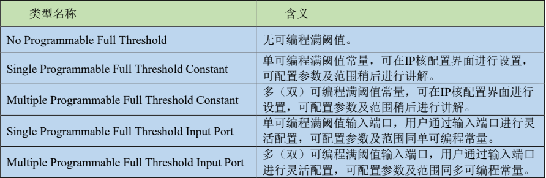

# IP核之 FIFO 


## 前言

- **FIFO**（**First In First Out**，即**先入先出**），是一种数据缓存器，用来实现数据先入先出的读写方式。在FPGA 或者 ASIC 中使用到的 FIFO 一般指的是对数据的存储具有先入先出特性的缓存器，常被用于多比特数据跨时钟域的转换、读写数据带宽不同步等场合。 

## 何为 FIFO

### FIFO与RAM的区别
- FIFO 本质上是由 RAM 加读写控制逻辑构成的一种先进先出的数据缓冲器，其与普通存储器 RAM 的
区别在于 FIFO 没有外部读写地址线，使用起来非常简单，但 FIFO 只能顺序写入数据，并按顺序读出数据，其数据地址由内部读写指针自动加 1 完成，不能像普通存储器那样可以由地址线决定读取或写入某个指定的地址，不过也正是因为这个特性，使得 FIFO 在使用时并不存在像 RAM 那样的读写冲突问题。

### FIFO 分类
- 根据 FIFO 工作的时钟域，可以将 FIFO 分为**同步 FIFO** 和**异步 FIFO**。
- **同步 FIFO** 是指读时钟和写时钟为同一个时钟，在时钟沿来临时同时发生读写操作，常用于两边数据处理带宽不一致的临时缓冲。
- **异步FIFO** 是指读写时钟不一致，读写时钟是互相独立的，一般用于数据信号跨时钟阈处理。 
<div align="center">

</div>

### FIFO 常见参数
- 对于 FIFO 我们还需要了解一些常见参数： 
    1. FIFO 的宽度：FIFO 一次读写操作的数据位宽 N。
    2. FIFO 的深度：FIFO 可以存储多少个宽度为 N 位的数据。 
    3. 将空标志：almost_empty，FIFO 即将被读空。 
    4. 空标志：empty，FIFO 已空时由 FIFO 的状态电路送出的一个信号，以阻止 FIFO 的读操作继续从FIFO 中读出数据而造成无效数据的读出。 
    5. 将满标志：almost_full，FIFO 即将被写满。 
    6. 满标志：full，FIFO 已满时由 FIFO 的状态电路送出的一个信号，以阻止 FIFO 的写操作继续向FIFO 中写数据而造成溢出。 
    7. 写时钟：写 FIFO 时所遵循的时钟，在每个时钟的上升沿触发。 
    8. 读时钟：读 FIFO 时所遵循的时钟，在每个时钟的上升沿触发。 
    9. 可配置满阈值：影响可配置满信号于何时有效，其可配置范围一般为 3~写深度-3。
    10. 可配置满信号：prog_full，表示 FIFO 中存储的数据量达到可配置满阈值中配置的数值。 
    11. 可配置空阈值：影响可配置空信号于何时有效，其可配置范围一般为 2~读深度-3。 
    12. 可配置空信号：prog_empty，表示 FIFO 中剩余的数据量已经减少到可配置空阈值中配置的数值。 
- 注意：
    1. `almost_empty`和`almost_full`这两个信号分别被看作`empty`和`full`的警告信号，他们相对于真正的空（empty）和满（full）都会提前一个时钟周期拉高。 
    2. FIFO 中，先写入的数据被置于高位，后写入的数据被置于低位，由于其先入先出的特性，所以读出的数据也是高位在前，低位在后。这一点在读写数据位宽不对等时尤为重要，例如我们写数据位宽为8，读数据位宽为 2，当写入的数据为 11000111 时，读出的数据依次为 11、00、01、11。如下图所示：

    <div align="center">
    
    </div>

    - 读位宽大于写位宽时，原理是相同的，如下图所示：

    <div align="center">
    
    </div>

## FIFO 设计

### FIFO 基础知识
-  FIFO Generato IP 核（FIFO 发生器）其信号框图
    <div align="center">
    
    </div>

    - PS：上图中<u>*黑色箭头*</u>表示此信号为**必要信号**；<u>*蓝色箭头*</u>表示此信号为**可选信号**；<u>*灰色箭头*</u>表示此信号为可选的**边带信号**。 
    - 从图中我们可以了解到：
      - 当被配置为**同步 FIFO** 时，只使用 `wr_clk`，所有的输入输出信号都同步于`wr_clk` 信号。
      - 当被配置为**异步 FIFO**时，写端口和读端口分别有独立的时钟，所有与写相关的信号都是同步于写时钟 `wr_clk`，所有与读相关的信号都是同步于读时钟 `rd_clk`。 

- 各常用端口的功能描述如下：
    <div align="center">
    
    </div>

- 一个典型的写操作时序如下图所示： 
    <div align="center">
    
    </div>

    - 当 `wr_en`（写使能）信号使能时，会在 `wr_clk`（写时钟）的下一个上升沿上发生写操作，由于 FIFO 未满，因此 `wr_ack`（写应答）信号处于有效状态，表示写入操作成功。当只能再执行一次写操作时，`almost_full`（将满）信号会被拉高，此时若再进行一次写操作，`full`（满）信号就会被拉高，表示 FIFO 已被写满，在有数据被读出前，无法再写入数据了。如果在 `full` 信号拉高后执意要进行写操作，`wr_ack` 就会被拉低，表示此次数据写入失败，同时 `overflow`（满溢出）信号就会被拉高，表示 FIFO 存在溢出现象。


- 一个典型的读操作时序如下图所示： 
    <div align="center">
    
    </div>

    - 只要 FIFO 中存有数据，`empty`（空）信号就会一直为低电平，表明 FIFO 中有数据可以进行读取。当`rd_en`（读使能）信号使能时，会在 `rd_clk`（读时钟）的下一个上升沿上发生读操作，FIFO 会在 `dout`（数据输出线）上输出数据，并拉高 `valid`（读有效）信号，表示读操作成功。当 FIFO 中还剩最后一个数据时，`almost_empty`（将空）信号会被拉高，此时若再进行一次读操作，`empty`（空）信号就会被拉高，表示FIFO 已被读空，在 FIFO 中有存储数据前，读请求将被忽视。如果在 `empty` 信号拉高后执意要进行读操作，`valid` 就会被拉低，表示此次数据读出失败，同时 `underflow`（空溢出）信号就会被拉高，表示 FIFO 中已经没有可被读取的数据了。 


### FIFO 设计思路
- 本文的实验任务是使用 Vivado 生成一个**异步 FIFO**，并实现以下功能：
  - 当 FIFO 为空时，向 FIFO 中写入数据，直至将 FIFO 写满后停止写操作；
  - 当 FIFO 为满时，从 FIFO 中读出数据，直到 FIFO 被读空后停止读操作


#### 顶层模块设计
- **顶层模块设计**：本文设计的是异步 FIFO，因此需要一个 MMCM IP 核来输出 50MHz 的写时钟和 100MHz 的读时钟（当然输出其它频率的时钟也是可以的）；然后我们还需要一个**写模块**`fifo_wr`和一个**读模块**`fifo_rd`。写模块通过 FIFO 的状态来判断是否给出写请求信号和写数据，读模块通过 FIFO的状态来判断是否给出读请求信号，并接收从 FIFO 中读出的数据；系统时钟和系统复位是一个完整的工程中必不可少的输入端口信号，这里就不再多讲了。
- 经过上述分析可以得一个大致的模块框图，如下图所示：    
<div align="center">

</div>


#### 写模块设计
- **写模块设计**：在 FIFO 写模块中，我们的输入信号主要有**系统时钟信号**（写时钟域的时钟）、**系统复位信号**；因为 FIFO 的写操作需要在 FIFO 完成复位后进行，所以我们还需要输入**写复位忙信号**`wr_rst_busy`来判断 FIFO 是否结束了复位状态。实验任务中我们提到了 FIFO 为空时进行写操作，因此还需要引入一个空相关的信号，这里我们引入的是 **空信号**`empty`；实验任务中我们还提到了写满了要停止写操作，所以这里我们引入了 **将满信号**`almost_full`，因为将满信号表示 FIFO 还能再进行最后一次写操作，使用这个信号的话我们正好可以在写入最后一次数据后关闭写使能，当然引入**满信号**`full`也是可以，区别只是在于这么做会在写使能关断前执行一次无效的写操作。输出信号有控制写 FIFO 所需的 **写端口使能**`fifo_wr_en`和 **写数据**`fifo_wr_data`这两个信号。
- 经过上述分析可以得一个大致的模块框图，如下图所示： 
<div align="center">

</div>

- 模块端口与功能描述如下表所示：
<div align="center">

</div>


#### 读模块设计
- **读模块设计**：在 FIFO 读模块中，我们的输入信号主要有**系统时钟信号**（读时钟域的时钟）、**系统复位信号**；因为 FIFO 的读操作需要在 FIFO 完成复位后进行，所以我们还需要输入**读复位忙信号**`rd_rst_busy`来判断 FIFO 是否结束了复位状态；实验任务中我们提到了 FIFO 为满时进行读操作，因此还需要引入一个满相关的信号，这里我们引入的是 **满信号**`full`；实验任务中我们还提到了读空了要停止读操作，所以这里我们引入了 **将空信号**`almost_empty`，因为将空信号表示 FIFO 还能再进行最后一次读操作，使用这个信号的话我们正好可以在读出最后一个数据后关闭读使能，当然引入**空信号**`empty`也是可以，区别只是在于这么做会在读使能关断前执行一次无效的读操作。输出信号仅有控制写 FIFO 所需的 **读端口使能信号**`fifo_rd_en`。
- 经过上述分析可以得一个大致的模块框图，如下图所示：
<div align="center">

</div>

- 模块端口与功能描述如下表所示：
<div align="center">

</div>

### FIFO 配置实验步骤
#### 一、创建工程
1. 创建一个名为`ip_fifo`的空白工程，然后点击 Vivado 软件左侧`Flow Navigator`栏中的`IP Catalog`，如下图所示： 
<div align="center">

</div>

#### 二、搜索创建 BMG IP核
2. 在`IP Catalog`窗口的搜索栏中输入`fifo`关键字后，出现唯一匹配的`FIFO Generator`，如下图所示： 
<div align="center">

</div>


#### 三、配置 IP 核
3. 双击`FIFO Generator`后弹出 IP 核的配置界面，对 BMG IP 核进行配置。
- `Basic`选项卡配置界面如下图所示:
<div align="center">

</div>

- 该选项卡下各参数（重点关注（2）和（3）中的内容）含义如下：
    1. 最上面的`Component Name`一栏可以设置该 IP 元件的名称，这里我们保持默认命名，当然也可以命名为其它方便自己一眼看出其功能的名称。 
    2. `lnterface Type（接口模式）`：有三种接口模式可选，分别为 `Native（常规）接口`、`AXI Memory Mapped（内存映射）接口`和 `AXI Stream（流）接口`。其中 AXI Memory Mapped 接口一般用于与PS 端进行数据交互；AXI Stream 接口一般应用于高速信号处理场景中，例如光口通信；通常情况下我们一般采用 Native 模式，所以本次实验我们选择 Native 模式。 
    3. `Fifo Implementation（FIFO 实现）`：用于设置用什么资源来实现什么样的 FIFO。可配置用于实现 FIFO 的资源有四种，分别为 `Block RAM（块 RAM）`、`Distributed RAM（分布式 RAM）`、`Shift Register （移位寄存器）`和 `Builtin FIFO（内置 FIFO）`，其中移位寄存器仅可用于实现同步 FIFO。可配置的 FIFO 类型有两类，分别为 `Common Clocks（公共时钟，即同步 FIFO）`和 `Independent Clocks（独立时钟，即异步FIFO）`。资源与种类两两组合之下便有了七种不同的选择。需要说明的是 BRAM 和分布式 RAM 是创建FIFO 时最常选用的存储资源类型，一般来说，FIFO 容量超过 1024 个字节就需要考虑使用 BRAM 了，没超过 1024 字节选择分布式 RAM。当然，如果芯片 BRAM 资源很富余的话，全部采用 BRAM 也是可以的，后两种基本用不到。本次实验我们选择`Independent Clocks Block RAM`，即使用 BRAM 资源来实现一个异步 FIFO。 
    4. `synchronization Stages（同步阶段）`：定义跨交叉时钟域逻辑的同步器级数，即设置读写状态信号的输出延迟。保持默认设置 2 即可。 
    5. `FIFO Implementation Options（FIFO 实现方案）`：此处的表格将实现 FIFO 的七种方案的特征都一一列出了，当我们不清楚自己的 FIFO 设计该使用哪种方案实现时，可以看下此处的表格。 

- `Native Ports`选项卡配置界面如下图所示:
<div align="center">

</div>

- 该选项卡下各参数（重点关注（1）、（2）和（4）中的内容）含义如下：
    1. `Read Mode（读取模式）`：有 `Standard FIFO（标准 FIFO）`和`First Word Fall Through（首字直通，简称 FWFT 模式，即预读模式）`两种可选，需要注意的是标准模式的数据输出会比读使能延迟一拍，预读模式的数据与读使能同时输出，这里我们选择默认的标准模式。 
    2. `Data Port Parameters（数据端口参数）`：用于设置 FIFO 的读写数据位宽和读写深度，其中写数据位宽可在 1~1024 内任意设置；写深度的可支持参数配置我们可以通过下拉来查看，这里我们设置为256，需要注意的是，虽然我们设置的深度为 256，但实际深度只有 255；读数据位宽支持 1：8~8：1 之间的偶数比，这里我们保持默认的 1：1 比例，即读数据位宽为 8；读深度是我们设置完读写数据位宽和写深度后自动确定的，无需我们进行设置。 
    这里有一点需要我们注意，在实际应用中，FIFO 的读写数据位宽和深度在满足设计需求的情况下要尽量设置的小一点，因为 FIFO 使用的是片上 BRAM 资源，而 FPGA 内部的片上 BRAM 资源是有限的，所以大家不要将位宽和深度设置成远远超过实际需求的值，造成 BRAM 资源的过度浪费。 
    3. `ECC，Output Register and Power Gating Options（ECC、输出寄存器和电源选通选项）`，其下各配置如下： 
       - 第一行有四个信号，当我们勾选 `ECC（纠错码）`后，可以选择 `Hard ECC（硬 ECC）`或 `Soft ECC （软 ECC）`，并可以勾选 `Single Bit Error Injection（注入单 bit 错误）`和 `Double Bit Error Injection（注入双bit 错误）`，这里我们保持默认的不启用 ECC 即可。 
       - 第二行有两个信号，`ECC Pipeline Reg（ECC 管道寄存器）`和`Dynamic Power Gating（动态功率选通）`都是仅限 UltraScale 系列芯片使用 Builtin FIFO 资源实现 FIFO 时才可进行配置。
       - 第三行用于配置输出寄存器，勾选`Output Registers（输出寄存器）`后，可以选择添加`Embedded Registers（嵌入式寄存器）`和`Fabric Registers（结构寄存器）`。其作用是可以改善 FIFO 的时序，为此付出的代价是每添加一个输出寄存器，输出就会延后一拍。这里我们保持默认，不做勾选。
    4. `Initialization（初始化）`，也就是设置复位相关的参数，详情如下： 
       - `Reset Pin（复位脚）`：选择是否引入复位信号，高电平有效。实际设计中，在 FPGA 配置完成后，读写操作开始前，FIFO 必须要进行复位操作，需要注意的是，在进行复位操作时，读写时钟必须是有效的。这里我们保持默认的勾选状态，即启用复位信号。 
       - `Enable Reset Synchronization（启用复位同步）`：用于设置异步 FIFO 时是否启用同步复位，需要注意的是官方文档中建议复位信号至少要保持三个时钟周期（以慢时钟为准）的有效，且在复位后至少要经过三十个时钟周期（以慢时钟为准）后，才能对 FIFO 进行写数据操作。这里我们保持默认的勾选状态，即启用同步复位。 
       - `Enable Safety Circuit（启用安全电路）`：用于设置 FIFO 是否向外输出 `wr_rst_busy`（写复位忙信号）和 `rd_rst_busy`（读复位忙信号），这两个信号皆是高电平表示处于复位状态，低电平表示空闲，我们可以通过这两个信号来判断 FIFO 是否复位完成，防止我们在复位完成前对 FIFO 进行读写操作而导致读写错误，所以我们保持默认的勾选状态，即启用安全电路。需要注意的是官方文档中建议当启用安全电路时，复位信号至少要保持八个时钟周期（以慢时钟为准）的有效，且在复位后至少要经过六十个时钟周期（以慢时钟为准）后，才能对 FIFO 进行写数据操作。 
       - `Reset Type（复位类型）`：当选择使用非 Builtin FIFO 资源来实现同步 FIFO 时，可以选择复位类型为`Asynchronous Reset（异步复位）`或 `Synchronous Reset（同步复位）`，使用异步 FIFO 模式时不需要考虑该配置。 
       - `Full Flags Reset Value（满信号的重置值）`：用于设置复位时三个满信号（满信号，将满信号，设置满信号）的状态是高电平还是低电平。这里我们保持默认设置 1 即可。 
       - `Dout Reset Value（输出的数据重置值）`：设置复位期间 FIFO 输出总线上的数据值，若未启用，则复位期间输出总线上的值时未知的。切记设置时此值的位宽不可超过读数据的位宽，这里我们保持默认的 0 即可。
    5. `Read Latency（读延迟）`，可以在此处看出经过以上设置后，输出被延迟了几拍。因为我们选择的读取模式是标准模式，且没有启用任何输出寄存器，所以输出延迟了一拍。 

- `Status Flags`选项卡配置界面如下图所示:
<div align="center">

</div>

- 该选项卡下各参数（重点关注（1）中的内容）含义如下：
    1. `Optional Flags（可选标准）`，可勾选是否输出 `Almost Full Flag（将满信号）`和 `Almost Empty Flag（将空信号）`，两个信号皆为高有效。其中将满信号是在 FIFO 内部写数据个数**大于等于FIFO 深度-1** 之后的第一个写时钟上升沿置高，直到 FIFO 内部写数据个数**小于FIFO 深度-1** 后的第一个写时钟上升沿拉低；将空信号是在 FIFO 内部读数据个数**小于等于1** 之后的第一个读时钟上升沿置高，直到 FIFO 内部读数据个数**大于1** 后的第一个读时钟上升沿拉低。这里我们选择输出这两个标志信号。
    2. `Handshaking Options（握手选项）`，可用于配置读写端口的握手机制，这里我们简单的介绍下各个配置含义：
        - `Write Port Handshaking（写端口握手）`：可使能 `Write Ackongledge`（写应答）信号和 `Overflow`（满溢出）信号。其中写应答信号是成功写入数据的标志，一次成功写入对应一个写时钟周期的写应答，有效电平状态可配；满溢出信号是写入数据无效（溢出）的标志，一次溢出对应一个写时钟周期，有效电平状态可配。这里我们不做任何勾选。 
        - `Read Port Handshaking（读端口握手）`：可使能 `Valid Flag`（读有效标志）信号和 `Underflow Flag`（空溢出）信号。这两个信号的有效电平状态同样可配，信号含义和写端口握手中的两个信号类似，这里就不多赘述了，这里我们不做任何勾选。 
    3. `Programmable Flags（可编程标志）`有六个可配置参数，这里的参数配置将影响到可编程空满信号（`prog_empty`和 `prog_full` 信号）在何时使能，各参数含义如下：
       -  `Programmable Full Type（可编程满类型）`：有五种类型可选，如下表所示：
       -  `Full Therhold Assert Value（满阈值有效值）`：当类型配置为单可编程满阈值常量，其可配置范围为 3~ 写深度-3；当类型配置为双可编程满阈值常量，其可配置范围为 4~写深度-3。 
       -  `Full Therhold Negate Value（满阈值无效值）`：当类型配置为双可编程满阈值常量才可进行配置，可配置范围为 3~满阈值有效值-1。
       -  `Programmable Empty Type（可编程空类型）`：有五种类型可选，含义与可编程满类型相同，只是满阈值变成了空阈值，这里就不再赘述了。 
       -  `Empty Threshold Assert Value（空阈值有效值）`：当类型配置为单可编程空阈值常量，其可配置范围为2~读实际深度-3；当类型配置为双可编程满阈值常量，其可配置范围为 2~读实际深度-4。 
       -  `Empty Threshold Negate Value（空阈值无效值）`：当类型配置为双可编程满阈值常量才可进行配置，可配置范围为空阈值有效值+1~读实际深度-3。 
       -  以可编程满阈值为例，假如在单可编程满阈值类型下，写深度为 32，而我们将满阈值有效值设置为28，那么 `prog_full` 信号将会在 FIFO 中的数据**大于等于28** 后的第一个写时钟上升沿置高，直到 FIFO 内部写数据个数**小于28** 后的第一个写时钟上升沿拉低。 

- `Data Counts`选项卡配置界面如下图所示:
<div align="center">

</div>

- 该选项卡下各参数（重点关注（1）中的内容）含义如下：
    1. `More Accurate Data Counts（更精确的数据计数）`，该功能只有选择使用块 RAM 或者分布式RAM 来实现 FIFO 时，将读取模式设置为预读模式才可进行配置和使用。 
    2. `Data Counts（数据计数）`，当使用非 Builtin FIFO 资源来实现同步 FIFO 时可进行设置，可用于跟踪 FIFO 中的字数（数据个数），我们可以指定其计数总线的宽度，最小为 1，最大宽度为 log2（FIFO 深度），如果指定的宽度小于最大宽度，则低位会被截断。例如数据深度为 16，则 Data Counts 的最大位宽为 4，如果我们设置为 3，那么 FIFO 中的数据量=2 时，Data Counts 才会加 1。 
    3. `Write Data Count(写数据计数)`，与写时钟同步。当使用非 Builtin FIFO 资源来实现异步 FIFO 时可进行设置，可用于跟踪写 FIFO 中的字数（数据个数），我们可以指定其计数总线的宽度，最小为 1，最大宽度为 log2（写 FIFO 深度），如果指定的宽度小于最大宽度，则低位会被截断。 
    4. `Read Data Count(读数据计数)`，与读时钟同步。当使用非 Builtin FIFO 资源来实现异步 FIFO 时可进行设置，可用于跟踪读 FIFO 中的字数（数据个数），我们可以指定其计数总线的宽度，最小为 1，最大宽度为 log2（读 FIFO 深度），如果指定的宽度小于最大宽度，则低位会被截断。 

- `Summary`选项卡，该界面显示了我们配置的存储器的类型，消耗的 BRAM 资源等信息，我们直接点击`OK`按钮完成 FIFO Generator IP 核的配置，如下图所示：
<div align="center">

</div>


#### 四、生成 IP 核
4. 配置完成后，弹出了`Generate Output Products`窗口，点击`Generate`按钮，开始生成 IP 核。
<div align="center">

</div>


#### 五、等待综合
5. 在`Design Run`窗口的`Out-of-Context Module Runs`一栏中看到该 IP 核对应的run `fifo_generator_0_synth_1`，其综合过程独立于顶层设计的综合，所以我们可以看到其正在综合，如下图所示： 
<div align="center">

</div>


#### 六、拷贝例化模板代码
6. 综合完成后，便可开始编写代码。首先查看IP核的例化模板。在`Source` 窗口中的`IP Sources`选项卡中，依次用鼠标单击展开`IP`-`fifo_generator_0`-`Instantitation Template`，我们可以看到`fifo_generator_0.veo`文件，它是由 IP 核自动生成的只读的 verilog 例化模板文件，双击就可以打开它，在例化时钟 IP 核模块的时钟，可以直接从这里拷贝，如下图所示 :
<div align="center">

</div>


#### 七、创建顶层模块
7. 本次实验除了调用 BMG IP 核外，需要使用到 PLL IP 核来输出两路不同频率的时钟来生成一个异步 FIFO，还需要例化一个写模块`fifo_wr`和一个读模块`fifo_rd`来进行异步的读写操作，所以需要创建一个顶层模块来例化两个 IP 核与读/写模块。创建源文件后，将顶层模块命名为 `ip_fifo`，代码如下： 
```verilog
module ip_fifo(
    input    sys_clk ,  // 系统时钟信号
    input    sys_rst_n  // 系统复位信号
    );
    
//wire define
wire         clk_50m       ;  // 50M时钟
wire         clk_100m      ;  // 100M时钟
wire         locked        ;  // 时钟锁定信号
wire         rst_n         ;  // 复位，低有效
wire         wr_rst_busy   ;  // 写复位忙信号
wire         rd_rst_busy   ;  // 读复位忙信号
wire         fifo_wr_en    ;  // FIFO写使能信号
wire         fifo_rd_en    ;  // FIFO读使能信号
wire  [7:0]  fifo_wr_data  ;  // 写入到FIFO的数据
wire  [7:0]  fifo_rd_data  ;  // 从FIFO读出的数据
wire         almost_full   ;  // FIFO将满信号
wire         almost_empty  ;  // FIFO将空信号
wire         full          ;  // FIFO满信号
wire         empty         ;  // FIFO空信号
wire  [7:0]  wr_data_count ;  // FIFO写时钟域的数据计数
wire  [7:0]  rd_data_count ;  // FIFO读时钟域的数据计数


//通过系统复位信号和时钟锁定信号来产生一个新的复位信号
assign   rst_n = sys_rst_n & locked;

//例化PLL IP核
clk_wiz_0 clk_wiz_0(
   // Clock out ports
   .clk_out1(clk_50m),     // output clk_out1
   .clk_out2(clk_100m),     // output clk_out2
   // Status and control signals
   .locked(locked),       // output locked
   // Clock in ports
   .clk_in1(sys_clk )
);      // input clk_in1
//例化FIFO IP核
fifo_generator_0 fifo_generator_0_u (
      .rst(~rst_n),                      // input wire rst
      .wr_clk(clk_50m ),                // input wire wr_clk
      .rd_clk(clk_100m),                // input wire rd_clk
      .din(fifo_wr_data),                      // input wire [7 : 0] din
      .wr_en(fifo_wr_en),                  // input wire wr_en
      .rd_en(fifo_rd_en),                  // input wire rd_en
      .dout(fifo_rd_data),                    // output wire [7 : 0] dout
      .full(full),                    // output wire full
      .almost_full(almost_full),      // output wire almost_full
      .empty(empty),                  // output wire empty
      .almost_empty(almost_empty),    // output wire almost_empty
      .rd_data_count(rd_data_count),  // output wire [7 : 0] rd_data_count
      .wr_data_count(wr_data_count),  // output wire [7 : 0] wr_data_count
      .wr_rst_busy(wr_rst_busy),      // output wire wr_rst_busy
      .rd_rst_busy(rd_rst_busy)      // output wire rd_rst_busy
    );
//例化写FIFO模块
fifo_wr fifo_wr_u(
    .wr_clk      (clk_50m),// 写时钟
    .rst_n       (rst_n), // 复位信号
    .wr_rst_busy (wr_rst_busy),// 写复位忙信号 
    .almost_full (almost_full), // fifo将满信号
    .empty       (empty), // fifo空信号
    .fifo_wr_en  (fifo_wr_en), // fifo写请求
    .fifo_wr_data(fifo_wr_data)  // 写入FIFO的数据
);
//例化读FIFO模块
fifo_rd fifo_rd_u(
    .rd_clk       (clk_100m),// 读时钟
    .rst_n        (rst_n),// 复位信号     
    .rd_rst_busy  (rd_rst_busy),// 读复位忙信号
    .almost_empty (almost_empty),// fifo将空信号
    .full         (full        ), // fifo满信号
    .fifo_rd_en   (fifo_rd_en  ),// fifo读请求
    .fifo_rd_data (fifo_rd_data) // 从FIFO输出的数据
);

endmodule
```
- 例化了 **FIFO IP 核**`fifo_generator_0`、**PLL IP 核**`clk_wiz_0`、**读模块**`fifo_rd`和**写模块**`fifo_wr`，其中写模块负责产生 FIFO IP 核写操作所需的所有数据、写请求等信号；读模块负责产生 FIFO IP 核读操作所需读请求信号，并将读出的数据也连接至读模块。 
- 因为读写模块的时钟皆来自 PLL IP 核，而 PLL IP 核需要一定的时间才能输出稳定的时钟，所以需要通过系统复位信号和时钟锁定信号来产生一个新的复位信号，使读/写模块及 FIFO IP 核在时钟稳定后才进入工作状态。 


#### 八、创建写模块
8. `fifo_wr` 模块用于产生 FIFO 写操作所需的信号，绘制大致的模块端口信号的波形图方便理解。
<div align="center">

</div>

- 由上图可知，当系统复位结束后，FIFO 还处于复位状态，我们需要等待 FIFO 写复位结束（即`wr_rst_busy` 信号拉低）后，再对 FIFO 进行写操作。这里说明一下，因为 `empty`（空）信号是 FIFO 读时钟域的输出信号，对于写操作来说属于异步信号，所以这里我们通过打拍的方式将 `empty` 信号同步到写时钟域下。需要注意的是，当 FIFO 中有两个或两个以上的数据时，将空信号就会被拉低，但是因为是异步FIFO，所以状态信号的同步需要一定的时间，因此将空信号并不是在写入第二个数据后拉低的。 
- 代码如下：
```verilog
module fifo_wr(
    input                  wr_clk      ,  // 时钟信号
    input                  rst_n       ,  // 复位信号
    //FIFO interface       
    input                  wr_rst_busy ,  // 写复位忙信号
    input                  almost_full ,  // FIFO将满信号
    input                  empty       ,  // FIFO空信号
    output    reg          fifo_wr_en  ,  // FIFO写使能
    output    reg  [7:0]   fifo_wr_data   // 写入FIFO的数据
    );
   
//reg define
reg        empty_d0;
reg        empty_d1;    

//因为empty信号是属于FIFO读时钟域的
//所以对empty打两拍同步到写时钟域下
always @(posedge wr_clk or negedge rst_n) begin
    if(!rst_n) begin
        empty_d0 <= 1'b0;
        empty_d1 <= 1'b0;
    end
    else begin
        empty_d0 <= empty;
        empty_d1 <= empty_d0;
    end
end    

//对fifo_wr_en赋值，当FIFO为空时开始写入，写满后停止写
always @(posedge wr_clk or negedge rst_n) begin
    if(!rst_n) 
        fifo_wr_en <= 1'b0;
    else if(!wr_rst_busy) begin
        if(empty_d1)
            fifo_wr_en <= 1'b1;
        else if(almost_full)
            fifo_wr_en <= 1'b0;  
    end
    else
        fifo_wr_en <= 1'b0;
end  

//对fifo_wr_data赋值,0~254
always @(posedge wr_clk or negedge rst_n) begin
    if(!rst_n) 
        fifo_wr_data <= 8'b0;
    else if(fifo_wr_en && fifo_wr_data < 8'd254)
        fifo_wr_data <= fifo_wr_data + 8'b1;
    else
        fifo_wr_data <= 8'b0;
end

endmodule
```

#### 九、创建读模块
9. `fifo_rd` 模块用于产生 FIFO 读操作所需的信号，绘制大致的模块端口信号的波形图方便理解。
<div align="center">

</div>

- 由上图可知，当系统复位结束后，FIFO 还处于复位状态，我们需要等待 FIFO 读复位结束（即`wr_rst_busy` 信号拉低）后，再对 FIFO 进行读操作。这里说明一下，因为 `full`（满）信号是 FIFO 写时钟域的输出信号，对于写操作来说属于异步信号，所以这里我们通过打拍的方式将 `full` 信号同步到写时钟域下。需要注意的是，当 FIFO 中的数据量小于写深度-1 时，将满信号就会被拉低，但是因为是异步 FIFO，所以状态信号的同步需要一定的时间，因此将空信号并不是在读出第二个数据后拉低的。 
- 代码如下：
```verilog
module fifo_rd(
    input                  rd_clk      ,  // 时钟信号
    input                  rst_n       ,  // 复位信号
    //FIFO interface       
    input                  rd_rst_busy ,  // 读复位忙信号
    input                  almost_empty ,  // FIFO将满空信号
    input                  full       ,  // FIFO满信号
    output    reg          fifo_rd_en  ,  // FIFO读使能
    input          [7:0]   fifo_rd_data   // 读入FIFO的数据
        );
    
 //reg define
 reg       full_d0;
 reg       full_d1;   
    
    
//因为full信号是属于FIFO写时钟域的
 //所以对full打两拍同步到读时钟域下
 always @(posedge rd_clk or negedge rst_n) begin
     if(!rst_n) begin
         full_d0 <= 1'b0;
         full_d1 <= 1'b0;
     end
     else begin
         full_d0 <= full;
         full_d1 <= full_d0;
     end
 end    
    
//对fifo_rd_en进行赋值,FIFO写满之后开始读，读空之后停止读
always @(posedge rd_clk or negedge rst_n) begin
    if(!rst_n) 
        fifo_rd_en <= 1'b0;
    else if(!rd_rst_busy) begin
        if(full_d1)
           fifo_rd_en <= 1'b1;
        else if(almost_empty)
           fifo_rd_en <= 1'b0; 
    end
    else
        fifo_rd_en <= 1'b0;
end    
              
endmodule
```

#### 十、引脚约束
10. 完成模块设计后，需要将模块的端口与 FPGA 的引脚进行约束。对应的 XDC 约束语句如下所示： 

```verilog
create_clock -period 20.000 -name sys_clk [get_ports sys_clk] 
set_property -dict {PACKAGE_PIN R4 IOSTANDARD LVCMOS33} [get_ports sys_clk] 
set_property -dict {PACKAGE_PIN U2 IOSTANDARD LVCMOS33} [get_ports sys_rst_n] 
```


#### 十一、添加 ILA IP 核
11.  添加两个 ILA IP 核，用于观察 FIFO 的读/写状态
- 本例程是将 ILA 例化在了 `ip_fifo` 模块中，例化代码如下所示：
```verilog
//写时钟域下 ila    
ila_0 ila_wr (
	.clk(clk_50m), // input wire clk


	.probe0(fifo_wr_en), // input wire [0:0]  probe0  
	.probe1(fifo_wr_data), // input wire [7:0]  probe1 
	.probe2(almost_full), // input wire [0:0]  probe2 
	.probe3(full), // input wire [0:0]  probe3 
	.probe4(wr_data_count) // input wire [7:0]  probe4
); 
//读时钟域下 ila   
ila_1 your_instance_name (
	.clk(clk_100m), // input wire clk


	.probe0(fifo_rd_en), // input wire [0:0]  probe0  
	.probe1(fifo_rd_data), // input wire [7:0]  probe1 
	.probe2(almost_empty), // input wire [0:0]  probe2 
	.probe3(empty), // input wire [0:0]  probe3 
	.probe4(rd_data_count) // input wire [7:0]  probe4
);
```


#### 十二、上板验证
12. 综合、实现、下载比特流后，在 FPGA 上验证 FIFO 的读写功能。
- **FIFO 写操作**在 ILA 中观察到的波形如下图所示： 
<div align="center">

</div>
<div align="center">

</div>

- 由上图可知，写使能拉高后，开始向 FIFO 中写入数据，当还能进行最后一次写操作时，将满信号`almost_full`拉高，当写入最后一个数据后，满信号`fifo_full`拉高，此时写使能关闭，等待读使能打开。 

- **FIFO 读操作**在 ILA 中观察到的波形如下图所示： 
<div align="center">

</div>
<div align="center">

</div>

- 由上图可知，读使能拉高后，开始从 FIFO 中读出数据，当读出倒数第二个数后，将空信号`almost_empty`拉高，当读出最后一个数据后，空信号`fifo_empty`拉高，此时读使能关闭，等待写使能打开。从图中我们也可以看出读使能拉高后，读数据会延后一拍输出，和我们的设置相符。