## 一、准备工作

### 1.node.js安装   

安装地址：[此处](https://nodejs.org/en/)
安装教程：[此处](https://cloud.tencent.com/developer/article/2103562)

### 2.Git 安装   
安装地址：[此处](https://git-scm.com/)
安装教程：[此处](https://www.cnblogs.com/xueweisuoyong/p/11914045.html)
（ps以上均为windows版本，请根据自身的操作系统情况选择对应的版本）

### 3.验证安装完成结果
键盘按住Windows徽标键+R键，打开“运行”窗口：
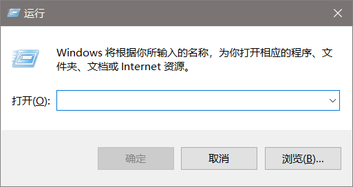
输入“cmd”，回车打开dos窗口
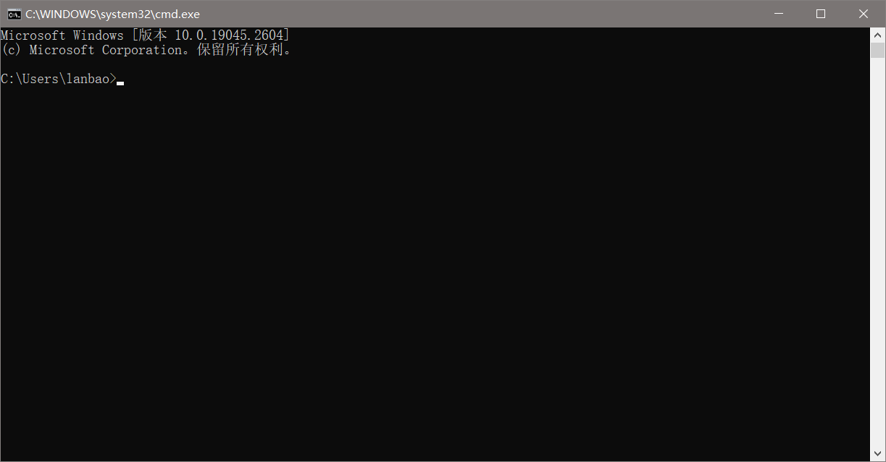
依次输入以下命令：
```
node -v
npm -v
git --version  #注意version前面有两个“-”符，不能遗漏
```
结果显示：
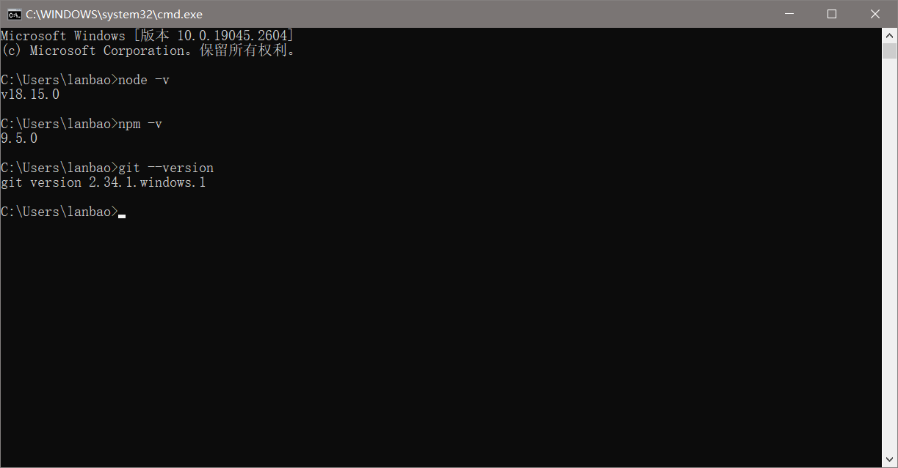
成功显示了版本号，即为成功。

### 4.安装Hexo
同样在dos窗口
输入命令：
`npm install hexo-cli -g`
若是下载速度很慢，一直停在第一步。则需要改变npm镜像，我使用的是淘宝镜像
在dos窗口输入命令：
`npm config set registry https://registry.npm.taobao.org`
然后再输入：
`npm install hexo-cli -g`
验证是否安装完成，输入命令：
`hexo -v`
成功结果如下：
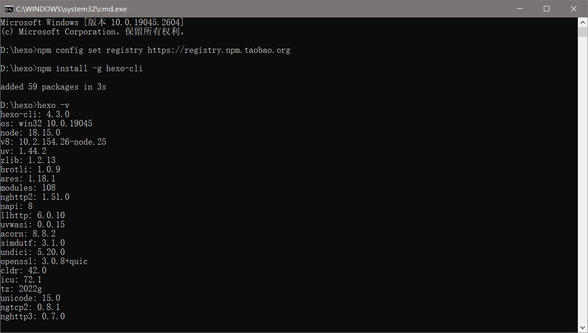

-----
## 二、创建仓库

### 1.点击New

首先有GitHub账号，进入GitHub官网登录 [GitHub](https://github.com/)
进入网址后，点击页面中的如下图标：
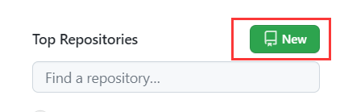

### 2.输入Repository name

在Repository name项输入：`你的GitHub账号名.github.io`
<font color="#dd0000">切记一定是你的GitHub账号名</font><br /> 

### 3.设置公开
公开仓库
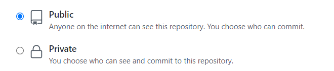

### 4.添加README file
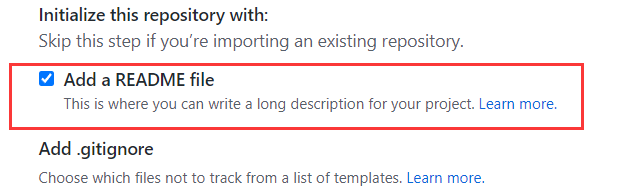
最后创建即可。

----

## 三、生成SSH Keys

### 1.右键点击Git Bash Here
打开任意一个文件夹，右键然后选择Git Bash Here
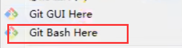

### 2.检测SSH安装
在窗口中输入命令：`ssh`
检测ssh是否安装（默认都是安装完成的）
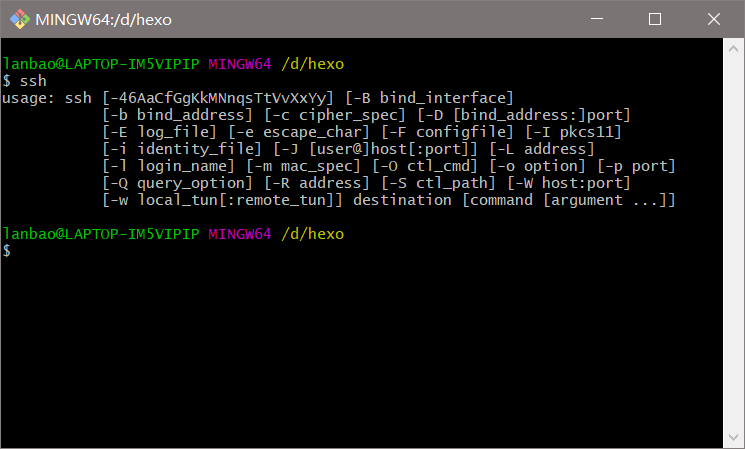
<font color="#dd0000">注意在该窗口不能使用Ctrl+v的快捷方式粘贴，应该用shift+ins快捷键，或者是右键选择Paste</font><br /> 

### 3.设置配置信息（非必须）
设置user.name和user.email配置信息(此步非必须)：
```
git config --global user.name "你的GitHub用户名"
git config --global user.email "你的GitHub注册邮箱"
```

### 4.生成密钥文件
生成ssh密钥文件：
```
ssh-keygen -t rsa -C "你的GitHub注册邮箱"
```
然后直接三个回车即可，默认不需要设置密码
然后找到生成的.ssh的文件夹中的id_rsa.pub密钥，将内容全部复制
路径基本上都会在 C:\Users\用户名\\.ssh

### 5.新建 SSH Key
打开[GitHub SSH and GPG keys ](https://github.com/settings/keys)页面，新建new SSH Key
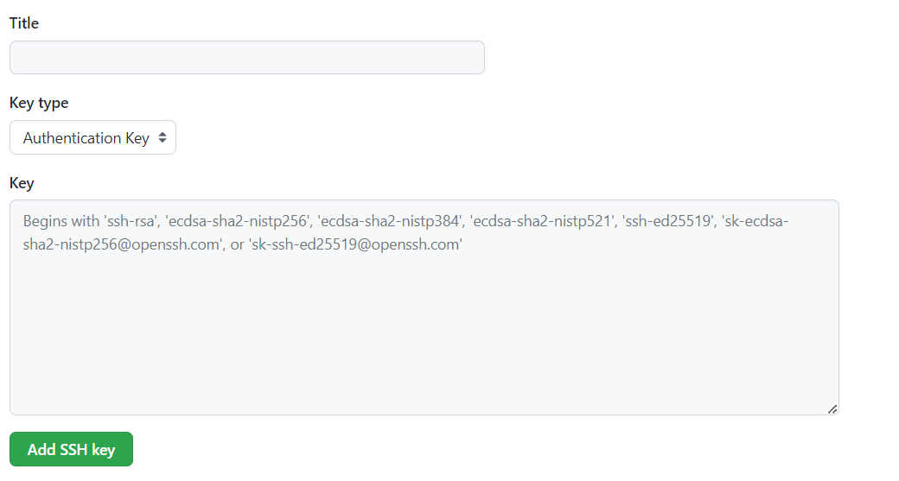
Title为标题，任意填即可，将刚刚复制的id_rsa.pub内容粘贴进去，最后点击Add SSH key。

### 6.检测
重新回到Git Bash中检测公钥是否安装成功，输入：`ssh git@github.com`
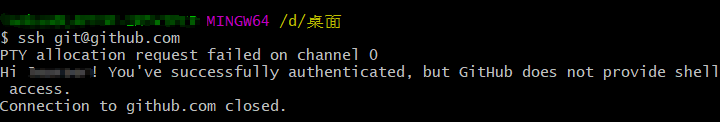
结果如上即为成功。

## 四、Hexo本地使用

### 1.初始化博客
建议创建一个新文件夹，然后在该文件夹下进入dos窗口。
具体方法如下图所示：
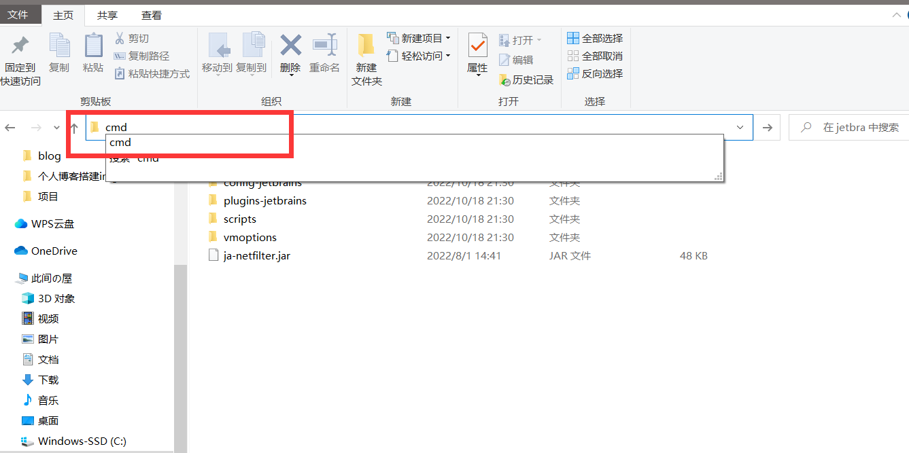
进入dos窗口后，输入：`hexo init blog`

### 2.检测功能
进入blog文件夹，用上述方法进入dos窗口
按顺序在dos中输入：
```
hexo new test  #新建文章,文章名为test
hexo g #生成
hexo s #部署
```

### 3.本地打开
根据上一步得到部署后的地址，端口一般默认为4000
在浏览器输入地址：localhost:4000
显示博客界面如下：
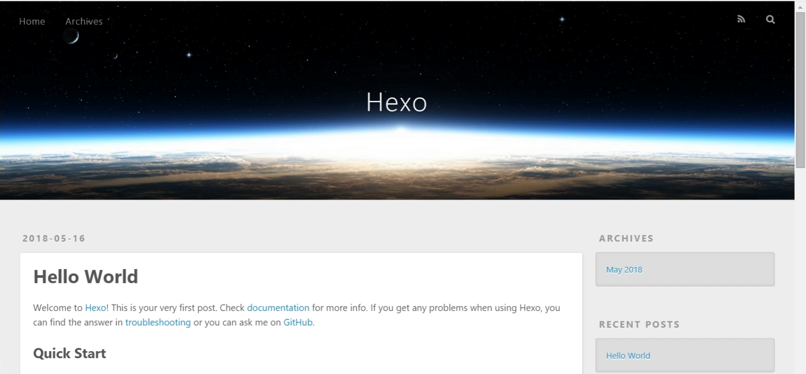
注：该img实例没有新建test文章，若是按照本文的顺序安装，会有标题为test的文章。

### 4.常用Hexo命令
```
npm install hexo -g #安装Hexo
npm update hexo -g #升级
hexo init #初始化博客
hexo n "我的博客" == hexo new "我的博客" "我的博客" #  新建文章名为"我的博客"
hexo g == hexo generate #生成网页
hexo s == hexo server #启动服务预览
hexo d == hexo deploy #部署
hexo server #Hexo会监视文件变动并自动更新，无须重启服务器
hexo server -s #静态模式
hexo server -p 5000 #更改端口5000
hexo server -i 192.168.1.1 #自定义 IP
hexo clean #清除缓存，若是网页正常情况下可以忽略这条命令
```

## 五、推送网址至GitHub

### 1.打开站点配置文件并修改
在blog根目录下，有_config.yml文件，为**站点**配置文件
如图所示：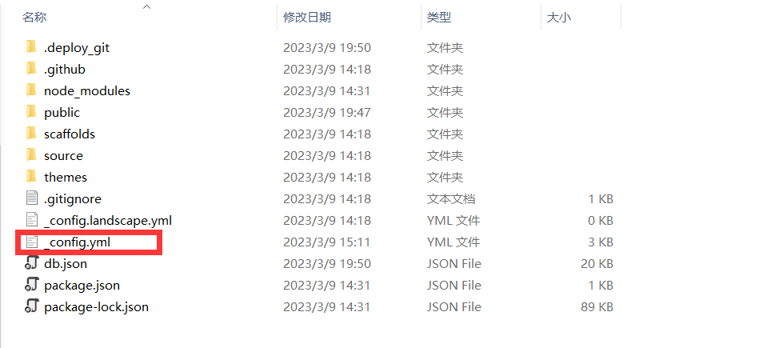
打开该文件，拉到最后将其修改为：
deploy:
type: git
repo: 这里填入你之前在GitHub上创建仓库的完整路径，记得加上 .git
branch: main

<font color="#dd0000">注意：此处可能与网上的其他教程不同，branch的值为main。这是由于在2020年10月1日起，GitHub默认主分支从master更名为main，以上的提交方式会默认创建一个master分支，为保持一致性，可将本地git init的时候默认分支修改为main。
在dos窗口，输入:</font><br />
```
git --version  #查看版本
git config --global init.defaultBranch main #git版本在2.28.0上，重新设置默认分支为main
```
参考如下：
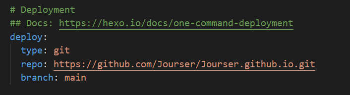

### 2.安装Git部署插件
需要让Hexo知晓我们将blog部署到GitHub仓库，在dos窗口输入：
```
npm install hexo-deployer-git --save
```

### 3.部署网站

在dos窗口继续依次输入以下命令：
```
hexo clean 
hexo g 
hexo d
```

### 4.打开测试
不出意外，网站推送成功，地址为: https://你的GitHub账号名.github.io 即为个人网站的仓库路径。用浏览器打开，即可得到和本地打开一样的个人博客。