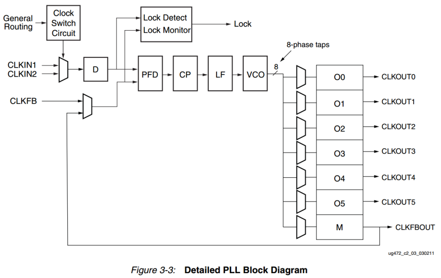
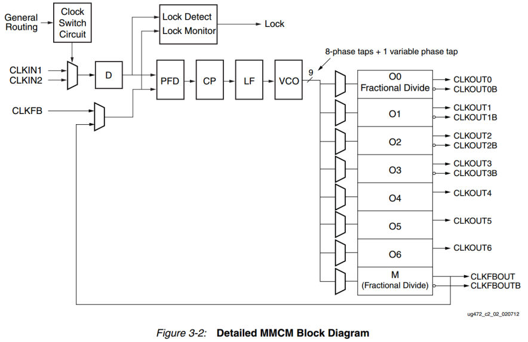

# IP核之 MMCM/PLL

## 前言

- Clock IP核（Clock IP Core）是FPGA设计中一种用于时钟管理和生成的预设计模块。Clock IP核通常由FPGA厂商提供，旨在简化时钟信号的处理和管理，满足设计对时钟信号的各种需求。
- Clock在时序逻辑的设计中是不可或缺的，同时对于Clock的编写和优化也能体现一个FPGA工程师的技术水平。熟练使用Clock IP核是学习FPGA的基础，需要熟练掌握。


## 何为Clock IP 核


### Clock IP核的功能

- Clock IP核可以实现以下功能：
    1. **时钟分频**：将输入时钟信号分频生成较低频率的时钟信号。
    2. **时钟倍频**：将输入时钟信号倍频生成较高频率的时钟信号。
    3. **相位偏移**：调整时钟信号的相位，使其满足特定的时序要求。
    4. **多输出时钟**：生成多个不同频率、不同相位的时钟信号。
    5. **时钟缓冲**：增强时钟信号的驱动能力，确保时钟信号在FPGA内部和外部传输过程中不失真。
    6. **时钟门控**：根据设计需求动态启用或禁用时钟信号，减少功耗。
    7. **时钟复位和启动控制**：提供对时钟信号的复位和启动控制，确保系统可靠启动和运行。

### 常见的Clock IP核

1. **PLL**（Phase-Locked Loop，锁相环）：
    - 用于生成稳定且低抖动的时钟信号。
    - 支持时钟倍频、分频、相位调整等功能。
2. **MMCM**（Mixed-Mode Clock Manager，混合模式时钟管理器）：
    - 提供更高级的时钟管理功能，支持更多的输出时钟信号。
    - 可用于实现复杂的时钟生成和管理需求。
3. **BUFG**（Global Clock Buffer，全局时钟缓冲）：
    - 提供高驱动能力的全局时钟缓冲，用于驱动FPGA内部的大量逻辑单元。
4. **DCM**（Digital Clock Manager，数字时钟管理器）：
    - 提供时钟分频、倍频和相位调整等基本功能。

### 相关概念的详情介绍

#### 1. CMT

- CMT(Clock Management Tile)：时钟管理器，包含了DCM/PLL/DCM等
- Xilinx 7 系列器件中具有时钟管理单元 CMT 时钟资源，xc7a35t 芯片内部有 5 个 CMT，xc7a100t 芯片内部有 6 个 CMT，xc7a200t 芯片内部有 10 个 CMT，为设备提供强大的系统时钟管理以及高速 I/O 通信的能力。时钟管理单元 CMT 的总体框图如下图所示。 

<div align="center">

</div>

- MMCM/PLL 的参考时钟输入可以是 IBUFG(CC)即具有时钟能力的 IO 输入、区域时钟 BUFR、全局时钟 BUFG、GT 收发器输出时钟、行时钟 BUFH 以及本地布线（不推荐使用本地布线来驱动时钟资源）。在最多的情况下，MMCM/PLL 的参考时钟输入都是来自 IBUFG(CC)即具有时钟能力的 IO 输入，本实验也是如此。MMCM/PLL 的输出可以驱动全局时钟 BUFG 和行时钟 BUFH 等等。BUFG 能够驱动整个器件内部的通用逻辑的所有时序单元的时钟端口。BUFG/BUFH/CMT 在一个时钟区域内的连接框图如下图所示。

<div align="center">

</div>

#### 2. 时钟缓冲器（Buffer）
- 从前文可知，时钟缓冲器（Buffer）是时钟管理单元 CMT 的一个重要组成部分。下面将介绍最常用的三种时钟缓冲器：IBUFG(CC)、BUFR 和 BUFG，并总结三者区别

- **IBUFG(CC) - 输入时钟缓冲器**
    - 功能：
        - IBUFG (Input BUFG) 是输入时钟缓冲器，用于将外部时钟信号引入FPGA内部。
    - 特点：
        - 将输入时钟信号引入FPGA的全局时钟网络。
        - 通常用于将来自板级的时钟信号（例如来自晶振或其他时钟源）直接传递给FPGA内部。
    - 应用：
        - 用于将外部时钟信号可靠地引入FPGA，以便在内部进一步处理或分配。
        - 提供稳定的时钟信号，避免外部噪声和信号失真。

- **BUFR - 区域时钟缓冲器**
    - 功能：
        - BUFR (Regional Clock Buffer) 是区域时钟缓冲器，用于在FPGA的特定区域内分配时钟信号。
    - 特点：
        - 仅限于在FPGA的一个区域（通常是一个时钟区域或时钟域）内分配时钟信号。
        - 支持时钟分频，可以根据需要对时钟信号进行分频。
    - 应用：
        - 用于需要在FPGA的特定区域内驱动时钟信号的应用场景。
        - 适用于局部时钟需求，例如一个逻辑模块或区域内的时钟分配。
- **BUFG - 全局时钟缓冲器**
    - 功能：
        - BUFG (Global Clock Buffer) 是全局时钟缓冲器，用于在整个FPGA芯片范围内分配时钟信号。
    - 特点：
        - 能够驱动FPGA内部的全局时钟网络，将时钟信号分配到整个FPGA芯片的所有逻辑单元。
        - 提供高驱动能力，确保时钟信号在全局范围内稳定传播。
    - 应用：
        - 用于需要在整个FPGA范围内分配时钟信号的应用场景。
        - 适用于驱动全局时钟、复位信号或其他需要全局分配的重要控制信号。

- **区别总结**

    - 作用范围：
        - IBUFG(CC)：用于将外部时钟信号引入FPGA。
        - BUFR：用于在FPGA的特定区域内分配时钟信号。
        - BUFG：用于在整个FPGA芯片范围内分配时钟信号。

    - 功能和用途：
        - IBUFG(CC)：引入并稳定外部时钟信号。
        - BUFR：局部区域时钟分配，支持时钟分频。
        - BUFG：全局时钟分配，高驱动能力。

    - 适用场景：
        - IBUFG(CC)：连接外部时钟源到FPGA内部。
        - BUFR：特定区域内的时钟需求，如分频或区域性时钟信号。
        - BUFG：全局时钟需求，如同步全局逻辑单元的时钟信号。

#### 3. MMCM和PLL
- 由上文介绍我们知道对于 Xilinx 7 系列的芯片一个 CMT 由一个 MMCM 和一个 PLL 组成。下面我们分别来看两者的关系。 

- **PLL(Phase Locked Loop)** ：
  - 为**锁相回路**或**锁相环**，用来统一整合时钟信号，使高频器件正常工作，如内存的存取资料等。PLL用于振荡器中的反馈技术。 许多电子设备要正常工作，通常需要外部的输入信号与内部的振荡信号同步。一般的晶振由于工艺与成本原因，做不到很高的频率，而在需要高频应用时，由相应的器件VCO，实现转成高频，但并不稳定，故利用锁相环路就可以实现稳定且高频的时钟信号。其具有时钟倍频、分频、相位偏移和可编程占空比的功能。
  - 
- **MMCM(Mixed Mode Clock Manager)**：
  - 混合模式时钟管理器， MMCM 功能是 PLL 的超集 ,在PLL的基础上加上了相位动态调整功能，因为PLL是模块电路，而动态调相是数字电路，所以叫Mixed Mode。MMCM是在Virtex-6中被引入的，而且Virtex-6中也只有MMCM。
  - 
- 由MMCM和PLL结构图我们可以直观看到MMCM和PLL的组成结构基本相同。
- MMCM（ Mixed-Mode Clock Manager）混合模式时钟管理器， MMCM 功能是 PLL 的超集，它是在 PLL的基础上加了相位动态调整功能， PLL 是模拟的，而动态调相是数字电路，所以称为混合模式。其相对于 PLL 的优势是相位可以动态调整，占用面积较大。 MMCM 主要用于驱动器件逻辑（ CLB、 DSP、 RAM 等）的时钟。 PLL 是和 IO 资源紧密绑定的，占用面积小，常用于为内存接口生成所需的时钟信号，但也具有与其他器件逻辑的连接，因此如果需要额外的功能，它们可以用作额外的时钟资源。


## IP 核配置实验步骤

### 一、创建工程
1. 打开 Vivado，新建一个工程。工程名为`ip_clk_wiz`。接下来添加 PLL IP 核。在 Vivado 软件的左侧`Flow Navigator`栏中单击`IP Catalog`
<div align="center">

</div>

### 二、搜索创建CLOCK IP
2. 打开`IP Catalog`窗口后，在搜索栏中输入`clock`关键字，可以看到 Vivado 已经自动查找出了与关键字匹配的 IP 核名称，如下图所示。双击`FPGA Features and Design`→`Clocking”下的“Clocking Wizard`
<div align="center">

</div>

### 三、配置 IP 核
3. 弹出 `Customize IP` 窗口，开始配置 IP 核
- 最上面的`Component Name`一栏设置该 IP 元件的名称，这里保持默认即可。在第一个`Clocking Options`选项卡中，`Primitive`选项用于选择是使用 MMCM 还是 PLL 来输出不同的时钟，对于我们的本次实验来说，MMCM 和 PLL 都可以完成，这里我们可以保持默认选择 MMCM。需要修改的是最下面的`Input Clock Information`一栏，把`Primary`时钟的输入频率修改为我们开发板的开发板上的晶振频率 50MHz，其他的设置保持默认即可，如下图所示。 
<div align="center">

</div>

- 接下来切换至`Output Clocks`选项卡，在`Output Clock`选项卡中，勾选前 4 个时钟，并且将其`Output Freq(MHz)`分别设置为 100、 100、 50、 25，注意，第 2 个 100MHz 时钟的相移`Phase(degrees)`一栏要设置为 180。其他设置保持默认即可，如下图所示：
<div align="center">

</div>

- `Port Renaming`选项卡主要是对一些控制信号的重命名。这里我们只用到了锁定指示 locked 信号，其名称保持默认即可，如下图所示。 
<div align="center">

</div>

- `MMCM Setting`选项卡展示了对整个 MMCM/PLL 的最终配置参数，这些参数都是根据之前用户输入的时钟需求由 Vivado 来自动配置，Vivado 已经对参数进行了最优的配置，在绝大多数情况下都不需要用户对它们进行更改，也不建议更改，所以这一步保持默认即可，如下图所示。 
<div align="center">

</div>

- 最后的`Summary`选项卡是对前面所有配置的一个总结，在这里我们直接点击`OK`按钮即可，如下图所示。 
<div align="center">

</div>

### 四、生成 IP 核
4. 配置完成后，弹出了`Generate Output Products`窗口，点击`Generate`按钮，开始生成 IP 核。
<div align="center">

</div>

### 五、等待综合
5. 在`Design Run`窗口的`Out-of-Context Module Runs`一栏中出现了该 IP 核对应的 run `clk_wiz_0_synth_1`，其综合过程独立于顶层设计的综合，所以在我们可以看到其正在综合，如下图所示。 
<div align="center">

</div>


### 六、拷贝例化模板代码
6. 综合完成后，便可开始编写代码。首先查看IP核的例化模板。在`Source` 窗口中的`IP Sources`选项卡中，依次用鼠标单击展开`IP`-`clk_wiz_0`-`Instantitation Template`，我们可以看到“clk_wiz.veo”文件，它是由 IP 核自动生成的只读的 verilog 例化模板文件，双击就可以打开它，在例化时钟 IP 核模块的时钟，可以直接从这里拷贝，如下图所示 :

<div align="center">

</div>

- 模板文件里有例化 IP 核的模板，如下所示：
```verilog
 clk_wiz_0 instance_name
   (
    // Clock out ports
    .clk_out1(clk_out1),     // output clk_out1
    .clk_out2(clk_out2),     // output clk_out2
    .clk_out3(clk_out3),     // output clk_out3
    .clk_out4(clk_out4),     // output clk_out4
    // Status and control signals
    .resetn(resetn), // input resetn
    .locked(locked),       // output locked
   // Clock in ports
    .clk_in1(clk_in1));      // input clk_in1
```


### 七、创建源文件
7. 创建一个 verilog 源文件，其名称为 ip_clk_wiz.v，代码如下： 
```verilog
module clk_wiz(
    input  sys_clk,
    input  sys_rst_n,

    output clk_out1,
    output clk_out2,
    output clk_out3,
    output clk_out4,
    output locked);

    clk_wiz_0 instance_name
   (
    // Clock out ports
    .clk_out1(clk_out1),     // output clk_out1
    .clk_out2(clk_out2),     // output clk_out2
    .clk_out3(clk_out3),     // output clk_out3
    .clk_out4(clk_out4),     // output clk_out4
    // Status and control signals
    .resetn(sys_rst_n), // input resetn
    .locked(locked),       // output locked
   // Clock in ports
    .clk_in1(sys_clk));      // input clk_in1

endmodule
```

- 它将 IP 核例化后，加上了输入输出，其原理图如下：
<div align="center">

</div>


### 八、创建仿真文件并模拟
8. 最后，仿真模拟。创建一个`tb_clk_wiz.v`的仿真文件，仿真代码编写如下：
```verilog
`timescale 1ns / 1ps

module tb_clk_wiz();
reg  sys_clk;
reg  sys_rst_n;

wire clk_out1;
wire clk_out2;
wire clk_out3;
wire clk_out4;
wire locked;

clk_wiz clk_wiz_inst(
   .sys_clk(sys_clk),
   .sys_rst_n(sys_rst_n),
   .clk_out1(clk_out1),
   .clk_out2(clk_out2),
   .clk_out3(clk_out3),
   .clk_out4(clk_out4),
   .locked(locked)
);

initial begin 
   sys_clk = 1'b0;
   sys_rst_n = 1'b0;
   #200
   sys_rst_n = 1'b1;

end

always #10 sys_clk = ~sys_clk;

endmodule
```

- 仿真波形如下：
<div align="center">

</div>

- 由上图可知，`locked` 信号拉高之后，锁相环开始输出 4 个稳定的时钟。`clk_100m` 和 `clk_100m_180deg` 周期都为 `10ns`，即时钟频率都为 100Mhz，但两个时钟相位偏移 180 度，所以这两个时钟刚好反相；`clk_50m` 周期为 20ns，时钟频率为 50Mhz；`clk_25m` 周期为 40ns，时钟频率为 25Mhz。也就是说，结果符合预期。