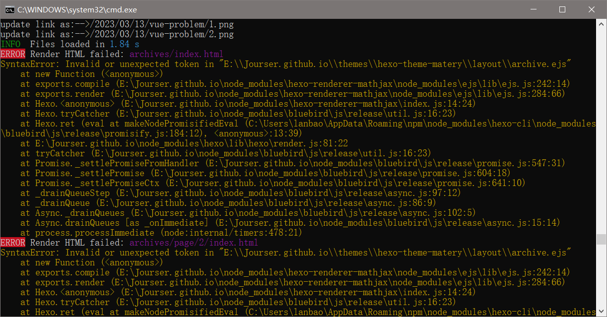
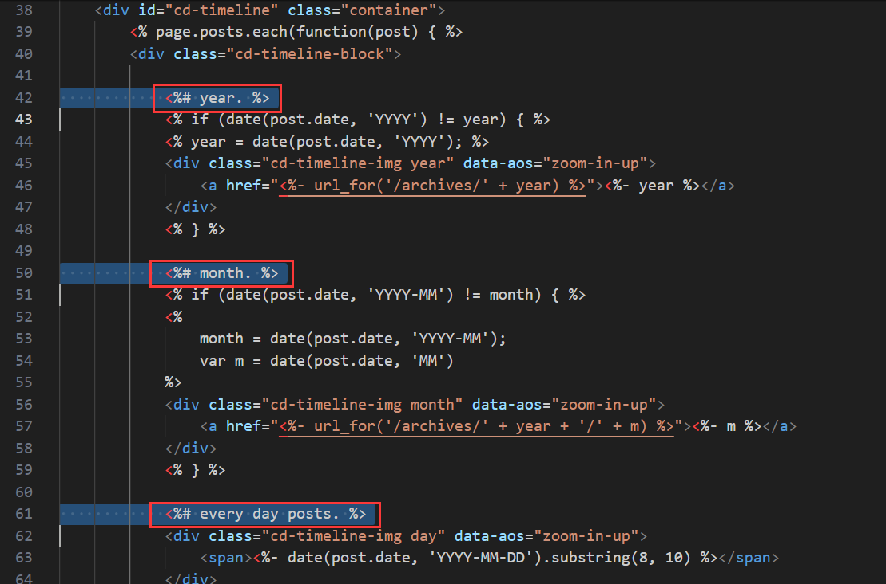

## 1.博客网页上图片不显示

- 用Markdown编辑器编.md文件，可以显示文件，但当上传后生成博客时，却无法显示。

### 解决方法：
#### 1.检测路径
- 首先检查在.md文件中的图片路径，尽量选择相对路径例如（./hexo-blog-create/img1.png）这样的格式。
#### 2.修改站点配置文件
- 打开blog根目录下的**站点**配置文件，找到**post_asset_folder**将其值改为**true**
如下图所示：

#### 3.安装插件
- 在blog目录下，用cmd打开dos窗口（或者用git bash），下载一个用于上传图片的插件。
输入命令：`npm install https://github.com/CodeFalling/hexo-asset-image`
<font color="#dd0000">注意：此处与网上的其他教程不同，网上教程普遍是使用命令`npm install hexo-asset-image --save`，该插件可以上传图片，但在hexo读取时，路径会出错，所以建议使用本文提供的路径，尤其是windows用户。</font><br /> 

#### 4.创建文章
- 此时用命令`hexo n "hello world"`创建title为hello world文章，会发现会在同级目录下产生一个与文章名相同的hello world文件夹。可以将图片放入其中。
<font color="#dd0000">建议创建英文标题的文章，这样生成的图片文件夹也是中文的。在上传图片的过程中，中文会被转为URL编码。若是坚持使用中文，则建议在.md文件中，将图片路径中的所有中文和特殊字符转为URL编码。过于复杂，所以还是建议全英文处理。</font><br /> 

#### 5.上传检验

- 最后再提交上传即可。

```
hexo g
hexo d
```

-----
## 2.博客文章无法显示数学公式
- 用Markdown编辑器编.md文件，文章内可以显示数学公式，但当上传后生成博客时，却无法正常显示。
### 解决方法：
- 方法根据具体情况而定，网上大部分教程大部分都是基于安装 hexo-math 插件实现的。
- 但是具体实施又有着各种大相径庭的操作。
- 比如：把渲染引擎从 hexo-renderer-marked 更换到 hexo-renderer-kramed；要求不使用 hexo-math，而是使用 hexo-renderer-mathjax；最后添加或是修改 `_config.yml` 中的配置，而所需的配置内容的格式层级却又相差甚远。
- 而且最重要的一点是没有提及具体的版本。
- 我的Hexo截止至2023年9月7日，是`6.3.0`版本，是比较新的版本。网上的教程那么比较老，那么就是与主题插件不符。
- 对的，有些Hexo主题可能需要额外的配置才能正确显示数学公式。因此主题选择同样很重要。
- 基本的主题，往往都是有mathjax设置的。
- 本人采用的主题是**hexo-theme-matery**。
- 在主题的`_config.yml`文件中，将mathjax开启，如

```
# MathJax Support
mathjax:
  enable: true
```

-----

## 3.文章基本信息修改

- 修改文章封面，修改文章轮播图，文章启用数学公式等基本功能。采用**hexo-theme-matery**主题，如何熟练使用。

### 完整实例

```
---
title: {{title}}
date: {{data}}
author: 作者名字
img: /medias/featureimages/xxx.jpg "文章特征图,路径在source中"
top: true "推荐文章"
cover: true "表示该文章是否需要加入到首页轮播封面中"
coverImg: /images/1.jpg "轮播图中的封面,访问的是"source"下的"images""
password: 8d969eef6ecad3c29
toc: false "是否开启 TOC，可以针对某篇文章单独关闭 TOC 的功能。前提是在主题的 config.yml 中激活了 toc 选项"
mathjax: false "是否开启数学公式支持,本文章是否开启 mathjax，且需要在主题的 _config.yml 文件中也需要开启才行"
summary: 这是你自定义的文章摘要内容，如果这个属性有值，文章卡片摘要就显示这段文字，否则程序会自动截取文章的部分内容作为摘要
categories: Markdown
tags:
  - Typora
  - Markdown
---
```

### 文章 Front-matter 选项详解

|  配置选项   | 默认值  |  描述  |
| :----:| :---- | :---- |
|title|Markdown 的文件标题|文章标题，强烈建议填写此选项|
|date|文件创建时的日期时间|发布时间，强烈建议填写此选项，且最好保证全局唯一|
| author|根 `_config.yml` 中的 author|文章作者 |
|img|featureImages 中的某个值|文章特征图，推荐使用图床(腾讯云、七牛云、又拍云等)来做图片的路径.如: `http://xxx.com/xxx.jpg`|
|top|true|推荐文章（文章是否置顶），如果 top 值为 true，则会作为首页推荐文章|
|cover|false|v1.0.2版本新增，表示该文章是否需要加入到首页轮播封面中|
|coverImg|无|v1.0.2版本新增，表示该文章在首页轮播封面需要显示的图片路径，如果没有，则默认使用文章的特色图片|
|password|无|文章阅读密码，如果要对文章设置阅读验证密码的话，就可以设置 password 的值，该值必须是用 SHA256 加密后的密码，防止被他人识破。前提是在主题的 config.yml 中激活了 verifyPassword 选项|
|toc|true|是否开启 TOC，可以针对某篇文章单独关闭 TOC 的功能。前提是在主题的 config.yml 中激活了 toc 选项|
|mathjax|false|是否开启数学公式支持 ，本文章是否开启 mathjax，且需要在主题的 _config.yml 文件中也需要开启才行|
|summary|无|文章摘要，自定义的文章摘要内容，如果这个属性有值，文章卡片摘要就显示这段文字，否则程序会自动截取文章的部分内容作为摘要|
|categories|无|文章分类，本主题的分类表示宏观上大的分类，只建议一篇文章一个分类|
|tags|无|文章标签，一篇文章可以多个标签|


## 4. hexo在多台电脑提交和更新

### 原理

- 通过`git`分支来实现hexo的同步。
- 如果通过前文的方式创建博客，那么会与网上的教程不同。本文在GitHub仓库中创建两个分支`master`和`main`，这两个分支共同组成了静态页面文件。
- 每当执行`hexo d`的时候，hexo都会帮我们把生成好的静态页面文件推到`master`和`main`分支上，这是和网上教程不同的地方。网上大部分教程，只有一个`master`分支。
- 不过，尽管如此，我们的解决办法依旧是相同的。就是创建一个新的分支，用来存放hexo的源文件。通过对hexo源文件的采用`git push`和`git pull`，实现多台电脑的同步。


### 操作步骤


#### 在原主机上操作
##### 1.创建分支
- 创建分支的方法很多，本文只是其中一种，适合git初学者
1. 在Github的username.github.io仓库上新建一个xxx分支
<div align="center">

</div>

<div align="center">

</div>

2. 将默认分支设为xxx，update保存。
  - 由于执行`hexo d` 对应的分支和默认分支是没有关系的，因为这是由配置文件决定的，配置文件写的哪个分支就是哪个分支。为了分别日后的提交和更新，需要将默认分支设为xxx。

<div align="center">

</div>

##### 2. 克隆新分支
1. Git Bash执行`git clone git@github.com:username/username.github.io.git`
2. 进入username.github.io文件夹，执行`git branch`命令查看当前所在分支，应为新建的分支xxx
<div align="center">

</div>

3. 该步骤可做可不做，但建议做，删除username.github.io文件夹内除了`.git`文件外的所有文件
4. 先将本地博客的部署文件（Hexo目录下的全部文件，除`node_modules`,`public`,`.deploy_git`等文件可不用）全部拷贝进username.github.io文件目录中去

<div align="center">

</div>

5.  Git Bash执行依次执行
```
git add .
git commit -m 'hexo' （引号内容可随意更改，只是类似注释的作用）
git push
```
- 下面是每个命令的具体作用：
  - `git add .`：这个命令将当前目录下的所有更改（包括新文件和修改过的文件）添加到Git的暂存区（staging area）。这是提交前的一个步骤，意味着你已经准备好将这些更改记录到版本历史中。
  - `git commit -m 'hexo'`：这个命令将暂存区的内容提交到本地的Git仓库中。-m 参数后面跟着的是提交信息，**必须要有**，这里是 'hexo'，但你可以将其更改为任何描述性的消息，以说明这次提交的内容或目的。提交信息是重要的，因为它帮助开发者理解每次提交的意图。
  - `git push`：这个命令将本地仓库的提交推送到远程仓库。如果你在一个团队中工作，并且你的代码需要与其他人共享，这一步是必要的。这会将你的本地更改上传到远程服务器，使得其他人可以拉取（pull）你的更改。

- 注意，将themes目录以内中的主题的.git目录删除（如果有），因为一个git仓库中不能包含另一个git仓库，提交主题文件夹会失败。
- 最后，可在仓库中看到提交的文件。

<div align="center">

</div>


#### 在新主机上操作

##### 1.将新电脑的生成的ssh key添加到GitHub账户上
- 这一操作可参考前文[《Hexo个人博客搭建》](https://jourser.github.io/2023/03/02/hexo-blog-create/)

##### 2.克隆分支
- 在新电脑上克隆username.github.io仓库的`source`分支(就是存放源码的分支)到本地，此时本地git仓库处于`hexo`分支,可以执行`git branch -v`查看

##### 3.准备工作
- 包括安装node.js，Git 和Hexo
- 该步骤同样参考前文[《Hexo个人博客搭建》](https://jourser.github.io/2023/03/02/hexo-blog-create/)
- 在执行Hexo命令前，记得先在该目录执行`npm install`命令安装依赖，会在该目录下生成`node_modules`文件夹
- 总结可直接执行以下指令：
```
npm config set registry https://registry.npmmirror.com 
npm install hexo-cli -g 
npm install
npm install hexo-deployer-git --save
```
- 各指令的含义：
  - `npm config set registry https://registry.npmmirror.com`：改变npm镜像为淘宝镜像，淘宝镜像随时可能更改，建议百度选择最新镜像
  - `npm install hexo-cli -g`：安装hexo
  - `npm install`：安装依赖
  - `npm install hexo-deployer-git --save`：安装Git部署插件

4. 至此，新电脑的hexo迁移已经完成了。以下是创建新博客同步的步骤。
    1. `git pull`合并更新，尤其是换新电脑更新的时候。若只在同一台电脑上操作，则不需要这一步。
    2. 创建新文章
    3. 将新文件上传至github仓库的`hexo`分支，也就是源文件分支
    4. 部署网站
```
git add .
git commit –m '日期'
git push
```
```
hexo clean 
hexo g 
hexo d
```


## 5. hexo g 出现 错误信息 SyntaxError: Invalid or unexpected token
- 该错误是我使用hexo在多台电脑提交和更新，也就是上一步发现的。

- 原因：该错误产生的原因可能是hexo的版本不一致，导致生成的静态文件不兼容与主题不兼容导致的。
- 这个错误信息 `SyntaxError: Invalid or unexpected token` 通常表示 JavaScript 解析器在尝试执行代码时遇到了一个它无法理解的符号或标记。在这种情况下，错误发生在处理 EJS 模板文件 `D:\Jourser.github.io\themes\hexo-theme-matery\layout\archive.ejs` 时。

### 解决方法：

- 该问题可采取直接删除`archive.ejs`文件的内的注释解决。
- 打开`archive.ejs`文件，删除以下内容：
