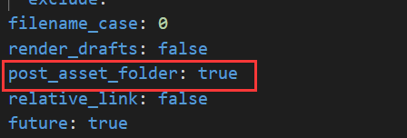

## 1.博客网页上图片不显示

用Markdown编辑器编.md文件，可以显示文件，但当上传后生成博客时，却无法显示。

### 解决方法：
#### 1.检测路径
首先检查在.md文件中的图片路径，尽量选择相对路径例如（./hexo-blog-create/img1.png）这样的格式。
#### 2.修改站点配置文件
打开blog根目录下的**站点**配置文件，找到**post_asset_folder**将其值改为**true**
如下图所示：

#### 3.安装插件
在blog目录下，用cmd打开dos窗口（或者用git bash），下载一个用于上传图片的插件。
输入命令：`npm install https://github.com/CodeFalling/hexo-asset-image`
<font color="#dd0000">注意：此处与网上的其他教程不同，网上教程普遍是使用命令`npm install hexo-asset-image --save`，该插件可以上传图片，但在hexo读取时，路径会出错，所以建议使用本文提供的路径，尤其是windows用户。</font><br /> 

#### 4.创建文章
此时用命令`hexo n "hello world"`创建title为hello world文章，会发现会在同级目录下产生一个与文章名相同的hello world文件夹。可以将图片放入其中。
<font color="#dd0000">建议创建英文标题的文章，这样生成的图片文件夹也是中文的。在上传图片的过程中，中文会被转为URL编码。若是坚持使用中文，则建议在.md文件中，将图片路径中的所有中文和特殊字符转为URL编码。过于复杂，所以还是建议全英文处理。</font><br /> 

#### 5.上传检验

最后再提交上传即可。

```
hexo g
hexo d
```

-----
## 2.博客文章无法显示数学公式
用Markdown编辑器编.md文件，文章内可以显示数学公式，但当上传后生成博客时，却无法正常显示。
### 解决方法：
方法根据具体情况而定，网上大部分教程大部分都是基于安装 hexo-math 插件实现的。

但是具体实施又有着各种大相径庭的操作。

比如：把渲染引擎从 hexo-renderer-marked 更换到 hexo-renderer-kramed；要求不使用 hexo-math，而是使用 hexo-renderer-mathjax；最后添加或是修改 `_config.yml` 中的配置，而所需的配置内容的格式层级却又相差甚远。
而且最重要的一点是没有提及具体的版本。

我的Hexo截止至2023年9月7日，是`6.3.0`版本，是比较新的版本。网上的教程那么比较老，那么就是与主题插件不符。

对的，有些Hexo主题可能需要额外的配置才能正确显示数学公式。因此主题选择同样很重要。

基本的主题，往往都是有mathjax设置的。

本人采用的主题是**hexo-theme-matery**。

在主题的`_config.yml`文件中，将mathjax开启，如

```
# MathJax Support
mathjax:
  enable: true
```

-----

## 3.文章基本信息修改

修改文章封面，修改文章轮播图，文章启用数学公式等基本功能。采用**hexo-theme-matery**主题，如何熟练使用。

### 完整实例

```
---
title: {{title}}
date: {{data}}
author: 作者名字
img: /medias/featureimages/xxx.jpg "文章特征图,路径在source中"
top: true "推荐文章"
cover: true "表示该文章是否需要加入到首页轮播封面中"
coverImg: /images/1.jpg "轮播图中的封面,访问的是"source"下的"images""
password: 8d969eef6ecad3c29
toc: false "是否开启 TOC，可以针对某篇文章单独关闭 TOC 的功能。前提是在主题的 config.yml 中激活了 toc 选项"
mathjax: false "是否开启数学公式支持,本文章是否开启 mathjax，且需要在主题的 _config.yml 文件中也需要开启才行"
summary: 这是你自定义的文章摘要内容，如果这个属性有值，文章卡片摘要就显示这段文字，否则程序会自动截取文章的部分内容作为摘要
categories: Markdown
tags:
  - Typora
  - Markdown
---
```

### 文章 Front-matter 选项详解

|  配置选项   | 默认值  |  描述  |
| :----:| :---- | :---- |
|title|Markdown 的文件标题|文章标题，强烈建议填写此选项|
|date|文件创建时的日期时间|发布时间，强烈建议填写此选项，且最好保证全局唯一|
| author|根 `_config.yml` 中的 author|文章作者 |
|img|featureImages 中的某个值|文章特征图，推荐使用图床(腾讯云、七牛云、又拍云等)来做图片的路径.如: `http://xxx.com/xxx.jpg`|
|top|true|推荐文章（文章是否置顶），如果 top 值为 true，则会作为首页推荐文章|
|cover|false|v1.0.2版本新增，表示该文章是否需要加入到首页轮播封面中|
|coverImg|无|v1.0.2版本新增，表示该文章在首页轮播封面需要显示的图片路径，如果没有，则默认使用文章的特色图片|
|password|无|文章阅读密码，如果要对文章设置阅读验证密码的话，就可以设置 password 的值，该值必须是用 SHA256 加密后的密码，防止被他人识破。前提是在主题的 config.yml 中激活了 verifyPassword 选项|
|toc|true|是否开启 TOC，可以针对某篇文章单独关闭 TOC 的功能。前提是在主题的 config.yml 中激活了 toc 选项|
|mathjax|false|是否开启数学公式支持 ，本文章是否开启 mathjax，且需要在主题的 _config.yml 文件中也需要开启才行|
|summary|无|文章摘要，自定义的文章摘要内容，如果这个属性有值，文章卡片摘要就显示这段文字，否则程序会自动截取文章的部分内容作为摘要|
|categories|无|文章分类，本主题的分类表示宏观上大的分类，只建议一篇文章一个分类|
|tags|无|文章标签，一篇文章可以多个标签|