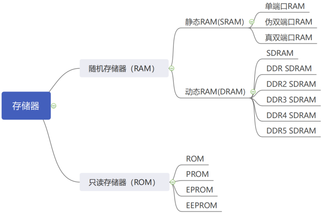

# IP核之 RAM 

## 前言

- 由下图可知，存储器包括随机存储器和只读存储器
- **随机存储器**包括**静态 RAM** 和**动态 RAM**。静态RAM 只要有供电，它保存的数据就不会丢失；而动态 RAM 在供电的情况下，还需要根据其要求的时间来对存储的数据进行刷新，才能保持存储的数据不会丢失。
- **只读存储器**一般包括 **PROM**、**EPROM** 和 **EEPROM** 等，是非易失性的存储器。目前使用率较高的是EEPROM，其特点是容量相对较小，存储的一般是器件的配置参数信息，例如 USB 2.0 芯片一般会配有一个 EEPROM 来存储相关的固件信息。 
- 想要了解更多关于存储器的内容，可访问本人博客另一文章《计算机组成原理》的存储系统板块  

 


## 何为 RAM

### 静态 RAM 和 动态 RAM
- **静态 RAM** 一般包括**单端口 RAM**（Single Port RAM，缩写为 SP RAM）、**简单双端口 RAM**（Simple Dual Port RAM，缩写为 SDP RAM，也叫伪双端口 RAM）和**真双端口 RAM**（True Dual Port RAM，缩写为 TDP RAM）。静态 RAM 的特点是存储容量相对不是很大，但是读写速度非常高，其在 FPGA 或者 ASIC 设计中都属于非常重要的器件，可以说查找表、寄存器、组合逻辑和静态 RAM 构成了整个数字电路体系，足见静态 RAM 的重要性。 
- **动态 RAM** 一般包括 **SDRAM** 和 **DDR SDRAM**。目前 DDR SDRAM 已经从 DDR1 代发展到 DDR5 代了，DDR3 和 DDR4 SDRAM 是目前非常主流的存储器，大量使用在电脑、嵌入式和 FPGA 板卡上面，其特点是存储容量非常大、但是读写速度相比于静态 RAM 会稍低一些，这一点在数据量较少的情况下尤为明显。 
- 本文主要讲解**静态 RAM**

### 静态 RAM 的常见种类及其特性与区别

| RAM类型  | 特性说明 | 数据读写口数量 | 地址口数量 |
| :----:| :---- | :----: | :----: |
| 单端口RAM  | 1. 允许通过一个端口对存储进行读写访问。<br> 2. 只有一组数据总线、地址总线、时钟信号以及读写使能信号。</br>  | 1 | 1 |
| 伪双端口RAM  | 1. 提供A和B两个端口，端口A只能进行写访问，端口B只能进行读访问。 <br>2. 有两组数据总线、地址总线、时钟信号以及读写使能信号。</br>  | 1 | 1 |
| 真双端口RAM  | 1. 提供A和B两个端口，两个端口均可对存储进行读写访问。 <br>2. 有两组数据总线、地址总线、时钟信号以及读写使能信号。</br>  | 2 | 2 |

- 从上表可以看出:
  - **单端口 RAM** ，其只有一个端口进行读写，即读/写只能通过这一个端口来进行。
  - **伪双端口 RAM** ，其也有两个端口可以用于读写，但是其中一个端口只能读不能写，另一个端口只能写不能读；
  - **真双端口 RAM** ，其有两个端口可以用于读写，且两个端口都可以进行读或写


### 静态 RAM 的使用场景

- 不同的特性决定不同的应用场景，在 RAM 的实际应用中，一般根据功能需求和带宽需求来选择合适的 RAM 类型，例如： 
  1. 当我们需要读取一个配置，且这个配置只在上电的时候配置一次，其他时候不需要写操作，那么我们直接选择单端口 RAM 即可，通过一个端口要么进行写操作，要么进行读操作。
  2. 当我们需要使用 FIFO（先进先出存储器）来存储数据，就可以选择伪双端口 RAM，一个写端口，一个读端口，且读写可以同时进行。 
  3. 当我们想要实现一个对 10000 节车厢的人数进行统计的功能，每节车厢有两个门，一个门仅用于上车，另一个门仅用于下车，有人上车时需要在原有的人数基础上加一，有人下车时需要在原有的人数基础上减一，每时每刻都可能有人上下车，那么要使用逻辑统计这么多节车厢的人数时，就需要有两个写端
口的 RAM，深度为 10000（对应 10000 节车厢），这时就要选择真双端口 RAM 了。因为如果单纯的使用寄存器资源进行统计的话，仅这 10000 节车厢的计数就很可能把 FPGA 的寄存器资源消耗殆尽了。 


## RAM 设计

### 单端口 RAM 配置

#### 单端口 RAM 基础知识

- BMG IP 核配置成单端口 RAM 的框图
<div align="center">

</div>

- 各个端口的功能描述如下：
<div align="center">

</div>

#### 单端口 RAM 设计思路
- 本次实验的目的是为了将 Xilinx BMG IP 核配置成一个单端口的 RAM 并对其进行读写操作。


##### 顶层模块设计
- **顶层模块设计**：由于单端口 RAM 的读写是共用一组信号总线的，所以这里我们将读写操作合成一个模块，可以将其命名为 `ram_rw`；系统时钟和系统复位是一个完整的工程中必不可少的输入端口信号，这里就不再多讲了；因为 RAM 主要用于存储程序中的数据，并不需要输出到 IO 引脚上，所以本实验不需要输出端口。
- 综上可得一个大致的模块框图：
<div align="center">

</div>


##### 读写模块设计
- **读写模块设计**：在 RAM 读写模块中，我们的输入信号主要有**系统时钟信号**、**系统复位信号**和 RAM IP 核输出的读数据`ram_rd_data`，输出有控制 RAM 所需的 **RAM 端口使能**`ram_en`、**读写使能**`ram_we`、**读写地址**`ram_addr`和 **写数据**`ram_wr_data`这四个信号。
- 综上可得一个大致的模块框图：
<div align="center">

</div>

- 模块端口与功能描述如下表所示：
<div align="center">

</div>


#### 单端口 RAM 配置实验步骤
##### 一、创建工程
1. 创建一个名为`ip_1port_ram`的空白工程，然后点击 Vivado 软件左侧`Flow Navigator`栏中的`IP Catalog`，如下图所示： 
<div align="center">

</div>

##### 二、搜索创建 BMG IP核
2. 在`IP Catalog`窗口的搜索栏中输入`Block Memory`关键字后，出现唯一匹配的`Block Memory Generator`，如下图所示（图中出现的两个 IP 核为同一个 BMG IP 核）： 
<div align="center">

</div>


##### 三、配置 IP 核
3. 双击`Block Memory Generator`后弹出 IP 核的配置界面，对 BMG IP 核进行配置。
- `Basic`选项卡配置界面如下图所示:
<div align="center">

</div>

- 该选项卡下各参数（重点关注（2）和（3）中的内容）含义如下： 
  1. 最上面的 `Component Name`一栏可以设置该 IP 元件的名称，这里我们保持默认命名，当然也可以命名为其它方便自己一眼看出其功能的名称。 
  2. `lnterface Type（接口模式）`：有两种接口模式可选，分别为 **Native（常规）接口**和 **AXI4 接口**。AXI4 模式一般是在处理器中的数据需要和 BRAM 交互时才会使用，当不需要与处理器数据进行交互时，我们一般采用 Native 模式，所以本次实验我们选择 Native 模式。 
  3. `Memory Type（存储类型）`：有五种类型可选，分别为`Single Port RAM（单端口RAM）`、`Simple Dual Port RAM（伪双端口 RAM）`、`True Dual Port RAM（真双端口 RAM）`、`Single Port ROM（单端口 ROM）`和`Dual Port ROM（双端口 ROM）`，因为本节的试验任务是学习单端口 RAM，所以我们选择 `Single Port RAM`。
  4. `ECC（全称 Error Correcting Code，即纠错码） Options`，纠错码选项只有在伪双端口 RAM 类型下才可以进行配置。 
  5. `Write Enable（写使能）`：可以选择是否使用字节写使能功能，启用后可设置字节大小为 8 位（无奇偶校验）或 9 位（包括奇偶校验），需要注意的是启用后内存的数据位宽必须设置为所选字节大小的整数倍。这里我们不启用字节写使能功能。
  6. `Algorithm Options（算法选项）`：算法选项主要用于决定 BRAM 的拼接的方式，一般在BRAM 深度、宽度较大的时候起作用，有三种算法可选，分别为`Minimum Area（最小面积算法）`、`Low Power（低功耗算法）`和`Fixed Primitives（固定单元算法）`。这里我们保持默认即可
  7. `Generate address interface with 32 bits`选项为是否生成位宽为 32 的地址接口，勾选后内存的数据位宽必须设置成 32 的整数倍，在实际应用中，我们一般不做勾选。
  8. `Common Clock`选项为是否启用同步时钟，在单端口模式下不需要考虑这个问题，所以该选项也无法进行设置。 


- `Port A Options`选项卡配置界面如下图所示:
<div align="center">

</div>

- 该选项卡下各参数（重点关注（1）（2）（3）（4）中的内容）含义如下： 
  1. `Write Width`：写数据位宽，单位 bit，本次实验我们设置成 8，可设置的位宽范围为 1~4608。
  2. `Read Width`：读数据位宽，其位宽设置必须与写数据位宽存在倍数关系（倍数比仅支持 1：1、1：2、1：4、1：8、2：1、4：1、8：1 和 16：1），通常情况下读/写数据位宽保持一致，所以这里设置成 8。
  3. `Write Depth`：写深度，这里设置成 32，即 RAM 所能访问的地址范围为 0~31。这里有一点需要大家注意，那就是写深度和写位宽的乘积不要超过器件本身的 ram 资源的大小，否则软件会报错。
  4. `Read Depth`：读深度，当写数据位宽、读数据位宽和写深度的值确定后，读深度的值就会自动确定。
  5. 
     - `Operating Mode`：RAM 运作模式。该选项决定了我们在进行写操作期间，DOUT（读数据线）上的数据变化，有三种模式可选，分别为： 
       1. `Write First（写优先模式）`：当我们在对某个地址进行写操作时，则会将写入的数据传递到读数据线上。在写优先模式下，当 ENA（使能信号）为高后，第一个时钟上升沿 WEA（读/写使能信号）为低电平，表示读数据，此时的地址为 aa，所以读出的就是 aa 内的数据；第二个时钟上升沿 WEA 为高电平，表示写数据，此时的地址为 bb，即先将数据（DAIN）“1111”写入地址 bb 后再读出，所以读出的数据也是“1111”；第三个时钟上升沿同理，将 DINA 数据写入存储器后再将更新后的数据送到 DOUTA 上进行输出；第四个时钟上升沿 WEA 为低电平，表示读数据，读取的就是地址 dd 内的数据。 

          <div align="center">
          
          </div>

       2. `Read First（读优先模式）`：当我们在对某个地址进行写操作时，则会将上次写入该地址的数据递到读数据线上。 在读优先模式下，当 ENA（使能信号）为高后，第一个时钟上升沿 WEA 为低电平，表示读数据，此时的地址为 aa，所以读出的就是 aa 内的数据；第二个时钟上升沿 WEA 为高电平，表示写数据，此时的地址为 bb，即先读出地址 bb 中的旧数据，然后再将数据（DAIN）“1111”写入地址 bb；第三个时钟上升沿同理，先将当前存储器中的旧数据送到 DOUTA 上进行输出，然后再将 DINA 数据写入当前存储地址；第四个时钟上升沿 WEA 为低电平，表示读数据，读取的就是地址 dd 内的数据。 

          <div align="center">
          
          </div>

       3. `No Change（不变模式）`：在该模式下，进行写操作时，读数据线上的数据保持不变。在不变模式下，当 ENA 和 WEA 同时为高时，只进行写操作，读数据保持不变，也就是说 DOUTA 保持前一拍数据，直到 WEA 为低。 
          
          <div align="center">
          
          </div>

       4. 总结一下就是在进行写操作时，读数据线（DOUT）上的数据在写优先模式和读优先模式下会随着地址的变化而输出相应的数据，在不变模式下则会保持最后一次读操作输出的数据。 
       5. 这里我们选择 No Change 模式。 
     - `Enable Port Type`：使能端口类型。有两种可选，分别为 `Use ENA pin`（添加使能端口 A 信号）和 `Always Enabled`（取消使能信号，端口 A 一直处于使能状态），这里选择默认的 Use ENA pin。 
  6. `Port A Optional Output Register`：用于为 RAM 的输出端添加寄存器。其作用是提高 BRAM 的运行频率和改善时序，当然为此付出的代价就是每勾选一个寄存器，输出就会延迟一拍。其中： 
     - `Primitives Output Register`，使用 BRAM 内部的寄存器打拍输出。 
     - `Core Output Register`，使用 SLICE 的寄存器打拍输出。 
     - `SoftECC Input Register`，当使用软 ECC 的时候，用 SLICE 的寄存器打拍。 
     - `REGCEA`，当使用 Primitives Output Register 或者 Core Output Register 时，可以用 REGCEA 来使能相应的输出。 
     - 本次实验中，建议生成 ip 的时候，取消 primitives output register 配置，这样我们在当前时钟周期发起读操作的话，在下一个时钟周期就可以读出有效数据了。 
  7. `Port A Output Reset Options`用于设置端口的复位信号，可以添加一个复位信号（RSTA Pin）、设置复位时 ram 输出总线上的数据值（Output Reset Value）、设置是否复位内置锁存器（Reset Memory Latch）和设置复位信号与时钟使能之间的优先级（Reset Priority），这里我们不需要添加，所以不做勾选。 
  8. `READ Address Change A`用于更改端口的读地址，这个功能只在 UltraScale 设备上使用，一般在某些低功耗场景中会应用到。 

- `Other Options`选项卡配置界面如下图所示:
<div align="center">

</div>

- 该选项卡下各参数含义如下： 
  1. `Pipeline Stages within Mux`，输出端 Mux 选择器的流水线级数。在大位宽、大深度的 BRAM 拼接场景中，我们会用 MUX 来选择输出地址所对应的数据，勾选该选项后可以使输出数据具有更好的时序。 
  2. `Memory Initialization（初始化文件）`，选择是否使用本地初始化文件（.coe 文件）来对存储空间进行初始化。 
  3. `Structural/UniSim Simulation Model Options`，用于选择结构仿真模型发生碰撞时生成的警告消息和输出的类型。 
  4. `Behavioral Simulation Model Options`，用于关闭仿真时的冲突告警和超出范围告警。 
- `Other Options`选项卡，用于设置 RAM 的初始值等信息

- `Summary`选项卡，该界面显示了我们配置的存储器的类型，消耗的 BRAM 资源等信息，我们直接点击`OK`按钮完成 BMG IP 核的配置，如下图所示： 
<div align="center">

</div>


##### 四、生成 IP 核
4. 配置完成后，弹出了`Generate Output Products`窗口，点击`Generate`按钮，开始生成 IP 核。
<div align="center">

</div>


##### 五、等待综合
5. 在`Design Run`窗口的`Out-of-Context Module Runs`一栏中看到该 IP 核对应的run `blk_mem_gen_0_synth_1`，其综合过程独立于顶层设计的综合，所以我们可以看到其正在综合，如下图所示： 
<div align="center">

</div>


##### 六、拷贝例化模板代码
6. 综合完成后，便可开始编写代码。首先查看IP核的例化模板。在`Source` 窗口中的`IP Sources`选项卡中，依次用鼠标单击展开`IP`-`blk_mem_gen_0`-`Instantitation Template`，我们可以看到`blk_mem_gen_0.veo`文件，它是由 IP 核自动生成的只读的 verilog 例化模板文件，双击就可以打开它，在例化时钟 IP 核模块的时钟，可以直接从这里拷贝，如下图所示 :
<div align="center">

</div>


##### 七、创建顶层模块
7. 本次实验除了调用 BMG IP 核外还需要例化一个读写模块（这里我们将其命名为 `ram_rw`），所以需要创建一个顶层模块来例化 IP 核与读写模块。创建源文件后，将顶层模块命名为 `ip_1port_ram`，代码如下：


```verilog
module ip_ram(
    input         sys_clk ,  //系统时钟
    input         sys_rst_n  //系统复位，低电平有效
    );
 
//wire define
    wire             ram_en      ;  //RAM使能    
    wire             ram_wea      ;  //ram读写使能信号,高电平写入,低电平读出 
    wire    [4:0]    ram_addr    ;  //ram读写地址 
    wire    [7:0]    ram_wr_data ;  //ram写数据  
    wire    [7:0]    ram_rd_data ;  //ram读数据   

//ram读写模块
ram_rw  u_ram_rw(
.clk        (sys_clk),  
.rst_n      (sys_rst_n),     
.ram_en     (ram_en     ), 
.ram_wea    (ram_wea     ), 
.ram_addr   (ram_addr   ),  
.ram_wr_data(ram_wr_data),  
.ram_rd_data(ram_rd_data) 
);

//ram ip 核
blk_mem_gen_0 your_instance_name (
     .clka(sys_clk),    // input wire clka
     .ena  ( ram_en     ),      // input wire ena
     .wea  ( ram_wea     ),      // input wire [0 : 0] wea
     .addra( ram_addr   ),  // input wire [4 : 0] addra
     .dina ( ram_wr_data),    // input wire [7 : 0] dina
     .douta( ram_rd_data)  // output wire [7 : 0] douta
   );        

endmodule
```
  


##### 八、创建读写模块
8. `ram_rw` 模块用于产生 RAM 读/写操作所需的信号，绘制大致的模块端口信号的波形图方便理解。

<div align="center">

</div>

- 当系统复位结束后，一直对 RAM 进行读写操作，所以 ram_en 在复位结束后一直处于使能状态。因为是读写 32 个数据，所以地址一直在 0~31 之间循环计数。接着我们用一个计数器（`rw_cnt`）循环计数 0~63，以此来对读写使能信号（`ram_we`）进行切换。当计数器值在 0~31 时进行写操作，写操作期间需要将 `ram_we` 置为高；当计数器值在 32~63 时进行读操作，读操作期间需要将 `ram_we` 置为低。 
- 在写操作期间，写数据（`ram_wr_data`）由 0 开始累加（步进为 1），直到累加值等于 31（即写入 32 个数据）时清零。而读数据只需要给出地址即可，需要注意的是读数据的输出会比地址晚一个时钟周期，当由读状态切换至写状态时，读数据会保持最后一次读出的数据。 
- 代码如下：

```verilog
module ram_rw(
    input               clk        ,  //时钟信号
    input               rst_n      ,  //复位信号，低电平有效
    
    output               ram_en     ,      //ram使能信号
    output               ram_wea    ,     //ram读写选择
    output  reg  [4:0]   ram_addr   ,    //ram读写地址
    output  reg  [7:0]   ram_wr_data,   //ram写数据
    input         [7:0]  ram_rd_data   //ram读数据      
    );
//reg define
    reg    [5:0]  rw_cnt ;                //读写控制计数器    
//rw_cnt计数范围在0~31,写入数据;32~63时,读出数据
assign ram_wea = (rw_cnt <= 6'd31 && ram_en == 1'b1) ? 1'b1 : 1'b0;
    
 //控制RAM使能信号
assign ram_en = rst_n; 
//读写控制计数器,计数器范围0~63
always @(posedge clk or negedge rst_n) begin
    if(rst_n == 1'b0)
        rw_cnt <= 6'b0;    
    else if(rw_cnt == 6'd63  && ram_en)
        rw_cnt <= 6'b0;
    else if(ram_en)
        rw_cnt <= rw_cnt + 1'b1; 
    else
        rw_cnt <= 6'b0;      
end 

//读写地址信号 范围：0~31
always @(posedge clk or negedge rst_n) begin
    if(rst_n == 1'b0)
        ram_addr <= 5'b0;
    else if(ram_addr == 5'd31 && ram_en)
        ram_addr <= 5'b0;
    else if (ram_en)   
        ram_addr <= ram_addr + 1'b1;
    else
        ram_addr <= 5'b0;         
end

//在WE拉高期间产生RAM写数据,变化范围是0~31
always @(posedge clk or negedge rst_n) begin
    if(rst_n == 1'b0)
        ram_wr_data <= 8'b0;  
    else if(ram_wr_data < 8'd31 && ram_wea)
        ram_wr_data <= ram_wr_data + 1'b1;
    else
        ram_wr_data <= 8'b0 ;   
end  
endmodule

```


- 模块中定义了一个读写控制计数器（`rw_cnt`），当计数范围在 0\~31 之间时，向 ram 的 0 \~ 31 地址写入数据（0 \~ 31）；当计数范围在 32 \~ 63 之间时，从 ram 的 0 \~ 31 地址中读出数据。

##### 九、引脚约束
9. 完成模块设计后，需要将模块的端口与 FPGA 的引脚进行约束。对应的 XDC 约束语句如下所示： 

```verilog
create_clock -period 20.000 -name sys_clk [get_ports sys_clk] 
set_property -dict {PACKAGE_PIN R4 IOSTANDARD LVCMOS33} [get_ports sys_clk] 
set_property -dict {PACKAGE_PIN U2 IOSTANDARD LVCMOS33} [get_ports sys_rst_n] 
```

##### 十、添加 ILA IP 核
10. 添加 ILA IP 核，用于观察 RAM 的读写状态。同时，由于本次实验中没有使用输出端口，所以`ram_rd_data (ram读数据 )`没有输出，若是没有ILA IP 核用作其输出，在生成比特流时，vivado软件会报错，认为该程序为无效程序，如下图所示：
<div align="center">

</div>

- 添加 ILA IP 核，将 `ram_en`（1 位）、`ram_wea`（1 位）、`ram_addr`（5 位）、`ram_wr_data`（8 位）和 `ram_rd_data`（8 位）信号添加至观察列表中，添加 ILA IP 核的方法这里就不再赘述了，按如下图所示创建：

<div align="center">

</div>

- 本例程是将 ILA 例化在了 `ram_rw` 模块中，例化代码如下所示：
```verilog
ila_0 your_instance_name (
	.clk(clk), // input wire clk


	.probe0(ram_en     ), // input wire [0:0]  probe0  
	.probe1(ram_wea    ), // input wire [0:0]  probe1 
	.probe2(ram_addr   ), // input wire [4:0]  probe2 
	.probe3(ram_wr_data), // input wire [7:0]  probe3 
	.probe4(ram_rd_data) // input wire [7:0]  probe4
);
```
- 如图所示：
<div align="center">

</div>

##### 十一、上板验证 
11. 综合、实现、下载比特流后，在 FPGA 上验证 RAM 的读写功能。
- RAM 写操作在 ILA 中观察到的波形如下图所示： 
<div align="center">

</div>

- 由上图可知，`ram_wea` 信号拉高之后，地址和数据都从 0 开始累加，也就说当 ram 地址为 0 时，写入的数据也是 0；当 ram 地址为 1 时，写入的数据也是 1。可以发现，写操作的验证结果正确。 

- RAM 读操作在 ILA 中观察到的波形如下图所示： 
<div align="center">

</div>

- 由上图可知，`ram_wea` 信号拉低之后，`ram_addr` 从 0 开始增加，即从 ram 的地址 0 开始读数据；`ram_rd_data` 在给出地址的下一个时钟周期后，开始输出数据，输出的数据为 0，1，2……30，31，和我们写入的值是相等的。可以发现，读操作的验证结果正确。

- 至此说明了 IP 核之单端口 RAM 实验验证成功。 


### 双端口 RAM 配置

#### 双端口 RAM 配置基础知识

- BMG IP 核配置成简单(伪)双端口 RAM 的框图：
<div align="center">

</div>

- 与单端口 RAM 对比：
  -  伪双端口 RAM 输入有两路时钟信号 CLKA/CLKB；
  -  独立的两组地址信号ADDRA/ADDRB；
  -  Port A 仅提供 DINA 写数据总线，作为数据的写入口；
  -  Port B 仅提供数据读的功能，读出的数据为 DOUTB。

- 各个新端口（这些信号很少使用，我们一般不用关注）的功能描述如下：
  - INJECTSBITERR：Inject Single-Bit Error 的简写，即注入单 bit 错误，仅适用于 Xilinx Zynq-7000 和 7系列芯片的 ECC 配置。 
  - INJECTDBITERR：Inject Double-Bit Error 的简写，即注入双 bit 错误，同样仅适用于 Xilinx Zynq-7000 和 7 系列芯片的 ECC 配置。 
  - SBITERR：Single-Bit Error 的简写，即单 bit 错误，标记内存中存在的单 bit 错误，该错误已在输出总线上自动更正。 
  - DBITERR：Double-Bit Error 的简写，即双 bit 错误，标记内存中存在双 bit 错误，需要注意的是内置的ECC 解码模块不能自动纠正双 bit 错误。 
  - RDADDRECC：Read Address for ECC Error output 的简写，即读地址 ECC 错误输出，同样仅适用于Xilinx Zynq-7000 和 7 系列芯片的 ECC 配置。

- BMG IP 核配置成真双端口 RAM 的框图：
<div align="center">

</div>

- 真双端口 RAM 提供了两个独立的读写端口（A 和 B），既可以同时读，也可以同时写，也可以一个读一个写。通过框图对比可以发现，真双端口 RAM 只是将单端口 RAM 的所有信号做了一个复制处理，不同端口的同一信号以 A 和 B 作为区分

- 三种静态 RAM 的端口对比表：

<div align="center">

</div>

- **注意**，伪双端口模式下我们需要避免**读写冲突**；在真双端口模式下我们需要避免**读写冲突**和**写写冲突**

- **读写冲突**：即同时刻读写同一地址所出现的冲突，例如理论上我们已经向某个地址写入了新的数据，我们也希望可以同时读到这个地址内新写入的数据，但实际上，这个新数据还没有写入 RAM 中，所以我们读出来的可能是 RAM 默认值，或者是 RAM 该地址中上一次的值，这便是读写冲突。

<div align="center">

</div>

- 由上图可知当发生读写冲突时，读优先的模式下读出的是读地址中存储的上一个数据；写优先模式时读出的是未知的数据“XX”。 

- **写写冲突**：表示两个端口写使能同时有效且写地址相同，此时需要关断一个写，把两个写端口都需要更新的值处理到一个写端口上。切记任何双端口 RAM 都不支持写写冲突。

<div align="center">

</div>

- 由上图可知当发生写写冲突时，发生冲突的地址写入的是未知的数据“XX”


#### 双端口 RAM 设计思路

##### 顶层模块设计
- **顶层模块设计**：本节设计的是伪双端口 RAM 并对其进行读写操作。因为伪双端口的数据线，地址线及其他信号线都是相互独立的，所以这里我们将读写分为两个子模块，分别命名为 `ram_rd`（读模块）和 `ram_wr`（写模块）。同样系统时钟和系统复位信号不再赘述。
- 综上可得一个大致的模块框图：

<div align="center">

</div>


##### 写模块设计
- **写模块设计**：在 RAM 写模块中，我们的输入信号主要有**系统时钟信号**和**系统复位信号**；输出有控制写 RAM 所需的 **写端口使能**`ram_wr_en`、**写使能**`ram_wr_we`、**写地址**`ram_wr_addr`和 **写数据**`ram_wr_data`这四个信号，以及控制读模块启动 **读启动**`rd_flag`信号。

- 经过上述分析可以得一个大致的模块框图，如下图所示： 

<div align="center">

</div>

- 模块端口与功能描述如下表所示：

<div align="center">

</div>

##### 读模块设计
- **读模块设计**：在 RAM 读模块中，我们的输入信号主要有系**统时钟信号**、**系统复位信号**、从 RAM 中**读出的数据**`ram_rd_data`以及我们自己定义的**读启动标志信号**`rd_flag`；输出有控制读 RAM 所需的 **读端口使能**`ram_rd_en`和 **读地址**`ram_rd_addr`这两个信号。

- 经过上述分析可以得一个大致的模块框图，如下图所示： 

<div align="center">

</div>

- 模块端口与功能描述如下表所示：

<div align="center">

</div>


#### 双端口 RAM 配置实验步骤

##### 一、创建工程
1. 创建一个名为`ip_2port_ram`的空白工程，然后点击 Vivado 软件左侧`Flow Navigator`栏中的`IP Catalog`，如下图所示： 
<div align="center">

</div>

##### 二、搜索创建 BMG IP核
2. 在`IP Catalog`窗口的搜索栏中输入`Block Memory`关键字后，出现唯一匹配的`Block Memory Generator`，如下图所示（图中出现的两个 IP 核为同一个 BMG IP 核）： 
<div align="center">

</div>


##### 三、配置 IP 核
3. 双击`Block Memory Generator`后弹出 IP 核的配置界面，对 BMG IP 核进行配置。

- `Basic`选项卡配置界面如下图所示:

<div align="center">

</div>

- 本节是创建一个同步的伪双端口 RAM，所以`Memory Type（存储类型）`我们选择`Simple Dual Port RAM（伪双端口 RAM）`，并勾选`Common Clock（同步时钟）`选项

- `Port A Options`选项卡配置界面如下图所示:

<div align="center">

</div>


- `Port B Options`选项卡配置界面如下图所示:

<div align="center">

</div>

- 接下来是`Other Options`选项卡，同上一章一样，该选项卡无需配置，保存默认即可。 
- 最后一个是`Summary`选项卡，该界面显示了我们配置的存储器的类型，消耗的 BRAM 资源等信息，我们直接点击`OK`按钮完成 BMG IP 核的配置

<div align="center">

</div>

##### 四、生成 IP 核
4. 配置完成后，弹出了`Generate Output Products`窗口，点击`Generate`按钮，开始生成 IP 核。
<div align="center">

</div>


##### 五、等待综合
5. 在`Design Run`窗口的`Out-of-Context Module Runs`一栏中看到该 IP 核对应的run `blk_mem_gen_0_synth_1`，其综合过程独立于顶层设计的综合，所以我们可以看到其正在综合，如下图所示： 
<div align="center">

</div>


##### 六、拷贝例化模板代码
6. 综合完成后，便可开始编写代码。首先查看IP核的例化模板。在`Source` 窗口中的`IP Sources`选项卡中，依次用鼠标单击展开`IP`-`blk_mem_gen_0`-`Instantitation Template`，我们可以看到`blk_mem_gen_0.veo`文件，它是由 IP 核自动生成的只读的 verilog 例化模板文件，双击就可以打开它，在例化时钟 IP 核模块的时钟，可以直接从这里拷贝，如下图所示 :
<div align="center">

</div>


##### 七、创建顶层模块
7. 本次实验除了调用 BMG IP 核外还需要例化两个子模块，分别命名为 `ram_rd`（读模块）和 `ram_wr`（写模块），所以需要创建一个顶层模块来例化 IP 核与读/写模块。创建源文件后，将顶层模块命名为 `ip_2port_ram`，代码如下：


```verilog
module ip_2port_ram(
    input       sys_clk    ,  //系统时钟
    input       sys_rst_n     //系统复位，低电平有效
    );
    
//wire define    
wire        ram_wr_we   ;//ram端口A写使能  
wire        ram_wr_en   ;//端口A使能
wire        rd_flag     ;//读启动标志
wire  [5:0] ram_wr_addr ;//ram写地址
wire  [7:0] ram_wr_data ;//ram写数据
wire  [7:0] ram_rd_data ;//ram读地址
wire  [5:0] ram_rd_addr ;//ram读数据
wire        ram_rd_en   ;//端口B使能


//简单双端口RAM
blk_mem_gen_0 your_instance_name (
  .clka (sys_clk),    // input wire clka
  .ena  (ram_wr_en),      // input wire ena
  .wea  (ram_wr_we),      // input wire [0 : 0] wea
  .addra(ram_wr_addr),  // input wire [5 : 0] addra
  .dina (ram_wr_data),    // input wire [7 : 0] dina
  .clkb (sys_clk),    // input wire clkb
  .enb  (ram_rd_en),      // input wire enb
  .addrb(ram_rd_addr ),  // input wire [5 : 0] addrb
  .doutb( ram_rd_data)  // output wire [7 : 0] doutb
);

//RAM写模块
ram_wr ram_wr_u(
        .clk          (sys_clk),
        .rst_n        (sys_rst_n),         
        .ram_wr_we    (ram_wr_we  ),
        .ram_wr_en    (ram_wr_en  ),
        .rd_flag      (rd_flag    ),
        .ram_wr_addr  (ram_wr_addr),
        .ram_wr_data  (ram_wr_data)
);
//RAM读模块 
ram_rd ram_rd_u(
    .clk           (sys_clk    ),
    .rst_n         (sys_rst_n  ),
    .rd_flag       (rd_flag    ),
    .ram_rd_en     (ram_rd_en  ),
    .ram_rd_addr   (ram_rd_addr),
    .ram_rd_data   (ram_rd_data)
    ); 

endmodule
```


##### 八、创建写模块
8. `ram_wr` 模块用于产生 RAM 写操作所需的信号，绘制大致的模块端口信号的波形图方便理解。

<div align="center">

</div>

- 因为需要一直向 RAM 中写入数据，所以当复位结束后，就将 `ram_wr_en`（写端口使能）和 `ram_wr_we`（ram 写使能）一直置为高。当写使能拉高后，写地址一直在 0 \~ 63 之间循环计数，并向对应的RAM 地址中写入数据，当写地址第一次计数到 31 时，将 `rd_flag` 信号拉高并保持，以启动读模块进行读操作。 

- 代码如下：
```verilog
module ram_wr(
    input            clk         , //时钟信号
    input            rst_n       , //复位信号，低电平有效
                                    
    //RAM写端口操作                
    output           ram_wr_we   , //ram写使能
    output           ram_wr_en   , //端口使能
    output reg       rd_flag     , //读启动信号
    output reg [5:0] ram_wr_addr , //ram写地址        
    output     [7:0] ram_wr_data   //ram写数据   
    );
//控制RAM使能信号
assign ram_wr_en = rst_n;   

//ram_wr_we为高电平表示写数据
assign ram_wr_we = ram_wr_en ;

//写数据与写地址相同，因位宽不等，所以高位补0
assign ram_wr_data = {2'b0,ram_wr_addr} ;

//写地址信号 范围:0~63        
always @(posedge clk or negedge rst_n) begin
    if(!rst_n)        
        ram_wr_addr <= 6'd0;
    else if(ram_wr_addr < 6'd63 && ram_wr_we)
        ram_wr_addr <= ram_wr_addr + 1'b1;
    else
        ram_wr_addr <= 6'd0;
end  

//当写入32个数据（0~31）后，拉高读启动信号
always @(posedge clk or negedge rst_n) begin
    if(!rst_n)
        rd_flag <= 1'b0;
    else if(ram_wr_addr == 6'd31)  
        rd_flag <= 1'b1;
    else
        rd_flag <= rd_flag;
end    

endmodule
```

##### 九、创建读模块
9. `ram_rd` 模块用于产生 RAM 读操作所需的信号，绘制大致的模块端口信号的波形图方便理解。

<div align="center">

</div>

- 因为需要一直从 RAM 中读出数据，所以当复位结束且读启动信号拉高后，就将 `ram_rd_en` （读端口使能）一直置为高。当读端口使能后，读地址就会一直在 0 \~ 63 之间循环计数，并读出对应 RAM 地址中的数据，需要注意的是读数据的输出会比读地址晚一个时钟周期。 

- 代码如下：
```verilog
module ram_rd(
    input            clk         , //时钟信号
    input            rst_n       , //复位信号，低电平有效
    
    //RAM读端口操作   
    input             rd_flag     , //读启动标志
    input       [7:0] ram_rd_data ,//ram读数据
    output reg [5:0]  ram_rd_addr ,//ram读地址     
    output            ram_rd_en   //端口使能
    );
 
//控制RAM使能信号
assign ram_rd_en = rd_flag;  

//读地址信号 范围:0~63        
always @(posedge clk or negedge rst_n) begin
    if(!rst_n)        
        ram_rd_addr <= 6'd0;
    else if(ram_rd_addr < 6'd63 && ram_rd_en)
        ram_rd_addr <= ram_rd_addr + 1'b1;
    else
        ram_rd_addr <= 6'd0;
end
   
endmodule
```


##### 十、引脚约束
10. 完成模块设计后，需要将模块的端口与 FPGA 的引脚进行约束。对应的 XDC 约束语句如下所示： 

```verilog
create_clock -period 20.000 -name sys_clk [get_ports sys_clk] 
set_property -dict {PACKAGE_PIN R4 IOSTANDARD LVCMOS33} [get_ports sys_clk] 
set_property -dict {PACKAGE_PIN U2 IOSTANDARD LVCMOS33} [get_ports sys_rst_n] 
```


##### 十一、添加 ILA IP 核
11.  添加两个 ILA IP 核，用于观察 RAM 的读/写状态

-  ILA IP 核，将 `ram_wr_en`（1 位）、`ram_wr_we`（1 位）、`ram_rd_en`（1 位）、`rd_flag`（1 位）、`ram_wr_addr`（6 位）、`ram_wr_data`（8 位）、`ram_rd_addr`（6 位）和 `ram_rd_data`（8 位）信号添加至观察列表中

- 本例程是将 ILA 例化在了 `ip_2port_ram` 模块中，例化代码如下所示：

```verilog
ila_0 ila_0_u (
	.clk(sys_clk), // input wire clk


	.probe0(ram_wr_we), // input wire [0:0]  probe0  
	.probe1(ram_wr_en), // input wire [0:0]  probe1 
	.probe2(rd_flag  ), // input wire [0:0]  probe2 
	.probe3(ram_rd_en), // input wire [0:0]  probe3 
	.probe4(ram_wr_addr), // input wire [5:0]  probe4 
	.probe5(ram_wr_data), // input wire [7:0]  probe5 
	.probe6(ram_rd_addr ), // input wire [5:0]  probe6 
	.probe7( ram_rd_data) // input wire [7:0]  probe7
);
```


##### 十二、上板验证
12. 综合、实现、下载比特流后，在 FPGA 上验证 简单双端RAM 的读写功能。
- 双端口 ram 的读写在 ILA 中观察到的波形如下图所示： 

<div align="center">


</div>


- 由上图可知，读写端口和读端口能够同时对 ram 进行相应的操作，且没有发生读写冲突现象，至此说明了 IP 核之双端口 RAM 实验验证成功。