# simulator的使用

## Vivado Simulato介绍

Simulato是Vivado的仿真模拟器，用于硬件调试和判断代码正确性。
Vivado 设计套件内部集成了仿真器Vivado Simulator，能够在设计流程的不同阶段运行设计的功能仿真和时序仿真，结果可以在Vivado IDE 集成的波形查看器中显示。Vivado 还支持与诸如ModelSim、Verilog Compiler Simulator (VCS)、Questa Advanced Simulator 等第三方仿真器的联合仿真。

### Vivado Simulator 仿真的意义

1. 验证设计正确性：
   - 在实际硬件实现之前，确保你的 HDL 代码按照预期工作，验证功能正确性。

2. 发现和修复错误：
   - 在仿真过程中可以发现设计中的逻辑错误和潜在问题，避免在硬件实现后才发现这些问题，从而减少调试时间和成本。

3. 性能分析：
   - 通过仿真可以进行时序分析和性能评估，确保设计满足时序要求。

4. 快速迭代：
   - 通过仿真工具，可以快速测试设计的不同修改和优化方案，而无需每次都进行硬件综合和实现，节省时间。

5. <font color="#dd0000">硬件调试与仿真的区别</font>：
   - 硬件调试需要连接开发板，还会消耗片上资源，所以很难观察一段时间内的变化，仿真则没有这些问题，但是需要编写输入激励文件(testbench文件)。

### FPGA 开发流程中的仿真步骤

- FPGA 开发流程中的主要步骤包括编写 HDL 代码、仿真、综合、实现、调试和最终部署。在这个流程中，仿真通常在以下阶段进行：

1. 设计编写和单元测试：
   - 在编写和完成 HDL 代码后，进行模块级别（单元测试）的仿真。这是仿真的初始阶段，用于验证单个模块的功能和行为。

2. 集成和系统测试：
   - 当多个模块集成到一起形成系统设计后，进行系统级别的仿真。这一步用于验证整个系统的功能和交互行为。

3. 综合前仿真：
   - 在进行综合（Synthesis）之前，仿真设计的 RTL（Register Transfer Level）代码，确保设计逻辑正确。

4. 综合后仿真：
   - 综合后仿真是对综合生成的网表文件进行仿真，验证综合过程中是否引入了问题，并确保综合后的设计仍然符合预期。

5. 实现后仿真：
   - 在实现（Implementation）之后，可以进行时序仿真，验证实际布线后设计的时序和功能。

- 上述五大仿真又可以分为两大类：**RTL(功能)仿真**和**时序仿真**
- FPGA设计流程如下图所示：
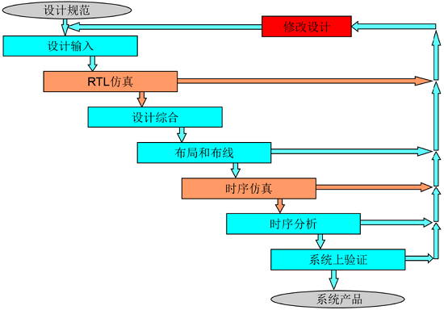
- **RTL仿真**：也叫功能仿真或行为仿真，它跟硬件没有关系，只是检查设计的输入有没有逻辑错误或是代码有没有错误。主旨在于验证电路的功能是否符合设计要求，其特点是不考虑电路门延迟与线延迟(硬件延迟)，主要是验证电路与理想情况是否一致。
- **时序仿真**：也称为布局布线后仿真，是指电路已经映射到特定的工艺环境以后，综合考虑电路的路径延迟与门延迟的影响，验证电路能否在一定时序条件下满足设计构想的过程，能较好地反映芯片的实际工作情况。时序仿真会考虑走线的延迟，真实情况下<u>一般进行RTL仿真，时序仿真很少使用</u>。时序满足与否一般在时序分析中进行。
- **功能仿真**与**时序仿真**的**主要区别**在于<u>是否考虑硬件延迟</u>。
- 本文主要讲述功能仿真

## 功能仿真 - TB文件创建

### 文件创建

- 仿真文件创建步骤同前文《Vivado的使用》中源文件创建步骤几近相同

1. 添加或创建一个仿真文件(`testbench`文件)
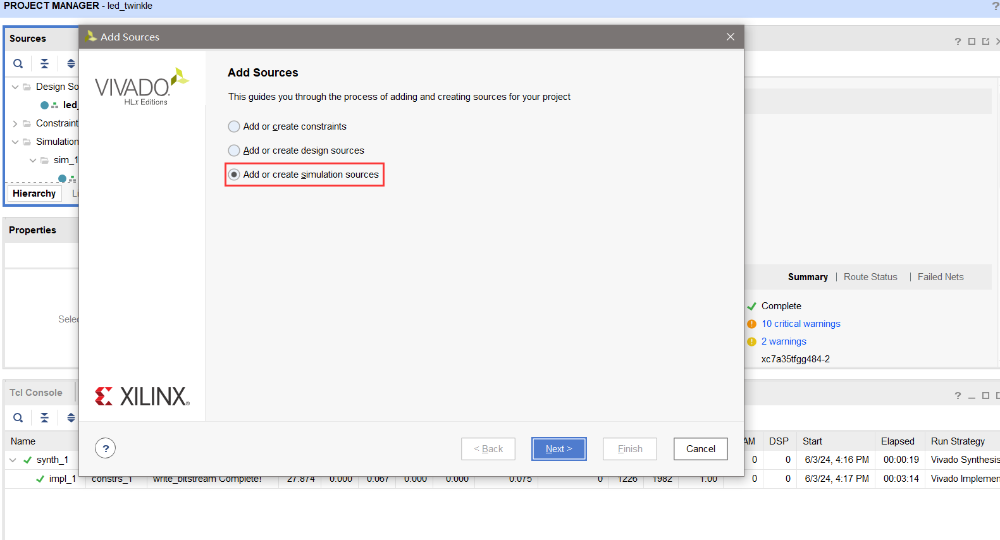

2. 选择创建仿真文件，当然也可同源文件步骤一样，现在直接添加仿真文件
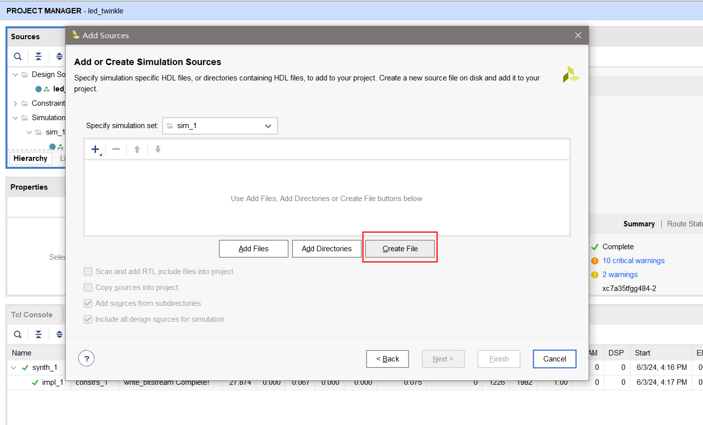

3. 输入仿真文件名`tb_led_twinkle`。一般命名为`tb_`+`模块名`。点击`OK`后，会自动生成`tb_led_twinkle.v`文件。最后点击`Finish`。
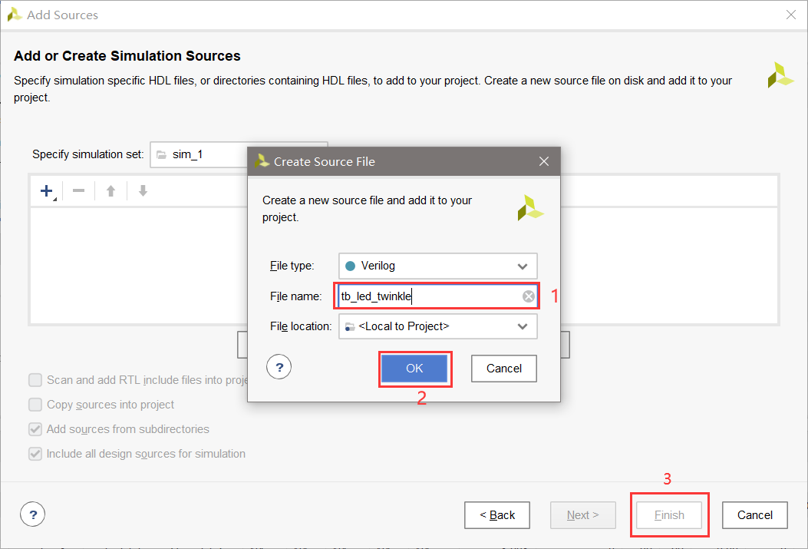

4. 完成仿真文件创建。在弹出的自动定义模块窗口中我们直接点击`OK` 即可。而后弹出的下图窗口提醒用户在定义模块和指定 I/O 端口时，没有进行任何更改并确认是否要继续使用当前值。
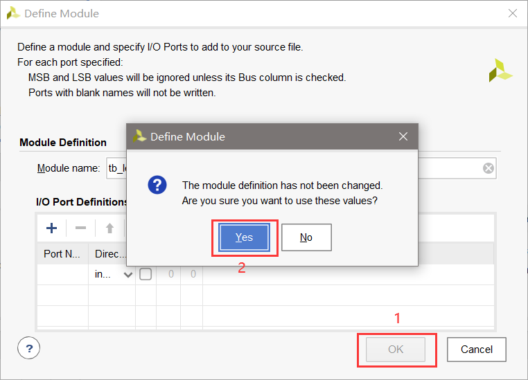

5. 此时，在工程目录下会生成`tb_led_twinkle.v`文件。点击该文件打开
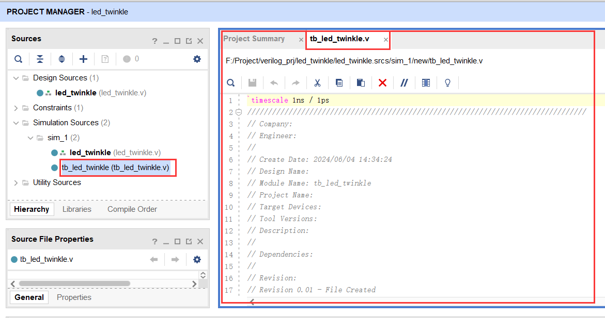


### TB文件简介

- TB文件(testbench文件)结构：
```verilog
`timescale  仿真单位/仿真精度
module test_bench(); //通常testbench没有输入与输出端口
//信号或变量定义声明，定义为wire或reg类型
//使用initial或always语句产生激励波形
//例化设计模块
endmodule
```

- 若仿真单位/仿真精度分别为：1ns/1ps，则：
```verilog
#200 //取决于仿真单位，这里就是延迟200ns
#200.123 //表示延迟200.123ns，因为其精度为ps，若精度改为1ns，这里就是延迟200ns
```

- 本次实验，`tb_led_twinkle.v`的内容如下：
```verilog
`timescale 1ns / 1ps

module tb_led_twinkle();
reg sys_clk;
reg sys_rst_n; 
wire [1:0] led; 
//初始化
initial begin
	sys_clk = 1'b0;
	sys_rst_n = 1'b0;
	#200 //延迟200ns
	sys_rst_n = 1'b1; //延迟200ns后拉高复位信号
end 
//时钟生成
always #10 sys_clk = ~sys_clk; 
//时钟频率为50MHZ，周期为20ns，因此每延迟10ns，时钟翻转一次
//例化模块，一般格式为：模块名_例化名，例化名一般为u_模块名
led_twinkle u_led_twinkle(    
	.sys_clk (sys_clk),        //系统时钟，命名自定义，可相同
	.sys_rst_n (sys_rst_n),    //系统复位，低电平有效
	.led (led)                 //LED灯
	);
endmodule

```


## 仿真具体步骤

### 仿真界面窗口介绍
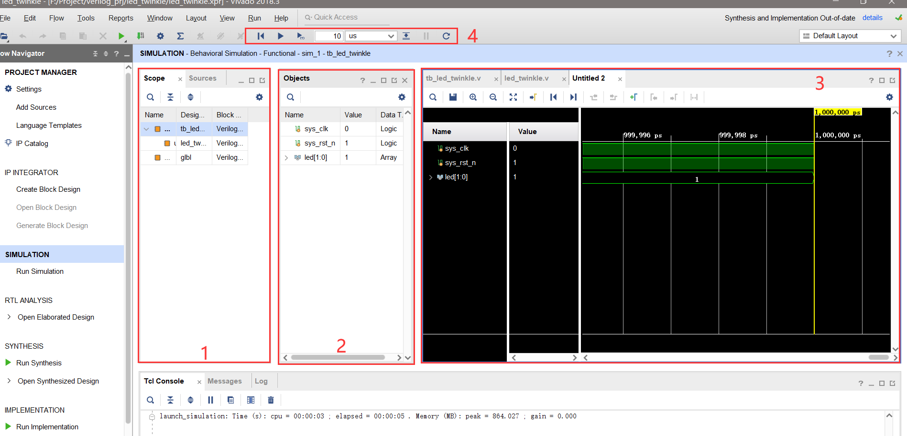
- 窗口1：**Scope 窗口**
  - `Scope`（范围）是HDL 设计的层次划分。在`Scope`窗口中，您可以看到设计层次结构。
  - 当您选择了一个Scope 层次结构中的作用域时，该作用域内的**所有HDL 对象**，包括reg、wire 等都会出现在`Objects`窗口中。
  - <u>比如原本的在`Objects`窗口中，是没有`cnt`计数器对象的，而我们在`Scope` 窗口中选择`u_led_twinkle`，在`Objects`窗口中就会自动显示出`led_twinkle`模块中所有的对象。</u>如下图所示：
  - 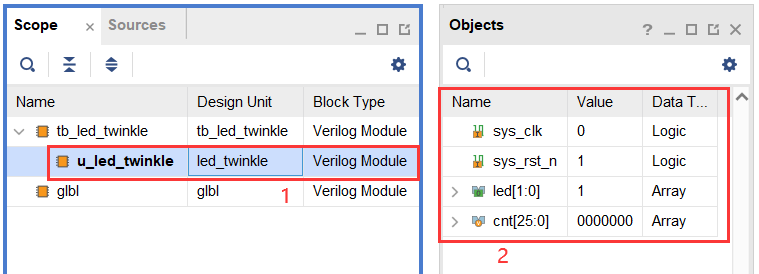
  
  
- 窗口2：**Object窗口**
  - `Objects`窗口会显示在`Scopes`窗口中选择的范围内的所有HDL 仿真对象。
  - 若我们选择`tb_led_twinkle`，则`Objects`窗口中会显示`tb_led_twinkle`模块中的所有对象，如下图所示：
  - 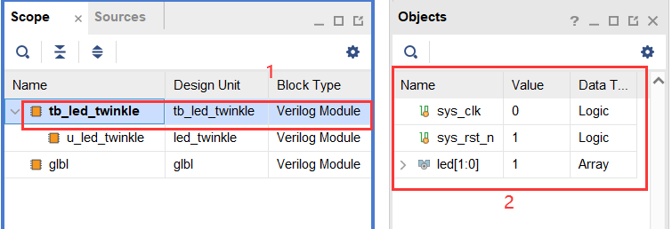
  - 可以在`Objects`窗口中选择HDL 对象，并将它们添加到波形窗口中。
  - 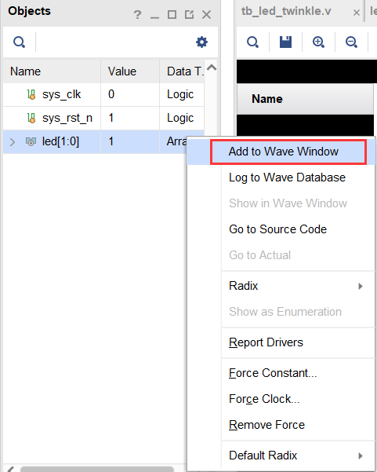

- 窗口3：**波形窗口**
  - 用于显示所要观察信号的波形。
  - 若要添加信号，可通过`Objects`窗口选择信号，然后将其添加到波形窗口中。
  - 基本功能与ILA调试窗口中类似，不再赘述。比起ILA调试窗口，波形窗口中多了如下功能：
  - 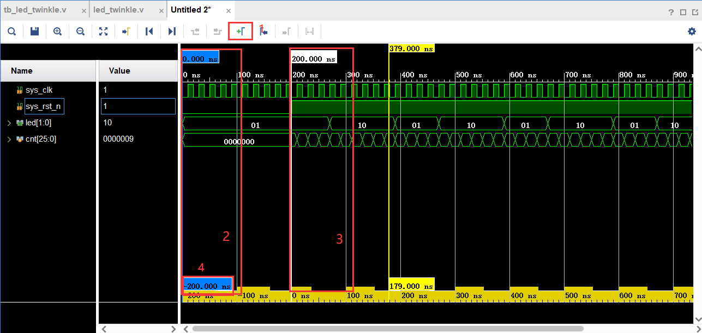
  - 如上图所示，可通过**按键1**添加蓝色的**时间标识2、3**。而最后会显示如**位置4**所示的两个时间标识的时间间隔，如图所示的20ns。

- 界面4：仿真工具栏。
  - 仿真工具栏包含运行各个仿真动作的命令按钮，从左至右依次是：
  - 
    - `Restart`：将仿真时间重置为零，此时波形窗口中原有的波形都会被清除。下次执行仿真时，会从0时刻重新开始。
    - `Run all`：运行仿真，直到其完成所有事件或遇到HDL语句中的`stop`或`finish`命令为止。注意，如果没有在TestBench语句中加入`stop`或`finish`命令，当点击`Run all`命令时，仿真器会无休止地一直仿真下去，除非用户点击仿真工具栏中的`Break`按钮来手动地结束仿真。但是，如果此时需要仿真的设计比较复杂，则仿真器在运行仿真时会耗费电脑大量的CPU和内存资源，此时有可能会造成电脑卡顿甚至死机的情况。所以，如果设计比较复杂，且没有在TestBench 语句中加入stop或finish命令，<font color="#dd0000">最好不要轻易点击Run all命令</font>。
    - `Run For`：运行特定的一段时间。紧随在后面的两个文本框用于设定仿真时长的数值大小和时间单位。
    - `Step`：按步运行仿真，每一步仿真一个HDL 语句。
    - `Break`：暂停当前仿真。
    - `Relaunch`：重新编译仿真源并重新启动仿真。在使用Vivado 仿真器来调试HDL 设计时，您可能会根据仿真结果来对您的HDL 源代码进行修改。在修改完HDL 源代码后，可以点击Relaunch 按钮来重新加载UUT 设计和TestBench，以重新对修改后的HDL 源代码进行仿真。此时就不需要再关闭并重新打开仿真器了

### 仿真前的实验准备
- 在仿真时遇到类似于`cnt`计数器这类变量，以本次`led_twinkle`为例，需要将`cnt`变量数值可达50000000，若在仿真中达到该值需要过长的时间，不利于观察，所以需要将其量级降低。如图所示：
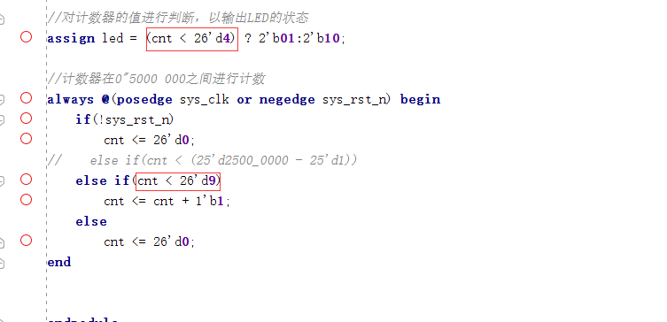
- 同时图中预留一个错误，使得`led`信号为`10`和`01`时间不相同。


### 仿真步骤
1. 在`Flow Navigator`窗口中点击`Run Simulation`并选择`Run Behavioral Simulation`
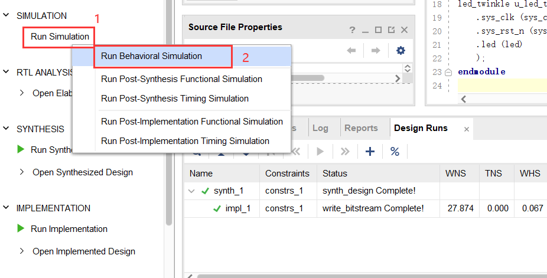
   - 其余几个选项：
     - **Run Behavior Simulation** <font color="#dd0000">功能仿真(主要使用的)</font>
     - Run Post-Systhesis Functional Simulation 综合后的功能仿真
     - Run Post-Systhesis Timing Simulation 综合后的时序仿真
     - Run Post-Implementation Functional Simulation 实现后/布局布线后的功能仿真
     - Run Post-Implementation Timing Simulation 实现后/布局布线后的时序仿真

2. 而后我们进入仿真窗口，具体窗口作用功能在前文《仿真界面窗口介绍》这一栏中提到，这里不在赘述。在`Scope` 窗口中选择`u_led_twinkle`，而后在`Objects`窗口中选择`sys_clk`、`sys_rst_n`、`led`和`cnt`信号，而后在波形窗口中添加这4个对象。
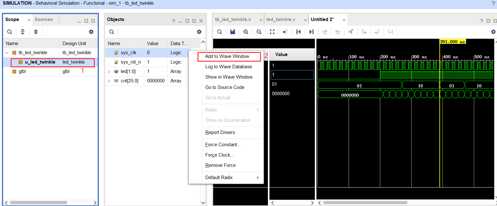

3. 开始分析仿真波形，选择`led`信号为`10`的波形进行测量，添加蓝色时间标识，如下图所示：
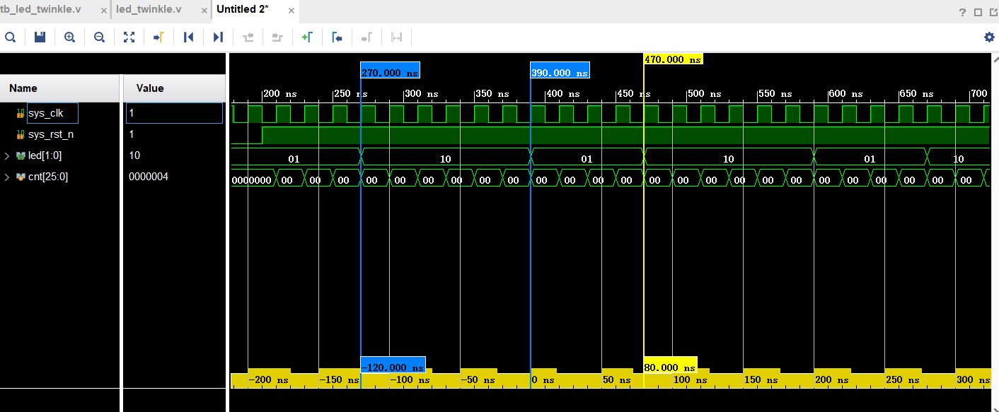
   - 发现`led`信号为`10`的波形在仿真时，持续120ns，为6个时钟周期。
   - 同理，对`led`信号为`10`的波形进行测量，发现其持续80ns，为4个时钟周期。
   - 发现其时间不相同，查看代码中可发现`assign led = (cnt < 26'd4) ? 2'b01:2'b10;`该语句错误，应该改为`assign led = (cnt < 26'd5) ? 2'b01:2'b10;`
   - 在`led_twinkle.v`文件中修改后，重新编译仿真源文件，点击`Relaunch`按钮，重新加载UUT，如图所示修改成功
   - 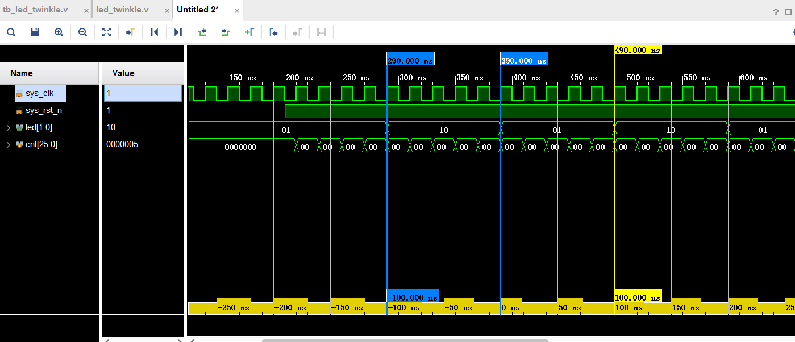


