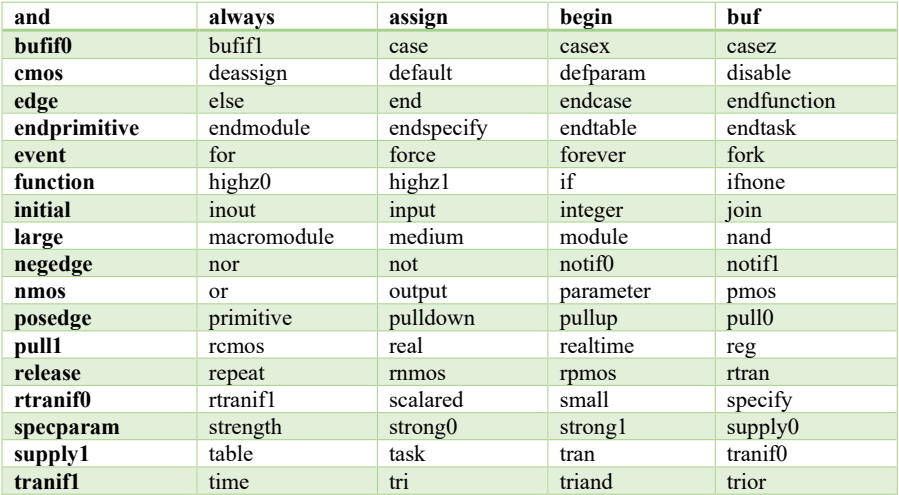
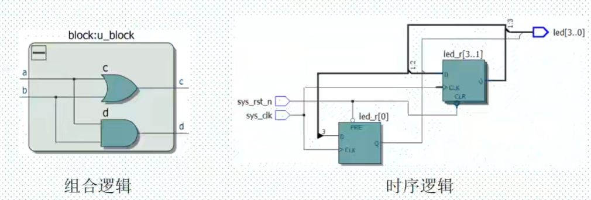
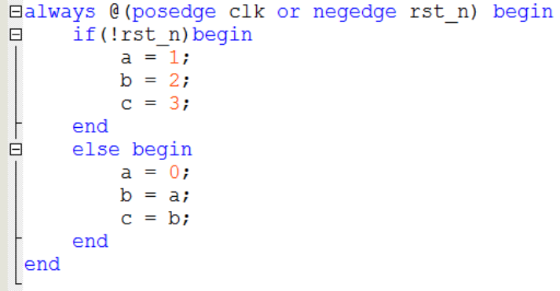
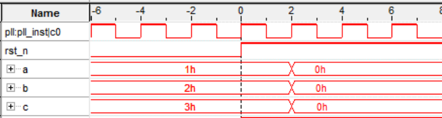
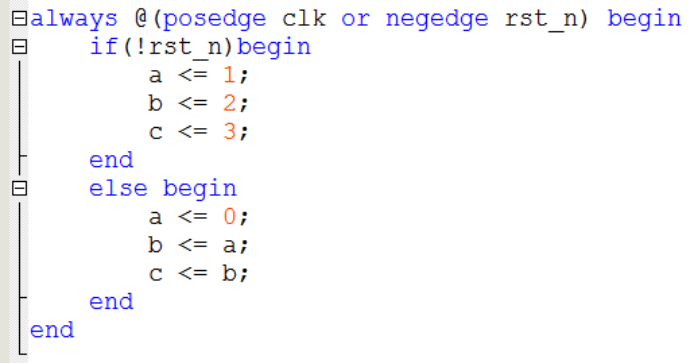
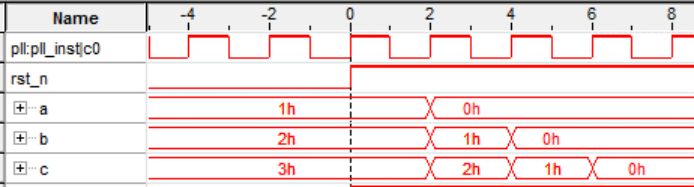
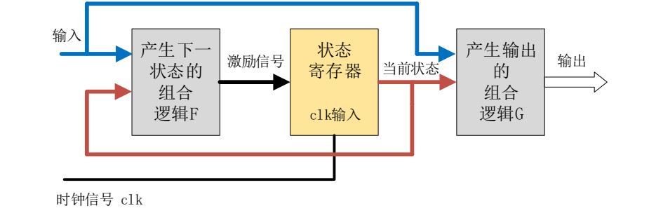
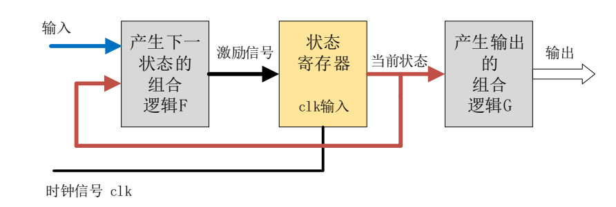
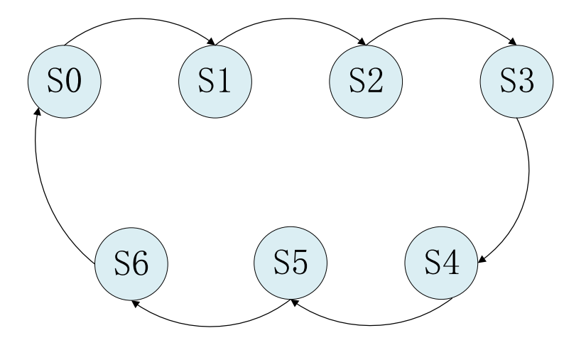
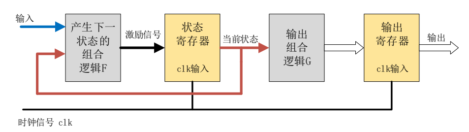

# Verilog HDL语法

本文参考了《正点原子 达芬奇 Pro 之 FPGA 开发指南》

## Verilog 简介

Verilog 是一种硬件描述语言（HDL），用于描述数字电路和系统的设计与验证。

### 为什么需要 Verilog？

1. **硬件设计**：Verilog 用于描述硬件电路的结构和行为，便于在设计阶段对电路进行建模、仿真和验证。
2. **高效性**：使用 Verilog，可以在较高抽象层次上设计电路，大大提高了设计效率。
3. **自动化工具支持**：Verilog 被广泛支持，许多 EDA（电子设计自动化）工具可以直接读取 Verilog 代码，进行综合、仿真和布局布线等操作。
4. **可移植性**：Verilog 代码是平台无关的，可以方便地在不同的硬件平台上实现。
5. **验证和调试**：通过 Verilog 可以方便地对设计进行仿真和调试，发现和修复问题。

### Verilog 和 VHDL 的区别
Verilog 和 VHDL（VHSIC Hardware Description Language）是两种主要的硬件描述语言。它们各有特点和优缺点。

- **语法风格**：
    - Verilog：类似于 C 语言，语法简洁明了，易于学习和使用。
    - VHDL：类似于 Ada 语言，语法更加严谨和复杂，提供了更强的类型检查。
- **使用领域**：
    - Verilog：在北美和商用 ASIC 设计中更为流行。
    - VHDL：在欧洲和国防、航空等高可靠性应用中更常见。
- **模块化设计**：
    - Verilog：模块化设计简单直观，但在一些复杂的类型处理上较为弱势。
    - VHDL：支持更强大的模块化设计和数据类型，适合复杂系统的设计。
- **语言功能**：
    - Verilog：更适合快速原型设计和较为简单的硬件描述。
    - VHDL：提供了更多的语法结构和功能，更适合复杂系统和高可靠性设计。

### Verilog 和 C 的区别
Verilog 和 C 语言有许多根本性的区别，因为它们针对不同的应用领域。

- **用途**：
    - Verilog：用于描述和仿真硬件电路的行为和结构。
    - C 语言：用于编写软件程序，运行在通用处理器上。
- **抽象层次**：
    - Verilog：强调并行性，适合描述硬件的并行操作和时序行为。
    - C 语言：强调顺序执行，适合描述算法和顺序逻辑。
- **执行方式**：
    - Verilog：代码通过硬件描述语言仿真工具执行，用于生成综合后的硬件电路。
    - C 语言：代码通过编译器编译成机器代码，在处理器上运行。
- **设计目标**：
    - Verilog：目标是生成高效的硬件电路，关注时序、延迟和资源利用。
    - C 语言：目标是生成可执行的软件程序，关注性能、可读性和可维护性。

## Verilog 基础语法

### Verilog的逻辑值

- 逻辑 0：表示低电平，也就是对应我们电路的 GND；
- 逻辑 1：表示高电平，也就是对应我们电路的 VCC；
- 逻辑 X：表示未知，有可能是高电平，也有可能是低电平；
- 逻辑 Z：表示高阻态，外部没有激励信号是一个悬空状态。

<div align="center">

</div>

### Verilog的数字进制格式

- Verilog 数字进制格式包括二进制、八进制、十进制和十六进制，一般常用的为二进制、十进制和十六进制。 
- 二进制表示如下：4’**b**0101 表示 4 位二进制数字 0101； 
- 十进制表示如下：4’**d**2 表示 4 位十进制数字 2（二进制 0010）； 
- 十六进制表示如下：4’**h**a 表示 4 位十六进制数字 a（二进制 1010），十六进制的计数方式为 0，1，2…9，a，b，c，d，e，f，最大计数为 f（f：十进制表示为 15）。 
- 当代码中没有指定数字的位宽与进制时，默认为 32 位的十进制，比如 100，实际上表示的值为32’d100。 


### Verilog 的标识符

- 标识符(identifier）用于定义模块名、端口名和信号名等。
- Verilog 的标识符可以是任意一组字母、数字、$和_(下划线)符号的组合
- 但标识符的第一个字符必须是字母或者下划线。
- 另外，标识符是区分大小写的。

- 注意：
  - 不建议大小写混合使用，
  - 普通内部信号建议全部小写，
  - 参数定义建议大写，
  - 另外信号命名最好体现信号的含义。 

- 以下是一些书写规范的要求： 
  1. 用有意义的有效的名字如 sum、cpu_addr 等。 
  2. 用下划线区分词语组合，如 cpu_addr。 
  3. 采用一些前缀或后缀，比如：时钟采用 clk 前缀：clk_50m，clk_cpu；低电平采用_n 后缀：enable_n； 
  4. 统一缩写，如全局复位信号 rst。 
  5. 同一信号在不同层次保持一致性，如同一时钟信号必须在各模块保持一致。 
  6. 自定义的标识符不能与保留字（关键词）同名。 
  7. 参数统一采用大写，如定义参数使用 SIZE。 

### Verilog 的数据类型 

在 Verilog 语法中，主要有三大类数据类型，即**寄存器类型**、**线网类型**和**参数类型**。从名称中，我们可以看出，真正在数字电路中起作用的数据类型应该是寄存器类型和线网类型。

#### 1. 寄存器类型
- 寄存器类型表示一个抽象的数据存储单元，它只能在 `always` 语句和 `initial` 语句中被赋值
- 如果该过程语句描述的是**时序逻辑**，即 `always` 语句<u>带有时钟信号</u>，则该寄存器变量对应为**寄存器**
- 如果该过程语句描述的是**组合逻辑**，即 `always` 语句<u>不带有时钟信号</u>，则该寄存器变量对应为**硬件连线**
- 寄存器类型的缺省值是 x（未知状态）。
- 寄存器数据类型有很多种，如 `reg`、`integer`、`real` 等，其中最常用的就是 `reg` 类型，它的使用方法如下： 

```verilog
//reg define 
reg  [31:0]  delay_cnt;    //延时计数器 
reg          key_flag ;    //按键标志 
```


#### 2. 线网类型
- 线网表示 Verilog 结构化元件间的物理连线。
- 它的值由驱动元件的值决定，例如连续赋值或门的输出。
- 如果没有驱动元件连接到线网，线网的缺省值为 z（高阻态）。
- 线网类型同寄存器类型一样也是有很多种，如 `tri` 和 `wire` 等，其中最常用的就是 `wire` 类型，它的使用方法如下：

```verilog
//wire define 
wire         data_en;         //数据使能信号 
wire  [7:0]  data   ;         //数据
``` 

#### 3. 参数类型
- 参数其实就是一个常量，常被用于定义状态机的状态、数据位宽和延迟大小
等
- 在定义参数时，我们可以一次定义多个参数，参数与参数之间需要用逗号隔开。
- 采用标识符来代表一个常量可以提高程序的可读性和可维护性。
- 在模块调用时，可通过参数传递来改变被调用模块中已定义的参数。
- 是参数的定义是局部的，只在当前模块中有效。它的使用方法如下：

```verilog
//parameter define 
parameter    DATA_WIDTH = 8;  //数据位宽为8位
``` 

### Verilog 的运算符

- 大部分运算符与C相同，本文就讲述特别且常用的运算符
#### 1.位运算符
- 位运算符是一类最基本的运算符，可以认为它们直接对应数字逻辑中的与、或、非门等逻辑门。常用的位运算符如下表所示。
- 位运算符的与、或、非与逻辑运算符逻辑与、逻辑或、逻辑非使用时候容易混淆，逻辑运算符一般用在条件判断上，位运算符一般用在信号赋值上。 

| 符合 | 使用方法 | 说明 |
| :-----| :---- | :---- |
| ~ | ~a | 将 a 的每个位进行取反 |
| & | a&b | 将 a 的每个位与 b 相同的位进行相与  |
| \| |a\|b | 将 a 的每个位与 b 相同的位进行相或 |
| ^ | a ^ b  | 将 a 的每个位与 b 相同的位进行异或 |


#### 2.移位运算符
- 移位运算符包括左移位运算符和右移位运算符，这两种移位运算符都**用 0 来填补移出的空位**。
- 假设 a 有 8bit 数据位宽，那么 `a<<2`，表示 a 左移 2bit，a 还是 8bit 数据位宽，a 的最高 2bit 数据被移位丢弃了，最低 2bit 数据固定补 0。
- 如果 a 是 3（二进制：00000011），那么 3 左移 2bit，`3<<2`，就是 12（二进制：00001100）。一般使用左移位运算代替乘法，右移位运算代替除法，但是这种也只能表示 2 的指数次幂的乘除法。 

| 符合 | 使用方法 | 说明 |
| :-----| :---- | :---- |
| << |  a << b |  将 a 左移 b 位 | 
| >> |  a >> b |  将 a 右移 b 位 | 


#### 3.拼接运算符
- Verilog 中有一个特殊的运算符是 C 语言中没有的，就是位拼接运算符。用这个运算符可以把两个或多个信号的某些位拼接起来进行运算操作。
  
| 符合 | 使用方法 | 说明 |
| :-----| :---- | :---- |
| {}  |  {a,b} |  将 a 和 b 拼接起来，作为一个新信号 | 


## Verilog 程序框架
### 关键字 
- Verilog 和 C 语言类似，都因编写需要定义了一系列保留字，叫做关键字（或关键词）。这些保留字是识别语法的关键。

- **实际经常使用的主要如下表**:

<div align="center">

</div>

### 程序框架
- Verilog 的基本设计单元是“**模块**”(block)，一个模块是由两部分组成的，一部分**描述接口**，另一部分**描述逻辑功能**。
- 每个Verilog程序包括4个主要的部分：**端口定义**、**IO说明**、**内部信号声明**、**功能定义**。

- 以 《正点原子 达芬奇 Pro 之 FPGA 开发指南》提供的LED 流水灯程序为例来展示 Verilog 的程序框架，代码如下所示（注意：代码中前面的行号只是为了方便大家阅读代码与快速定位到行号的位置，在实际编写代码时不可以添加行号，否则编译代码时会报错）。

```verilog
module led( 
    input               sys_clk  ,  //系统时钟 
    input               sys_rst_n,  //系统复位，低电平有效 
    output  reg  [3:0]  led         //4 位 LED 灯 
    ); 
 
//parameter define 
parameter  WIDTH     = 25        ; 
parameter  COUNT_MAX = 25_000_000;  //板载 50M 时钟=20ns，0.5s/20ns=25000000，需要 25bit 
                                    //位宽 
//reg define 
reg    [WIDTH-1:0]  counter     ; 
reg    [1:0]        led_ctrl_cnt; 
 
//wire define 
wire                counter_en  ; 
 
//*******************************************************************
//**                                 main code 
//*******************************************************************
 
//计数到最大值时产生高电平使能信号 
assign  counter_en = (counter == (COUNT_MAX - 1'b1))  ?  1'b1  :  1'b0;   
          
//用于产生 0.5 秒使能信号的计数器 
always @(posedge sys_clk or negedge sys_rst_n) begin 
    if (sys_rst_n == 1'b0) 
        counter <= 1'b0; 
    else if (counter_en) 
        counter <= 1'b0; 
    else 
        counter <= counter + 1'b1; 
end 
 
//led 流水控制计数器 
always @(posedge sys_clk or negedge sys_rst_n) begin 
    if (sys_rst_n == 1'b0) 
        led_ctrl_cnt <= 2'b0; 
    else if (counter_en) 
        led_ctrl_cnt <= led_ctrl_cnt + 2'b1; 
end 
 
//通过控制 IO 口的高低电平实现发光二极管的亮灭 
always @(posedge sys_clk or negedge sys_rst_n) begin 
    if (sys_rst_n == 1'b0) 
        led <= 4'b0; 
    else begin 
        case (led_ctrl_cnt)                  
            2'd0 : led <= 4'b0001; 
            2'd1 : led <= 4'b0010; 
            2'd2 : led <= 4'b0100; 
            2'd3 : led <= 4'b1000; 
            default : ; 
        endcase 
    end 
end 
 
endmodule  
```
- 首先//开头的都是注释，这个之前我们讲解过了。下面我们来看下具体的解释。 
- 第 1 行为模块定义，模块定义以 module 开始，endmodule 结束，如 59 行所示。 
- 其次 2 到 5 行为端口定义，需要定义 led 模块的输入信号和输出信号，此处输入信号为系统时钟和复位信号，输出为 led 控制信号。 
- 7 到 9 行为参数 parameter 定义，语法如 7 到 9 行所示，定义 parameter 的好处是可以灵活改变参数数字就能控制一些计数器最大计数值或者信号位宽的最大位宽。 
- 12 到 14 行为 reg 信号定义，reg 信号一般情况下代表寄存器，比如此处控制 0.5 秒使能信号的计数器counter。 
- 16 到 17 行为 wire 信号定义，wire 信号就是硬件连线，比如此处的 counter_en，代表计数到最大值时产生高电平使能，本质上是一个硬件连线，其实代表的是一些计数器/寄存器做逻辑判断的结果。 19 到 21 行为 moudle 开始的注释，不添加工具综合也不会报错，但是我们推荐添加，作为一个良好的编程规范。 
- 23 到 24 行为 assign 语句的样式，条件成立选择 1，否则选择 0。 
- 26 到 34 行是 always 语句的样式，27 行代表在时钟上升沿或者复位的下降沿进行信号触发。begin/end 代表语句的开始和结束。28 到 33 行为 if/else 语句，和 C 语言是比较类似的。29 行的“<=”标记代表信号是非阻塞赋值，信号赋值有非阻塞赋值和阻塞赋值两个方式，这个我们后面会详细解释。 36 和 42 行也是一个 always 语句，和 26 到 34 行类似。 
- 44 和 57 行也是一个 always 语句，不过这个 always 语句中嵌入了一个 case 语句，case 语句的语法如49 到 55 行所示，需要一个 case 关键字开始，endcase 关键字结束，default 作为默认分支，和 C 语言也是类似的。当然 case 语句也可以用在不带时钟的 always 语句中，不过本例子的 always 都是带有时钟的。不带时钟的 always 和带时钟的 always 语句的差异这个我们后面也会详细解释。 
- 59 行是 endmodule 标记，代表模块的结束。 
- 如果只有一条赋值语句时，if 后面可以加 begin 和 end，也可以不加；如果超过一条赋值语句时，就必须加上 begin 和 end。 代码如下所示：
```verilog
if(en == 1'b1) begin 
    b <= 1'b1; 
    c <= 1'b1; 
end 
```
## Verilog 高级知识点

### 结构语句
#### initial和 always
- `initial`语句它在模块中只执行一次。
它常用于测试文件的编写，用来产生仿真测试信号(激励信号)，或者用于对存储器变量赋初值。
- `always`语句一直在不断地重复活动。
但是只有和一定的时间控制结合在一起才有作用。
#### assign 和 always 区别 
- `assign` 语句使用时不能带时钟。 
- `always` 语句可以带时钟，也可以不带时钟。在 `always` 不带时钟时，逻辑功能和 `assign` 完全一致，都是
- 只产生组合逻辑。比较**简单的组合逻辑**推荐使用 `assign` 语句，比较**复杂的组合逻辑**推荐使用 `always` 语句。

#### 带不带时钟的 always 语句
- `always`的时间控制可以是**沿触发**也可以是**电平触发**:
- 可以是单个信号，也可以是多个信号，多个信号中间要用关键字or连接。
- 信号的上升沿触发：`@(posedge signal)`
- 信号的下降沿触发：`@(negedge signal)`
- 信号的电平触发：`@(signal)`
- 在 `always` 不带时钟时，逻辑功能和 `assign` 完全一致，虽然产生的信号定义还是 `reg` 类型，但是该语句产生的还是**组合逻辑**。 
```verilog
reg   [3:0] led； 
always @(*) begin 
       case (led_ctrl_cnt)                  
            2'd0    : led = 4'b0001; 
            2'd1    : led = 4'b0010; 
            2'd2    : led = 4'b0100; 
            2'd3    : led = 4'b1000; 
            default : led = 4'b0000; 
        endcase 
end 
```
- 在 `always` 带时钟信号时，这个逻辑语句才能产生真正的寄存器，如下示例 `counter` 就是真正的寄存器。 
```verilog
//用于产生 0.5 秒使能信号的计数器 
always @(posedge sys_clk or negedge sys_rst_n) begin 
    if (sys_rst_n == 1'b0) 
        counter <= 1'b0; 
    else if (counter_en) 
        counter <= 1'b0; 
    else 
        counter <= counter + 1'b1; 34  end 
```

#### 组合逻辑电路和时序逻辑电路
- 根据逻辑功能的不同特点，可以将数字电路分成两大类：**组合逻辑电路**和**时序逻辑电路**。
- **组合逻辑电路**中，任意时刻的输出仅仅取决于该时刻的输入，与电路原来的状态无关。
- **时序逻辑电路**中，任一时刻的输出不仅取决于当时的输入信号，而且还取决于电路原来的状态。或者说还与以前的输入有关，因此时序逻辑必须具备记忆功能。



### 赋值语句
#### 阻塞赋值（Blocking） 
- 阻塞赋值，顾名思义即在一个 `always` 块中，一条阻塞赋值语句如果没有执行结束，那么该语句后面的语句就不能被执行，即被“阻塞”。
- RHS：赋值等号右边的表达式或变量可以写作 RHS 表达式或 RHS 变量 
- LHS：赋值等号左边的表达式或变量可以写作 LHS 表达式或 LHS 变量


- 代码中使用的是阻塞赋值语句，从波形图中可以看到：
  - 在复位的时候（rst_n=0），a=1，b=2，c=3；
  - 而结束复位之后（波形图中的 0 时刻），当 clk 的上升沿到来时（波形图中的 2 时刻），a=0，b=0，c=0。
  - 这是因为阻塞赋值是在当前语句执行完成之后，才会执行后面的赋值语句，因此首先执行的是 a=0，赋值完成后将 a 的值赋值给 b，由于此时 a 的值已经为 0，所以 b=a=0，最后执行的是将 b 的值赋值给 c，而 b 的值已经赋值为 0，所以 c 的值同样等于 0。 

#### 非阻塞赋值（Non-blocking） 
- 符号“<=”用于非阻塞赋值（如:b <= a;），非阻塞赋值是由时钟节拍决定，在时钟上升到来时，执行赋值语句右边，然后将 begin-end 之间的所有赋值语句同时赋值到赋值语句的左边
- 非阻塞赋值的操作过程可以看作两个步骤： 
  1. 赋值开始的时候，计算 RHS； 
  2. 赋值结束的时候，更新 LHS。 




- 代码中使用的是非阻塞赋值语句，从波形图中可以看到：
  - 在复位的时候（rst_n=0），a=1，b=2，c=3；
  - 而结束复位之后（波形图中的 0 时刻），当 clk 的上升沿到来时（波形图中的 2 时刻），a=0，b=1，c=2。
  - 这是因为非阻塞赋值在计算 RHS 和更新 LHS 期间，允许其它的非阻塞赋值语句同时计算 RHS 和更新 LHS。在波形图中的 2 时刻，RHS 的表达是 0、a、b，分别等于 0、1、2，这三条语句是同时更新 LHS，所以 a、b、c 的值分别等于 0、1、2。 

#### 阻塞和非阻塞何时使用
- 在描述**组合逻辑电路**的时候，使用**阻塞赋值**，比如 `assign` 赋值语句和不带时钟的 `always` 赋值语句
- 在描述**时序逻辑**的时候，使用**非阻塞赋值**，综合成时序逻辑的电路结构，比如带时钟的 `always` 语句；这种电路结构往往与触发沿有关系，只有在触发沿时才可能发生赋值的变化


## Verilog 状态机
- 状态机(State Machine)
  - 有限状态机(Finite State Machine，简称FSM)
  - 在有限个状态之间按一定规律转换的时序电路。
- 根据状态机的输出是否与输入条件相关，可将状态机分为两大类，即**摩尔(Moore)型状态机**和**米勒(Mealy)型状态机**。 
    -  **Mealy 状态机**：组合逻辑的输出不仅取决于当前状态，还取决于输入状态。 
    - **Moore 状态机**：组合逻辑的输出只取决于当前状态。

### 1. Mealy 状态机
- 米勒状态机的模型如下图所示：
  - 模型中第一个方框是指产生下一状态的组合逻辑 F，F 是当前状态和输入信号的函数，状态是否改变、如何改变，取决于组合逻辑 F 的输出；
  - 第二框图是指状态寄存器，其由一组触发器组成，用来记忆状态机当前所处的状态，状态的改变只发生在时钟的跳边沿；
  - 第三个框图是指产生输出的组合逻辑 G，状态机的输出是由输出组合逻辑 G 提供的，G 也是当前状态和输入信号的函数。 


### 2. Moore 状态机
 - 摩尔状态机的模型如下图所示，对比米勒状态机的模型可以发现，其区别在于米勒状态机的输出由**当前状态和输入条件决定**的，而摩尔状态机的输出**只取决于当前状态**。



### 3. 三段式状态机
- 根据状态机的实际写法，状态机还可以分为一段式、二段式和三段式状态机。 
- 三段式：使用三个 `always` 模块。
  - 第一个 `always` 模块采用<u>同步时序</u>**描述状态转移**，
  - 第二个 `always` 采用<u>组合逻辑判断状态转移条件</u>，**描述状态转移规律**，
  - 第三个 `always` 模块**描述状态输出**(可以用组合电路输出，也可以时序电路输出)。 
- 实际应用中三段式状态机使用最多，因为三段式状态机将组合逻辑和时序分开，有利于综合器分析优化以及程序的维护；并且三段式状态机将状态转移与状态输出分开，使代码看上去更加清晰易懂，提高了代码的可读性

1. 在开始编写状态机代码之前，一般先画出状态跳转图，这样在编写代码时思路会比较清晰，下面以一个 7 分频为例：


2. 状态跳转图画完之后，接下来通过 `parameter` 来定义各个不同状态的参数，如下代码所示:
```verilog
parameter S0 = 7'b0000001;     //独热码定义方式 
parameter S1 = 7'b0000010; 
parameter S2 = 7'b0000100; 
parameter S3 = 7'b0001000; 
parameter S4 = 7'b0010000; 
parameter S5 = 7'b0100000; 
parameter S6 = 7'b1000000;  
```

3. 定义状态寄存器，如下代码所示：
```verilog
reg  [6:0]   curr_st     ;     //当前状态 
reg  [6:0]   next_st     ;     //下一个状态 
```

4. 接下来就可以使用三个 `always` 语句来开始编写状态机的代码，第一个 always 采用同步时序描述状态转移，第二个 `always` 采用组合逻辑判断状态转移条件，第三个 `always` 是描述状态输出，一个完整的三段式状态机的例子如下代码所示： 
```verilog
module divider7_fsm (  
    //系统时钟与复位 
    input       sys_clk      ,  
    input       sys_rst_n    , 
 
    //输出时钟 
    output reg  clk_divide_7  
    ); 
 
//parameter define  
parameter S0 = 7'b0000001;     //独热码定义方式 12 parameter S1 = 7'b0000010; 
parameter S2 = 7'b0000100; 
parameter S3 = 7'b0001000; 
parameter S4 = 7'b0010000; 
parameter S5 = 7'b0100000; 
parameter S6 = 7'b1000000;     
     
//reg define  
reg  [6:0]   curr_st     ;     //当前状态 
reg  [6:0]   next_st     ;     //下一个状态 
 
//***************************************************** 
//*****************************************************
//状态机的第一段采用同步时序描述状态转移 
always @(posedge sys_clk or negedge sys_rst_n) begin                   
    if (!sys_rst_n) 
        curr_st <= S0; 
    else 
        curr_st <= next_st; 
end 
 
//状态机的第二段采用组合逻辑判断状态转移条件  
always @(*) begin  
    case (curr_st)  
        S0: next_st = S1; 
        S1: next_st = S2; 
        S2: next_st = S3; 
        S3: next_st = S4; 
        S4: next_st = S5; 
        S5: next_st = S6; 
        S6: next_st = S0; 
        default: next_st = S0;
    endcase 
end 
 
//状态机的第三段描述状态输出（这里采用时序电路输出） 
always @(posedge sys_clk or negedge sys_rst_n) begin  
    if (!sys_rst_n) 
        clk_divide_7 <= 1'b0; 
    else if ((curr_st == S0) | (curr_st == S1) | (curr_st == S2)  | (curr_st == S3))                 
        clk_divide_7  <= 1'b0; 
    else if ((curr_st == S4) | (curr_st == S5) | (curr_st == S6))  
        clk_divide_7  <= 1'b1;     
end 
 
endmodule 
```

- 第一个 `always` 语句实现同步状态跳转（如代码的第 27 至第 33 行所示），在复位的时候，当前状态处在 S0 状态，否则将下一个状态赋值给当前状态
- 第二个 `always` 采用组合逻辑判断状态转移条件（如代码的第 35 行至第 47 行代码所示），这里每一个状态只保持一个时钟周期，也就是直接跳转到下一个状态，在实际应用中，一般根据输入的条件来判断是否跳转到其它状态或者停留在当前转态，最后在 `case` 语句后面增加一个 `default` 语句，来防止状态机处在异常的状态；
- 第三个 `always` 输出分频后的时钟（如代码的第 49 至第 59 行代码所示），状态机的第三段可以使用组合逻辑电路输出，也可以使用时序逻辑电路输出，一般推荐使用时序电路输出，因为状态机的设计和其它设计一样，最好使用同步时序方式设计，以提高设计的稳定性，消除毛刺。



- 三段式可以在组合逻辑后再**增加一级寄存器**来实现时序逻辑输出:
  1. 可以有效地滤去组合逻辑输出的毛刺;
  2. 可以有效地进行时序计算与约束;
  3. 另外对于总线形式的输出信号来说，容易使总线数据对齐，从而减小总线数据间的偏移，减小接收端数据采样出错的频率。
