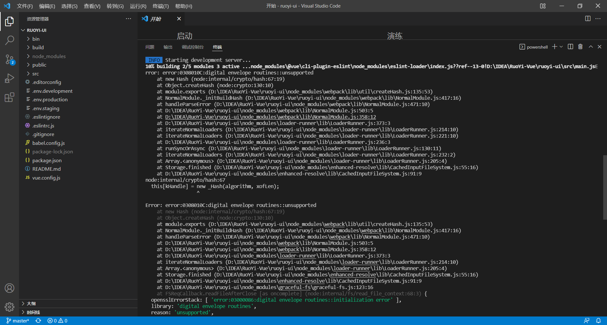
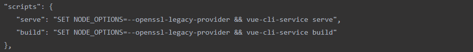

## 1.npm run dev失败Error: error:0308010C:digital envelope routines::unsupported



问题原因：node版本过高，因为 node.js V17版本中最近发布的OpenSSL3.0, 而OpenSSL3.0对允许算法和密钥大小增加了严格的限制，可能会对生态系统造成一些影响.

### 解决办法：
#### 1.通过命令设置NODE_OPTIONS参数
这个办法的缺点是每次构建前都需要执行一次命令
windows与linux或mac系统设置命令不一样，并且需要在项目目录下执行该命令，直接cmd命令默认路径下执行会无效。

windows系统：
```
set NODE_OPTIONS=--openssl-legacy-provider
```
linux或mac系统：
```
export NODE_OPTIONS=--openssl-legacy-provider
```
#### 2.修改package.json
在相关构建命令之前加入set NODE_OPTIONS=–openssl-legacy-provider，这个办法可以一劳永逸，以后直接通过npm执行scripts里面的命令即可。不管是项目迭代，还是团队开发，这种都比较有效。


#### 3.降低node版本
回到16版本以下。这个办法也可以解决问题，不过需要考虑到整个系统架构与技术选型问题，以及不同版本的兼容问题。不管是卸载node重装还是使用nvm工具降低版本，均有风险。特别是nvm工具降版本有时会出现意想不到的错误。
